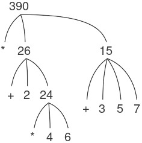
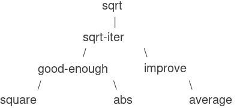

# 1.1 Các thành phần của Programming

Một ngôn ngữ **programming** mạnh mẽ không chỉ là công cụ để ra lệnh cho máy tính thực hiện các tác vụ. Ngôn ngữ còn đóng vai trò như một khung tư duy mà trong đó chúng ta tổ chức các ý tưởng về **processes** (quá trình). Vì vậy, khi mô tả một ngôn ngữ, chúng ta nên chú ý đặc biệt đến các phương tiện mà ngôn ngữ cung cấp để kết hợp những ý tưởng đơn giản nhằm hình thành các ý tưởng phức tạp hơn. Mỗi ngôn ngữ mạnh mẽ đều có ba cơ chế để thực hiện điều này:

* **primitive expressions** (biểu thức nguyên thủy), đại diện cho những thực thể đơn giản nhất mà ngôn ngữ quan tâm,
* **means of combination** (phương tiện kết hợp), bằng đó các phần tử phức hợp được xây dựng từ những phần tử đơn giản hơn, và
* **means of abstraction** (phương tiện trừu tượng hóa), nhờ đó các phần tử phức hợp có thể được đặt tên và thao tác như các đơn vị.

Trong **programming**, chúng ta làm việc với hai loại thành phần: **procedures** (thủ tục) và **data** (dữ liệu). (Sau này chúng ta sẽ phát hiện rằng chúng thực ra không hẳn là khác biệt.) Nói một cách không chính thức, **data** là “thứ” mà chúng ta muốn thao tác, còn **procedures** là mô tả các quy tắc để thao tác dữ liệu đó. Do đó, bất kỳ ngôn ngữ programming mạnh mẽ nào cũng phải có khả năng mô tả **primitive data** và **primitive procedures**, đồng thời có phương thức để kết hợp và trừu tượng hóa **procedures** và **data**.

Trong chương này, chúng ta sẽ chỉ làm việc với **numerical data** (dữ liệu số) đơn giản để có thể tập trung vào các quy tắc xây dựng **procedures**.^[1] Ở các chương sau, chúng ta sẽ thấy rằng các quy tắc này cũng cho phép ta xây dựng **procedures** để thao tác với **compound data** (dữ liệu phức hợp).

---

## 1.1.1 Expressions

Một cách dễ dàng để bắt đầu học **programming** là quan sát một số tương tác điển hình với **interpreter** (trình thông dịch) của ngôn ngữ **Scheme** (một dialect của Lisp). Hãy tưởng tượng bạn đang ngồi trước một máy tính. Bạn gõ vào một **expression** (biểu thức), và **interpreter** phản hồi bằng cách hiển thị kết quả của việc **evaluating** (tính toán/đánh giá) biểu thức đó.

Một loại **primitive expression** mà bạn có thể gõ là một số. (Chính xác hơn, biểu thức bạn gõ gồm các chữ số đại diện cho số đó ở hệ thập phân.) Nếu bạn đưa cho Lisp một số

```{.scheme}
486
```

**interpreter** sẽ phản hồi bằng cách in ra^[2]

```{.scheme}
486
```

Các **expressions** biểu diễn số có thể được kết hợp với một **expression** biểu diễn một **primitive procedure** (chẳng hạn như `+` hoặc `*`) để hình thành một **compound expression** (biểu thức phức hợp) mô tả việc áp dụng **procedure** đó lên các số. Ví dụ:

```{.scheme}
(+ 137 349)
486

(- 1000 334)
666

(* 5 99)
495

(/ 10 5)
2

(+ 2.7 10)
12.7
```

Những **expressions** như trên, được tạo ra bằng cách đặt một danh sách các **expressions** trong cặp ngoặc đơn để biểu thị việc áp dụng **procedure**, được gọi là *combinations* (tổ hợp). Phần tử ngoài cùng bên trái trong danh sách được gọi là *operator* (toán tử), và các phần tử còn lại được gọi là *operands* (toán hạng). Giá trị của một *combination* được thu được bằng cách áp dụng **procedure** mà *operator* chỉ định lên các *arguments* (đối số) chính là giá trị của các *operands*.

Quy ước đặt *operator* ở bên trái *operands* được gọi là *prefix notation* (ký pháp tiền tố), và ban đầu có thể hơi khó hiểu vì nó khác biệt đáng kể với quy ước toán học thông thường. Tuy nhiên, *prefix notation* có một số ưu điểm. Một trong số đó là nó có thể chứa các **procedures** có số lượng **arguments** tùy ý, như trong các ví dụ sau:

```{.scheme}
(+ 21 35 12 7)
75

(* 25 4 12)
1200
```

Không thể xảy ra sự mơ hồ, vì *operator* luôn là phần tử ngoài cùng bên trái và toàn bộ *combination* được bao bởi dấu ngoặc đơn.

Ưu điểm thứ hai của *prefix notation* là nó mở rộng một cách trực tiếp để cho phép *combinations* được *nested* (lồng nhau), tức là có những *combinations* mà các phần tử của chúng lại chính là *combinations*:

```{.scheme}
(+ (* 3 5) (- 10 6))
19
```

Về nguyên tắc, độ sâu của việc *nested* và độ phức tạp tổng thể của **expressions** mà **interpreter** Lisp có thể tính toán là không giới hạn. Chính con người chúng ta mới là những người dễ bị rối khi gặp những biểu thức tương đối đơn giản như:

```{.scheme}
(+ (* 3 (+ (* 2 4) (+ 3 5))) (+ (- 10 7) 6))
```

trong khi **interpreter** có thể dễ dàng tính ra kết quả 57. Chúng ta có thể tự giúp mình bằng cách viết biểu thức này theo dạng

```{.scheme}
(+ (* 3
      (+ (* 2 4)
         (+ 3 5)))
   (+ (- 10 7)
      6))
```

theo một quy ước định dạng gọi là *pretty-printing* (in đẹp), trong đó mỗi *combination* dài được viết sao cho các *operands* được căn thẳng hàng theo chiều dọc. Các thụt lề như vậy hiển thị rõ cấu trúc của **expression**.^[3]

Ngay cả với những **expressions** phức tạp, **interpreter** luôn vận hành theo cùng một chu trình cơ bản: Nó đọc một **expression** từ terminal, tính toán biểu thức đó, và in ra kết quả. Chế độ hoạt động này thường được diễn đạt bằng cách nói rằng **interpreter** chạy trong một vòng lặp *read-eval-print loop*. Hãy đặc biệt chú ý rằng không cần phải ra lệnh tường minh cho **interpreter** in ra giá trị của biểu thức.^[4]

---

## 1.1.2 Naming and the Environment

Một khía cạnh quan trọng của một ngôn ngữ programming là phương tiện mà nó cung cấp để sử dụng tên nhằm tham chiếu đến các đối tượng tính toán. Chúng ta nói rằng tên xác định một *variable* (biến), mà *value* (giá trị) của nó là đối tượng đó.

Trong dialect Scheme của Lisp, chúng ta đặt tên bằng `define`. Việc gõ

```{.scheme}
(define size 2)
```

khiến **interpreter** liên kết giá trị 2 với tên `size`.^[5] Một khi tên `size` đã được gắn với số 2, chúng ta có thể tham chiếu đến giá trị 2 bằng tên đó:

```{.scheme}
size
2

(* 5 size)
10
```

Dưới đây là thêm một vài ví dụ về việc sử dụng `define`:

```{.scheme}
(define pi 3.14159)
(define radius 10)

(* pi (* radius radius))
314.159

(define circumference (* 2 pi radius))

circumference
62.8318
```

`Define` là phương tiện trừu tượng hóa đơn giản nhất của ngôn ngữ, vì nó cho phép chúng ta sử dụng những tên đơn giản để tham chiếu đến kết quả của các phép toán phức hợp, chẳng hạn như `circumference` được tính ở trên. Nói chung, các đối tượng tính toán có thể có cấu trúc rất phức tạp, và sẽ cực kỳ bất tiện nếu phải nhớ và lặp lại chi tiết của chúng mỗi lần muốn sử dụng. Thật vậy, các chương trình phức tạp được xây dựng bằng cách tạo ra, từng bước một, các đối tượng tính toán có độ phức tạp ngày càng tăng. **Interpreter** khiến cho việc xây dựng chương trình theo từng bước như vậy trở nên đặc biệt tiện lợi vì các liên kết tên-đối tượng có thể được tạo ra dần dần qua những lần tương tác kế tiếp. Đặc điểm này khuyến khích sự phát triển và thử nghiệm chương trình theo cách gia tăng và phần lớn chịu trách nhiệm cho việc chương trình Lisp thường bao gồm một số lượng lớn các **procedures** tương đối đơn giản.

Rõ ràng việc có thể gắn các giá trị với các ký hiệu rồi sau đó truy xuất lại chúng có nghĩa là **interpreter** phải duy trì một dạng bộ nhớ nào đó để theo dõi các cặp tên-đối tượng. Bộ nhớ này được gọi là *environment* (môi trường) (chính xác hơn là *global environment* (môi trường toàn cục), vì sau này chúng ta sẽ thấy rằng một phép tính có thể liên quan đến nhiều *environments* khác nhau).^[[Chapter 3](Chapter-3.xhtml#Chapter-3) sẽ cho thấy rằng khái niệm *environment* này rất quan trọng, cả trong việc hiểu cách **interpreter** hoạt động lẫn trong việc hiện thực hóa các **interpreters**.]

---

## 1.1.3 Evaluating Combinations

Một trong những mục tiêu của chúng ta trong chương này là phân tách các vấn đề liên quan đến việc tư duy theo cách **procedural** (thủ tục). Là một ví dụ, hãy xem xét rằng khi tính toán một *combination*, chính **interpreter** cũng đang tuân theo một **procedure**.

> Để tính toán một *combination*, hãy thực hiện các bước sau:
>
> > 1. Tính toán các *subexpressions* (biểu thức con) của *combination*.
>
> 2. Áp dụng **procedure** là giá trị của *subexpression* ngoài cùng bên trái (*operator*) lên các **arguments** là giá trị của các *subexpressions* còn lại (*operands*).

Ngay cả quy tắc đơn giản này cũng minh họa một số điểm quan trọng về các **processes** nói chung. Trước hết, hãy chú ý rằng bước đầu tiên quy định rằng để hoàn thành quá trình tính toán một *combination*, chúng ta phải trước tiên thực hiện quá trình tính toán trên từng phần tử của *combination*. Do đó, quy tắc tính toán này có bản chất là *recursive* (đệ quy); tức là, nó bao gồm — như một trong các bước — yêu cầu gọi lại chính quy tắc đó.^[6]

---

## Footnotes

^[1]: Việc mô tả số như là “dữ liệu đơn giản” thực chất là một sự đánh lừa trắng trợn. Thật ra, cách xử lý số là một trong những khía cạnh khó khăn và dễ gây nhầm lẫn nhất của bất kỳ ngôn ngữ programming nào. Một số vấn đề điển hình là: Một số hệ thống máy tính phân biệt *integers* (số nguyên), như 2, với *real numbers* (số thực), như 2.71. Số thực 2.00 có khác với số nguyên 2 không? Các phép toán số học cho số nguyên có giống với các phép toán cho số thực không? 6 chia cho 2 cho ra 3 hay 3.0? Ta có thể biểu diễn số lớn đến mức nào? Biểu diễn được bao nhiêu chữ số thập phân chính xác? Phạm vi của số nguyên có giống với phạm vi của số thực không? Ngoài tất cả những câu hỏi này, dĩ nhiên, còn có một loạt vấn đề về sai số làm tròn và cắt cụt — toàn bộ ngành khoa học phân tích số. Vì trọng tâm của cuốn sách này là thiết kế chương trình quy mô lớn chứ không phải các kỹ thuật số, nên chúng ta sẽ bỏ qua những vấn đề này. Các ví dụ số học trong chương này sẽ thể hiện hành vi làm tròn thường thấy khi sử dụng các phép toán chỉ giữ được một số lượng chữ số thập phân nhất định trong các phép toán phi nguyên.

^[2]: Trong suốt cuốn sách này, khi muốn nhấn mạnh sự phân biệt giữa đầu vào do người dùng gõ và phản hồi do **interpreter** in ra, chúng tôi sẽ hiển thị cái sau bằng chữ nghiêng.

^[3]: Các hệ thống Lisp thường cung cấp những tính năng hỗ trợ người dùng trong việc định dạng biểu thức. Hai tính năng đặc biệt hữu ích là: một tính năng tự động thụt lề đúng vị trí *pretty-print* mỗi khi bắt đầu dòng mới, và một tính năng làm nổi bật dấu ngoặc mở tương ứng mỗi khi người dùng gõ dấu ngoặc đóng.

^[4]: Lisp tuân theo quy ước rằng mọi **expression** đều có một giá trị. Quy ước này, cùng với danh tiếng cũ của Lisp như một ngôn ngữ kém hiệu quả, là nguồn gốc của câu nói đùa của Alan Perlis (mượn lời Oscar Wilde) rằng “Lisp programmers know the value of everything but the cost of nothing.”

^[5]: Trong cuốn sách này, chúng tôi không hiển thị phản hồi của **interpreter** khi tính toán các **definitions** (định nghĩa), vì điều này phụ thuộc rất nhiều vào cách hiện thực cụ thể.

^[6]: Có thể thấy kỳ lạ rằng quy tắc tính toán nói, trong phần của bước đầu tiên, rằng chúng ta nên tính toán phần tử ngoài cùng bên trái của một *combination*, bởi vì ở thời điểm này nó chỉ có thể là một *operator* như `+` hoặc `*` đại diện cho một **primitive procedure** như cộng hoặc nhân. Chúng ta sẽ thấy sau này rằng việc có thể làm việc với những *combinations* mà *operators* của chúng lại là các **expressions** phức hợp là điều hữu ích.

Đây là bản dịch sang tiếng Việt theo đúng yêu cầu bạn đặt ra (Markdown, giữ nguyên công thức, code, hình ảnh, thêm footnote bắt đầu từ số 7):

---

Nhận thấy rằng ý tưởng về recursion (đệ quy) có thể được dùng để diễn đạt một cách súc tích điều mà trong trường hợp của một combination (tổ hợp) lồng nhau sâu sẽ được xem như một quá trình khá phức tạp. Ví dụ, việc tính giá trị của

```{.scheme}
(* (+ 2 (* 4 6)) (+ 3 5 7))
```

yêu cầu quy tắc đánh giá được áp dụng cho bốn combination khác nhau. Chúng ta có thể minh họa tiến trình này bằng cách biểu diễn combination dưới dạng một cây, như được thể hiện trong [Figure 1.1](#Figure-1_002e1). Mỗi combination được biểu diễn bằng một nút với các nhánh tương ứng với operator (toán tử) và các operand (toán hạng) phát sinh từ nó. Các nút tận (terminal node – tức là nút không có nhánh nào phát sinh từ chúng) biểu diễn hoặc là toán tử, hoặc là số. Khi nhìn vào việc đánh giá theo cây, ta có thể hình dung rằng các giá trị của các operand “thấm dần lên” (percolate upward), bắt đầu từ các nút tận rồi kết hợp ở các mức ngày càng cao hơn. Nhìn chung, ta sẽ thấy rằng recursion là một kỹ thuật rất mạnh để xử lý các đối tượng phân cấp, dạng cây. Thực tế, dạng “percolate values upward” của quy tắc đánh giá chính là một ví dụ của một kiểu tiến trình tổng quát gọi là *tree accumulation* (tích lũy theo cây).



**Figure 1.1:** Tree representation, showing the value of each subcombination.

Tiếp theo, hãy quan sát rằng việc lặp đi lặp lại bước đầu tiên dẫn chúng ta đến chỗ cần phải đánh giá, không phải các combination, mà là các primitive expression (biểu thức nguyên thủy) như số, toán tử dựng sẵn, hoặc các tên khác. Ta xử lý các trường hợp nguyên thủy này bằng cách quy định rằng:

* giá trị của số (numeral) là chính con số mà nó biểu diễn,
* giá trị của các toán tử dựng sẵn là các chuỗi lệnh máy thực hiện các phép toán tương ứng, và
* giá trị của các tên khác là các đối tượng gắn liền với những tên đó trong environment (môi trường).

Ta có thể xem quy tắc thứ hai là một trường hợp đặc biệt của quy tắc thứ ba bằng cách quy định rằng các symbol (ký hiệu) như `+` và `*` cũng được bao gồm trong global environment và được gắn với các chuỗi lệnh máy là “giá trị” của chúng. Điểm mấu chốt cần lưu ý là vai trò của environment trong việc xác định ý nghĩa của các symbol trong biểu thức. Trong một ngôn ngữ tương tác như Lisp, thật vô nghĩa khi nói về giá trị của một biểu thức như `(+ x 1)` mà không chỉ rõ thông tin nào đó về environment, thứ sẽ cung cấp ý nghĩa cho symbol `x` (thậm chí cả cho symbol `+`). Như ta sẽ thấy trong [Chapter 3](Chapter-3.xhtml#Chapter-3), khái niệm tổng quát về environment như một bối cảnh mà trong đó việc đánh giá diễn ra sẽ đóng một vai trò quan trọng trong việc hiểu cách thực thi chương trình.

Hãy lưu ý rằng quy tắc đánh giá đưa ra ở trên không xử lý các định nghĩa. Chẳng hạn, việc tính `(define x 3)` không có nghĩa là áp dụng `define` cho hai đối số, một là giá trị của symbol `x` và một là 3, bởi vì mục đích của `define` chính là để gắn `x` với một giá trị. (Nói cách khác, `(define x 3)` không phải là một combination.)

Những ngoại lệ cho quy tắc đánh giá tổng quát như vậy được gọi là *special forms* (biểu thức đặc biệt). `Define` là ví dụ duy nhất về special form mà chúng ta đã thấy cho đến nay, nhưng chẳng bao lâu nữa ta sẽ gặp thêm các ví dụ khác. Mỗi special form có quy tắc đánh giá riêng. Các loại biểu thức khác nhau (mỗi loại gắn với quy tắc đánh giá riêng của nó) cấu thành cú pháp của ngôn ngữ lập trình. So với hầu hết các ngôn ngữ lập trình khác, Lisp có cú pháp rất đơn giản; nghĩa là, quy tắc đánh giá cho các biểu thức có thể được mô tả bằng một quy tắc tổng quát đơn giản kết hợp với một số ít quy tắc chuyên biệt dành cho các special form.^[7]

---

## 1.1.4 Compound Procedures (Thủ tục hợp thành)

Chúng ta đã xác định trong Lisp một số yếu tố cần xuất hiện trong bất kỳ ngôn ngữ lập trình mạnh mẽ nào:

* Numbers và các phép toán số học là dữ liệu và procedure (thủ tục) nguyên thủy.
* Việc lồng các combination cung cấp phương tiện để kết hợp các phép toán.
* Các định nghĩa gắn tên với giá trị cung cấp một phương tiện trừu tượng hóa hạn chế.

Bây giờ chúng ta sẽ học về *procedure definition* (định nghĩa thủ tục), một kỹ thuật trừu tượng hóa mạnh mẽ hơn nhiều, nhờ đó một phép toán hợp thành có thể được gán cho một tên và sau đó được tham chiếu như một đơn vị.

Chúng ta bắt đầu bằng cách xem xét làm thế nào để diễn đạt ý tưởng “bình phương.” Ta có thể nói, “Bình phương một cái gì đó nghĩa là nhân nó với chính nó.” Điều này được diễn đạt trong ngôn ngữ của chúng ta như sau:

```{.scheme}
(define (square x) (* x x))
```

Ta có thể hiểu điều này như sau:

```{.example}
(define (square x)    (*       x       x))
  |      |      |      |       |       |
 To square something, multiply it by itself.
```

Ở đây chúng ta có một *compound procedure* (thủ tục hợp thành), được gán tên `square`. Thủ tục này biểu diễn phép toán nhân một cái gì đó với chính nó. Đối tượng cần nhân được gán một tên cục bộ, `x`, vốn đóng cùng vai trò như đại từ trong ngôn ngữ tự nhiên. Việc đánh giá định nghĩa này tạo ra thủ tục hợp thành đó và gắn nó với tên `square`.^[8]

Dạng tổng quát của một procedure definition là:

```{.scheme}
(define (⟨name⟩ ⟨formal parameters⟩) ⟨body⟩)
```

`⟨`name`⟩` là một symbol sẽ được gắn với định nghĩa thủ tục trong environment.^[9]
`⟨`formal parameters`⟩` là các tên được sử dụng trong body (thân) của thủ tục để tham chiếu đến các đối số tương ứng của thủ tục.
`⟨`body`⟩` là một biểu thức sẽ cho ra giá trị của lời gọi thủ tục khi các tham số hình thức được thay thế bằng các đối số thực mà thủ tục được áp dụng.^[10]
`⟨`name`⟩` và `⟨`formal parameters`⟩` được nhóm lại trong dấu ngoặc đơn, giống như cách chúng xuất hiện trong một lời gọi thực sự đến thủ tục đang được định nghĩa.

Sau khi đã định nghĩa `square`, ta có thể dùng nó:

```{.scheme}
(square 21)
441

(square (+ 2 5))
49

(square (square 3))
81
```

Ta cũng có thể dùng `square` làm khối xây dựng trong việc định nghĩa các thủ tục khác. Chẳng hạn, \$x^{2} + y^{2}\$ có thể được biểu diễn là:

```{.scheme}
(+ (square x) (square y))
```

Ta có thể dễ dàng định nghĩa một thủ tục `sum-of-squares` mà, với hai số bất kỳ làm đối số, tạo ra tổng các bình phương của chúng:

```{.scheme}
(define (sum-of-squares x y)
  (+ (square x) (square y)))

(sum-of-squares 3 4)
25
```

Bây giờ ta có thể dùng `sum-of-squares` làm khối xây dựng để tạo ra các thủ tục tiếp theo:

```{.scheme}
(define (f a)
  (sum-of-squares (+ a 1) (* a 2)))

(f 5)
136
```

Compound procedure được sử dụng theo cách hoàn toàn giống với primitive procedure. Thật vậy, ta không thể biết, chỉ bằng cách nhìn vào định nghĩa của `sum-of-squares` ở trên, rằng `square` được xây dựng sẵn trong interpreter giống như `+` và `*`, hay được định nghĩa như một compound procedure.

---

## 1.1.5 The Substitution Model for Procedure Application (Mô hình thay thế trong việc áp dụng thủ tục)

Để đánh giá một combination mà operator của nó là tên của một compound procedure, interpreter thực hiện gần như cùng một quá trình như đối với combination có operator là tên của một primitive procedure, mà chúng ta đã mô tả trong [1.1.3](#g_t1_002e1_002e3). Nghĩa là, interpreter đánh giá các thành phần của combination và áp dụng procedure (vốn là giá trị của operator của combination) lên các argument (là các giá trị của operand trong combination).

Ta có thể giả định rằng cơ chế áp dụng primitive procedure lên các argument được xây dựng sẵn trong interpreter. Đối với compound procedure, quá trình áp dụng diễn ra như sau:

> Để áp dụng một compound procedure cho các argument, hãy đánh giá body của thủ tục với mỗi tham số hình thức được thay thế bằng đối số tương ứng.

Để minh họa quá trình này, hãy đánh giá combination

```{.scheme}
(f 5)
```

trong đó `f` là thủ tục được định nghĩa trong [1.1.4](#g_t1_002e1_002e4). Ta bắt đầu bằng cách lấy body của `f`:

```{.scheme}
(sum-of-squares (+ a 1) (* a 2))
```

Sau đó ta thay thế tham số hình thức `a` bằng đối số 5:

```{.scheme}
(sum-of-squares (+ 5 1) (* 5 2))
```

Như vậy, vấn đề được rút gọn thành việc đánh giá một combination với hai operand và một operator `sum-of-squares`. Việc đánh giá combination này bao gồm ba tiểu vấn đề. Ta phải đánh giá operator để nhận thủ tục cần áp dụng, và ta phải đánh giá các operand để lấy các đối số. Bây giờ `(+ 5 1)` cho kết quả 6 và `(* 5 2)` cho kết quả 10, do đó ta phải áp dụng thủ tục `sum-of-squares` cho 6 và 10. Các giá trị này được thay thế cho tham số hình thức `x` và `y` trong body của `sum-of-squares`, làm cho biểu thức trở thành:

```{.scheme}
(+ (square 6) (square 10))
```

Nếu dùng định nghĩa của `square`, biểu thức này được rút gọn thành:

```{.scheme}
(+ (* 6 6) (* 10 10))
```

rút gọn theo phép nhân thành:

```{.scheme}
(+ 36 100)
```

và cuối cùng là:

```{.scheme}
136
```

Quá trình mà chúng ta vừa mô tả được gọi là *substitution model* (mô hình thay thế) cho việc áp dụng thủ tục. Nó có thể được coi như một mô hình xác định “ý nghĩa” của việc áp dụng thủ tục, xét trong phạm vi các thủ tục ở chương này. Tuy nhiên, có hai điểm cần nhấn mạnh:

* Mục đích của việc thay thế là để giúp chúng ta suy nghĩ về việc áp dụng thủ tục, chứ không phải để mô tả cách interpreter thực sự hoạt động. Các interpreter điển hình không đánh giá các lời gọi thủ tục bằng cách thao tác văn bản của thủ tục để thay thế các giá trị cho các tham số hình thức. Trên thực tế, “sự thay thế” này được thực hiện bằng cách sử dụng một environment cục bộ cho các tham số hình thức. Chúng ta sẽ bàn kỹ hơn điều này trong [Chapter 3](Chapter-3.xhtml#Chapter-3) và [Chapter 4](Chapter-4.xhtml#Chapter-4) khi khảo sát chi tiết việc cài đặt một interpreter.
* Trong suốt cuốn sách này, chúng ta sẽ giới thiệu một chuỗi các mô hình ngày càng phức tạp về cách interpreter hoạt động, cuối cùng sẽ dẫn đến một bản cài đặt hoàn chỉnh của một interpreter và một compiler trong [Chapter 5](Chapter-5.xhtml#Chapter-5). Substitution model chỉ là mô hình đầu tiên trong số đó—một cách để bắt đầu suy nghĩ một cách hình thức về quá trình đánh giá. Nhìn chung, khi mô hình hóa các hiện tượng trong khoa học và kỹ thuật, chúng ta thường bắt đầu với các mô hình đơn giản, chưa đầy đủ. Khi khảo sát chi tiết hơn, các mô hình đơn giản đó trở nên không đủ và phải được thay thế bằng các mô hình tinh vi hơn. Substitution model cũng không phải ngoại lệ. Đặc biệt, khi chúng ta bàn đến trong [Chapter 3](Chapter-3.xhtml#Chapter-3) việc sử dụng thủ tục với “mutable data” (dữ liệu có thể thay đổi), ta sẽ thấy substitution model bị phá vỡ và phải được thay thế bằng một mô hình phức tạp hơn về việc áp dụng thủ tục.^[11]

---

### Footnotes

^[7]: Special syntactic forms that are simply convenient alternative surface structures for things that can be written in more uniform ways are sometimes called *syntactic sugar*, to use a phrase coined by Peter Landin. In comparison with users of other languages, Lisp programmers, as a rule, are less concerned with matters of syntax. (By contrast, examine any Pascal manual and notice how much of it is devoted to descriptions of syntax.) This disdain for syntax is due partly to the flexibility of Lisp, which makes it easy to change surface syntax, and partly to the observation that many “convenient” syntactic constructs, which make the language less uniform, end up causing more trouble than they are worth when programs become large and complex. In the words of Alan Perlis, “Syntactic sugar causes cancer of the semicolon.”

^[8]: Observe that có hai thao tác khác nhau được kết hợp ở đây: chúng ta tạo ra thủ tục, và chúng ta gán cho nó tên `square`. Điều quan trọng là phải phân biệt được hai khái niệm này—tạo thủ tục mà không đặt tên, và gán tên cho thủ tục đã được tạo. Chúng ta sẽ thấy cách làm điều này ở [1.3.2](1_002e3.xhtml#g_t1_002e1_002e3_002e2).

^[9]: Trong suốt cuốn sách này, chúng ta sẽ mô tả cú pháp tổng quát của biểu thức bằng cách sử dụng các ký hiệu in nghiêng được đặt trong dấu ngoặc nhọn—ví dụ, `⟨`name`⟩`—để biểu thị các “chỗ trống” trong biểu thức, vốn sẽ được điền vào khi biểu thức đó thực sự được sử dụng.

^[10]: Tổng quát hơn, body của thủ tục có thể là một chuỗi các biểu thức. Trong trường hợp đó, interpreter sẽ đánh giá lần lượt từng biểu thức trong chuỗi và trả về giá trị của biểu thức cuối cùng như là giá trị của lời gọi thủ tục.

^[11]: Mặc dù ý tưởng thay thế có vẻ đơn giản, nhưng lại hóa ra khá phức tạp khi cần đưa ra một định nghĩa toán học chặt chẽ cho tiến trình thay thế. Vấn đề nảy sinh từ khả năng nhầm lẫn giữa các tên được dùng cho tham số hình thức của một thủ tục và các tên (có thể trùng lặp) được dùng trong các biểu thức mà thủ tục có thể được áp dụng. Thực tế, đã có một lịch sử dài những định nghĩa sai lầm về *substitution* trong tài liệu logic và ngữ nghĩa lập trình. Xem [Stoy 1977](References.xhtml#Stoy-1977) để tham khảo một thảo luận cẩn trọng về substitution.

### Thứ tự áp dụng so với thứ tự chuẩn tắc

Theo mô tả về quá trình *evaluation* (đánh giá biểu thức) trong [1.1.3](#g_t1_002e1_002e3), *interpreter* (trình thông dịch) trước hết sẽ tính toán *operator* (toán tử) và các *operand* (toán hạng), sau đó áp dụng *procedure* (thủ tục) thu được cho các *argument* (đối số) tương ứng. Đây không phải là cách duy nhất để thực hiện evaluation. Một mô hình khác sẽ không tính toán các operand cho đến khi thật sự cần giá trị của chúng. Thay vào đó, nó sẽ thay thế các biểu thức operand vào tham số cho đến khi nhận được một biểu thức chỉ còn liên quan đến các *primitive operator* (toán tử nguyên thủy), rồi mới thực hiện evaluation. Nếu ta dùng phương pháp này, quá trình tính `(f 5)` sẽ diễn ra theo chuỗi khai triển như sau:

```{.scheme}
(sum-of-squares (+ 5 1) (* 5 2))

(+ (square (+ 5 1)) 
   (square (* 5 2)))

(+ (* (+ 5 1) (+ 5 1)) 
   (* (* 5 2) (* 5 2)))
```

tiếp theo là các bước rút gọn:

```{.scheme}
(+ (* 6 6) 
   (* 10 10))

(+ 36 100)

136
```

Cách này cho ra cùng một kết quả như mô hình evaluation trước đó, nhưng quá trình thực hiện thì khác. Đặc biệt, các biểu thức `(+ 5 1)` và `(* 5 2)` được tính hai lần, tương ứng với việc rút gọn biểu thức `(* x x)` khi thay `x` bằng `(+ 5 1)` và `(* 5 2)`.

Phương pháp thay thế hoàn toàn rồi rút gọn này được gọi là *normal-order evaluation* (đánh giá theo thứ tự chuẩn tắc), trái ngược với phương pháp “tính toán đối số trước rồi áp dụng” mà interpreter thực sự dùng, gọi là *applicative-order evaluation* (đánh giá theo thứ tự áp dụng). Có thể chứng minh rằng với các ứng dụng *procedure* có thể được mô hình hóa bằng phép thay thế (bao gồm toàn bộ các procedure trong hai chương đầu tiên của sách này) và cho ra giá trị hợp lệ, thì normal-order và applicative-order evaluation đều sinh ra cùng một kết quả. (Xem [Bài tập 1.5](#Exercise-1_002e5) để thấy ví dụ về một giá trị “không hợp lệ” mà hai cách đánh giá không cho cùng một kết quả.)

Lisp sử dụng applicative-order evaluation, một phần vì hiệu suất cao hơn khi tránh phải tính toán lặp lại nhiều lần các biểu thức như `(+ 5 1)` và `(* 5 2)` ở trên, và quan trọng hơn, vì normal-order evaluation trở nên phức tạp hơn nhiều khi ta bước ra ngoài phạm vi những procedure có thể mô hình hóa bằng thay thế. Tuy vậy, normal-order evaluation có thể là một công cụ cực kỳ hữu ích, và ta sẽ nghiên cứu một số hệ quả của nó trong [Chương 3](Chapter-3.xhtml#Chapter-3) và [Chương 4](Chapter-4.xhtml#Chapter-4).^[13]

---

## 1.1.6 Biểu thức điều kiện và *Predicate*

Khả năng biểu đạt của lớp *procedure* mà chúng ta có thể định nghĩa ở thời điểm này vẫn rất hạn chế, bởi ta chưa có cách kiểm tra điều kiện và thực hiện những thao tác khác nhau dựa trên kết quả kiểm tra. Ví dụ, ta không thể định nghĩa một procedure tính giá trị tuyệt đối của một số bằng cách kiểm tra xem số đó dương, âm hay bằng 0 rồi chọn hành động tương ứng theo quy tắc:

$$$\left| x \right|; = ;\left{ \begin{array}{lll}
x & {\;\text{if}} & {x > 0,} \\
0 & {\;\text{if}} & {x = 0,} \\
{- x} & {\;\text{if}} & {x < 0.} \\
\end{array} \right.$$

Cấu trúc này gọi là *case analysis* (phân tích theo trường hợp), và trong Lisp có một *special form* (dạng đặc biệt) để viết: `cond` (viết tắt của “conditional”), được dùng như sau:

``` {.scheme}
(define (abs x)
  (cond ((> x 0) x)
        ((= x 0) 0)
        ((< x 0) (- x))))
```

The general form of a conditional expression is

``` {.scheme}
(cond (⟨p₁⟩ ⟨e₁⟩)
      (⟨p₂⟩ ⟨e₂⟩)
      …
      (⟨pₙ⟩ ⟨eₙ⟩))
```

consisting of the symbol `cond` followed by parenthesized pairs of expressions

``` {.scheme}
(⟨p⟩ ⟨e⟩)
```

called *clauses*. The first expression in each pair is a *predicate*—that is, an expression whose value is interpreted as either true or false.^[“Interpreted as either true or false” means this: In Scheme, there are two distinguished values that are denoted by the constants `#t` and `#f`. When the interpreter checks a predicate’s value, it interprets `#f` as false. Any other value is treated as true. (Thus, providing `#t` is logically unnecessary, but it is convenient.) In this book we will use names `true` and `false`, which are associated with the values `#t` and `#f` respectively.]

Conditional expressions are evaluated as follows. The predicate $\langle p_{1}\rangle$ is evaluated first. If its value is false, then $\langle p_{2}\rangle$ is evaluated. If $\langle p_{2}\rangle$’s value is also false, then $\langle p_{3}\rangle$ is evaluated. This process continues until a predicate is found whose value is true, in which case the interpreter returns the value of the corresponding *consequent expression* $\langle e\rangle$ of the clause as the value of the conditional expression. If none of the $\langle p\rangle$’s is found to be true, the value of the `cond` is undefined.

The word *predicate* is used for procedures that return true or false, as well as for expressions that evaluate to true or false. The absolute-value procedure `abs` makes use of the primitive predicates `>`, `<`, and `=`.^[`Abs` also uses the “minus” operator `-`, which, when used with a single operand, as in `(- x)`, indicates negation.] These take two numbers as arguments and test whether the first number is, respectively, greater than, less than, or equal to the second number, returning true or false accordingly.

Another way to write the absolute-value procedure is

``` {.scheme}
(define (abs x)
  (cond ((< x 0) (- x))
        (else x)))
```

which could be expressed in English as “If $x$ is less than zero return $- x$; otherwise return $x$.” `Else` is a special symbol that can be used in place of the $\langle p\rangle$ in the final clause of a `cond`. This causes the `cond` to return as its value the value of the corresponding $\langle e\rangle$ whenever all previous clauses have been bypassed. In fact, any expression that always evaluates to a true value could be used as the $\langle p\rangle$ here.

Here is yet another way to write the absolute-value procedure:

``` {.scheme}
(define (abs x)
  (if (< x 0)
      (- x)
      x))
```

This uses the special form `if`, a restricted type of conditional that can be used when there are precisely two cases in the case analysis. The general form of an `if` expression is

``` {.scheme}
(if ⟨predicate⟩ ⟨consequent⟩ ⟨alternative⟩)
```

To evaluate an `if` expression, the interpreter starts by evaluating the `⟨`predicate`⟩` part of the expression. If the `⟨`predicate`⟩` evaluates to a true value, the interpreter then evaluates the `⟨`consequent`⟩` and returns its value. Otherwise it evaluates the `⟨`alternative`⟩` and returns its value.^[A minor difference between `if` and `cond` is that the `⟨`e`⟩` part of each `cond` clause may be a sequence of expressions. If the corresponding `⟨`p`⟩` is found to be true, the expressions `⟨`e`⟩` are evaluated in sequence and the value of the final expression in the sequence is returned as the value of the `cond`. In an `if` expression, however, the `⟨`consequent`⟩` and `⟨`alternative`⟩` must be single expressions.]

In addition to primitive predicates such as `<`, `=`, and `>`, there are logical composition operations, which enable us to construct compound predicates. The three most frequently used are these:

- `(and ⟨e₁⟩ … ⟨eₙ⟩)`

    The interpreter evaluates the expressions `⟨`e`⟩` one at a time, in left-to-right order. If any `⟨`e`⟩` evaluates to false, the value of the `and` expression is false, and the rest of the `⟨`e`⟩`’s are not evaluated. If all `⟨`e`⟩`’s evaluate to true values, the value of the `and` expression is the value of the last one.

- `(or ⟨e₁⟩ … ⟨eₙ⟩)`

    The interpreter evaluates the expressions `⟨`e`⟩` one at a time, in left-to-right order. If any `⟨`e`⟩` evaluates to a true value, that value is returned as the value of the `or` expression, and the rest of the `⟨`e`⟩`’s are not evaluated. If all `⟨`e`⟩`’s evaluate to false, the value of the `or` expression is false.

- `(not ⟨e⟩)`

    The value of a `not` expression is true when the expression `⟨`e`⟩` evaluates to false, and false otherwise.

Notice that `and` and `or` are special forms, not procedures, because the subexpressions are not necessarily all evaluated. `Not` is an ordinary procedure.

As an example of how these are used, the condition that a number $x$ be in the range $5 < x < 10$ may be expressed as

``` {.scheme}
(and (> x 5) (< x 10))
```

As another example, we can define a predicate to test whether one number is greater than or equal to another as

``` {.scheme}
(define (>= x y) 
  (or (> x y) (= x y)))
```

or alternatively as

``` {.scheme}
(define (>= x y) 
  (not (< x y)))
```

## 1.1.7 Example: Square Roots by Newton’s Method

Procedures, as introduced above, are much like ordinary mathematical functions. They specify a value that is determined by one or more parameters. But there is an important difference between mathematical functions and computer procedures. Procedures must be effective.

As a case in point, consider the problem of computing square roots. We can define the square-root function as 

$$\sqrt{x}\;\; = \;\;{\text{the}\;\; y}\;\;\text{such\ that}\;\;{y \geq 0}\;\;{\text{and}\;\; y^{2} = x.}$$

 This describes a perfectly legitimate mathematical function. We could use it to recognize whether one number is the square root of another, or to derive facts about square roots in general. On the other hand, the definition does not describe a procedure. Indeed, it tells us almost nothing about how to actually find the square root of a given number. It will not help matters to rephrase this definition in pseudo-Lisp:

``` {.scheme}
(define (sqrt x)
  (the y (and (>= y 0) 
              (= (square y) x))))
```

This only begs the question.

The contrast between function and procedure is a reflection of the general distinction between describing properties of things and describing how to do things, or, as it is sometimes referred to, the distinction between declarative knowledge and imperative knowledge. In mathematics we are usually concerned with declarative (what is) descriptions, whereas in computer science we are usually concerned with imperative (how to) descriptions.^[Declarative and imperative descriptions are intimately related, as indeed are mathematics and computer science. For instance, to say that the answer produced by a program is “correct” is to make a declarative statement about the program. There is a large amount of research aimed at establishing techniques for proving that programs are correct, and much of the technical difficulty of this subject has to do with negotiating the transition between imperative statements (from which programs are constructed) and declarative statements (which can be used to deduce things). In a related vein, an important current area in programming-language design is the exploration of so-called very high-level languages, in which one actually programs in terms of declarative statements. The idea is to make interpreters sophisticated enough so that, given “what is” knowledge specified by the programmer, they can generate “how to” knowledge automatically. This cannot be done in general, but there are important areas where progress has been made. We shall revisit this idea in [Chapter 4](Chapter-4.xhtml#Chapter-4).]

How does one compute square roots? The most common way is to use Newton’s method of successive approximations, which says that whenever we have a guess $y$ for the value of the square root of a number $x$, we can perform a simple manipulation to get a better guess (one closer to the actual square root) by averaging $y$ with $x/y$.^[This square-root algorithm is actually a special case of Newton’s method, which is a general technique for finding roots of equations. The square-root algorithm itself was developed by Heron of Alexandria in the first century A.D. We will see how to express the general Newton’s method as a Lisp procedure in [1.3.4](1_002e3.xhtml#g_t1_002e3_002e4).] For example, we can compute the square root of 2 as follows. Suppose our initial guess is 1:

``` {.example}
Guess     Quotient      Average

1         (2/1)  = 2    ((2 + 1)/2)  = 1.5

1.5       (2/1.5)       ((1.3333 + 1.5)/2)
            = 1.3333      = 1.4167

1.4167    (2/1.4167)    ((1.4167 + 1.4118)/2) 
            = 1.4118      = 1.4142  

1.4142    ...           ...
```

Continuing this process, we obtain better and better approximations to the square root.

Now let’s formalize the process in terms of procedures. We start with a value for the radicand (the number whose square root we are trying to compute) and a value for the guess. If the guess is good enough for our purposes, we are done; if not, we must repeat the process with an improved guess. We write this basic strategy as a procedure:

``` {.scheme}
(define (sqrt-iter guess x)
  (if (good-enough? guess x)
      guess
      (sqrt-iter (improve guess x) x)))
```

A guess is improved by averaging it with the quotient of the radicand and the old guess:

``` {.scheme}
(define (improve guess x)
  (average guess (/ x guess)))
```

where

``` {.scheme}
(define (average x y) 
  (/ (+ x y) 2))
```

We also have to say what we mean by “good enough.” The following will do for illustration, but it is not really a very good test. (See [Exercise 1.7](#Exercise-1_002e7).) The idea is to improve the answer until it is close enough so that its square differs from the radicand by less than a predetermined tolerance (here 0.001):^[We will usually give predicates names ending with question marks, to help us remember that they are predicates. This is just a stylistic convention. As far as the interpreter is concerned, the question mark is just an ordinary character.]

``` {.scheme}
(define (good-enough? guess x)
  (< (abs (- (square guess) x)) 0.001))
```

Finally, we need a way to get started. For instance, we can always guess that the square root of any number is 1:^[Observe that we express our initial guess as 1.0 rather than 1. This would not make any difference in many Lisp implementations. MIT Scheme, however, distinguishes between exact integers and decimal values, and dividing two integers produces a rational number rather than a decimal. For example, dividing 10 by 6 yields 5/3, while dividing 10.0 by 6.0 yields 1.6666666666666667. (We will learn how to implement arithmetic on rational numbers in [2.1.1](2_002e1.xhtml#g_t2_002e1_002e1).) If we start with an initial guess of 1 in our square-root program, and $x$ is an exact integer, all subsequent values produced in the square-root computation will be rational numbers rather than decimals. Mixed operations on rational numbers and decimals always yield decimals, so starting with an initial guess of 1.0 forces all subsequent values to be decimals.]

``` {.scheme}
(define (sqrt x)
  (sqrt-iter 1.0 x))
```

If we type these definitions to the interpreter, we can use `sqrt` just as we can use any procedure:

``` {.scheme}
(sqrt 9)
3.00009155413138

(sqrt (+ 100 37))
11.704699917758145

(sqrt (+ (sqrt 2) (sqrt 3)))
1.7739279023207892

(square (sqrt 1000))
1000.000369924366
```

The `sqrt` program also illustrates that the simple procedural language we have introduced so far is sufficient for writing any purely numerical program that one could write in, say, C or Pascal. This might seem surprising, since we have not included in our language any iterative (looping) constructs that direct the computer to do something over and over again. `Sqrt-iter`, on the other hand, demonstrates how iteration can be accomplished using no special construct other than the ordinary ability to call a procedure.^[Readers who are worried about the efficiency issues involved in using procedure calls to implement iteration should note the remarks on “tail recursion” in [1.2.1](1_002e2.xhtml#g_t1_002e2_002e1).]

## 1.1.8 Procedures as Black-Box Abstractions

`Sqrt` is our first example of a process defined by a set of mutually defined procedures. Notice that the definition of `sqrt-iter` is *recursive*; that is, the procedure is defined in terms of itself. The idea of being able to define a procedure in terms of itself may be disturbing; it may seem unclear how such a “circular” definition could make sense at all, much less specify a well-defined process to be carried out by a computer. This will be addressed more carefully in [1.2](1_002e2.xhtml#g_t1_002e2). But first let’s consider some other important points illustrated by the `sqrt` example.

Observe that the problem of computing square roots breaks up naturally into a number of subproblems: how to tell whether a guess is good enough, how to improve a guess, and so on. Each of these tasks is accomplished by a separate procedure. The entire `sqrt` program can be viewed as a cluster of procedures (shown in [Figure 1.2](#Figure-1_002e2)) that mirrors the decomposition of the problem into subproblems.



**Figure 1.2:** Procedural decomposition of the `sqrt` program.

The importance of this decomposition strategy is not simply that one is dividing the program into parts. After all, we could take any large program and divide it into parts—the first ten lines, the next ten lines, the next ten lines, and so on. Rather, it is crucial that each procedure accomplishes an identifiable task that can be used as a module in defining other procedures. For example, when we define the `good-enough?` procedure in terms of `square`, we are able to regard the `square` procedure as a “black box.” We are not at that moment concerned with *how* the procedure computes its result, only with the fact that it computes the square. The details of how the square is computed can be suppressed, to be considered at a later time. Indeed, as far as the `good-enough?` procedure is concerned, `square` is not quite a procedure but rather an abstraction of a procedure, a so-called *procedural abstraction*. At this level of abstraction, any procedure that computes the square is equally good.

Thus, considering only the values they return, the following two procedures for squaring a number should be indistinguishable. Each takes a numerical argument and produces the square of that number as the value.^[It is not even clear which of these procedures is a more efficient implementation. This depends upon the hardware available. There are machines for which the “obvious” implementation is the less efficient one. Consider a machine that has extensive tables of logarithms and antilogarithms stored in a very efficient manner.]

``` {.scheme}
(define (square x) (* x x))

(define (square x) 
  (exp (double (log x))))

(define (double x) (+ x x))
```

So a procedure definition should be able to suppress detail. The users of the procedure may not have written the procedure themselves, but may have obtained it from another programmer as a black box. A user should not need to know how the procedure is implemented in order to use it.


### Local names

One detail of a procedure’s implementation that should not matter to the user of the procedure is the implementer’s choice of names for the procedure’s formal parameters. Thus, the following procedures should not be distinguishable:

``` {.scheme}
(define (square x) (* x x))
(define (square y) (* y y))
```

This principle—that the meaning of a procedure should be independent of the parameter names used by its author—seems on the surface to be self-evident, but its consequences are profound. The simplest consequence is that the parameter names of a procedure must be local to the body of the procedure. For example, we used `square` in the definition of `good-enough?` in our square-root procedure:

``` {.scheme}
(define (good-enough? guess x)
  (< (abs (- (square guess) x)) 0.001))
```

The intention of the author of `good-enough?` is to determine if the square of the first argument is within a given tolerance of the second argument. We see that the author of `good-enough?` used the name `guess` to refer to the first argument and `x` to refer to the second argument. The argument of `square` is `guess`. If the author of `square` used `x` (as above) to refer to that argument, we see that the `x` in `good-enough?` must be a different `x` than the one in `square`. Running the procedure `square` must not affect the value of `x` that is used by `good-enough?`, because that value of `x` may be needed by `good-enough?` after `square` is done computing.

If the parameters were not local to the bodies of their respective procedures, then the parameter `x` in `square` could be confused with the parameter `x` in `good-enough?`, and the behavior of `good-enough?` would depend upon which version of `square` we used. Thus, `square` would not be the black box we desired.

A formal parameter of a procedure has a very special role in the procedure definition, in that it doesn’t matter what name the formal parameter has. Such a name is called a *bound variable*, and we say that the procedure definition *binds* its formal parameters. The meaning of a procedure definition is unchanged if a bound variable is consistently renamed throughout the definition.^[The concept of consistent renaming is actually subtle and difficult to define formally. Famous logicians have made embarrassing errors here.] If a variable is not bound, we say that it is *free*. The set of expressions for which a binding defines a name is called the *scope* of that name. In a procedure definition, the bound variables declared as the formal parameters of the procedure have the body of the procedure as their scope.

In the definition of `good-enough?` above, `guess` and `x` are bound variables but `<`, `-`, `abs`, and `square` are free. The meaning of `good-enough?` should be independent of the names we choose for `guess` and `x` so long as they are distinct and different from `<`, `-`, `abs`, and `square`. (If we renamed `guess` to `abs` we would have introduced a bug by *capturing* the variable `abs`. It would have changed from free to bound.) The meaning of `good-enough?` is not independent of the names of its free variables, however. It surely depends upon the fact (external to this definition) that the symbol `abs` names a procedure for computing the absolute value of a number. `Good-enough?` will compute a different function if we substitute `cos` for `abs` in its definition.


### Internal definitions and block structure

We have one kind of name isolation available to us so far: The formal parameters of a procedure are local to the body of the procedure. The square-root program illustrates another way in which we would like to control the use of names. The existing program consists of separate procedures:

``` {.scheme}
(define (sqrt x) 
  (sqrt-iter 1.0 x))

(define (sqrt-iter guess x)
  (if (good-enough? guess x)
      guess
      (sqrt-iter (improve guess x) x)))

(define (good-enough? guess x)
  (< (abs (- (square guess) x)) 0.001))

(define (improve guess x)
  (average guess (/ x guess)))
```

The problem with this program is that the only procedure that is important to users of `sqrt` is `sqrt`. The other procedures (`sqrt-iter`, `good-enough?`, and `improve`) only clutter up their minds. They may not define any other procedure called `good-enough?` as part of another program to work together with the square-root program, because `sqrt` needs it. The problem is especially severe in the construction of large systems by many separate programmers. For example, in the construction of a large library of numerical procedures, many numerical functions are computed as successive approximations and thus might have procedures named `good-enough?` and `improve` as auxiliary procedures. We would like to localize the subprocedures, hiding them inside `sqrt` so that `sqrt` could coexist with other successive approximations, each having its own private `good-enough?` procedure. To make this possible, we allow a procedure to have internal definitions that are local to that procedure. For example, in the square-root problem we can write

``` {.scheme}
(define (sqrt x)
  (define (good-enough? guess x)
    (< (abs (- (square guess) x)) 0.001))
  (define (improve guess x)
    (average guess (/ x guess)))
  (define (sqrt-iter guess x)
    (if (good-enough? guess x)
        guess
        (sqrt-iter (improve guess x) x)))
  (sqrt-iter 1.0 x))
```

Such nesting of definitions, called *block structure*, is basically the right solution to the simplest name-packaging problem. But there is a better idea lurking here. In addition to internalizing the definitions of the auxiliary procedures, we can simplify them. Since `x` is bound in the definition of `sqrt`, the procedures `good-enough?`, `improve`, and `sqrt-iter`, which are defined internally to `sqrt`, are in the scope of `x`. Thus, it is not necessary to pass `x` explicitly to each of these procedures. Instead, we allow `x` to be a free variable in the internal definitions, as shown below. Then `x` gets its value from the argument with which the enclosing procedure `sqrt` is called. This discipline is called *lexical scoping*.^[Lexical scoping dictates that free variables in a procedure are taken to refer to bindings made by enclosing procedure definitions; that is, they are looked up in the environment in which the procedure was defined. We will see how this works in detail in chapter 3 when we study environments and the detailed behavior of the interpreter.]

``` {.scheme}
(define (sqrt x)
  (define (good-enough? guess)
    (< (abs (- (square guess) x)) 0.001))
  (define (improve guess)
    (average guess (/ x guess)))
  (define (sqrt-iter guess)
    (if (good-enough? guess)
        guess
        (sqrt-iter (improve guess))))
  (sqrt-iter 1.0))
```

We will use block structure extensively to help us break up large programs into tractable pieces.^[Embedded definitions must come first in a procedure body. The management is not responsible for the consequences of running programs that intertwine definition and use.] The idea of block structure originated with the programming language Algol 60. It appears in most advanced programming languages and is an important tool for helping to organize the construction of large programs.
