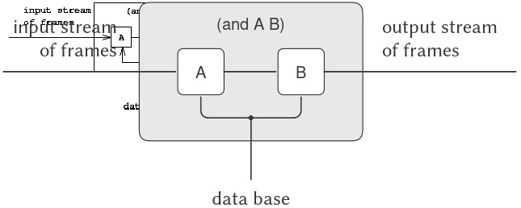

# 4.4 Logic Programming

Trong Chương 1, chúng ta đã nhấn mạnh rằng khoa học máy tính xử lý imperative ("cách làm") knowledge (kiến thức), trong khi toán học xử lý declarative ("cái gì là") knowledge. Thật vậy, programming languages (ngôn ngữ lập trình) yêu cầu lập trình viên biểu đạt kiến thức dưới một hình thức cho thấy các phương pháp từng bước để giải quyết những vấn đề cụ thể. Mặt khác, high-level languages (ngôn ngữ bậc cao) cung cấp, như một phần của việc triển khai ngôn ngữ, một lượng đáng kể methodological knowledge (kiến thức phương pháp) giúp người dùng không phải bận tâm đến vô số chi tiết về cách một phép tính đã chỉ định sẽ được thực hiện.

Hầu hết programming languages, bao gồm Lisp, được tổ chức xoay quanh việc tính toán giá trị của các mathematical functions (hàm toán học). Expression-oriented languages (ngôn ngữ hướng biểu thức) (như Lisp, Fortran, và Algol) tận dụng “lối chơi chữ” rằng một expression (biểu thức) mô tả giá trị của một hàm cũng có thể được hiểu như một phương tiện để tính toán giá trị đó. Vì lý do này, hầu hết programming languages có xu hướng thiên mạnh về unidirectional computations (tính toán một chiều) (tính toán với đầu vào và đầu ra được xác định rõ ràng). Tuy nhiên, có những programming languages hoàn toàn khác biệt làm giảm bớt sự thiên lệch này. Chúng ta đã thấy một ví dụ như vậy ở 3.3.5, nơi các đối tượng của phép tính là arithmetic constraints (ràng buộc số học). Trong một constraint system (hệ thống ràng buộc), hướng và thứ tự của phép tính không được xác định rõ ràng; do đó, khi thực hiện một phép tính, hệ thống phải cung cấp nhiều kiến thức “cách làm” chi tiết hơn so với trường hợp của một phép tính số học thông thường. Tuy nhiên, điều này không có nghĩa là người dùng hoàn toàn được giải phóng khỏi trách nhiệm cung cấp imperative knowledge. Có nhiều constraint networks (mạng ràng buộc) triển khai cùng một tập hợp ràng buộc, và người dùng phải chọn từ tập hợp các mạng tương đương về mặt toán học một mạng phù hợp để chỉ định một phép tính cụ thể.

The nondeterministic program evaluator (bộ đánh giá chương trình bất định) ở 4.3 cũng rời xa quan điểm rằng lập trình là xây dựng các thuật toán để tính toán các hàm một chiều. Trong một nondeterministic language (ngôn ngữ bất định), các biểu thức có thể có nhiều hơn một giá trị, và do đó, phép tính xử lý các quan hệ thay vì các hàm đơn trị. Logic programming (lập trình logic) mở rộng ý tưởng này bằng cách kết hợp tầm nhìn lập trình dựa trên quan hệ với một dạng powerful symbolic pattern matching (so khớp mẫu ký hiệu mạnh mẽ) gọi là *unification* (hợp nhất).^[1]

Cách tiếp cận này, khi hoạt động, có thể là một phương pháp rất mạnh mẽ để viết chương trình. Một phần sức mạnh đến từ thực tế rằng một “what is” fact (sự thật “cái gì là”) duy nhất có thể được dùng để giải quyết nhiều vấn đề khác nhau vốn sẽ có các thành phần “how to” khác nhau. Ví dụ, hãy xét operation (phép toán) `append`, nhận hai lists (danh sách) làm đối số và kết hợp các phần tử của chúng để tạo thành một danh sách duy nhất. Trong một procedural language (ngôn ngữ thủ tục) như Lisp, chúng ta có thể định nghĩa `append` dựa trên basic list constructor (hàm dựng danh sách cơ bản) `cons`, như chúng ta đã làm ở 2.2.1:

``` {.scheme}
(define (append x y)
  (if (null? x) 
      y 
      (cons (car x) (append (cdr x) y))))
```

Procedure này có thể được xem như một bản dịch sang Lisp của hai quy tắc sau, trong đó quy tắc đầu tiên bao quát trường hợp danh sách thứ nhất rỗng và quy tắc thứ hai xử lý trường hợp danh sách không rỗng, vốn là một `cons` của hai phần:

- Với bất kỳ list `y` nào, empty list (danh sách rỗng) và `y` `append` để tạo thành `y`.
- Với bất kỳ `u`, `v`, `y`, và `z` nào, `(cons u v)` và `y` `append` để tạo thành `(cons u z)` nếu `v` và `y` `append` để tạo thành `z`.^[2]

Sử dụng procedure `append`, chúng ta có thể trả lời các câu hỏi như:

> Tìm `append` của `(a b)` và `(c d)`.

Nhưng cùng hai quy tắc đó cũng đủ để trả lời các loại câu hỏi sau, vốn procedure không thể trả lời:

> Tìm một list `y` mà `append` với `(a b)` để tạo ra `(a b c d)`.
> > Tìm tất cả `x` và `y` mà `append` để tạo thành `(a b c d)`.

^[1]: Logic programming phát triển từ một lịch sử nghiên cứu lâu dài về automatic theorem proving (chứng minh định lý tự động). Các chương trình chứng minh định lý thời kỳ đầu đạt được rất ít, vì chúng tìm kiếm toàn bộ không gian các chứng minh khả dĩ. Bước đột phá lớn khiến việc tìm kiếm này khả thi là khám phá vào đầu những năm 1960 của *unification algorithm* (thuật toán hợp nhất) và *resolution principle* (nguyên lý quy giải) (Robinson 1965). Resolution được sử dụng, ví dụ, bởi Green và Raphael (1968) (xem thêm Green 1969) làm cơ sở cho một hệ thống hỏi-đáp suy diễn. Trong hầu hết giai đoạn này, các nhà nghiên cứu tập trung vào các thuật toán được đảm bảo sẽ tìm ra chứng minh nếu tồn tại. Các thuật toán như vậy khó kiểm soát và điều hướng tới một chứng minh. Hewitt (1969) nhận ra khả năng kết hợp control structure (cấu trúc điều khiển) của một programming language với các thao tác của một logic-manipulation system (hệ thống thao tác logic), dẫn đến công trình về tìm kiếm tự động được đề cập ở 4.3.1 (Footnote 250). Cùng thời điểm đó, Colmerauer, ở Marseille, đang phát triển các rule-based systems (hệ thống dựa trên luật) để xử lý natural language (ngôn ngữ tự nhiên) (xem Colmerauer et al. 1973). Ông phát minh ra một programming language gọi là Prolog để biểu diễn các luật đó. Kowalski (1973; 1979), ở Edinburgh, nhận ra rằng việc thực thi một chương trình Prolog có thể được hiểu như là chứng minh các định lý (sử dụng một kỹ thuật chứng minh gọi là linear Horn-clause resolution). Sự kết hợp của hai hướng nghiên cứu cuối cùng này đã dẫn đến phong trào logic programming. Do đó, khi ghi nhận công lao phát triển logic programming, người Pháp có thể chỉ ra nguồn gốc của Prolog tại Đại học Marseille, trong khi người Anh có thể nhấn mạnh công trình tại Đại học Edinburgh. Theo một số người ở MIT, logic programming được phát triển bởi các nhóm này trong nỗ lực tìm hiểu xem Hewitt đang nói gì trong luận án tiến sĩ xuất sắc nhưng khó hiểu của ông. Để biết lịch sử của logic programming, xem Robinson 1983.

^[2]: Để thấy sự tương ứng giữa các quy tắc và procedure, hãy để `x` trong procedure (khi `x` không rỗng) tương ứng với `(cons u v)` trong quy tắc. Khi đó `z` trong quy tắc tương ứng với `append` của `(cdr x)` và `y`.

Trong một logic programming language (ngôn ngữ lập trình logic), lập trình viên viết một `append` “procedure” (thủ tục) bằng cách nêu ra hai quy tắc về `append` đã được đưa ra ở trên. “How to” knowledge (kiến thức “cách làm”) được interpreter (trình thông dịch) tự động cung cấp để cho phép cặp quy tắc duy nhất này được sử dụng nhằm trả lời cả ba loại câu hỏi về `append`.^[3]  

Các contemporary logic programming languages (ngôn ngữ lập trình logic hiện đại) (bao gồm cả ngôn ngữ mà chúng ta triển khai ở đây) có những thiếu sót đáng kể, ở chỗ các phương pháp “how to” tổng quát của chúng có thể dẫn đến các vòng lặp vô hạn giả hoặc các hành vi không mong muốn khác. Logic programming là một lĩnh vực nghiên cứu đang hoạt động trong computer science (khoa học máy tính).^[4]  

Trước đó trong chương này, chúng ta đã khám phá công nghệ triển khai interpreters (bộ thông dịch) và mô tả các thành phần thiết yếu đối với một interpreter cho một Lisp-like language (ngôn ngữ giống Lisp) (thực tế là cho bất kỳ ngôn ngữ thông thường nào). Giờ đây, chúng ta sẽ áp dụng những ý tưởng này để thảo luận về một interpreter cho một logic programming language. Chúng ta gọi ngôn ngữ này là *query language* (ngôn ngữ truy vấn), bởi vì nó rất hữu ích để truy xuất thông tin từ data bases (cơ sở dữ liệu) bằng cách xây dựng *queries* (truy vấn), hay các câu hỏi, được diễn đạt trong ngôn ngữ này.  

Mặc dù query language rất khác với Lisp, chúng ta sẽ thấy thuận tiện khi mô tả ngôn ngữ này theo cùng một khuôn khổ tổng quát mà chúng ta đã sử dụng từ trước đến nay: như một tập hợp các primitive elements (phần tử nguyên thủy), cùng với các means of combination (phương thức kết hợp) cho phép chúng ta kết hợp các phần tử đơn giản để tạo ra các phần tử phức tạp hơn, và các means of abstraction (phương thức trừu tượng hóa) cho phép chúng ta coi các phần tử phức tạp như những đơn vị khái niệm đơn lẻ.  

Một interpreter cho một logic programming language phức tạp hơn đáng kể so với một interpreter cho một ngôn ngữ như Lisp. Tuy nhiên, chúng ta sẽ thấy rằng interpreter của query language chứa nhiều thành phần giống với interpreter ở 4.1. Đặc biệt, sẽ có một phần “eval” phân loại expressions (biểu thức) theo loại và một phần “apply” triển khai abstraction mechanism (cơ chế trừu tượng hóa) của ngôn ngữ (procedures trong trường hợp của Lisp, và *rules* (quy tắc) trong trường hợp của logic programming). Ngoài ra, một vai trò trung tâm trong việc triển khai được đảm nhận bởi frame data structure (cấu trúc dữ liệu khung), cấu trúc này xác định sự tương ứng giữa các symbols (ký hiệu) và các giá trị liên kết của chúng. Một khía cạnh thú vị khác của việc triển khai query language là chúng ta sử dụng đáng kể streams (luồng), vốn đã được giới thiệu trong Chương 3.  

## 4.4.1 Deductive Information Retrieval

Logic programming vượt trội trong việc cung cấp các giao diện tới data bases để truy xuất thông tin. Query language mà chúng ta sẽ triển khai trong chương này được thiết kế để sử dụng theo cách đó.  

Để minh họa những gì query system (hệ thống truy vấn) thực hiện, chúng ta sẽ cho thấy cách nó có thể được sử dụng để quản lý cơ sở dữ liệu hồ sơ nhân sự của Microshaft, một công ty công nghệ cao đang phát triển mạnh ở khu vực Boston. Ngôn ngữ này cung cấp khả năng truy cập thông tin nhân sự theo hướng pattern-directed (dựa trên mẫu) và cũng có thể tận dụng các general rules (quy tắc tổng quát) để đưa ra các suy luận logic.  

### A sample data base

Cơ sở dữ liệu nhân sự của Microshaft chứa các *assertions* (mệnh đề khẳng định) về nhân sự của công ty. Dưới đây là thông tin về Ben Bitdiddle, resident computer wizard (chuyên gia máy tính thường trú):

``` {.scheme}
(address (Bitdiddle Ben) 
         (Slumerville (Ridge Road) 10))
(job (Bitdiddle Ben) (computer wizard))
(salary (Bitdiddle Ben) 60000)
```

Mỗi assertion là một list (danh sách) (trong trường hợp này là một triple — bộ ba) mà các phần tử của nó cũng có thể là các list.  

Là resident wizard, Ben phụ trách bộ phận máy tính của công ty, và anh giám sát hai programmers (lập trình viên) và một technician (kỹ thuật viên). Dưới đây là thông tin về họ:  


^[3]: Điều này chắc chắn không giải phóng người dùng khỏi toàn bộ vấn đề về cách tính toán câu trả lời. Có nhiều tập hợp quy tắc tương đương về mặt toán học để xây dựng quan hệ `append`, nhưng chỉ một số trong đó có thể được chuyển thành các công cụ hiệu quả để tính toán theo bất kỳ hướng nào. Ngoài ra, đôi khi thông tin “what is” không đưa ra manh mối nào về “how to” để tính toán câu trả lời. Ví dụ, hãy xét bài toán tính $y$ sao cho $y^{2} = x$.  

^[4]: Sự quan tâm đến logic programming đạt đỉnh vào đầu những năm 80 khi chính phủ Nhật Bản bắt đầu một dự án đầy tham vọng nhằm xây dựng các máy tính siêu nhanh được tối ưu hóa để chạy logic programming languages. Tốc độ của các máy tính như vậy được đo bằng LIPS (Logical Inferences Per Second) thay vì FLOPS (FLoating-point Operations Per Second) thông thường. Mặc dù dự án đã thành công trong việc phát triển phần cứng và phần mềm như kế hoạch ban đầu, ngành công nghiệp máy tính quốc tế đã đi theo một hướng khác. Xem Feigenbaum và Shrobe 1993 để có cái nhìn tổng quan và đánh giá về dự án của Nhật Bản. Cộng đồng logic programming cũng đã chuyển sang xem xét relational programming (lập trình quan hệ) dựa trên các kỹ thuật khác ngoài simple pattern matching (so khớp mẫu đơn giản), chẳng hạn như khả năng xử lý numerical constraints (ràng buộc số) như những ràng buộc được minh họa trong constraint-propagation system (hệ thống truyền ràng buộc) ở 3.3.5.


Cũng có một programmer trainee (lập trình viên tập sự), người được Alyssa giám sát:  

``` {.scheme}
(address (Reasoner Louis) 
         (Slumerville (Pine Tree Road) 80))
(job (Reasoner Louis) 
     (computer programmer trainee))
(salary (Reasoner Louis) 30000)
(supervisor (Reasoner Louis) 
            (Hacker Alyssa P))
```

Tất cả những người này đều thuộc computer division (bộ phận máy tính), như được chỉ ra bởi từ `computer` là mục đầu tiên trong phần mô tả công việc của họ.  

Ben là một high-level employee (nhân viên cấp cao). Người giám sát của anh chính là big wheel (lãnh đạo cấp cao) của công ty:  

``` {.scheme}
(supervisor (Bitdiddle Ben) (Warbucks Oliver))
(address (Warbucks Oliver) 
         (Swellesley (Top Heap Road)))
(job (Warbucks Oliver) 
     (administration big wheel))
(salary (Warbucks Oliver) 150000)
```

Ngoài computer division do Ben giám sát, công ty còn có một accounting division (bộ phận kế toán), bao gồm một chief accountant (kế toán trưởng) và trợ lý của ông:  

``` {.scheme}
(address (Scrooge Eben) 
         (Weston (Shady Lane) 10))
(job (Scrooge Eben) 
     (accounting chief accountant))
(salary (Scrooge Eben) 75000)
(supervisor (Scrooge Eben) (Warbucks Oliver))

(address (Cratchet Robert) 
         (Allston (N Harvard Street) 16))
(job (Cratchet Robert) (accounting scrivener))
(salary (Cratchet Robert) 18000)
(supervisor (Cratchet Robert) (Scrooge Eben))
```

Cũng có một secretary (thư ký) cho big wheel:  

``` {.scheme}
(address (Aull DeWitt) 
         (Slumerville (Onion Square) 5))
(job (Aull DeWitt) (administration secretary))
(salary (Aull DeWitt) 25000)
(supervisor (Aull DeWitt) (Warbucks Oliver))
```

Cơ sở dữ liệu cũng chứa các assertions (mệnh đề khẳng định) về những loại công việc có thể được thực hiện bởi những người giữ các loại công việc khác. Ví dụ, một computer wizard có thể làm cả công việc của một computer programmer và một computer technician:  

``` {.scheme}
(can-do-job (computer wizard) 
            (computer programmer))

(can-do-job (computer wizard) 
            (computer technician))
```

Một computer programmer có thể thay thế cho một trainee:  

``` {.scheme}
(can-do-job (computer programmer)
            (computer programmer trainee))
```

Ngoài ra, như ai cũng biết:  

``` {.scheme}
(can-do-job (administration secretary)
            (administration big wheel))
```

### Simple queries

Query language (ngôn ngữ truy vấn) cho phép người dùng truy xuất thông tin từ data base (cơ sở dữ liệu) bằng cách đưa ra các truy vấn để phản hồi lại prompt (nhắc lệnh) của hệ thống. Ví dụ, để tìm tất cả các computer programmers (lập trình viên máy tính), ta có thể viết:  

``` {.scheme}
;;; Query input:
(job ?x (computer programmer))
```

Hệ thống sẽ phản hồi với các mục sau:  

``` {.scheme}
;;; Query results:
(job (Hacker Alyssa P) (computer programmer))
(job (Fect Cy D) (computer programmer))
```

Truy vấn đầu vào chỉ ra rằng chúng ta đang tìm các mục trong data base khớp với một *pattern* (mẫu) nhất định. Trong ví dụ này, pattern chỉ ra rằng các mục bao gồm ba phần tử, trong đó phần tử thứ nhất là literal symbol (ký hiệu dạng literal) `job`, phần tử thứ hai có thể là bất kỳ giá trị nào, và phần tử thứ ba là literal list `(computer programmer)`. Giá trị “bất kỳ” có thể là phần tử thứ hai trong danh sách khớp được chỉ định bởi một *pattern variable* (biến mẫu), `?x`. Dạng tổng quát của một pattern variable là một symbol, được coi là tên của biến, đứng trước bởi một dấu hỏi. Chúng ta sẽ thấy bên dưới lý do tại sao việc chỉ định tên cho pattern variables lại hữu ích hơn là chỉ đặt `?` vào trong pattern để biểu diễn “bất kỳ giá trị nào”. Hệ thống phản hồi một simple query (truy vấn đơn giản) bằng cách hiển thị tất cả các mục trong data base khớp với pattern đã chỉ định.  

Một pattern có thể có nhiều hơn một biến. Ví dụ, truy vấn:  

``` {.scheme}
(address ?x ?y)
```

sẽ liệt kê tất cả địa chỉ của nhân viên.  

Một pattern có thể không có biến nào, trong trường hợp đó truy vấn chỉ đơn giản xác định xem pattern đó có phải là một mục trong data base hay không. Nếu có, sẽ có một kết quả khớp; nếu không, sẽ không có kết quả nào.  

Cùng một pattern variable có thể xuất hiện nhiều hơn một lần trong một truy vấn, chỉ ra rằng cùng một “bất kỳ giá trị nào” phải xuất hiện ở mỗi vị trí. Đây là lý do tại sao các biến có tên. Ví dụ:  

``` {.scheme}
(supervisor ?x ?x)
```

tìm tất cả những người tự giám sát chính mình (mặc dù không có mệnh đề nào như vậy trong data base mẫu của chúng ta).  

Truy vấn:  

``` {.scheme}
(job ?x (computer ?type))
```

khớp với tất cả các mục công việc mà phần tử thứ ba là một danh sách gồm hai phần tử, trong đó phần tử đầu tiên là `computer`:  

``` {.scheme}
(job (Bitdiddle Ben) (computer wizard))
(job (Hacker Alyssa P) (computer programmer))
(job (Fect Cy D) (computer programmer))
(job (Tweakit Lem E) (computer technician))
```

Pattern này *không* khớp với:  

``` {.scheme}
(job (Reasoner Louis) 
     (computer programmer trainee))
```

bởi vì phần tử thứ ba trong mục này là một danh sách gồm ba phần tử, trong khi phần tử thứ ba của pattern chỉ định rằng phải có hai phần tử. Nếu chúng ta muốn thay đổi pattern để phần tử thứ ba có thể là bất kỳ danh sách nào bắt đầu bằng `computer`, ta có thể chỉ định^[5]:  

``` {.scheme}
(job ?x (computer . ?type))
```

Ví dụ:  

``` {.scheme}
(computer . ?type)
```

khớp với dữ liệu:  

``` {.scheme}
(computer programmer trainee)
```

với `?type` là danh sách `(programmer trainee)`. Nó cũng khớp với dữ liệu:  

``` {.scheme}
(computer programmer)
```

với `?type` là danh sách `(programmer)`, và khớp với dữ liệu:  

``` {.scheme}
(computer)
```

với `?type` là danh sách rỗng `()`.  

Chúng ta có thể mô tả cách query language xử lý simple queries như sau:  

- Hệ thống tìm tất cả các phép gán cho các biến trong query pattern mà *satisfy* (thỏa mãn) pattern — nghĩa là, tất cả các tập giá trị cho các biến sao cho nếu pattern variables được *instantiated with* (thay thế bằng) các giá trị đó, kết quả sẽ có trong data base.  
- Hệ thống phản hồi truy vấn bằng cách liệt kê tất cả các instantiations (thể hiện) của query pattern với các phép gán biến thỏa mãn nó.  

Lưu ý rằng nếu pattern không có biến nào, truy vấn sẽ được rút gọn thành việc xác định xem pattern đó có trong data base hay không. Nếu có, phép gán rỗng — không gán giá trị nào cho biến — sẽ thỏa mãn pattern đó đối với data base này.  


^[5]: Điều này sử dụng dotted-tail notation (ký pháp đuôi chấm) được giới thiệu trong Bài tập 2.20.

### Compound queries

Simple queries (truy vấn đơn giản) tạo thành các primitive operations (phép toán nguyên thủy) của query language (ngôn ngữ truy vấn). Để hình thành các compound operations (phép toán phức hợp), query language cung cấp các means of combination (phương thức kết hợp). Một yếu tố khiến query language trở thành một logic programming language (ngôn ngữ lập trình logic) là các means of combination này phản chiếu các phương thức kết hợp được sử dụng trong việc hình thành logical expressions (biểu thức logic): `and`, `or`, và `not`. (Ở đây `and`, `or`, và `not` không phải là các Lisp primitives, mà là các phép toán được tích hợp sẵn trong query language.)  

Chúng ta có thể sử dụng `and` như sau để tìm địa chỉ của tất cả các computer programmers:  

``` {.scheme}
(and (job ?person (computer programmer))
     (address ?person ?where))
```

Kết quả đầu ra là:  

``` {.scheme}
(and (job (Hacker Alyssa P) 
          (computer programmer))
     (address (Hacker Alyssa P) 
              (Cambridge (Mass Ave) 78)))

(and (job (Fect Cy D) (computer programmer))
     (address (Fect Cy D) 
              (Cambridge (Ames Street) 3)))
```

Tổng quát:  

``` {.scheme}
(and ⟨query₁⟩ ⟨query₂⟩ … ⟨queryₙ⟩)
```

được thỏa mãn bởi tất cả các tập giá trị của pattern variables (biến mẫu) đồng thời thỏa mãn $\langle\mspace{2mu} query_{1}\rangle$ … $\langle\mspace{2mu} query_{n}\rangle$.  

Tương tự như với simple queries, hệ thống xử lý một compound query bằng cách tìm tất cả các phép gán cho pattern variables thỏa mãn truy vấn, sau đó hiển thị các instantiations (thể hiện) của truy vấn với các giá trị đó.  

Một phương thức khác để xây dựng compound queries là thông qua `or`. Ví dụ:  

``` {.scheme}
(or (supervisor ?x (Bitdiddle Ben))
    (supervisor ?x (Hacker Alyssa P)))
```

sẽ tìm tất cả các nhân viên được giám sát bởi Ben Bitdiddle hoặc Alyssa P. Hacker:  

``` {.scheme}
(or (supervisor (Hacker Alyssa P) 
                (Bitdiddle Ben))
    (supervisor (Hacker Alyssa P) 
                (Hacker Alyssa P)))

(or (supervisor (Fect Cy D) 
                (Bitdiddle Ben))
    (supervisor (Fect Cy D) 
                (Hacker Alyssa P)))

(or (supervisor (Tweakit Lem E) 
                (Bitdiddle Ben))
    (supervisor (Tweakit Lem E) 
                (Hacker Alyssa P)))

(or (supervisor (Reasoner Louis) 
                (Bitdiddle Ben))
    (supervisor (Reasoner Louis) 
                (Hacker Alyssa P)))
```

Tổng quát:  

``` {.scheme}
(or ⟨query₁⟩ ⟨query₂⟩ … ⟨queryₙ⟩)
```

được thỏa mãn bởi tất cả các tập giá trị của pattern variables thỏa mãn ít nhất một trong các $\langle\mspace{2mu} query_{1}\rangle$ … $\langle\mspace{2mu} query_{n}\rangle$.  

Compound queries cũng có thể được tạo bằng `not`. Ví dụ:  

``` {.scheme}
(and (supervisor ?x (Bitdiddle Ben))
     (not (job ?x (computer programmer))))
```

tìm tất cả những người được Ben Bitdiddle giám sát nhưng không phải là computer programmers. Tổng quát:  

``` {.scheme}
(not ⟨query₁⟩)
```

được thỏa mãn bởi tất cả các phép gán cho pattern variables mà không thỏa mãn $\langle\mspace{2mu} query_{1}\rangle$.^[6]  

Hình thức kết hợp cuối cùng được gọi là `lisp-value`. Khi `lisp-value` là phần tử đầu tiên của một pattern, nó chỉ ra rằng phần tử tiếp theo là một Lisp predicate (mệnh đề điều kiện Lisp) sẽ được áp dụng cho các phần tử còn lại (đã được instantiate) như các đối số. Tổng quát:  

``` {.scheme}
(lisp-value ⟨predicate⟩ ⟨arg₁⟩ … ⟨argₙ⟩)
```

sẽ được thỏa mãn bởi các phép gán cho pattern variables mà `⟨`predicate`⟩` khi áp dụng cho các $\langle\mspace{2mu} arg_{1}\rangle$ … $\langle\mspace{2mu} arg_{n}\rangle$ đã được instantiate là đúng. Ví dụ, để tìm tất cả những người có salary (mức lương) lớn hơn \$30,000, chúng ta có thể viết^[7]:  

``` {.scheme}
(and (salary ?person ?amount)
     (lisp-value > ?amount 30000))
```


^[6]: Thực tế, mô tả này của `not` chỉ đúng cho các trường hợp đơn giản. Hành vi thực sự của `not` phức tạp hơn. Chúng ta sẽ xem xét các đặc điểm riêng của `not` trong 4.4.2 và 4.4.3.  

^[7]: `Lisp-value` chỉ nên được sử dụng để thực hiện một phép toán không được hỗ trợ sẵn trong query language. Đặc biệt, nó không nên được dùng để kiểm tra equality (bằng nhau) (vì đó là điều mà cơ chế matching trong query language được thiết kế để thực hiện) hoặc inequality (khác nhau) (vì điều đó có thể được thực hiện với `same` rule được trình bày bên dưới).

### Rules

Ngoài primitive queries (truy vấn nguyên thủy) và compound queries (truy vấn phức hợp), query language (ngôn ngữ truy vấn) còn cung cấp phương thức để trừu tượng hóa truy vấn. Các phương thức này được đưa ra dưới dạng *rules* (quy tắc). Quy tắc:

``` {.scheme}
(rule (lives-near ?person-1 ?person-2)
      (and (address ?person-1 
                    (?town . ?rest-1))
           (address ?person-2 
                    (?town . ?rest-2))
           (not (same ?person-1 ?person-2))))
```

chỉ ra rằng hai người sống gần nhau nếu họ sống trong cùng một thị trấn. Mệnh đề `not` cuối cùng ngăn quy tắc này khẳng định rằng mọi người đều sống gần chính mình. Quan hệ `same` được định nghĩa bởi một quy tắc rất đơn giản:^[8]  

``` {.scheme}
(rule (same ?x ?x))
```

Quy tắc sau đây tuyên bố rằng một người là “wheel” (nhân vật quyền lực) trong một tổ chức nếu người đó giám sát ai đó mà người này lại là một supervisor (người giám sát):

``` {.scheme}
(rule (wheel ?person)
      (and (supervisor ?middle-manager 
                       ?person)
           (supervisor ?x ?middle-manager)))
```

Dạng tổng quát của một quy tắc là:

``` {.scheme}
(rule ⟨conclusion⟩ ⟨body⟩)
```

trong đó `⟨`conclusion`⟩` là một pattern (mẫu) và `⟨`body`⟩` là bất kỳ query (truy vấn) nào.^[9] Chúng ta có thể xem một quy tắc như đại diện cho một tập hợp lớn (thậm chí vô hạn) các assertions (mệnh đề khẳng định), cụ thể là tất cả các instantiations (thể hiện) của phần kết luận của quy tắc với các phép gán biến thỏa mãn phần thân quy tắc. Khi mô tả simple queries (truy vấn đơn giản), chúng ta đã nói rằng một phép gán cho các biến thỏa mãn một pattern nếu pattern đã được instantiate có trong data base (cơ sở dữ liệu). Tuy nhiên, pattern không nhất thiết phải tồn tại tường minh trong data base như một assertion. Nó có thể là một assertion ngầm được suy ra từ một quy tắc. Ví dụ, truy vấn:

``` {.scheme}
(lives-near ?x (Bitdiddle Ben))
```

cho kết quả:

``` {.scheme}
(lives-near (Reasoner Louis) (Bitdiddle Ben))
(lives-near (Aull DeWitt) (Bitdiddle Ben))
```

Để tìm tất cả các computer programmers (lập trình viên máy tính) sống gần Ben Bitdiddle, ta có thể hỏi:

``` {.scheme}
(and (job ?x (computer programmer))
     (lives-near ?x (Bitdiddle Ben)))
```

Giống như trong trường hợp compound procedures (thủ tục phức hợp), rules có thể được sử dụng như một phần của các rules khác (như ta đã thấy với quy tắc `lives-near` ở trên) hoặc thậm chí được định nghĩa đệ quy. Ví dụ, quy tắc:

``` {.scheme}
(rule (outranked-by ?staff-person ?boss)
      (or (supervisor ?staff-person ?boss)
          (and (supervisor ?staff-person 
                           ?middle-manager)
               (outranked-by ?middle-manager 
                             ?boss))))
```

nói rằng một nhân viên bị outranked-by (cấp dưới) một boss (sếp) trong tổ chức nếu boss là supervisor của người đó hoặc (đệ quy) nếu supervisor của người đó bị outranked-by boss.

### Logic as programs

Chúng ta có thể coi một rule như một dạng logical implication (hàm ý logic): *Nếu* một phép gán giá trị cho các pattern variables thỏa mãn phần thân, *thì* nó thỏa mãn phần kết luận. Do đó, chúng ta có thể coi query language là có khả năng thực hiện *logical deductions* (suy luận logic) dựa trên các rules.  

Ví dụ, hãy xét operation (phép toán) `append` được mô tả ở đầu mục 4.4. Như đã nói, `append` có thể được đặc trưng bởi hai quy tắc sau:  

- Với bất kỳ list `y` nào, empty list (danh sách rỗng) và `y` `append` để tạo thành `y`.  
- Với bất kỳ `u`, `v`, `y`, và `z` nào, `(cons u v)` và `y` `append` để tạo thành `(cons u z)` nếu `v` và `y` `append` để tạo thành `z`.  

Để biểu diễn điều này trong query language, chúng ta định nghĩa hai quy tắc cho một relation (quan hệ):

``` {.scheme}
(append-to-form x y z)
```

mà ta có thể hiểu là “`x` và `y` `append` để tạo thành `z`”:

``` {.scheme}
(rule (append-to-form () ?y ?y))
(rule (append-to-form (?u . ?v) ?y (?u . ?z))
      (append-to-form ?v ?y ?z))
```

Quy tắc đầu tiên không có body, nghĩa là kết luận đúng với mọi giá trị của `?y`. Lưu ý cách quy tắc thứ hai sử dụng dotted-tail notation (ký pháp đuôi chấm) để đặt tên cho `car` và `cdr` của một list.  

Với hai quy tắc này, chúng ta có thể xây dựng các truy vấn để tính `append` của hai lists:  

``` {.scheme}
;;; Query input:
(append-to-form (a b) (c d) ?z)

;;; Query results:
(append-to-form (a b) (c d) (a b c d))
```

Điều thú vị hơn là chúng ta có thể dùng cùng các quy tắc này để hỏi: “List nào, khi `append` với `(a b)`, sẽ cho ra `(a b c d)`?” Điều này được thực hiện như sau:  

``` {.scheme}
;;; Query input:
(append-to-form (a b) ?y (a b c d))

;;; Query results:
(append-to-form (a b) (c d) (a b c d))
```

Chúng ta cũng có thể yêu cầu tất cả các cặp lists mà `append` để tạo thành `(a b c d)`:

``` {.scheme}
;;; Query input:
(append-to-form ?x ?y (a b c d))

;;; Query results:
(append-to-form () (a b c d) (a b c d))
(append-to-form (a) (b c d) (a b c d))
(append-to-form (a b) (c d) (a b c d))
(append-to-form (a b c) (d) (a b c d))
(append-to-form (a b c d) () (a b c d))
```

Query system (hệ thống truy vấn) có vẻ thể hiện khá nhiều “trí thông minh” khi sử dụng các rules để suy ra câu trả lời cho các truy vấn trên. Thực tế, như chúng ta sẽ thấy ở phần tiếp theo, hệ thống đang tuân theo một thuật toán được xác định rõ ràng để phân giải các rules. Đáng tiếc là, mặc dù hệ thống hoạt động ấn tượng trong trường hợp `append`, các phương pháp tổng quát có thể thất bại trong những trường hợp phức tạp hơn, như chúng ta sẽ thấy ở 4.4.3.  


^[8]: Lưu ý rằng chúng ta không cần `same` để làm cho hai thứ giống nhau: Chỉ cần sử dụng cùng một pattern variable cho mỗi thứ — thực chất, chúng ta chỉ có một thứ thay vì hai thứ ngay từ đầu. Ví dụ, xem `?town` trong quy tắc `lives-near` và `?middle-manager` trong quy tắc `wheel` bên dưới. `Same` hữu ích khi chúng ta muốn buộc hai thứ phải khác nhau, chẳng hạn như `?person-1` và `?person-2` trong quy tắc `lives-near`. Mặc dù việc sử dụng cùng một pattern variable ở hai phần của một truy vấn buộc cùng một giá trị xuất hiện ở cả hai chỗ, nhưng việc sử dụng các pattern variables khác nhau không buộc các giá trị phải khác nhau. (Các giá trị được gán cho các pattern variables khác nhau có thể giống hoặc khác nhau.)  

^[9]: Chúng ta cũng cho phép các rules không có body, như trong `same`, và chúng ta sẽ hiểu một quy tắc như vậy có nghĩa là kết luận của quy tắc được thỏa mãn với bất kỳ giá trị nào của các biến.

## 4.4.2 How the Query System Works

Trong mục 4.4.4, chúng ta sẽ trình bày một implementation (triển khai) của query interpreter (bộ thông dịch truy vấn) dưới dạng một tập hợp các procedures (thủ tục). Trong mục này, chúng ta đưa ra một phần tổng quan giải thích cấu trúc chung của hệ thống, tách biệt với các chi tiết triển khai ở mức thấp. Sau khi mô tả việc triển khai interpreter, chúng ta sẽ có cơ sở để hiểu một số hạn chế của nó và một số cách tinh vi mà các phép toán logic của query language (ngôn ngữ truy vấn) khác với các phép toán của mathematical logic (logic toán học).

Có thể thấy rõ rằng query evaluator (bộ đánh giá truy vấn) phải thực hiện một dạng tìm kiếm nào đó để so khớp các truy vấn với các facts (sự kiện) và rules (quy tắc) trong data base (cơ sở dữ liệu). Một cách để làm điều này là triển khai query system (hệ thống truy vấn) như một nondeterministic program (chương trình bất định), sử dụng `amb` evaluator ở 4.3 (xem Bài tập 4.78). Một khả năng khác là quản lý việc tìm kiếm với sự hỗ trợ của streams (luồng). Implementation của chúng ta theo cách tiếp cận thứ hai này.

Query system được tổ chức xoay quanh hai thao tác trung tâm gọi là *pattern matching* (so khớp mẫu) và *unification* (hợp nhất). Trước tiên, chúng ta mô tả pattern matching và giải thích cách thao tác này, cùng với việc tổ chức thông tin dưới dạng streams of frames (luồng các khung), cho phép chúng ta triển khai cả simple queries (truy vấn đơn giản) và compound queries (truy vấn phức hợp). Tiếp theo, chúng ta thảo luận về unification, một sự khái quát hóa của pattern matching cần thiết để triển khai rules. Cuối cùng, chúng ta sẽ chỉ ra cách toàn bộ query interpreter được ghép lại với nhau thông qua một procedure phân loại expressions (biểu thức) theo cách tương tự như `eval` phân loại expressions cho interpreter được mô tả ở 4.1.

### Pattern matching

Một *pattern matcher* (bộ so khớp mẫu) là một chương trình kiểm tra xem một datum (dữ liệu) có khớp với một pattern (mẫu) đã chỉ định hay không. Ví dụ, data list `((a b) c (a b))` khớp với pattern `(?x c ?x)` với pattern variable (biến mẫu) `?x` được gán giá trị `(a b)`. Cùng data list này khớp với pattern `(?x ?y ?z)` với `?x` và `?z` đều được gán `(a b)` và `?y` được gán `c`. Nó cũng khớp với pattern `((?x ?y) c (?x ?y))` với `?x` được gán `a` và `?y` được gán `b`. Tuy nhiên, nó không khớp với pattern `(?x a ?y)`, vì pattern này chỉ định một list có phần tử thứ hai là symbol `a`.

Pattern matcher được query system sử dụng nhận vào một pattern, một datum, và một *frame* (khung) chỉ định các bindings (ràng buộc) cho các pattern variables khác nhau. Nó kiểm tra xem datum có khớp với pattern theo cách nhất quán với các bindings đã có trong frame hay không. Nếu có, nó trả về frame đã cho, được bổ sung thêm bất kỳ bindings nào có thể được xác định bởi phép so khớp. Nếu không, nó cho biết rằng phép so khớp đã thất bại.

Ví dụ, sử dụng pattern `(?x ?y ?x)` để so khớp `(a b a)` với một empty frame (khung rỗng) sẽ trả về một frame chỉ định rằng `?x` được gán `a` và `?y` được gán `b`. Thử so khớp với cùng pattern, cùng datum, và một frame chỉ định rằng `?y` được gán `a` sẽ thất bại. Thử so khớp với cùng pattern, cùng datum, và một frame trong đó `?y` được gán `b` và `?x` chưa được gán sẽ trả về frame đã cho, được bổ sung thêm binding của `?x` với `a`.

Pattern matcher là toàn bộ cơ chế cần thiết để xử lý các simple queries không liên quan đến rules. Ví dụ, để xử lý truy vấn:

``` {.scheme}
(job ?x (computer programmer))
```

chúng ta quét qua tất cả các assertions (mệnh đề khẳng định) trong data base và chọn những mệnh đề khớp với pattern so với một empty frame ban đầu. Với mỗi kết quả khớp tìm được, chúng ta sử dụng frame trả về từ phép so khớp để instantiate (thay thế) pattern với một giá trị cho `?x`.

### Streams of frames

Việc kiểm tra các patterns (mẫu) so với frames (khung) được tổ chức thông qua việc sử dụng streams (luồng). Với một frame duy nhất, quá trình so khớp sẽ duyệt qua các mục trong data base (cơ sở dữ liệu) từng mục một. Với mỗi mục trong data base, matcher (bộ so khớp) sẽ tạo ra hoặc là một symbol đặc biệt cho biết phép so khớp đã thất bại, hoặc là một phần mở rộng của frame. Kết quả cho tất cả các mục trong data base được thu thập thành một stream, sau đó được đưa qua một bộ lọc để loại bỏ các kết quả thất bại. Kết quả cuối cùng là một stream gồm tất cả các frames mở rộng frame đã cho thông qua việc so khớp với một assertion (mệnh đề khẳng định) nào đó trong data base.^[10]  

Trong hệ thống của chúng ta, một query (truy vấn) nhận vào một input stream (luồng đầu vào) gồm các frames và thực hiện thao tác so khớp như trên cho từng frame trong stream, như minh họa ở Hình 4.4. Nghĩa là, với mỗi frame trong input stream, query sẽ tạo ra một stream mới gồm tất cả các phần mở rộng của frame đó thông qua việc so khớp với các assertions trong data base. Tất cả các streams này sau đó được kết hợp lại để tạo thành một stream lớn duy nhất, chứa tất cả các phần mở rộng khả dĩ của mọi frame trong input stream. Stream này chính là output (đầu ra) của query.


**Figure 4.4:** A query processes a stream of frames.

Để trả lời một simple query (truy vấn đơn giản), chúng ta sử dụng query với một input stream gồm một empty frame (khung rỗng) duy nhất. Output stream thu được sẽ chứa tất cả các phần mở rộng của empty frame (tức là tất cả các câu trả lời cho truy vấn của chúng ta). Stream các frames này sau đó được dùng để tạo ra một stream các bản sao của query pattern gốc, với các biến được instantiate (thay thế) bằng các giá trị trong mỗi frame, và đây là stream cuối cùng được in ra.

### Compound queries

Sự tinh tế thực sự của việc triển khai stream-of-frames (luồng khung) thể hiện rõ khi chúng ta xử lý compound queries (truy vấn phức hợp). Việc xử lý compound queries tận dụng khả năng của matcher yêu cầu một phép so khớp phải nhất quán với một frame đã chỉ định. Ví dụ, để xử lý `and` của hai queries, như:

``` {.scheme}
(and (can-do-job 
      ?x 
      (computer programmer trainee))
     (job ?person ?x))
```

(theo cách diễn đạt tự nhiên: “Tìm tất cả những người có thể làm công việc của một computer programmer trainee”), trước tiên chúng ta tìm tất cả các mục khớp với pattern:

``` {.scheme}
(can-do-job ?x (computer programmer trainee))
```

Điều này tạo ra một stream các frames, mỗi frame chứa một binding (ràng buộc) cho `?x`. Sau đó, với mỗi frame trong stream, chúng ta tìm tất cả các mục khớp với:

``` {.scheme}
(job ?person ?x)
```

theo cách nhất quán với binding đã cho của `?x`. Mỗi phép so khớp như vậy sẽ tạo ra một frame chứa các bindings cho `?x` và `?person`. `And` của hai queries có thể được xem như một sự kết hợp nối tiếp của hai truy vấn thành phần, như minh họa ở Hình 4.5. Các frames đi qua bộ lọc của truy vấn thứ nhất sẽ được lọc và mở rộng thêm bởi truy vấn thứ hai.



**Figure 4.5:** The `and` combination of two queries is produced by operating on the stream of frames in series.

Figure 4.6 minh họa phương pháp tương tự để tính `or` của hai queries như một sự kết hợp song song của hai truy vấn thành phần. Input stream các frames được mở rộng riêng biệt bởi mỗi truy vấn. Hai streams kết quả sau đó được hợp nhất để tạo ra output stream cuối cùng.


**Figure 4.6:** The `or` combination of two queries is produced by operating on the stream of frames in parallel and merging the results.

Ngay cả từ mô tả ở mức cao này, có thể thấy rằng việc xử lý compound queries có thể chậm. Ví dụ, vì một query có thể tạo ra nhiều hơn một output frame cho mỗi input frame, và mỗi query trong một `and` nhận input frames từ query trước đó, một `and` query trong trường hợp xấu nhất có thể phải thực hiện số phép so khớp tăng theo hàm mũ với số lượng queries (xem Bài tập 4.76).^[11] Mặc dù các hệ thống chỉ xử lý simple queries là khá khả thi, việc xử lý complex queries (truy vấn phức tạp) là cực kỳ khó khăn.^[12]  

Từ góc nhìn stream-of-frames, `not` của một query nào đó hoạt động như một bộ lọc loại bỏ tất cả các frames mà query đó có thể được thỏa mãn. Ví dụ, với pattern:

``` {.scheme}
(not (job ?x (computer programmer)))
```

chúng ta sẽ cố gắng, với mỗi frame trong input stream, tạo ra các extension frames (khung mở rộng) thỏa mãn `(job ?x (computer programmer))`. Chúng ta loại bỏ khỏi input stream tất cả các frames mà các extension như vậy tồn tại. Kết quả là một stream chỉ gồm những frames trong đó binding của `?x` không thỏa mãn `(job ?x (computer programmer))`. Ví dụ, khi xử lý truy vấn:

``` {.scheme}
(and (supervisor ?x ?y)
     (not (job ?x (computer programmer))))
```

mệnh đề đầu tiên sẽ tạo ra các frames với bindings cho `?x` và `?y`. Mệnh đề `not` sau đó sẽ lọc các frames này bằng cách loại bỏ tất cả các frames trong đó binding của `?x` thỏa mãn điều kiện rằng `?x` là một computer programmer.^[13]  

Special form (dạng đặc biệt) `lisp-value` được triển khai như một bộ lọc tương tự trên các frame streams. Chúng ta sử dụng mỗi frame trong stream để instantiate bất kỳ biến nào trong pattern, sau đó áp dụng Lisp predicate (mệnh đề điều kiện Lisp). Chúng ta loại bỏ khỏi input stream tất cả các frames mà predicate trả về false.


^[10]: Vì việc so khớp thường rất tốn kém, chúng ta muốn tránh áp dụng full matcher (bộ so khớp đầy đủ) cho mọi phần tử của data base. Điều này thường được thực hiện bằng cách chia quá trình thành một phép so khớp nhanh, thô và phép so khớp cuối cùng. Phép so khớp thô lọc data base để tạo ra một tập nhỏ các ứng viên cho phép so khớp cuối cùng. Nếu cẩn thận, chúng ta có thể sắp xếp data base sao cho một phần công việc của phép so khớp thô có thể được thực hiện khi xây dựng data base thay vì khi chúng ta muốn chọn các ứng viên. Điều này được gọi là *indexing* (đánh chỉ mục) data base. Có một công nghệ rất lớn xoay quanh các phương pháp đánh chỉ mục cơ sở dữ liệu. Implementation của chúng ta, được mô tả ở 4.4.4, chứa một dạng tối ưu hóa đơn giản của kỹ thuật này.  

^[11]: Nhưng kiểu bùng nổ theo hàm mũ này không phổ biến trong các `and` queries vì các điều kiện bổ sung có xu hướng giảm thay vì tăng số lượng frames được tạo ra.  

^[12]: Có một lượng lớn tài liệu về data-base-management systems (hệ quản trị cơ sở dữ liệu) tập trung vào cách xử lý complex queries một cách hiệu quả.  

^[13]: Có một sự khác biệt tinh tế giữa cách triển khai `not` như một bộ lọc này và ý nghĩa thông thường của `not` trong mathematical logic. Xem 4.4.3.


### Unification

Để xử lý các rules (quy tắc) trong query language (ngôn ngữ truy vấn), chúng ta phải có khả năng tìm các rules có phần kết luận (conclusion) khớp với một query pattern (mẫu truy vấn) đã cho. Rule conclusions giống như assertions (mệnh đề khẳng định) ngoại trừ việc chúng có thể chứa các biến, vì vậy chúng ta sẽ cần một sự khái quát hóa của pattern matching (so khớp mẫu) — gọi là *unification* (hợp nhất) — trong đó cả “pattern” và “datum” (dữ liệu) đều có thể chứa biến.

Một *unifier* (bộ hợp nhất) nhận vào hai patterns, mỗi pattern chứa các hằng số và biến, và xác định xem có thể gán giá trị cho các biến để làm cho hai patterns này bằng nhau hay không. Nếu có thể, nó trả về một frame (khung) chứa các bindings (ràng buộc) này. Ví dụ, unifying `(?x a ?y)` và `(?y ?z a)` sẽ tạo ra một frame trong đó `?x`, `?y`, và `?z` đều được gán giá trị `a`. Ngược lại, unifying `(?x ?y a)` và `(?x b ?y)` sẽ thất bại, vì không có giá trị nào cho `?y` có thể làm cho hai patterns này bằng nhau. (Để phần tử thứ hai của hai patterns bằng nhau, `?y` phải là `b`; tuy nhiên, để phần tử thứ ba bằng nhau, `?y` phải là `a`.) Unifier được sử dụng trong query system, giống như pattern matcher, nhận vào một frame và thực hiện unification sao cho nhất quán với frame này.

Thuật toán unification là phần khó nhất về mặt kỹ thuật của query system. Với các patterns phức tạp, việc thực hiện unification có thể đòi hỏi suy luận. Ví dụ, để unify `(?x ?x)` và `((a ?y c) (a b ?z))`, thuật toán phải suy ra rằng `?x` nên là `(a b c)`, `?y` nên là `b`, và `?z` nên là `c`. Chúng ta có thể xem quá trình này như việc giải một tập hợp các phương trình giữa các thành phần của pattern. Nói chung, đây là các phương trình đồng thời, có thể yêu cầu xử lý đáng kể để giải quyết.^[14] Ví dụ, unifying `(?x ?x)` và `((a ?y c) (a b ?z))` có thể được xem như việc xác định các phương trình đồng thời:

``` {.scheme}
?x = (a ?y c)
?x = (a b ?z)
```

Các phương trình này ngụ ý rằng:

``` {.scheme}
(a ?y c) = (a b ?z)
```

và điều này lại ngụ ý rằng:

``` {.scheme}
a = a, ?y = b, c = ?z,
```

và do đó:

``` {.scheme}
?x = (a b c)
```

Trong một pattern match thành công, tất cả các pattern variables sẽ được gán giá trị, và các giá trị này chỉ chứa các hằng số. Điều này cũng đúng với tất cả các ví dụ về unification mà chúng ta đã thấy cho đến nay. Tuy nhiên, nói chung, một unification thành công có thể không xác định hoàn toàn giá trị của các biến; một số biến có thể vẫn chưa được gán, và một số khác có thể được gán các giá trị chứa biến.

Xét unification của `(?x a)` và `((b ?y) ?z)`. Chúng ta có thể suy ra rằng `?x = (b ?y)` và `a = ?z`, nhưng không thể giải thêm cho `?x` hoặc `?y`. Unification này không thất bại, vì chắc chắn có thể làm cho hai patterns này bằng nhau bằng cách gán giá trị cho `?x` và `?y`. Vì phép so khớp này không hề giới hạn các giá trị mà `?y` có thể nhận, nên không có binding nào cho `?y` được đưa vào frame kết quả. Tuy nhiên, phép so khớp này giới hạn giá trị của `?x`. Dù `?y` có giá trị gì, `?x` cũng phải là `(b ?y)`. Do đó, một binding của `?x` với pattern `(b ?y)` được đưa vào frame. Nếu sau này giá trị của `?y` được xác định và thêm vào frame (bởi một pattern match hoặc unification khác cần nhất quán với frame này), thì `?x` đã được gán trước đó sẽ tham chiếu đến giá trị này.^[15]  


### Applying rules

Unification là chìa khóa cho thành phần của query system cho phép suy luận từ các rules. Để thấy cách thực hiện điều này, hãy xét việc xử lý một query liên quan đến áp dụng một rule, chẳng hạn:

``` {.scheme}
(lives-near ?x (Hacker Alyssa P))
```

Để xử lý query này, trước tiên chúng ta sử dụng ordinary pattern-match procedure (thủ tục so khớp mẫu thông thường) đã mô tả ở trên để xem có assertion nào trong data base khớp với pattern này hay không. (Trong trường hợp này sẽ không có, vì data base của chúng ta không chứa các assertion trực tiếp về việc ai sống gần ai.) Bước tiếp theo là cố gắng unify query pattern với conclusion của mỗi rule. Chúng ta thấy rằng pattern này unify với conclusion của rule:

``` {.scheme}
(rule (lives-near ?person-1 ?person-2)
      (and (address ?person-1 
                    (?town . ?rest-1))
           (address ?person-2 
                    (?town . ?rest-2))
           (not (same ?person-1 ?person-2))))
```

Kết quả là một frame chỉ định rằng `?person-2` được gán `(Hacker Alyssa P)` và `?x` sẽ được gán (có cùng giá trị với) `?person-1`. Bây giờ, dựa trên frame này, chúng ta đánh giá compound query (truy vấn phức hợp) được cho trong phần body của rule. Các phép so khớp thành công sẽ mở rộng frame này bằng cách cung cấp một binding cho `?person-1`, và do đó một giá trị cho `?x`, mà chúng ta có thể dùng để instantiate query pattern ban đầu.

Nói chung, query evaluator sử dụng phương pháp sau để áp dụng một rule khi cố gắng xác lập một query pattern trong một frame đã chỉ định các bindings cho một số pattern variables:

- Unify query với conclusion của rule để tạo ra, nếu thành công, một phần mở rộng của frame ban đầu.  
- Dựa trên frame đã mở rộng, đánh giá query được tạo thành từ body của rule.

Hãy chú ý sự tương đồng với phương pháp áp dụng một procedure trong `eval`/`apply` evaluator cho Lisp:

- Gán các parameters (tham số) của procedure với các arguments (đối số) để tạo ra một frame mở rộng environment (môi trường) ban đầu của procedure.  
- Dựa trên environment đã mở rộng, đánh giá expression (biểu thức) được tạo thành từ body của procedure.

Sự tương đồng giữa hai evaluators này không có gì đáng ngạc nhiên. Cũng như procedure definitions (định nghĩa thủ tục) là phương tiện trừu tượng hóa trong Lisp, rule definitions là phương tiện trừu tượng hóa trong query language. Trong mỗi trường hợp, chúng ta “tháo gỡ” sự trừu tượng bằng cách tạo ra các bindings thích hợp và đánh giá body của rule hoặc procedure dựa trên chúng.


### Simple queries

Chúng ta đã thấy ở phần trước của mục này cách đánh giá simple queries khi không có rules. Giờ đây, sau khi đã thấy cách áp dụng rules, chúng ta có thể mô tả cách đánh giá simple queries bằng cách sử dụng cả rules và assertions.

Với query pattern và một stream các frames, chúng ta tạo ra, cho mỗi frame trong input stream, hai streams:

- Một stream các extended frames (khung mở rộng) thu được bằng cách so khớp pattern với tất cả các assertions trong data base (sử dụng pattern matcher).  
- Một stream các extended frames thu được bằng cách áp dụng tất cả các rules khả dĩ (sử dụng unifier).^[16]  

Ghép nối (append) hai streams này tạo ra một stream bao gồm tất cả các cách mà pattern đã cho có thể được thỏa mãn, nhất quán với frame ban đầu. Các streams này (một cho mỗi frame trong input stream) sau đó được kết hợp lại để tạo thành một stream lớn duy nhất, do đó bao gồm tất cả các cách mà bất kỳ frame nào trong input stream ban đầu có thể được mở rộng để tạo ra một phép so khớp với pattern đã cho.


^[14]: Trong one-sided pattern matching (so khớp mẫu một phía), tất cả các phương trình chứa pattern variables đều tường minh và đã được giải cho ẩn số (pattern variable).  
^[15]: Một cách khác để nghĩ về unification là nó tạo ra pattern tổng quát nhất, vốn là một trường hợp đặc biệt của cả hai patterns đầu vào. Nghĩa là, unification của `(?x a)` và `((b ?y)

### The query evaluator and the driver loop

Bất chấp sự phức tạp của các thao tác so khớp bên dưới, hệ thống được tổ chức khá giống với một evaluator (bộ đánh giá) cho bất kỳ ngôn ngữ nào. Procedure (thủ tục) điều phối các thao tác so khớp được gọi là `qeval`, và nó đóng vai trò tương tự như procedure `eval` trong Lisp. `Qeval` nhận vào một query (truy vấn) và một stream (luồng) các frames (khung). Đầu ra của nó là một stream các frames, tương ứng với các phép so khớp thành công với query pattern (mẫu truy vấn), mở rộng một số frame trong input stream, như minh họa ở Hình 4.4. Giống như `eval`, `qeval` phân loại các loại expressions (biểu thức) khác nhau (queries) và điều phối đến procedure thích hợp cho từng loại. Có một procedure cho mỗi special form (`and`, `or`, `not`, và `lisp-value`) và một procedure cho simple queries (truy vấn đơn giản).

Driver loop (vòng lặp điều khiển), tương tự như procedure `driver-loop` cho các evaluators khác trong chương này, đọc các queries từ terminal. Với mỗi query, nó gọi `qeval` với query đó và một stream gồm một empty frame (khung rỗng) duy nhất. Điều này sẽ tạo ra stream của tất cả các phép so khớp khả dĩ (tất cả các phần mở rộng khả dĩ của empty frame). Với mỗi frame trong stream kết quả, nó instantiate (thay thế) query gốc bằng các giá trị của các biến tìm thấy trong frame. Stream các queries đã được instantiate này sau đó được in ra.^[17]  

Driver cũng kiểm tra lệnh đặc biệt `assert!`, báo hiệu rằng input không phải là một query mà là một assertion (mệnh đề khẳng định) hoặc rule (quy tắc) cần được thêm vào data base (cơ sở dữ liệu). Ví dụ:

``` {.scheme}
(assert!
 (job (Bitdiddle Ben)
      (computer wizard)))

(assert!
 (rule (wheel ?person)
       (and (supervisor 
             ?middle-manager ?person)
            (supervisor
             ?x ?middle-manager))))
```


## 4.4.3 Is Logic Programming Mathematical Logic?

Các means of combination (phương thức kết hợp) được sử dụng trong query language thoạt nhìn có thể giống hệt với các phép toán `and`, `or`, và `not` của mathematical logic (logic toán học), và việc áp dụng các query-language rules (quy tắc của ngôn ngữ truy vấn) thực tế được thực hiện thông qua một phương pháp suy luận hợp lệ.^[18] Tuy nhiên, sự đồng nhất này giữa query language và mathematical logic thực ra không hoàn toàn đúng, vì query language cung cấp một *control structure* (cấu trúc điều khiển) diễn giải các mệnh đề logic theo cách thủ tục. Chúng ta thường có thể tận dụng control structure này. Ví dụ, để tìm tất cả supervisors (người giám sát) của programmers (lập trình viên), chúng ta có thể xây dựng một query theo một trong hai dạng logic tương đương:

``` {.scheme}
(and (job ?x (computer programmer))
     (supervisor ?x ?y))
```

hoặc

``` {.scheme}
(and (supervisor ?x ?y)
     (job ?x (computer programmer)))
```

Nếu một công ty có nhiều supervisors hơn programmers (trường hợp thường gặp), thì tốt hơn nên dùng dạng đầu tiên thay vì dạng thứ hai, vì data base phải được quét cho mỗi kết quả trung gian (frame) được tạo ra bởi mệnh đề đầu tiên của `and`.

Mục tiêu của logic programming là cung cấp cho lập trình viên các kỹ thuật để phân tách một vấn đề tính toán thành hai vấn đề riêng biệt: “what” (cái gì) cần tính toán, và “how” (cách) tính toán điều đó. Điều này được thực hiện bằng cách chọn một tập con của các mệnh đề trong mathematical logic đủ mạnh để mô tả bất kỳ điều gì cần tính toán, nhưng đủ yếu để có thể diễn giải thủ tục một cách kiểm soát được. Ý định ở đây là, một mặt, một chương trình được chỉ định trong một logic programming language phải là một chương trình hiệu quả có thể được máy tính thực thi. Control (“how” to compute) được thực hiện bằng cách sử dụng thứ tự đánh giá của ngôn ngữ. Chúng ta nên có khả năng sắp xếp thứ tự các mệnh đề và thứ tự các subgoals (mục tiêu con) trong mỗi mệnh đề sao cho việc tính toán được thực hiện theo một trình tự được coi là hiệu quả. Đồng thời, chúng ta nên có khả năng xem kết quả của việc tính toán (“what” to compute) như một hệ quả đơn giản của các quy luật logic.

Query language của chúng ta có thể được coi là một tập con của mathematical logic có thể diễn giải theo cách thủ tục. Một assertion biểu diễn một sự thật đơn giản (một atomic proposition — mệnh đề nguyên tử). Một rule biểu diễn hàm ý rằng kết luận của rule đúng trong những trường hợp mà phần thân của rule đúng. Một rule có một cách diễn giải thủ tục tự nhiên: Để xác lập kết luận của rule, hãy xác lập phần thân của rule. Do đó, rules chỉ định các phép tính. Tuy nhiên, vì rules cũng có thể được coi là các mệnh đề của mathematical logic, chúng ta có thể biện minh cho bất kỳ “inference” (suy luận) nào được thực hiện bởi một logic program bằng cách khẳng định rằng cùng một kết quả có thể đạt được khi làm việc hoàn toàn trong mathematical logic.^[19]  


^[17]: Lý do chúng ta sử dụng streams (thay vì lists) các frames là vì việc áp dụng đệ quy các rules có thể tạo ra số lượng vô hạn các giá trị thỏa mãn một query. Việc đánh giá trì hoãn (delayed evaluation) được thể hiện trong streams là rất quan trọng ở đây: Hệ thống sẽ in các phản hồi từng cái một khi chúng được tạo ra, bất kể số lượng phản hồi là hữu hạn hay vô hạn.  
^[18]: Việc một phương pháp suy luận nào đó là hợp lệ không phải là một khẳng định tầm thường. Cần phải chứng minh rằng nếu bắt đầu với các tiền đề đúng, thì chỉ có thể suy ra các kết luận đúng. Phương pháp suy luận được thể hiện qua việc áp dụng rules là *modus ponens*, phương pháp suy luận quen thuộc nói rằng nếu $A$ đúng và *A implies B* đúng, thì ta có thể kết luận rằng $B$ đúng.  
^[19]: Chúng ta cần làm rõ rằng, khi nói về “inference” được thực hiện bởi một logic program, chúng ta giả định rằng việc tính toán kết thúc. Đáng tiếc là, ngay cả phát biểu đã được làm rõ này cũng sai đối với implementation của query language của chúng ta (và cũng sai đối với các chương trình trong Prolog và hầu hết các logic programming languages hiện tại) vì việc sử dụng `not` và `lisp-value`. Như chúng ta sẽ mô tả bên dưới, `not` được triển khai trong query language không phải lúc nào cũng nhất quán với `not` của mathematical logic, và `lisp-value` gây ra các phức tạp bổ sung. Chúng ta có thể triển khai một ngôn ngữ nhất quán với mathematical logic bằng cách đơn giản loại bỏ `not` và `lisp-value` khỏi ngôn ngữ và đồng ý viết chương trình chỉ sử dụng simple queries, `and`, và `or`. Tuy nhiên, điều này sẽ hạn chế đáng kể sức biểu đạt của ngôn ngữ. Một trong những mối quan tâm lớn của nghiên cứu trong logic programming là tìm cách đạt được sự nhất quán hơn với mathematical logic mà không làm giảm quá nhiều sức biểu đạt.

### Infinite loops

Một hệ quả của việc diễn giải thủ tục (procedural interpretation) các logic programs (chương trình logic) là có thể xây dựng ra những chương trình cực kỳ kém hiệu quả để giải quyết một số vấn đề nhất định. Một trường hợp cực đoan của sự kém hiệu quả xảy ra khi hệ thống rơi vào các vòng lặp vô hạn trong quá trình suy luận.  

Ví dụ đơn giản, giả sử chúng ta đang thiết lập một data base (cơ sở dữ liệu) về các cuộc hôn nhân nổi tiếng, bao gồm:  

``` {.scheme}
(assert! (married Minnie Mickey))
```

Nếu bây giờ chúng ta hỏi:  

``` {.scheme}
(married Mickey ?who)
```

chúng ta sẽ không nhận được phản hồi, vì hệ thống không biết rằng nếu $A$ kết hôn với $B$, thì $B$ cũng kết hôn với $A$. Vì vậy, chúng ta thêm vào rule (quy tắc):  

``` {.scheme}
(assert! (rule (married ?x ?y)
               (married ?y ?x)))
```

và lại truy vấn:  

``` {.scheme}
(married Mickey ?who)
```

Thật không may, điều này sẽ khiến hệ thống rơi vào vòng lặp vô hạn, như sau:  

- Hệ thống phát hiện rule `married` có thể áp dụng; nghĩa là, rule conclusion `(married ?x ?y)` unify (hợp nhất) thành công với query pattern `(married Mickey ?who)` để tạo ra một frame (khung) trong đó `?x` được gán `Mickey` và `?y` được gán `?who`. Do đó, interpreter (bộ thông dịch) tiếp tục đánh giá rule body `(married ?y ?x)` trong frame này — thực chất là xử lý truy vấn `(married ?who Mickey)`.  
- Một câu trả lời xuất hiện trực tiếp như một assertion (mệnh đề khẳng định) trong data base: `(married Minnie Mickey)`.  
- Rule `married` cũng có thể áp dụng, vì vậy interpreter lại đánh giá rule body, lần này tương đương với `(married Mickey ?who)`.  

Hệ thống hiện đang ở trong vòng lặp vô hạn. Thực tế, việc hệ thống có tìm ra câu trả lời đơn giản `(married Minnie Mickey)` trước khi rơi vào vòng lặp hay không phụ thuộc vào các chi tiết triển khai liên quan đến thứ tự mà hệ thống kiểm tra các mục trong data base. Đây là một ví dụ rất đơn giản về các loại vòng lặp có thể xảy ra. Tập hợp các rules liên quan lẫn nhau có thể dẫn đến các vòng lặp khó lường hơn nhiều, và sự xuất hiện của vòng lặp có thể phụ thuộc vào thứ tự các mệnh đề trong một `and` (xem Bài tập 4.64) hoặc vào các chi tiết mức thấp liên quan đến thứ tự mà hệ thống xử lý các queries.^[20]  


### Problems with `not`

Một điểm đặc biệt khác trong query system liên quan đến `not`. Với data base ở 4.4.1, hãy xét hai queries sau:  

``` {.scheme}
(and (supervisor ?x ?y)
     (not (job ?x (computer programmer))))

(and (not (job ?x (computer programmer)))
     (supervisor ?x ?y))
```

Hai queries này không tạo ra cùng một kết quả. Query đầu tiên bắt đầu bằng việc tìm tất cả các mục trong data base khớp với `(supervisor ?x ?y)`, sau đó lọc các frames kết quả bằng cách loại bỏ những frame trong đó giá trị của `?x` thỏa mãn `(job ?x (computer programmer))`. Query thứ hai bắt đầu bằng việc lọc các frames đầu vào để loại bỏ những frame có thể thỏa mãn `(job ?x (computer programmer))`. Vì frame đầu vào duy nhất là empty frame, hệ thống sẽ kiểm tra data base để xem có pattern nào thỏa mãn `(job ?x (computer programmer))` hay không. Vì thường sẽ có các mục như vậy, mệnh đề `not` sẽ lọc bỏ empty frame và trả về một empty stream (luồng rỗng) các frames. Do đó, toàn bộ compound query (truy vấn phức hợp) trả về một empty stream.

Vấn đề là implementation (triển khai) của `not` thực chất được thiết kế để hoạt động như một bộ lọc trên các giá trị của biến. Nếu một mệnh đề `not` được xử lý với một frame trong đó một số biến vẫn chưa được gán giá trị (như `?x` trong ví dụ trên), hệ thống sẽ tạo ra kết quả không mong đợi. Các vấn đề tương tự xảy ra với việc sử dụng `lisp-value` — Lisp predicate (mệnh đề điều kiện Lisp) không thể hoạt động nếu một số đối số của nó chưa được gán giá trị. Xem Bài tập 4.77.

Ngoài ra, còn có một điểm khác biệt nghiêm trọng hơn giữa `not` của query language và `not` của mathematical logic. Trong logic, chúng ta diễn giải mệnh đề “not $P$” là $P$ không đúng. Tuy nhiên, trong query system, “not $P$” nghĩa là $P$ không thể được suy ra từ kiến thức trong data base. Ví dụ, với personnel data base (cơ sở dữ liệu nhân sự) ở 4.4.1, hệ thống sẽ dễ dàng suy ra đủ loại mệnh đề `not`, chẳng hạn như Ben Bitdiddle không phải là một baseball fan (người hâm mộ bóng chày), rằng bên ngoài không mưa, và rằng 2 + 2 không bằng 4.^[21] Nói cách khác, `not` của logic programming languages phản ánh giả định gọi là *closed world assumption* (giả định thế giới đóng) rằng tất cả thông tin liên quan đã được đưa vào data base.^[22]  


^[20]: Đây không phải là vấn đề của logic mà là của cách diễn giải thủ tục logic do interpreter của chúng ta cung cấp. Chúng ta có thể viết một interpreter sẽ không rơi vào vòng lặp ở đây. Ví dụ, chúng ta có thể liệt kê tất cả các chứng minh có thể suy ra từ các assertions và rules của mình theo thứ tự duyệt rộng (breadth-first) thay vì duyệt sâu (depth-first). Tuy nhiên, một hệ thống như vậy sẽ khó tận dụng thứ tự suy luận trong các chương trình của chúng ta hơn. Một nỗ lực xây dựng cơ chế điều khiển tinh vi cho một chương trình như vậy được mô tả trong deKleer et al. 1977. Một kỹ thuật khác, không dẫn đến các vấn đề điều khiển nghiêm trọng như vậy, là đưa vào kiến thức đặc biệt, chẳng hạn như các bộ phát hiện các loại vòng lặp cụ thể (Bài tập 4.67). Tuy nhiên, không thể có một cơ chế tổng quát nào đảm bảo ngăn hệ thống đi vào các nhánh vô hạn khi thực hiện suy luận. Hãy tưởng tượng một rule “quái ác” dạng “Để chứng minh $P(x)$ đúng, hãy chứng minh rằng $P(f(x))$ đúng” với một hàm $f$ được chọn phù hợp.  

^[21]: Xét query `(not (baseball-fan (Bitdiddle Ben)))`. Hệ thống phát hiện rằng `(baseball-fan (Bitdiddle Ben))` không có trong data base, nên empty frame không thỏa mãn pattern và không bị lọc ra khỏi initial stream (luồng ban đầu) các frames. Kết quả của query do đó là empty frame, được dùng để instantiate query đầu vào để tạo ra `(not (baseball-fan (Bitdiddle Ben)))`.  

^[22]: Một cuộc thảo luận và biện minh cho cách xử lý `not` này có thể được tìm thấy trong bài báo của Clark (1978).


## 4.4.4 Implementing the Query System

Mục 4.4.2 đã mô tả cách query system (hệ thống truy vấn) hoạt động. Giờ đây, chúng ta sẽ bổ sung chi tiết bằng cách trình bày một implementation (triển khai) hoàn chỉnh của hệ thống.

### 4.4.4.1 The Driver Loop and Instantiation

Driver loop (vòng lặp điều khiển) cho query system liên tục đọc các input expressions (biểu thức đầu vào). Nếu expression là một rule (quy tắc) hoặc assertion (mệnh đề khẳng định) cần được thêm vào data base (cơ sở dữ liệu), thì thông tin đó sẽ được thêm vào. Ngược lại, expression được giả định là một query (truy vấn). Driver sẽ chuyển query này đến evaluator (bộ đánh giá) `qeval` cùng với một initial frame stream (luồng khung ban đầu) gồm một empty frame (khung rỗng) duy nhất. Kết quả của việc đánh giá là một stream các frames được tạo ra bằng cách thỏa mãn query với các giá trị biến tìm thấy trong data base. Các frames này được dùng để tạo thành một stream mới gồm các bản sao của query gốc, trong đó các biến được instantiate (thay thế) bằng các giá trị được cung cấp bởi stream các frames, và stream cuối cùng này sẽ được in ra tại terminal:

(... code block here)

Ở đây, giống như trong các evaluators khác trong chương này, chúng ta sử dụng abstract syntax (cú pháp trừu tượng) cho các expressions của query language (ngôn ngữ truy vấn). Implementation của cú pháp expression, bao gồm predicate (mệnh đề điều kiện) `assertion-to-be-added?` và selector (bộ chọn) `add-assertion-body`, được trình bày ở 4.4.4.7. `Add-rule-or-assertion!` được định nghĩa ở 4.4.4.5.

Trước khi xử lý bất kỳ input expression nào, driver loop sẽ biến đổi cú pháp của nó thành một dạng giúp việc xử lý hiệu quả hơn. Điều này bao gồm việc thay đổi representation (biểu diễn) của pattern variables (biến mẫu). Khi query được instantiate, bất kỳ biến nào vẫn chưa được gán giá trị sẽ được biến đổi trở lại representation đầu vào trước khi in ra. Các phép biến đổi này được thực hiện bởi hai procedures `query-syntax-process` và `contract-question-mark` (4.4.4.7).

Để instantiate một expression, chúng ta sao chép nó, thay thế bất kỳ biến nào trong expression bằng giá trị của chúng trong một frame đã cho. Các giá trị này cũng được instantiate, vì chúng có thể chứa biến (ví dụ, nếu `?x` trong `exp` được gán `?y` do kết quả của unification và `?y` lại được gán 5). Hành động cần thực hiện nếu một biến không thể được instantiate được xác định bởi một đối số thủ tục truyền vào `instantiate`.

``` {.scheme}
(define (instantiate 
         exp frame unbound-var-handler)
  (define (copy exp)
    (cond ((var? exp)
           (let ((binding 
                  (binding-in-frame 
                   exp frame)))
             (if binding
                 (copy 
                  (binding-value binding))
                 (unbound-var-handler 
                  exp frame))))
          ((pair? exp)
           (cons (copy (car exp)) 
                 (copy (cdr exp))))
          (else exp)))
  (copy exp))
```

Các procedures thao tác với bindings được định nghĩa ở 4.4.4.8.

### 4.4.4.2 The Evaluator

Procedure `qeval`, được gọi bởi `query-driver-loop`, là basic evaluator (bộ đánh giá cơ bản) của query system. Nó nhận vào một query và một stream các frames, và trả về một stream các extended frames (khung mở rộng). Nó nhận diện các special forms (dạng đặc biệt) bằng một data-directed dispatch (điều phối theo dữ liệu) sử dụng `get` và `put`, giống như cách chúng ta đã làm khi triển khai generic operations (phép toán tổng quát) ở Chương 2. Bất kỳ query nào không được nhận diện là special form sẽ được giả định là simple query (truy vấn đơn giản), để được xử lý bởi `simple-query`.

``` {.scheme}
(define (qeval query frame-stream)
  (let ((qproc (get (type query) 'qeval)))
    (if qproc
        (qproc (contents query) frame-stream)
        (simple-query query frame-stream))))
```

`Type` và `contents`, được định nghĩa ở 4.4.4.7, triển khai abstract syntax của các special forms.

### Simple queries

Procedure `simple-query` xử lý simple queries. Nó nhận vào một simple query (một pattern) cùng với một stream các frames, và trả về stream được tạo thành bằng cách mở rộng mỗi frame bởi tất cả các phép so khớp trong data base với query.

``` {.scheme}
(define (simple-query query-pattern 
                      frame-stream)
  (stream-flatmap
   (lambda (frame)
     (stream-append-delayed
      (find-assertions query-pattern frame)
      (delay 
        (apply-rules query-pattern frame))))
   frame-stream))
```

Với mỗi frame trong input stream, chúng ta sử dụng `find-assertions` (4.4.4.3) để so khớp pattern với tất cả các assertions trong data base, tạo ra một stream các extended frames, và sử dụng `apply-rules` (4.4.4.4) để áp dụng tất cả các rules khả dĩ, tạo ra một stream khác các extended frames. Hai streams này được kết hợp (sử dụng `stream-append-delayed`, 4.4.4.6) để tạo thành một stream của tất cả các cách mà pattern đã cho có thể được thỏa mãn, nhất quán với frame ban đầu (xem Bài tập 4.71). Các streams cho từng frame đầu vào riêng lẻ được kết hợp bằng `stream-flatmap` (4.4.4.6) để tạo thành một stream lớn gồm tất cả các cách mà bất kỳ frame nào trong input stream ban đầu có thể được mở rộng để tạo ra một phép so khớp với pattern đã cho.

### Compound queries

Các `and` queries được xử lý như minh họa ở Hình 4.5 bởi procedure `conjoin`. `Conjoin` nhận vào các conjuncts (mệnh đề liên kết) và frame stream, trả về stream các extended frames. Trước tiên, `conjoin` xử lý stream các frames để tìm stream của tất cả các phần mở rộng frame có thể thỏa mãn query đầu tiên trong conjunction (liên kết). Sau đó, sử dụng kết quả này làm frame stream mới, nó đệ quy áp dụng `conjoin` cho các queries còn lại.

``` {.scheme}
(define (conjoin conjuncts frame-stream)
  (if (empty-conjunction? conjuncts)
      frame-stream
      (conjoin (rest-conjuncts conjuncts)
               (qeval 
                (first-conjunct conjuncts)
                frame-stream))))
```

Biểu thức:

``` {.scheme}
(put 'and 'qeval conjoin)
```

thiết lập để `qeval` điều phối đến `conjoin` khi gặp một form `and`.

Các `or` queries được xử lý tương tự, như minh họa ở Hình 4.6. Các output streams cho các disjuncts (mệnh đề rời rạc) khác nhau của `or` được tính toán riêng biệt và hợp nhất bằng procedure `interleave-delayed` từ 4.4.4.6. (Xem Bài tập 4.71 và Bài tập 4.72.)

``` {.scheme}
(define (disjoin disjuncts frame-stream)
  (if (empty-disjunction? disjuncts)
      the-empty-stream
      (interleave-delayed
       (qeval (first-disjunct disjuncts) 
              frame-stream)
       (delay (disjoin 
               (rest-disjuncts disjuncts)
               frame-stream)))))
(put 'or 'qeval disjoin)
```

Các predicates và selectors cho cú pháp của conjuncts và disjuncts được trình bày ở 4.4.4.7.

### Filters

`Not` được xử lý theo phương pháp đã phác thảo ở 4.4.2. Chúng ta cố gắng mở rộng mỗi frame trong input stream (luồng đầu vào) để thỏa mãn query (truy vấn) đang bị phủ định, và chỉ đưa một frame nhất định vào output stream (luồng đầu ra) nếu nó không thể được mở rộng.

``` {.scheme}
(define (negate operands frame-stream)
  (stream-flatmap
   (lambda (frame)
     (if (stream-null? 
          (qeval (negated-query operands)
                 (singleton-stream frame)))
         (singleton-stream frame)
         the-empty-stream))
   frame-stream))
(put 'not 'qeval negate)
```

`Lisp-value` là một bộ lọc tương tự như `not`. Mỗi frame trong stream được dùng để instantiate (thay thế) các biến trong pattern, áp dụng predicate (mệnh đề điều kiện) đã chỉ định, và các frame mà predicate trả về false sẽ bị lọc ra khỏi input stream. Nếu có các pattern variables chưa được gán giá trị, sẽ xảy ra lỗi.

``` {.scheme}
(define (lisp-value call frame-stream)
  (stream-flatmap
   (lambda (frame)
     (if (execute
          (instantiate
           call
           frame
           (lambda (v f)
             (error 
              "Unknown pat var: LISP-VALUE" 
              v))))
         (singleton-stream frame)
         the-empty-stream))
   frame-stream))
(put 'lisp-value 'qeval lisp-value)
```

`Execute`, thao tác áp dụng predicate cho các đối số, phải `eval` biểu thức predicate để lấy procedure (thủ tục) cần áp dụng. Tuy nhiên, nó không được đánh giá các đối số, vì chúng vốn đã là các đối số thực tế, không phải là các biểu thức mà việc đánh giá (trong Lisp) sẽ tạo ra các đối số đó. Lưu ý rằng `execute` được triển khai bằng cách sử dụng `eval` và `apply` từ hệ thống Lisp nền tảng.

``` {.scheme}
(define (execute exp)
  (apply (eval (predicate exp) 
               user-initial-environment)
         (args exp)))
```

Special form (dạng đặc biệt) `always-true` cung cấp một query luôn được thỏa mãn. Nó bỏ qua nội dung của mình (thường là rỗng) và đơn giản truyền qua tất cả các frame trong input stream. `Always-true` được sử dụng bởi selector `rule-body` (4.4.4.7) để cung cấp body cho các rules được định nghĩa mà không có body (tức là các rules có conclusions luôn được thỏa mãn).

``` {.scheme}
(define (always-true ignore frame-stream) 
  frame-stream)
(put 'always-true 'qeval always-true)
```

Các selectors định nghĩa cú pháp của `not` và `lisp-value` được trình bày ở 4.4.4.7.


### 4.4.4.3 Finding Assertions by Pattern Matching

`Find-assertions`, được gọi bởi `simple-query` (4.4.4.2), nhận vào một pattern và một frame. Nó trả về một stream các frames, mỗi frame mở rộng frame đã cho bằng một phép so khớp trong data base của pattern đã cho. Nó sử dụng `fetch-assertions` (4.4.4.5) để lấy một stream tất cả các assertions trong data base cần được kiểm tra so khớp với pattern và frame. Lý do sử dụng `fetch-assertions` ở đây là vì chúng ta thường có thể áp dụng các kiểm tra đơn giản để loại bỏ nhiều mục trong data base khỏi tập ứng viên cho một phép so khớp thành công. Hệ thống vẫn sẽ hoạt động nếu chúng ta bỏ `fetch-assertions` và chỉ đơn giản kiểm tra một stream của tất cả các assertions trong data base, nhưng việc tính toán sẽ kém hiệu quả hơn vì cần phải gọi matcher nhiều lần hơn.

``` {.scheme}
(define (find-assertions pattern frame)
  (stream-flatmap 
    (lambda (datum) 
      (check-an-assertion datum pattern frame))
    (fetch-assertions pattern frame)))
```

`Check-an-assertion` nhận vào một pattern, một data object (đối tượng dữ liệu — assertion), và một frame, trả về hoặc là một one-element stream (luồng một phần tử) chứa frame đã mở rộng, hoặc `the-empty-stream` nếu phép so khớp thất bại.

``` {.scheme}
(define (check-an-assertion 
         assertion query-pat query-frame)
  (let ((match-result
         (pattern-match 
          query-pat assertion query-frame)))
    (if (eq? match-result 'failed)
        the-empty-stream
        (singleton-stream match-result))))
```

Basic pattern matcher (bộ so khớp mẫu cơ bản) trả về hoặc symbol `failed` hoặc một phần mở rộng của frame đã cho. Ý tưởng cơ bản của matcher là kiểm tra pattern với dữ liệu, từng phần tử một, tích lũy các bindings (ràng buộc) cho các pattern variables. Nếu pattern và data object giống nhau, phép so khớp thành công và chúng ta trả về frame các bindings đã tích lũy cho đến thời điểm đó. Ngược lại, nếu pattern là một biến, chúng ta mở rộng frame hiện tại bằng cách gán biến đó với dữ liệu, miễn là điều này nhất quán với các bindings đã có trong frame. Nếu pattern và dữ liệu đều là các cặp (pairs), chúng ta (đệ quy) so khớp `car` của pattern với `car` của dữ liệu để tạo ra một frame; trong frame này, chúng ta tiếp tục so khớp `cdr` của pattern với `cdr` của dữ liệu. Nếu không trường hợp nào trong số này áp dụng, phép so khớp thất bại và chúng ta trả về symbol `failed`.

``` {.scheme}
(define (pattern-match pat dat frame)
  (cond ((eq? frame 'failed) 'failed)
        ((equal? pat dat) frame)
        ((var? pat) 
         (extend-if-consistent 
          pat dat frame))
        ((and (pair? pat) (pair? dat))
         (pattern-match 
          (cdr pat) 
          (cdr dat)
          (pattern-match
           (car pat) (car dat) frame)))
        (else 'failed)))
```

Dưới đây là procedure (thủ tục) mở rộng một frame (khung) bằng cách thêm một binding (ràng buộc) mới, nếu điều này nhất quán với các bindings đã có trong frame:

``` {.scheme}
(define (extend-if-consistent var dat frame)
  (let ((binding (binding-in-frame var frame)))
    (if binding
        (pattern-match 
         (binding-value binding) dat frame)
        (extend var dat frame))))
```

Nếu không có binding cho biến trong frame, chúng ta chỉ cần thêm binding của biến đó với dữ liệu. Ngược lại, chúng ta so khớp, trong frame, dữ liệu với giá trị của biến trong frame. Nếu giá trị đã lưu chỉ chứa các hằng số, như bắt buộc nếu nó được lưu trong quá trình pattern matching bởi `extend-if-consistent`, thì phép so khớp chỉ đơn giản kiểm tra xem giá trị đã lưu và giá trị mới có giống nhau không. Nếu giống, nó trả về frame không thay đổi; nếu không, nó trả về thông báo thất bại. Tuy nhiên, giá trị đã lưu có thể chứa các pattern variables nếu nó được lưu trong quá trình unification (xem 4.4.4.4). Phép so khớp đệ quy giữa pattern đã lưu và dữ liệu mới sẽ thêm hoặc kiểm tra các bindings cho các biến trong pattern này. Ví dụ, giả sử chúng ta có một frame trong đó `?x` được gán `(f ?y)` và `?y` chưa được gán, và chúng ta muốn bổ sung frame này bằng binding của `?x` với `(f b)`. Chúng ta tra cứu `?x` và thấy rằng nó được gán `(f ?y)`. Điều này dẫn đến việc so khớp `(f ?y)` với giá trị mới đề xuất `(f b)` trong cùng frame. Cuối cùng, phép so khớp này mở rộng frame bằng cách thêm binding của `?y` với `b`. `?X` vẫn được gán `(f ?y)`. Chúng ta không bao giờ sửa đổi một binding đã lưu và không bao giờ lưu nhiều hơn một binding cho cùng một biến.

Các procedures được `extend-if-consistent` sử dụng để thao tác với bindings được định nghĩa ở 4.4.4.8.


### Patterns with dotted tails

Nếu một pattern chứa một dấu chấm theo sau bởi một pattern variable, thì pattern variable đó sẽ khớp với phần còn lại của data list (thay vì phần tử tiếp theo của data list), đúng như mong đợi với ký pháp dotted-tail được mô tả trong Bài tập 2.20. Mặc dù pattern matcher mà chúng ta vừa triển khai không tìm kiếm dấu chấm, nhưng nó vẫn hoạt động như mong muốn. Điều này là do primitive `read` của Lisp, được `query-driver-loop` sử dụng để đọc query và biểu diễn nó dưới dạng cấu trúc danh sách, xử lý dấu chấm theo một cách đặc biệt.

Khi `read` gặp một dấu chấm, thay vì tạo phần tử tiếp theo thành phần tử tiếp theo của danh sách (`car` của một `cons` có `cdr` là phần còn lại của danh sách), nó sẽ tạo phần tử tiếp theo thành `cdr` của cấu trúc danh sách. Ví dụ, cấu trúc danh sách được `read` tạo ra cho pattern `(computer ?type)` có thể được xây dựng bằng cách đánh giá biểu thức `(cons 'computer (cons '?type '()))`, và cấu trúc cho `(computer . ?type)` có thể được xây dựng bằng cách đánh giá biểu thức `(cons 'computer '?type)`.

Do đó, khi `pattern-match` đệ quy so sánh `car` và `cdr` của một data list và một pattern có dấu chấm, nó sẽ cuối cùng so khớp biến sau dấu chấm (là `cdr` của pattern) với một sublist của data list, gán biến đó với danh sách này. Ví dụ, so khớp pattern `(computer . ?type)` với `(computer programmer trainee)` sẽ gán `?type` với danh sách `(programmer trainee)`.


### 4.4.4.4 Rules and Unification

`Apply-rules` là phần tương tự của rules so với `find-assertions` (4.4.4.3). Nó nhận vào một pattern và một frame, và tạo ra một stream các extension frames bằng cách áp dụng các rules từ data base. `Stream-flatmap` ánh xạ `apply-a-rule` xuống stream các rules có thể áp dụng (được chọn bởi `fetch-rules`, 4.4.4.5) và kết hợp các stream frames kết quả.

``` {.scheme}
(define (apply-rules pattern frame)
  (stream-flatmap 
   (lambda (rule)
     (apply-a-rule rule pattern frame))
   (fetch-rules pattern frame)))
```

`Apply-a-rule` áp dụng rules theo phương pháp đã mô tả ở 4.4.2. Nó trước tiên mở rộng frame đối số của mình bằng cách unify (hợp nhất) rule conclusion với pattern trong frame đã cho. Nếu thành công, nó sẽ đánh giá rule body trong frame mới này.

Tuy nhiên, trước khi thực hiện bất kỳ điều gì, chương trình sẽ đổi tên tất cả các biến trong rule thành các tên mới duy nhất. Lý do là để ngăn các biến của các lần áp dụng rule khác nhau bị nhầm lẫn với nhau. Ví dụ, nếu hai rules đều sử dụng một biến tên `?x`, thì mỗi rule có thể thêm một binding cho `?x` vào frame khi được áp dụng. Hai `?x` này không liên quan gì đến nhau, và chúng ta không nên bị đánh lừa nghĩ rằng hai binding này phải nhất quán. Thay vì đổi tên biến, chúng ta có thể thiết kế một cấu trúc environment (môi trường) thông minh hơn; tuy nhiên, cách đổi tên mà chúng ta chọn ở đây là đơn giản nhất, dù không phải hiệu quả nhất. (Xem Bài tập 4.79.) Dưới đây là procedure `apply-a-rule`:

``` {.scheme}
(define (apply-a-rule rule
                      query-pattern
                      query-frame)
  (let ((clean-rule 
         (rename-variables-in rule)))
    (let ((unify-result
           (unify-match query-pattern
                        (conclusion clean-rule)
                        query-frame)))
      (if (eq? unify-result 'failed)
          the-empty-stream
          (qeval (rule-body clean-rule)
                 (singleton-stream 
                  unify-result))))))
```

Các selectors `rule-body` và `conclusion` để trích xuất các phần của một rule được định nghĩa ở 4.4.4.7.

Chúng ta tạo ra các tên biến duy nhất bằng cách gắn một định danh duy nhất (chẳng hạn một số) với mỗi lần áp dụng rule và kết hợp định danh này với các tên biến gốc. Ví dụ, nếu định danh của lần áp dụng rule là 7, chúng ta có thể đổi mỗi `?x` trong rule thành `?x-7` và mỗi `?y` thành `?y-7`. (`Make-new-variable` và `new-rule-application-id` được bao gồm cùng với các thủ tục cú pháp ở 4.4.4.7.)

``` {.scheme}
(define (rename-variables-in rule)
  (let ((rule-application-id 
         (new-rule-application-id)))
    (define (tree-walk exp)
      (cond ((var? exp)
             (make-new-variable 
              exp 
              rule-application-id))
            ((pair? exp)
             (cons (tree-walk (car exp))
                   (tree-walk (cdr exp))))
            (else exp)))
    (tree-walk rule)))
```

Thuật toán unification được triển khai như một procedure nhận vào hai patterns và một frame, trả về hoặc frame đã mở rộng hoặc symbol `failed`. Unifier giống như pattern matcher ngoại trừ việc nó là đối xứng — các biến được phép xuất hiện ở cả hai phía của phép so khớp. `Unify-match` về cơ bản giống `pattern-match`, ngoại trừ có thêm đoạn mã (được đánh dấu “`***`” bên dưới) để xử lý trường hợp đối tượng ở phía bên phải của phép so khớp là một biến.


``` {.scheme}
(define (unify-match p1 p2 frame)
  (cond ((eq? frame 'failed) 'failed)
        ((equal? p1 p2) frame)
        ((var? p1)
         (extend-if-possible p1 p2 frame))
        ((var? p2)
         (extend-if-possible 
          p2 
          p1 
          frame))        ; ***
        ((and (pair? p1) 
              (pair? p2))
         (unify-match 
          (cdr p1) 
          (cdr p2)
          (unify-match 
           (car p1)
           (car p2)
           frame)))
        (else 'failed)))
```

Trong unification (hợp nhất), cũng như trong one-sided pattern matching (so khớp mẫu một phía), chúng ta chỉ chấp nhận một phần mở rộng đề xuất của frame (khung) nếu nó nhất quán với các bindings (ràng buộc) đã tồn tại. Procedure `extend-if-possible` được sử dụng trong unification giống với `extend-if-consistent` được dùng trong pattern matching, ngoại trừ hai kiểm tra đặc biệt, được đánh dấu “`***`” trong chương trình dưới đây.  

Trường hợp đầu tiên: nếu biến mà chúng ta đang cố gắng so khớp chưa được gán, nhưng giá trị mà chúng ta đang cố gắng so khớp với nó lại là một biến (khác), thì cần kiểm tra xem giá trị đó đã được gán chưa, và nếu có thì so khớp với giá trị đó. Nếu cả hai phía của phép so khớp đều chưa được gán, chúng ta có thể gán một bên với bên kia.

Kiểm tra thứ hai xử lý các nỗ lực gán một biến với một pattern có chứa chính biến đó. Tình huống này có thể xảy ra bất cứ khi nào một biến được lặp lại trong cả hai patterns. Ví dụ, xét việc unify hai patterns `(?x ?x)` và `(?y ⟨biểu thức chứa ?y⟩)` trong một frame mà cả `?x` và `?y` đều chưa được gán. Đầu tiên `?x` được so khớp với `?y`, tạo ra binding của `?x` với `?y`. Sau đó, cùng `?x` được so khớp với biểu thức chứa `?y`. Vì `?x` đã được gán với `?y`, điều này dẫn đến việc so khớp `?y` với biểu thức. Nếu chúng ta xem unifier như việc tìm một tập giá trị cho các pattern variables sao cho các patterns giống nhau, thì các patterns này ngụ ý rằng cần tìm một `?y` sao cho `?y` bằng biểu thức chứa `?y`. Không có phương pháp tổng quát nào để giải các phương trình như vậy, vì thế chúng ta từ chối các bindings như vậy; các trường hợp này được nhận diện bởi predicate `depends-on?`^[23].

Mặt khác, chúng ta không muốn từ chối các nỗ lực gán một biến với chính nó. Ví dụ, xét việc unify `(?x ?x)` và `(?y ?y)`. Lần thứ hai gán `?x` với `?y` sẽ so khớp `?y` (giá trị đã lưu của `?x`) với `?y` (giá trị mới của `?x`). Trường hợp này được xử lý bởi mệnh đề `equal?` trong `unify-match`.

``` {.scheme}
(define (extend-if-possible var val frame)
  (let ((binding (binding-in-frame var frame)))
    (cond (binding
           (unify-match
            (binding-value binding) val frame))
          ((var? val)                   ; ***
           (let ((binding 
                  (binding-in-frame 
                   val
                   frame)))
             (if binding
                 (unify-match
                  var 
                  (binding-value binding) 
                  frame)
                 (extend var val frame))))
          ((depends-on? val var frame)  ; ***
           'failed)
          (else (extend var val frame)))))
```

`Depends-on?` là một predicate kiểm tra xem một biểu thức được đề xuất làm giá trị của một pattern variable có phụ thuộc vào biến đó hay không. Việc này phải được thực hiện tương ứng với frame hiện tại, vì biểu thức có thể chứa các biến mà giá trị của chúng đã phụ thuộc vào biến đang được kiểm tra. Cấu trúc của `depends-on?` là một tree walk (duyệt cây) đệ quy đơn giản, trong đó chúng ta thay thế các giá trị của biến bất cứ khi nào cần thiết.

``` {.scheme}
(define (depends-on? exp var frame)
  (define (tree-walk e)
    (cond ((var? e)
           (if (equal? var e)
               true
               (let
                 ((b (binding-in-frame 
                      e 
                      frame)))
                  (if b
                      (tree-walk 
                       (binding-value b))
                      false))))
          ((pair? e)
           (or (tree-walk (car e))
               (tree-walk (cdr e))))
          (else false)))
  (tree-walk exp))
```


### 4.4.4.5 Maintaining the Data Base

Một vấn đề quan trọng trong việc thiết kế logic programming languages (ngôn ngữ lập trình logic) là sắp xếp sao cho càng ít mục không liên quan trong data base được kiểm tra khi so khớp một pattern càng tốt. Trong hệ thống của chúng ta, ngoài việc lưu trữ tất cả assertions trong một stream lớn, chúng ta còn lưu trữ tất cả assertions có `car` là constant symbol (ký hiệu hằng) trong các streams riêng biệt, trong một bảng được đánh chỉ mục theo symbol.  

Để truy xuất một assertion có thể khớp với một pattern, trước tiên chúng ta kiểm tra xem `car` của pattern có phải là một constant symbol không. Nếu có, chúng ta trả về (để được kiểm tra bằng matcher) tất cả các assertions đã lưu có cùng `car`. Nếu `car` của pattern không phải là constant symbol, chúng ta trả về tất cả assertions đã lưu. Các phương pháp tinh vi hơn có thể tận dụng thông tin trong frame, hoặc cố gắng tối ưu hóa trường hợp `car` của pattern không phải là constant symbol. Chúng ta tránh việc tích hợp tiêu chí đánh chỉ mục (sử dụng `car`, chỉ xử lý trường hợp constant symbol) vào chương trình; thay vào đó, chúng ta gọi các predicates và selectors thể hiện tiêu chí của mình.

``` {.scheme}
(define THE-ASSERTIONS the-empty-stream)

(define (fetch-assertions pattern frame)
  (if (use-index? pattern)
      (get-indexed-assertions pattern)
      (get-all-assertions)))

(define (get-all-assertions) THE-ASSERTIONS)

(define (get-indexed-assertions pattern)
  (get-stream (index-key-of pattern)
              'assertion-stream))
```

`Get-stream` tra cứu một stream trong bảng và trả về stream rỗng nếu không có gì được lưu ở đó.

``` {.scheme}
(define (get-stream key1 key2)
  (let ((s (get key1 key2)))
    (if s s the-empty-stream)))
```

Rules được lưu trữ tương tự, sử dụng `car` của rule conclusion. Tuy nhiên, rule conclusions là các patterns tùy ý, vì vậy chúng khác với assertions ở chỗ chúng có thể chứa biến. Một pattern có `car` là constant symbol có thể khớp với các rules có conclusions bắt đầu bằng biến cũng như các rules có conclusions có cùng `car`. Do đó, khi truy xuất các rules có thể khớp với một pattern có `car` là constant symbol, chúng ta truy xuất tất cả các rules có conclusions bắt đầu bằng biến cũng như các rules có conclusions có cùng `car` với pattern. Để làm điều này, chúng ta lưu tất cả các rules có conclusions bắt đầu bằng biến trong một stream riêng biệt trong bảng, được đánh chỉ mục bằng symbol `?`.

``` {.scheme}
(define THE-RULES the-empty-stream)

(define (fetch-rules pattern frame)
  (if (use-index? pattern)
      (get-indexed-rules pattern)
      (get-all-rules)))

(define (get-all-rules) THE-RULES)

(define (get-indexed-rules pattern)
  (stream-append
   (get-stream (index-key-of pattern)
               'rule-stream)
   (get-stream '? 'rule-stream)))
```

`Add-rule-or-assertion!` được `query-driver-loop` sử dụng để thêm assertions và rules vào data base. Mỗi mục được lưu vào index nếu phù hợp, và vào stream của tất cả assertions hoặc rules trong data base.

``` {.scheme}
(define (add-rule-or-assertion! assertion)
  (if (rule? assertion)
      (add-rule! assertion)
      (add-assertion! assertion)))

(define (add-assertion! assertion)
  (store-assertion-in-index assertion)
  (let ((old-assertions THE-ASSERTIONS))
    (set! THE-ASSERTIONS
          (cons-stream assertion 
                       old-assertions))
    'ok))

(define (add-rule! rule)
  (store-rule-in-index rule)
  (let ((old-rules THE-RULES))
    (set! THE-RULES
          (cons-stream rule old-rules))
    'ok))
```


^[23]: Nói chung, unify `?y` với một biểu thức chứa `?y` sẽ yêu cầu chúng ta tìm một fixed point (điểm cố định) của phương trình `?y` = `⟨biểu thức chứa ?y⟩`. Đôi khi có thể hình thành một biểu thức có vẻ là nghiệm. Ví dụ, `?y` = `(f ?y)` dường như có fixed point là `(f (f (f … )))`, mà ta có thể tạo ra bằng cách bắt đầu với biểu thức..


Để thực sự lưu trữ một assertion (mệnh đề khẳng định) hoặc một rule (quy tắc), chúng ta kiểm tra xem nó có thể được đánh chỉ mục hay không. Nếu có, chúng ta lưu nó vào stream thích hợp.

``` {.scheme}
(define (store-assertion-in-index assertion)
  (if (indexable? assertion)
      (let ((key (index-key-of assertion)))
        (let ((current-assertion-stream
               (get-stream 
                key 'assertion-stream)))
          (put key
               'assertion-stream
               (cons-stream 
                assertion
                current-assertion-stream))))))

(define (store-rule-in-index rule)
  (let ((pattern (conclusion rule)))
    (if (indexable? pattern)
        (let ((key (index-key-of pattern)))
          (let ((current-rule-stream
                 (get-stream 
                  key 'rule-stream)))
            (put key
                 'rule-stream
                 (cons-stream 
                  rule
                  current-rule-stream)))))))
```

Các procedures sau đây định nghĩa cách sử dụng chỉ mục của data base. Một pattern (một assertion hoặc phần kết luận của một rule) sẽ được lưu vào bảng nếu nó bắt đầu bằng một biến hoặc một constant symbol (ký hiệu hằng).

``` {.scheme}
(define (indexable? pat)
  (or (constant-symbol? (car pat))
      (var? (car pat))))
```

Khóa dưới đó một pattern được lưu vào bảng là `?` (nếu nó bắt đầu bằng một biến) hoặc constant symbol mà nó bắt đầu.

``` {.scheme}
(define (index-key-of pat)
  (let ((key (car pat)))
    (if (var? key) '? key)))
```

Chỉ mục sẽ được sử dụng để truy xuất các mục có thể khớp với một pattern nếu pattern bắt đầu bằng một constant symbol.

``` {.scheme}
(define (use-index? pat)
  (constant-symbol? (car pat)))
```

### 4.4.4.6 Stream Operations

Query system sử dụng một vài thao tác trên stream chưa được trình bày trong Chương 3.

`Stream-append-delayed` và `interleave-delayed` giống như `stream-append` và `interleave` (3.5.3), ngoại trừ việc chúng nhận một đối số bị trì hoãn (giống như procedure `integral` trong 3.5.4). Điều này giúp trì hoãn vòng lặp trong một số trường hợp (xem Bài tập 4.71).

``` {.scheme}
(define (stream-append-delayed s1 delayed-s2)
  (if (stream-null? s1)
      (force delayed-s2)
      (cons-stream
       (stream-car s1)
       (stream-append-delayed (stream-cdr s1)
                              delayed-s2))))

(define (interleave-delayed s1 delayed-s2)
  (if (stream-null? s1)
      (force delayed-s2)
      (cons-stream
       (stream-car s1)
       (interleave-delayed 
        (force delayed-s2)
        (delay (stream-cdr s1))))))
```

`Stream-flatmap`, được sử dụng xuyên suốt trong query evaluator để ánh xạ một procedure lên một stream các frames và kết hợp các stream kết quả, là phiên bản trên stream của procedure `flatmap` đã được giới thiệu cho danh sách thông thường trong 2.2.3. Tuy nhiên, khác với `flatmap` thông thường, chúng ta tích lũy các streams bằng một quá trình interleaving thay vì chỉ đơn giản là nối chúng lại (xem Bài tập 4.72 và 4.73).

``` {.scheme}
(define (stream-flatmap proc s)
  (flatten-stream (stream-map proc s)))

(define (flatten-stream stream)
  (if (stream-null? stream)
      the-empty-stream
      (interleave-delayed
       (stream-car stream)
       (delay (flatten-stream
               (stream-cdr stream))))))
```

Evaluator cũng sử dụng procedure đơn giản sau để tạo một stream gồm một phần tử duy nhất:

``` {.scheme}
(define (singleton-stream x)
  (cons-stream x the-empty-stream))
```


### 4.4.4.7 Query Syntax Procedures

`Type` và `contents`, được sử dụng bởi `qeval` (4.4.4.2), chỉ định rằng một special form được nhận diện bởi symbol trong `car` của nó. Chúng giống với các procedures `type-tag` và `contents` trong 2.4.2, ngoại trừ thông báo lỗi.

``` {.scheme}
(define (type exp)
  (if (pair? exp)
      (car exp)
      (error "Unknown expression TYPE"
             exp)))

(define (contents exp)
  (if (pair? exp)
      (cdr exp)
      (error "Unknown expression CONTENTS"
             exp)))
```

Các procedures sau, được sử dụng bởi `query-driver-loop` (trong 4.4.4.1), chỉ định rằng rules và assertions được thêm vào data base bằng các expressions có dạng `(assert! ⟨rule-or-assertion⟩)`:

``` {.scheme}
(define (assertion-to-be-added? exp)
  (eq? (type exp) 'assert!))

(define (add-assertion-body exp)
  (car (contents exp)))
```

Dưới đây là các định nghĩa cú pháp cho các special forms `and`, `or`, `not`, và `lisp-value` (4.4.4.2):

``` {.scheme}
(define (empty-conjunction? exps) (null? exps))
(define (first-conjunct exps) (car exps))
(define (rest-conjuncts exps) (cdr exps))
(define (empty-disjunction? exps) (null? exps))
(define (first-disjunct exps) (car exps))
(define (rest-disjuncts exps) (cdr exps))
(define (negated-query exps) (car exps))
(define (predicate exps) (car exps))
(define (args exps) (cdr exps))
```

Ba procedures sau định nghĩa cú pháp của rules:

``` {.scheme}
(define (rule? statement)
  (tagged-list? statement 'rule))

(define (conclusion rule) (cadr rule))

(define (rule-body rule)
  (if (null? (cddr rule))
      '(always-true)
      (caddr rule)))
```

`Query-driver-loop` (4.4.4.1) gọi `query-syntax-process` để biến đổi các pattern variables (biến mẫu) trong expression (biểu thức), vốn có dạng `?symbol`, thành định dạng nội bộ `(? symbol)`. Nói cách khác, một pattern như `(job ?x ?y)` thực chất được hệ thống biểu diễn nội bộ dưới dạng `(job (? x) (? y))`. Điều này giúp tăng hiệu quả xử lý truy vấn, vì hệ thống có thể kiểm tra một expression có phải là pattern variable hay không bằng cách kiểm tra xem `car` của expression có phải là symbol `?`, thay vì phải tách ký tự từ symbol. Phép biến đổi cú pháp này được thực hiện bởi procedure sau đây:^[24]

``` {.scheme}
(define (query-syntax-process exp)
  (map-over-symbols expand-question-mark exp))

(define (map-over-symbols proc exp)
  (cond ((pair? exp)
         (cons (map-over-symbols 
                proc (car exp))
               (map-over-symbols 
                proc (cdr exp))))
        ((symbol? exp) (proc exp))
        (else exp)))

(define (expand-question-mark symbol)
  (let ((chars (symbol->string symbol)))
    (if (string=? (substring chars 0 1) "?")
        (list '? (string->symbol
                  (substring
                   chars 
                   1 
                   (string-length chars))))
        symbol)))
```

Khi các biến đã được biến đổi theo cách này, các biến trong một pattern là các danh sách bắt đầu bằng `?`, còn các constant symbols (ký hiệu hằng) (cần được nhận diện để đánh chỉ mục trong data base, xem 4.4.4.5) chỉ là các symbol.

``` {.scheme}
(define (var? exp) (tagged-list? exp '?))
(define (constant-symbol? exp) (symbol? exp))
```

Các biến duy nhất được tạo ra trong quá trình áp dụng rule (xem 4.4.4.4) thông qua các procedures sau. Định danh duy nhất cho một lần áp dụng rule là một số, được tăng lên mỗi khi một rule được áp dụng.

``` {.scheme}
(define rule-counter 0)

(define (new-rule-application-id)
  (set! rule-counter (+ 1 rule-counter))
  rule-counter)

(define (make-new-variable 
         var rule-application-id)
  (cons '? (cons rule-application-id
                 (cdr var))))
```

Khi `query-driver-loop` instantiate (thay thế) query để in ra câu trả lời, nó chuyển đổi bất kỳ pattern variable chưa được gán nào trở lại đúng định dạng để in ra, sử dụng:

``` {.scheme}
(define (contract-question-mark variable)
  (string->symbol
   (string-append "?"
     (if (number? (cadr variable))
         (string-append
          (symbol->string (caddr variable))
          "-"
          (number->string (cadr variable)))
         (symbol->string (cadr variable))))))
```


### 4.4.4.8 Frames and Bindings

Frames được biểu diễn dưới dạng danh sách các bindings, mỗi binding là một cặp biến-giá trị:

``` {.scheme}
(define (make-binding variable value)
  (cons variable value))

(define (binding-variable binding)
  (car binding))

(define (binding-value binding)
  (cdr binding))

(define (binding-in-frame variable frame)
  (assoc variable frame))

(define (extend variable value frame)
  (cons (make-binding variable value) frame))
```


^[24]: Hầu hết các hệ thống Lisp đều cho phép người dùng sửa đổi procedure `read` thông thường để thực hiện các phép biến đổi như vậy bằng cách định nghĩa *reader macro characters*. Các biểu thức được trích dẫn đã được xử lý theo cách này: Trình đọc tự động chuyển `'expression` thành `(quote expression)` trước khi evaluator nhìn thấy nó. Chúng ta có thể sắp xếp để `?expression` được biến đổi thành `(? expression)` theo cách tương tự; tuy nhiên, để rõ ràng, chúng tôi đã đưa procedure biến đổi vào đây một cách tường minh.