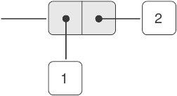
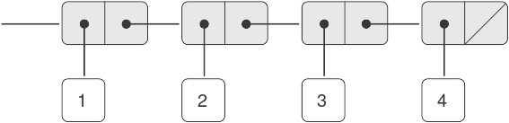
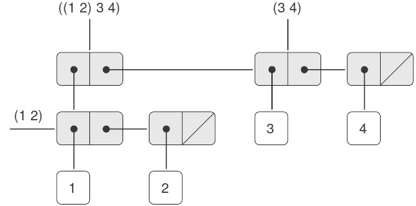
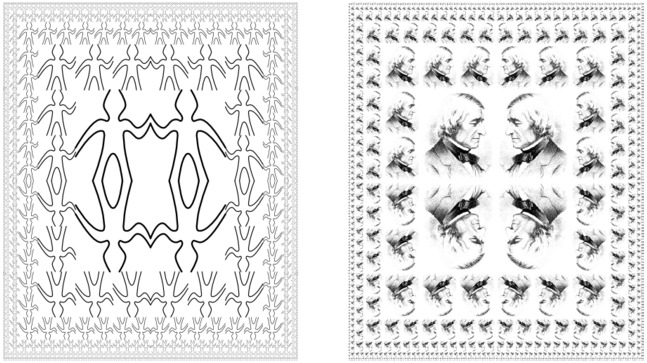
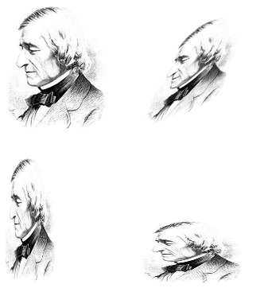
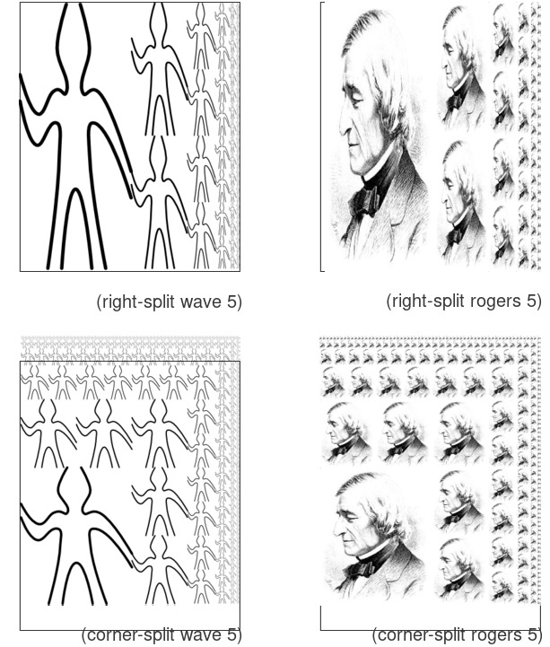
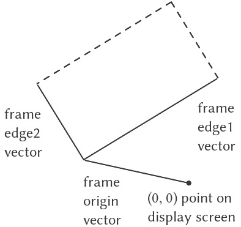

# 2.2 Dữ liệu phân cấp và tính chất closure

Như chúng ta đã thấy, *pair* (cặp) cung cấp một dạng “keo” nguyên thủy mà ta có thể dùng để xây dựng các đối tượng dữ liệu phức hợp. Hình 2.2 cho thấy một cách tiêu chuẩn để hình dung một *pair* — trong trường hợp này là *pair* được tạo bởi `(cons 1 2)`. Trong cách biểu diễn này, được gọi là *box-and-pointer notation* (“ký pháp hộp-và-con-trỏ”), mỗi đối tượng được thể hiện như một *pointer* (con trỏ) tới một hộp. Hộp của một đối tượng nguyên thủy chứa phần biểu diễn của đối tượng đó. Ví dụ, hộp của một số chứa ký hiệu số. Hộp của một *pair* thực chất là một hộp kép, phần bên trái chứa (một con trỏ tới) `car` của *pair* và phần bên phải chứa `cdr`.



**Figure 2.2:** Box-and-pointer representation of `(cons 1 2)`.

Chúng ta đã thấy rằng `cons` có thể được dùng để kết hợp không chỉ các số mà cả các *pair*. (Bạn đã sử dụng thực tế này, hoặc lẽ ra nên sử dụng, khi làm Bài tập 2.2 và Bài tập 2.3.) Do đó, *pair* cung cấp một khối xây dựng phổ quát từ đó ta có thể tạo ra đủ loại cấu trúc dữ liệu. Hình 2.3 cho thấy hai cách dùng *pair* để kết hợp các số 1, 2, 3 và 4.


**Figure 2.3:** Two ways to combine 1, 2, 3, and 4 using pairs.

Khả năng tạo ra các *pair* mà phần tử của chúng cũng là *pair* chính là bản chất của tầm quan trọng của *list structure* (“cấu trúc danh sách”) như một công cụ biểu diễn. Chúng ta gọi khả năng này là *closure property* (“tính chất closure”) của `cons`. Nói chung, một phép toán kết hợp các đối tượng dữ liệu thỏa mãn *closure property* nếu kết quả của việc kết hợp các đối tượng bằng phép toán đó lại có thể được kết hợp tiếp bằng chính phép toán đó^[1]. *Closure* là chìa khóa sức mạnh của bất kỳ phương thức kết hợp nào, bởi nó cho phép ta tạo ra các cấu trúc *hierarchical* (phân cấp) — các cấu trúc được tạo thành từ các phần, mà bản thân mỗi phần lại được tạo thành từ các phần nhỏ hơn, và cứ thế tiếp diễn.

Ngay từ đầu Chương 1, chúng ta đã sử dụng một cách thiết yếu *closure* khi làm việc với *procedure*, bởi hầu hết các chương trình, trừ những chương trình đơn giản nhất, đều dựa vào thực tế rằng các phần tử của một phép kết hợp bản thân chúng cũng có thể là các phép kết hợp. Trong phần này, chúng ta sẽ xét các hệ quả của *closure* đối với dữ liệu phức hợp. Chúng ta sẽ mô tả một số kỹ thuật thông dụng để dùng *pair* biểu diễn *sequence* (dãy) và *tree* (cây), và sẽ trình bày một ngôn ngữ đồ họa minh họa *closure* một cách sinh động^[2].

## 2.2.1 Biểu diễn *Sequence*

Một trong những cấu trúc hữu ích mà ta có thể xây dựng bằng *pair* là *sequence* — một tập hợp có thứ tự các đối tượng dữ liệu. Tất nhiên, có nhiều cách để biểu diễn *sequence* bằng *pair*. Một cách đặc biệt trực quan được minh họa trong Hình 2.4, nơi *sequence* 1, 2, 3, 4 được biểu diễn như một chuỗi các *pair*. `car` của mỗi *pair* là phần tử tương ứng trong chuỗi, và `cdr` của *pair* là *pair* tiếp theo trong chuỗi. `cdr` của *pair* cuối cùng báo hiệu kết thúc *sequence* bằng cách trỏ tới một giá trị đặc biệt không phải là *pair*, được biểu diễn trong sơ đồ *box-and-pointer* bằng một đường chéo và trong chương trình bằng giá trị của biến `nil`. Toàn bộ *sequence* được tạo ra bằng các phép `cons` lồng nhau:

``` {.scheme}
(cons 1
      (cons 2
            (cons 3
                  (cons 4 nil))))
```



**Figure 2.4:** The sequence 1, 2, 3, 4 represented as a chain of pairs.

Một *sequence* như vậy của các *pair*, được tạo bởi các `cons` lồng nhau, được gọi là *list*, và Scheme cung cấp một nguyên thủy gọi là `list` để hỗ trợ việc xây dựng *list*^[3]. *Sequence* ở trên có thể được tạo ra bởi `(list 1 2 3 4)`. Nói chung,

``` {.scheme}
(list ⟨a₁⟩ ⟨a₂⟩ … ⟨aₙ⟩)
```

tương đương với

``` {.scheme}
(cons ⟨a₁⟩
      (cons ⟨a₂⟩
            (cons …
                  (cons ⟨aₙ⟩
                        nil)…)))
```

Các hệ thống Lisp theo thông lệ in *list* bằng cách in dãy các phần tử, đặt trong dấu ngoặc đơn. Do đó, đối tượng dữ liệu trong Hình 2.4 được in ra là `(1 2 3 4)`:

``` {.scheme}
(define one-through-four (list 1 2 3 4))

one-through-four
(1 2 3 4)
```

Cần cẩn thận để không nhầm lẫn biểu thức `(list 1 2 3 4)` với *list* `(1 2 3 4)`, vốn là kết quả thu được khi biểu thức được đánh giá. Cố gắng đánh giá biểu thức `(1 2 3 4)` sẽ gây lỗi khi *interpreter* cố áp dụng *procedure* `1` cho các đối số `2`, `3`, `4`.

Ta có thể coi `car` là phép chọn phần tử đầu tiên trong *list*, và `cdr` là phép chọn *sublist* gồm tất cả các phần tử trừ phần tử đầu tiên. Các phép áp dụng lồng nhau của `car` và `cdr` có thể được dùng để trích xuất phần tử thứ hai, thứ ba, và các phần tử tiếp theo trong *list*^[4]. *Constructor* `cons` tạo ra một *list* giống như *list* ban đầu, nhưng có thêm một phần tử ở đầu.

``` {.scheme}
(car one-through-four)
1

(cdr one-through-four)
(2 3 4)

(car (cdr one-through-four))
2

(cons 10 one-through-four)
(10 1 2 3 4)

(cons 5 one-through-four)
(5 1 2 3 4)
```

Giá trị của `nil`, được dùng để kết thúc chuỗi các *pair*, có thể được coi là một *sequence* không có phần tử nào, tức *empty list* (danh sách rỗng). Từ *nil* là dạng rút gọn của từ Latin *nihil*, nghĩa là “không gì cả”^[5].


^[1]: Việc sử dụng từ “closure” ở đây xuất phát từ đại số trừu tượng, nơi một tập hợp các phần tử được gọi là *đóng* dưới một phép toán nếu việc áp dụng phép toán đó lên các phần tử trong tập cho ra một phần tử vẫn thuộc tập. Cộng đồng Lisp cũng (thật không may) dùng từ “closure” để mô tả một khái niệm hoàn toàn khác: *closure* là một kỹ thuật hiện thực để biểu diễn *procedure* với các biến tự do. Chúng tôi không dùng từ “closure” theo nghĩa thứ hai này trong cuốn sách này.

^[2]: Khái niệm rằng một phương thức kết hợp nên thỏa mãn *closure* là một ý tưởng đơn giản. Thật không may, các công cụ kết hợp dữ liệu trong nhiều ngôn ngữ lập trình phổ biến không thỏa mãn *closure*, hoặc khiến việc khai thác *closure* trở nên rườm rà. Trong Fortran hoặc Basic, người ta thường kết hợp các phần tử dữ liệu bằng cách ghép chúng vào *array* — nhưng không thể tạo *array* mà phần tử của nó lại là *array*. Pascal và C cho phép các *structure* có phần tử là *structure*. Tuy nhiên, điều này đòi hỏi lập trình viên phải thao tác *pointer* một cách tường minh, và tuân theo ràng buộc rằng mỗi trường của *structure* chỉ có thể chứa các phần tử thuộc một dạng xác định trước. Không giống Lisp với *pair*, các ngôn ngữ này không có một “keo” đa dụng tích hợp sẵn giúp thao tác dữ liệu phức hợp một cách thống nhất. Hạn chế này là


### Các phép toán trên *list*

Việc sử dụng *pair* để biểu diễn các *sequence* của phần tử dưới dạng *list* đi kèm với các kỹ thuật lập trình quy ước để thao tác *list* bằng cách lần lượt “`cdr` xuống” *list*. Ví dụ, *procedure* (thủ tục) `list-ref` nhận đối số là một *list* và một số $n$ và trả về phần tử thứ $n^{\text{th}}$ của *list*. Theo thông lệ, các phần tử của *list* được đánh số bắt đầu từ 0. Phương pháp tính `list-ref` như sau:

- Với $n = 0$, `list-ref` sẽ trả về `car` của *list*.
- Ngược lại, `list-ref` sẽ trả về phần tử thứ $(n - 1)$ của `cdr` của *list*.

``` {.scheme}
(define (list-ref items n)
  (if (= n 0)
      (car items)
      (list-ref (cdr items) 
                (- n 1))))

(define squares 
  (list 1 4 9 16 25))

(list-ref squares 3)
16
```

Thường thì ta sẽ `cdr` xuống toàn bộ *list*. Để hỗ trợ việc này, Scheme bao gồm một *primitive predicate* `null?`, dùng để kiểm tra xem đối số của nó có phải là *empty list* hay không. *Procedure* `length`, trả về số phần tử trong một *list*, minh họa mẫu sử dụng điển hình này:

``` {.scheme}
(define (length items)
  (if (null? items)
      0
      (+ 1 (length (cdr items)))))

(define odds
  (list 1 3 5 7))

(length odds)
4
```

*Procedure* `length` hiện thực một kế hoạch đệ quy đơn giản. Bước rút gọn là:

- `length` của bất kỳ *list* nào bằng 1 cộng với `length` của `cdr` của *list* đó.

Điều này được áp dụng liên tiếp cho đến khi ta đạt trường hợp cơ sở:

- `length` của *empty list* là 0.

Ta cũng có thể tính `length` theo phong cách lặp:

``` {.scheme}
(define (length items)
  (define (length-iter a count)
    (if (null? a)
        count
        (length-iter (cdr a) 
                     (+ 1 count))))
  (length-iter items 0))
```

Một kỹ thuật lập trình quy ước khác là “`cons` lên” một *answer list* trong khi `cdr` xuống một *list*, như trong *procedure* `append`, nhận hai *list* làm đối số và kết hợp các phần tử của chúng để tạo ra một *list* mới:

``` {.scheme}
(append squares odds)
(1 4 9 16 25 1 3 5 7)

(append odds squares)
(1 3 5 7 1 4 9 16 25)
```

`Append` cũng được hiện thực bằng một kế hoạch đệ quy. Để `append` hai *list* `list1` và `list2`, thực hiện như sau:

- Nếu `list1` là *empty list*, thì kết quả chính là `list2`.
- Ngược lại, `append` `cdr` của `list1` và `list2`, rồi `cons` `car` của `list1` vào kết quả:

``` {.scheme}
(define (append list1 list2)
  (if (null? list1)
      list2
      (cons (car list1) 
            (append (cdr list1) 
                    list2))))
```


### *Mapping* trên *list*

Một phép toán cực kỳ hữu ích là áp dụng một phép biến đổi nào đó lên từng phần tử trong một *list* và tạo ra *list* kết quả. Ví dụ, *procedure* sau đây nhân mỗi số trong một *list* với một hệ số cho trước:

``` {.scheme}
(define (scale-list items factor)
  (if (null? items)
      nil
      (cons (* (car items) factor)
            (scale-list (cdr items) 
                        factor))))

(scale-list (list 1 2 3 4 5) 10)
(10 20 30 40 50)
```

Chúng ta có thể trừu tượng hóa ý tưởng tổng quát này và nắm bắt nó như một mẫu chung được biểu diễn dưới dạng *higher-order procedure*, giống như trong 1.3. *Higher-order procedure* ở đây được gọi là `map`. `Map` nhận đối số là một *procedure* của một đối số và một *list*, và trả về một *list* các kết quả thu được bằng cách áp dụng *procedure* đó lên từng phần tử trong *list*^[6]:

``` {.scheme}
(define (map proc items)
  (if (null? items)
      nil
      (cons (proc (car items))
            (map proc (cdr items)))))

(map abs (list -10 2.5 -11.6 17))
(10 2.5 11.6 17)

(map (lambda (x) (* x x)) (list 1 2 3 4))
(1 4 9 16)
```

Giờ đây ta có thể đưa ra một định nghĩa mới của `scale-list` dựa trên `map`:

``` {.scheme}
(define (scale-list items factor)
  (map (lambda (x) (* x factor))
       items))
```

`Map` là một cấu trúc quan trọng, không chỉ vì nó nắm bắt một mẫu chung, mà còn vì nó thiết lập một mức độ trừu tượng cao hơn khi làm việc với *list*. Trong định nghĩa ban đầu của `scale-list`, cấu trúc đệ quy của chương trình làm nổi bật việc xử lý từng phần tử của *list*. Định nghĩa `scale-list` dựa trên `map` loại bỏ mức chi tiết đó và nhấn mạnh rằng phép nhân tỷ lệ biến đổi một *list* phần tử thành một *list* kết quả. Sự khác biệt giữa hai định nghĩa không phải là máy tính thực hiện một quá trình khác (thực ra không phải), mà là chúng ta suy nghĩ về quá trình đó theo một cách khác. Thực chất, `map` giúp thiết lập một *abstraction barrier* (rào chắn trừu tượng) tách biệt việc hiện thực các *procedure* biến đổi *list* khỏi các chi tiết về cách trích xuất và kết hợp các phần tử của *list*. Giống như các rào chắn được minh họa trong Hình 2.1, sự trừu tượng này cho phép chúng ta linh hoạt thay đổi các chi tiết mức thấp về cách *sequence* được hiện thực, đồng thời vẫn giữ nguyên khung khái niệm của các phép toán biến đổi *sequence* thành *sequence*. Mục 2.2.3 sẽ mở rộng việc sử dụng *sequence* như một khung tổ chức chương trình.


^[6]: Scheme theo tiêu chuẩn cung cấp một *procedure* `map` tổng quát hơn so với mô tả ở đây. Phiên bản tổng quát hơn này nhận một *procedure* của $n$ đối số, cùng với $n$ *list*, và áp dụng *procedure* đó cho tất cả các phần tử thứ nhất của các *list*, tất cả các phần tử thứ hai của các *list*, và cứ thế tiếp tục, trả về một *list* các kết quả.

## 2.2.2 Cấu trúc phân cấp

Việc biểu diễn *sequence* bằng *list* được mở rộng một cách tự nhiên để biểu diễn các *sequence* mà phần tử của chúng bản thân cũng có thể là *sequence*. Ví dụ, ta có thể xem đối tượng `((1 2) 3 4)` được tạo bởi

``` {.scheme}
(cons (list 1 2) (list 3 4))
```

như một *list* gồm ba phần tử, trong đó phần tử đầu tiên bản thân nó là một *list*, `(1 2)`. Thật vậy, điều này được gợi ý bởi dạng mà *interpreter* in ra kết quả. Hình 2.5 cho thấy cách biểu diễn cấu trúc này bằng các *pair*.



**Figure 2.5:** Structure formed by `(cons (list 1 2) (list 3 4))`.

Một cách khác để hình dung các *sequence* mà phần tử của chúng là *sequence* là xem chúng như các *tree* (cây). Các phần tử của *sequence* là các nhánh của *tree*, và các phần tử vốn là *sequence* sẽ là các *subtree* (cây con). Hình 2.6 cho thấy cấu trúc trong Hình 2.5 khi được nhìn như một *tree*.


**Figure 2.6:** The list structure in Figure 2.5 viewed as a tree.

*Recursion* (đệ quy) là một công cụ tự nhiên để xử lý các cấu trúc *tree*, vì ta thường có thể quy các phép toán trên *tree* về các phép toán trên các nhánh của nó, rồi tiếp tục quy về các phép toán trên nhánh của nhánh, và cứ thế, cho đến khi ta chạm tới các *leaf* (lá) của *tree*. Ví dụ, hãy so sánh *procedure* `length` ở mục 2.2.1 với *procedure* `count-leaves`, trả về tổng số *leaf* của một *tree*:

``` {.scheme}
(define x (cons (list 1 2) (list 3 4)))
```

``` {.scheme}
(length x)
3
```

``` {.scheme}
(count-leaves x)
4

(list x x)
(((1 2) 3 4) ((1 2) 3 4))

(length (list x x))
2

(count-leaves (list x x))
8
```

Để hiện thực `count-leaves`, hãy nhớ lại kế hoạch đệ quy để tính `length`:

- `Length` của một *list* `x` bằng 1 cộng với `length` của `cdr` của `x`.
- `Length` của *empty list* bằng 0.

`Count-leaves` cũng tương tự. Giá trị cho *empty list* là giống nhau:

- `Count-leaves` của *empty list* bằng 0.

Nhưng ở bước rút gọn, khi ta bỏ đi `car` của *list*, ta phải tính đến khả năng `car` bản thân nó là một *tree* mà ta cần đếm các *leaf*. Do đó, bước rút gọn thích hợp là:

- `Count-leaves` của một *tree* `x` bằng `count-leaves` của `car` của `x` cộng với `count-leaves` của `cdr` của `x`.

Cuối cùng, khi lấy `car` ta sẽ gặp các *leaf* thực sự, nên ta cần một trường hợp cơ sở khác:

- `Count-leaves` của một *leaf* bằng 1.

Để hỗ trợ việc viết các *procedure* đệ quy trên *tree*, Scheme cung cấp *primitive predicate* `pair?`, dùng để kiểm tra xem đối số của nó có phải là một *pair* hay không. Dưới đây là *procedure* hoàn chỉnh^[7]:

``` {.scheme}
(define (count-leaves x)
  (cond ((null? x) 0)
        ((not (pair? x)) 1)
        (else (+ (count-leaves (car x))
                 (count-leaves (cdr x))))))
```


### *Mapping* trên *tree*

Cũng giống như `map` là một phép trừu tượng mạnh mẽ để xử lý *sequence*, `map` kết hợp với *recursion* là một phép trừu tượng mạnh mẽ để xử lý *tree*. Ví dụ, *procedure* `scale-tree`, tương tự như `scale-list` ở mục 2.2.1, nhận đối số là một hệ số số học và một *tree* mà các *leaf* là số. Nó trả về một *tree* có cùng hình dạng, trong đó mỗi số được nhân với hệ số đó. Kế hoạch đệ quy cho `scale-tree` tương tự như cho `count-leaves`:

``` {.scheme}
(define (scale-tree tree factor)
  (cond ((null? tree) nil)
        ((not (pair? tree)) 
         (* tree factor))
        (else
         (cons (scale-tree (car tree) 
                           factor)
               (scale-tree (cdr tree) 
                           factor)))))

(scale-tree (list 1 
                  (list 2 (list 3 4) 5) 
                  (list 6 7))
            10)

(10 (20 (30 40) 50) (60 70))
```

Một cách khác để hiện thực `scale-tree` là coi *tree* như một *sequence* của các *subtree* và dùng `map`. Ta *map* trên *sequence*, nhân tỷ lệ từng *subtree* lần lượt, và trả về *list* kết quả. Trong trường hợp cơ sở, khi *tree* là một *leaf*, ta chỉ cần nhân với hệ số:

``` {.scheme}
(define (scale-tree tree factor)
  (map (lambda (sub-tree)
         (if (pair? sub-tree)
             (scale-tree sub-tree factor)
             (* sub-tree factor)))
       tree))
```

Nhiều phép toán trên *tree* có thể được hiện thực bằng các kết hợp tương tự giữa các phép toán trên *sequence* và *recursion*.


^[7]: Thứ tự của hai mệnh đề đầu tiên trong `cond` là quan trọng, vì *empty list* thỏa mãn `null?` và đồng thời cũng không phải là một *pair*.


## 2.2.3 *Sequence* như các *Conventional Interface* (giao diện quy ước)

Khi làm việc với dữ liệu phức hợp, chúng ta đã nhấn mạnh cách *data abstraction* (trừu tượng hóa dữ liệu) cho phép thiết kế chương trình mà không bị sa lầy vào các chi tiết của cách biểu diễn dữ liệu, và cách mà sự trừu tượng hóa giữ cho chúng ta khả năng linh hoạt để thử nghiệm với các cách biểu diễn thay thế. Trong phần này, chúng ta giới thiệu một nguyên tắc thiết kế mạnh mẽ khác khi làm việc với các cấu trúc dữ liệu — việc sử dụng *conventional interface*.

Trong mục 1.3, chúng ta đã thấy cách các *program abstraction* (trừu tượng hóa chương trình), được hiện thực dưới dạng *higher-order procedure* (thủ tục bậc cao), có thể nắm bắt các mẫu chung trong các chương trình xử lý dữ liệu số. Khả năng của chúng ta trong việc xây dựng các phép toán tương tự để làm việc với dữ liệu phức hợp phụ thuộc rất nhiều vào phong cách mà chúng ta thao tác với các cấu trúc dữ liệu. Hãy xem xét, ví dụ, *procedure* sau, tương tự như *procedure* `count-leaves` ở mục 2.2.2, nhận một *tree* làm đối số và tính tổng bình phương của các *leaf* là số lẻ:

``` {.scheme}
(define (sum-odd-squares tree)
  (cond ((null? tree) 0)
        ((not (pair? tree))
         (if (odd? tree) (square tree) 0))
        (else (+ (sum-odd-squares 
                  (car tree))
                 (sum-odd-squares 
                  (cdr tree))))))
```

Bề ngoài, *procedure* này rất khác so với *procedure* sau, tạo ra một *list* chứa tất cả các số Fibonacci chẵn $\text{Fib}(k)$, với $k$ nhỏ hơn hoặc bằng một số nguyên $n$ cho trước:

``` {.scheme}
(define (even-fibs n)
  (define (next k)
    (if (> k n)
        nil
        (let ((f (fib k)))
          (if (even? f)
              (cons f (next (+ k 1)))
              (next (+ k 1))))))
  (next 0))
```

Mặc dù hai *procedure* này về mặt cấu trúc rất khác nhau, nhưng một mô tả trừu tượng hơn về hai phép tính này lại cho thấy nhiều điểm tương đồng. Chương trình thứ nhất:

- liệt kê các *leaf* của một *tree*;
- lọc chúng, chọn ra các phần tử lẻ;
- bình phương từng phần tử đã chọn; và
- cộng dồn các kết quả bằng `+`, bắt đầu từ 0.

Chương trình thứ hai:

- liệt kê các số nguyên từ 0 đến $n$;
- tính số Fibonacci cho mỗi số nguyên;
- lọc chúng, chọn ra các phần tử chẵn; và
- cộng dồn các kết quả bằng `cons`, bắt đầu từ *empty list*.

Một kỹ sư xử lý tín hiệu sẽ thấy tự nhiên khi hình dung các quá trình này như các tín hiệu chảy qua một chuỗi các giai đoạn, mỗi giai đoạn hiện thực một phần của kế hoạch chương trình, như minh họa trong Hình 2.7. Trong `sum-odd-squares`, chúng ta bắt đầu với một *enumerator*, tạo ra một “tín hiệu” gồm các *leaf* của một *tree* cho trước. Tín hiệu này được truyền qua một *filter*, loại bỏ tất cả trừ các phần tử lẻ. Tín hiệu kết quả lại được truyền qua một *map*, là một “transducer” áp dụng *procedure* `square` lên từng phần tử. Đầu ra của *map* sau đó được đưa vào một *accumulator*, kết hợp các phần tử bằng `+`, bắt đầu từ giá trị ban đầu là 0. Kế hoạch cho `even-fibs` là tương tự.


**Figure 2.7:** The signal-flow plans for the procedures `sum-odd-squares` (top) and `even-fibs` (bottom) reveal the commonality between the two programs.

Thật không may, hai định nghĩa *procedure* ở trên không thể hiện rõ cấu trúc *signal-flow* này. Ví dụ, nếu ta xem xét *procedure* `sum-odd-squares`, ta thấy rằng việc liệt kê được hiện thực một phần bởi các phép kiểm tra `null?` và `pair?`, và một phần bởi cấu trúc đệ quy trên *tree* của *procedure*. Tương tự, việc cộng dồn được tìm thấy một phần trong các phép kiểm tra và một phần trong phép cộng được dùng trong đệ quy. Nói chung, không có phần riêng biệt nào của mỗi *procedure* tương ứng trực tiếp với các thành phần trong mô tả *signal-flow*. Hai *procedure* này phân rã phép tính theo cách khác nhau, rải việc liệt kê khắp chương trình và trộn lẫn nó với *map*, *filter* và *accumulation*. Nếu chúng ta có thể tổ chức chương trình sao cho cấu trúc *signal-flow* được thể hiện rõ ràng trong các *procedure* mà ta viết, điều này sẽ nâng cao độ rõ ràng về mặt khái niệm của mã nguồn thu được.


### Các phép toán trên *Sequence*

Chìa khóa để tổ chức chương trình phản ánh rõ hơn cấu trúc *signal-flow* là tập trung vào các “tín hiệu” chảy từ giai đoạn này sang giai đoạn tiếp theo trong quá trình. Nếu ta biểu diễn các tín hiệu này dưới dạng *list*, thì ta có thể dùng các phép toán trên *list* để hiện thực việc xử lý ở mỗi giai đoạn. Ví dụ, ta có thể hiện thực các giai đoạn *mapping* của sơ đồ *signal-flow* bằng *procedure* `map` từ mục 2.2.1:

``` {.scheme}
(map square (list 1 2 3 4 5))
(1 4 9 16 25)
```

Lọc một *sequence* để chỉ chọn các phần tử thỏa mãn một *predicate* cho trước được thực hiện như sau:

``` {.scheme}
(define (filter predicate sequence)
  (cond ((null? sequence) nil)
        ((predicate (car sequence))
         (cons (car sequence)
               (filter predicate 
                       (cdr sequence))))
        (else  (filter predicate 
                       (cdr sequence)))))
```

Ví dụ:

``` {.scheme}
(filter odd? (list 1 2 3 4 5))
(1 3 5)
```

Các phép cộng dồn (*accumulation*) có thể được hiện thực như sau:

``` {.scheme}
(define (accumulate op initial sequence)
  (if (null? sequence)
      initial
      (op (car sequence)
          (accumulate op 
                      initial 
                      (cdr sequence)))))

(accumulate + 0 (list 1 2 3 4 5))
15
(accumulate * 1 (list 1 2 3 4 5))
120
(accumulate cons nil (list 1 2 3 4 5))
(1 2 3 4 5)
```

Tất cả những gì còn lại để hiện thực sơ đồ *signal-flow* là liệt kê *sequence* các phần tử cần xử lý. Với `even-fibs`, ta cần tạo ra *sequence* các số nguyên trong một khoảng cho trước, điều này có thể làm như sau:

``` {.scheme}
(define (enumerate-interval low high)
  (if (> low high)
      nil
      (cons low 
            (enumerate-interval 
             (+ low 1) 
             high))))

(enumerate-interval 2 7)
(2 3 4 5 6 7)
```

(TODO)

Để liệt kê các *leaf* của một *tree*, ta có thể dùng^[8]:

``` {.scheme}
(define (enumerate-tree tree)
  (cond ((null? tree) nil)
        ((not (pair? tree)) (list tree))
        (else (append 
               (enumerate-tree (car tree))
               (enumerate-tree (cdr tree))))))

(enumerate-tree (list 1 (list 2 (list 3 4)) 5))
(1 2 3 4 5)
```

Giờ đây ta có thể viết lại `sum-odd-squares` và `even-fibs` như trong các sơ đồ *signal-flow*. Với `sum-odd-squares`, ta liệt kê *sequence* các *leaf* của *tree*, lọc để giữ lại các số lẻ trong *sequence*, bình phương từng phần tử, và cộng tổng các kết quả:

``` {.scheme}
(define (sum-odd-squares tree)
  (accumulate 
   +
   0
   (map square
        (filter odd?
                (enumerate-tree tree)))))
```

Với `even-fibs`, ta liệt kê các số nguyên từ 0 đến $n$, sinh số Fibonacci cho mỗi số nguyên này, lọc *sequence* kết quả để giữ lại các phần tử chẵn, và cộng dồn các kết quả vào một *list*:

``` {.scheme}
(define (even-fibs n)
  (accumulate 
   cons
   nil
   (filter even?
           (map fib
                (enumerate-interval 0 n)))))
```

Giá trị của việc biểu diễn chương trình dưới dạng các phép toán trên *sequence* là nó giúp chúng ta thiết kế chương trình theo hướng *modular* (mô-đun), tức là các thiết kế được xây dựng bằng cách kết hợp các phần tương đối độc lập. Ta có thể khuyến khích thiết kế *modular* bằng cách cung cấp một thư viện các thành phần tiêu chuẩn cùng với một *conventional interface* để kết nối các thành phần theo những cách linh hoạt.

Xây dựng theo mô-đun là một chiến lược mạnh mẽ để kiểm soát độ phức tạp trong thiết kế kỹ thuật. Trong các ứng dụng xử lý tín hiệu thực tế, ví dụ, các nhà thiết kế thường xây dựng hệ thống bằng cách mắc nối tiếp các phần tử được chọn từ các họ *filter* và *transducer* tiêu chuẩn. Tương tự, các phép toán trên *sequence* cung cấp một thư viện các phần tử chương trình tiêu chuẩn mà ta có thể kết hợp và hoán đổi. Ví dụ, ta có thể tái sử dụng các phần từ *procedure* `sum-odd-squares` và `even-fibs` trong một chương trình tạo ra *list* các bình phương của $n + 1$ số Fibonacci đầu tiên:

``` {.scheme}
(define (list-fib-squares n)
  (accumulate 
   cons
   nil
   (map square
        (map fib
             (enumerate-interval 0 n)))))

(list-fib-squares 10)
(0 1 1 4 9 25 64 169 441 1156 3025)
```

Ta có thể sắp xếp lại các phần này và dùng chúng để tính tích các bình phương của các số nguyên lẻ trong một *sequence*:

``` {.scheme}
(define 
  (product-of-squares-of-odd-elements
   sequence)
  (accumulate 
   *
   1
   (map square (filter odd? sequence))))

(product-of-squares-of-odd-elements 
 (list 1 2 3 4 5))
225
```

Ta cũng có thể xây dựng các ứng dụng xử lý dữ liệu thông thường dưới dạng các phép toán trên *sequence*. Giả sử ta có một *sequence* các hồ sơ nhân sự và muốn tìm mức lương của lập trình viên được trả cao nhất. Giả sử ta có một *selector* `salary` trả về mức lương từ một hồ sơ, và một *predicate* `programmer?` kiểm tra xem hồ sơ đó có phải của một lập trình viên hay không. Khi đó ta có thể viết:

``` {.scheme}
(define 
  (salary-of-highest-paid-programmer
   records)
  (accumulate 
   max
   0
   (map salary
        (filter programmer? records))))
```

Các ví dụ này chỉ gợi ý một phần nhỏ trong phạm vi rộng lớn các phép toán có thể được biểu diễn dưới dạng các phép toán trên *sequence*^[9].

Các *sequence*, được hiện thực ở đây dưới dạng *list*, đóng vai trò như một *conventional interface* cho phép chúng ta kết hợp các mô-đun xử lý. Thêm vào đó, khi ta biểu diễn thống nhất các cấu trúc dưới dạng *sequence*, ta đã giới hạn sự phụ thuộc vào cấu trúc dữ liệu trong chương trình vào một số ít các phép toán trên *sequence*. Bằng cách thay đổi chúng, ta có thể thử nghiệm các cách biểu diễn thay thế của *sequence*, trong khi vẫn giữ nguyên thiết kế tổng thể của chương trình. Chúng ta sẽ khai thác khả năng này trong mục 3.5, khi ta khái quát hóa mô hình xử lý *sequence* để chấp nhận cả các *sequence* vô hạn.


^[8]: Thực tế, đây chính là *procedure* `fringe` trong Bài tập 2.28. Ở đây chúng tôi đổi tên để nhấn mạnh rằng nó là một phần của một họ các *procedure* thao tác *sequence* tổng quát.

^[9]: Richard Waters (1979) đã phát triển một chương trình tự động phân tích các chương trình Fortran truyền thống, xem chúng dưới dạng các *map*, *filter* và *accumulation*. Ông nhận thấy rằng tới 90% mã trong *Fortran Scientific Subroutine Package* hoàn toàn phù hợp với mô hình này. Một trong những lý do cho sự thành công của Lisp như một ngôn ngữ lập trình là *list* cung cấp một phương tiện tiêu chuẩn để biểu diễn các tập hợp có thứ tự, nhờ đó chúng có thể được thao tác bằng các phép toán bậc cao. Ngôn ngữ lập trình APL cũng có được nhiều sức mạnh và sự hấp dẫn nhờ một lựa chọn tương tự. Trong APL, mọi dữ liệu đều được biểu diễn dưới dạng *array*, và có một tập hợp các toán tử tổng quát, tiện lợi cho mọi loại thao tác trên *array*.


### *Nested Mappings* (Ánh xạ lồng nhau)

Chúng ta có thể mở rộng mô hình *sequence* để bao gồm nhiều phép tính thường được biểu diễn bằng các vòng lặp lồng nhau^[10]. Xét bài toán sau: Cho một số nguyên dương $n$, tìm tất cả các cặp có thứ tự gồm hai số nguyên dương phân biệt $i$ và $j$, với ${1 \leq j} < {i \leq n}$, sao cho $i + j$ là số nguyên tố. Ví dụ, nếu $n$ là 6, thì các cặp là:

$$\begin{array}{llllllll}
i & 2 & 3 & 4 & 4 & 5 & 6 & 6 \\
j & 1 & 2 & 1 & 3 & 2 & 1 & 5 \\
{i + j} & 3 & 5 & 5 & 7 & 7 & 7 & 11 \\
\end{array}$$

Một cách tự nhiên để tổ chức phép tính này là sinh ra *sequence* của tất cả các cặp có thứ tự gồm các số nguyên dương nhỏ hơn hoặc bằng $n$, *filter* để chọn các cặp có tổng là số nguyên tố, và sau đó, với mỗi cặp $(i,j)$ vượt qua bộ lọc, tạo ra bộ ba $(i,j,i + j)$.

Dưới đây là một cách để sinh *sequence* các cặp: Với mỗi số nguyên $i \leq n$, liệt kê các số nguyên $j < i$, và với mỗi $i$ và $j$ như vậy, sinh ra cặp $(i,j)$. Xét theo các phép toán trên *sequence*, ta *map* trên *sequence* `(enumerate-interval 1 n)`. Với mỗi $i$ trong *sequence* này, ta *map* trên *sequence* `(enumerate-interval 1 (- i 1))`. Với mỗi $j$ trong *sequence* sau, ta sinh ra cặp `(list i j)`. Điều này cho ta một *sequence* các cặp cho mỗi $i$. Kết hợp tất cả các *sequence* cho mọi $i$ (bằng cách *accumulate* với `append`) sẽ tạo ra *sequence* các cặp cần tìm^[11]:

``` {.scheme}
(accumulate 
 append
 nil
 (map (lambda (i)
        (map (lambda (j) 
               (list i j))
             (enumerate-interval 1 (- i 1))))
      (enumerate-interval 1 n)))
```

Sự kết hợp giữa *mapping* và *accumulating* với `append` phổ biến đến mức chúng ta sẽ tách nó thành một *procedure* riêng:

``` {.scheme}
(define (flatmap proc seq)
  (accumulate append nil (map proc seq)))
```

Giờ hãy *filter* *sequence* các cặp này để tìm những cặp có tổng là số nguyên tố. *Predicate* của *filter* được gọi cho mỗi phần tử của *sequence*; đối số của nó là một cặp và nó phải trích xuất các số nguyên từ cặp đó. Do đó, *predicate* áp dụng cho mỗi phần tử trong *sequence* là:

``` {.scheme}
(define (prime-sum? pair)
  (prime? (+ (car pair) (cadr pair))))
```

Cuối cùng, sinh *sequence* kết quả bằng cách *map* trên các cặp đã lọc, sử dụng *procedure* sau, tạo ra một bộ ba gồm hai phần tử của cặp cùng với tổng của chúng:

``` {.scheme}
(define (make-pair-sum pair)
  (list (car pair) 
        (cadr pair) 
        (+ (car pair) (cadr pair))))
```

Kết hợp tất cả các bước này cho ta *procedure* hoàn chỉnh:

``` {.scheme}
(define (prime-sum-pairs n)
  (map make-pair-sum
       (filter 
        prime-sum?
        (flatmap
         (lambda (i)
           (map (lambda (j) 
                  (list i j))
                (enumerate-interval 
                 1 
                 (- i 1))))
         (enumerate-interval 1 n)))))
```

*Nested mapping* cũng hữu ích cho các *sequence* khác ngoài những *sequence* liệt kê các khoảng số. Giả sử ta muốn sinh tất cả các *permutation* của một tập $S$; tức là tất cả các cách sắp xếp thứ tự các phần tử trong tập. Ví dụ, các *permutation* của $\{ 1,2,3\}$ là $\{ 1,2,3\}$, $\{ 1,3,2\}$, $\{ 2,1,3\}$, $\{ 2,3,1\}$, $\{ 3,1,2\}$, và $\{ 3,2,1\}$. Dưới đây là kế hoạch để sinh các *permutation* của $S$: Với mỗi phần tử $x$ trong $S$, đệ quy sinh *sequence* các *permutation* của $S - x$^[12], và nối $x$ vào đầu mỗi *permutation*. Điều này cho ta, với mỗi $x$ trong $S$, *sequence* các *permutation* của $S$ bắt đầu bằng $x$. Kết hợp các *sequence* này cho mọi $x$ sẽ cho tất cả các *permutation* của $S$^[13]:

``` {.scheme}
(define (permutations s)
  (if (null? s)   ; empty set?
      (list nil)  ; sequence containing empty set
      (flatmap (lambda (x)
                 (map (lambda (p) 
                        (cons x p))
                      (permutations 
                       (remove x s))))
               s)))
```

Hãy chú ý cách chiến lược này quy bài toán sinh các *permutation* của $S$ về bài toán sinh các *permutation* của các tập có ít phần tử hơn $S$. Trong trường hợp cuối cùng, ta đi đến *empty list*, biểu diễn một tập không có phần tử nào. Với trường hợp này, ta sinh `(list nil)`, là một *sequence* với một phần tử duy nhất, chính là tập không có phần tử. *Procedure* `remove` được dùng trong `permutations` trả về tất cả các phần tử trong một *sequence* cho trước, trừ một phần tử nhất định. Điều này có thể được biểu diễn như một *filter* đơn giản:

``` {.scheme}
(define (remove item sequence)
  (filter (lambda (x) (not (= x item)))
          sequence))
```


^[10]: Cách tiếp cận *nested mapping* này được giới thiệu cho chúng tôi bởi David Turner, người đã phát triển các ngôn ngữ KRC và Miranda, cung cấp các hình thức chính quy thanh nhã để xử lý các cấu trúc này. Các ví dụ trong phần này (xem thêm Bài tập 2.42) được điều chỉnh từ Turner 1981. Trong mục 3.5.3, chúng ta sẽ thấy cách tiếp cận này được khái quát hóa cho các *sequence* vô hạn.

^[11]: Ở đây chúng tôi biểu diễn một *pair* như một *list* gồm hai phần tử thay vì một *Lisp pair*. Do đó, “cặp” $(i,j)$ được biểu diễn là `(list i j)`, không phải `(cons i j)`.

^[12]: Tập $S - x$ là tập hợp tất cả các phần tử của $S$, ngoại trừ $x$.

^[13]: Dấu chấm phẩy trong mã Scheme được dùng để bắt đầu *comment*. Mọi thứ từ dấu chấm phẩy đến hết dòng sẽ bị *interpreter* bỏ qua. Trong cuốn sách này, chúng tôi không dùng nhiều *comment*; chúng tôi cố gắng làm cho chương trình tự giải thích bằng cách sử dụng các tên mô tả.

## 2.2.4 Ví dụ: Một ngôn ngữ vẽ tranh (*Picture Language*)

Phần này giới thiệu một ngôn ngữ đơn giản để vẽ tranh, minh họa sức mạnh của *data abstraction* (trừu tượng hóa dữ liệu) và *closure* (tính đóng), đồng thời khai thác *higher-order procedure* (thủ tục bậc cao) một cách thiết yếu. Ngôn ngữ này được thiết kế để giúp dễ dàng thử nghiệm với các mẫu như trong Hình 2.9, được tạo thành từ các phần tử lặp lại được tịnh tiến và co giãn^[14]. Trong ngôn ngữ này, các đối tượng dữ liệu được kết hợp được biểu diễn dưới dạng *procedure* thay vì cấu trúc *list*. Cũng giống như `cons`, vốn thỏa mãn *closure property* và cho phép chúng ta dễ dàng xây dựng các cấu trúc *list* phức tạp tùy ý, các phép toán trong ngôn ngữ này — cũng thỏa mãn *closure property* — cho phép chúng ta dễ dàng xây dựng các mẫu phức tạp tùy ý.



**Figure 2.9:** Designs generated with the picture language.


### Ngôn ngữ vẽ tranh

Khi bắt đầu nghiên cứu lập trình ở mục 1.1, chúng ta đã nhấn mạnh tầm quan trọng của việc mô tả một ngôn ngữ bằng cách tập trung vào các *primitive* (nguyên thủy) của ngôn ngữ, các phương thức kết hợp (*means of combination*), và các phương thức trừu tượng hóa (*means of abstraction*). Chúng ta sẽ tiếp tục theo khung này ở đây.

Một phần của sự tinh tế trong ngôn ngữ vẽ tranh này là chỉ có một loại phần tử duy nhất, gọi là *painter*. Một *painter* vẽ một hình ảnh được tịnh tiến và co giãn để vừa khít trong một khung hình dạng hình bình hành được chỉ định. Ví dụ, có một *primitive painter* mà ta gọi là `wave`, tạo ra một bản vẽ đường nét thô sơ, như minh họa trong Hình 2.10. Hình dạng thực tế của bản vẽ phụ thuộc vào khung — cả bốn hình trong Hình 2.10 đều được tạo ra bởi cùng một *painter* `wave`, nhưng với bốn khung khác nhau. *Painter* có thể phức tạp hơn thế: *Primitive painter* có tên `rogers` vẽ chân dung của người sáng lập MIT, William Barton Rogers, như trong Hình 2.11^[15]. Bốn hình trong Hình 2.11 được vẽ với cùng bốn khung như các hình `wave` trong Hình 2.10.


**Figure 2.10:** Images produced by the `wave` painter, with respect to four different frames. The frames, shown with dotted lines, are not part of the images.



**Figure 2.11:** Images of William Barton Rogers, founder and first president of MIT, painted with respect to the same four frames as in Figure 2.10 (original image from Wikimedia Commons).

Để kết hợp các hình ảnh, chúng ta sử dụng nhiều phép toán khác nhau để tạo ra *painter* mới từ các *painter* đã cho. Ví dụ, phép toán `beside` nhận hai *painter* và tạo ra một *compound painter* (painter phức hợp) vẽ hình ảnh của *painter* thứ nhất ở nửa bên trái khung và hình ảnh của *painter* thứ hai ở nửa bên phải khung. Tương tự, `below` nhận hai *painter* và tạo ra một *compound painter* vẽ hình ảnh của *painter* thứ nhất bên dưới hình ảnh của *painter* thứ hai. Một số phép toán biến đổi một *painter* duy nhất để tạo ra *painter* mới. Ví dụ, `flip-vert` nhận một *painter* và tạo ra một *painter* vẽ hình ảnh của nó lộn ngược, và `flip-horiz` tạo ra một *painter* vẽ hình ảnh của *painter* gốc đảo ngược trái-phải.

Hình 2.12 cho thấy bản vẽ của một *painter* có tên `wave4`, được xây dựng qua hai bước bắt đầu từ `wave`:

``` {.scheme}
(define wave2 (beside wave (flip-vert wave)))
(define wave4 (below wave2 wave2))
```


**Figure 2.12:** Creating a complex figure, starting from the `wave` painter of Figure 2.10.

Khi xây dựng một hình ảnh phức tạp theo cách này, chúng ta đang khai thác thực tế rằng các *painter* là *closed* (đóng) dưới các phương thức kết hợp của ngôn ngữ. `beside` hoặc `below` của hai *painter* bản thân nó cũng là một *painter*; do đó, chúng ta có thể sử dụng nó như một phần tử để tạo ra các *painter* phức tạp hơn. Giống như việc xây dựng cấu trúc *list* bằng `cons`, *closure* của dữ liệu dưới các phương thức kết hợp là yếu tố then chốt cho khả năng tạo ra các cấu trúc phức tạp chỉ với một vài phép toán.

Khi đã có thể kết hợp các *painter*, chúng ta muốn có khả năng trừu tượng hóa các mẫu kết hợp *painter* điển hình. Chúng ta sẽ hiện thực các phép toán *painter* dưới dạng *procedure* Scheme. Điều này có nghĩa là chúng ta không cần một cơ chế trừu tượng hóa đặc biệt trong ngôn ngữ vẽ tranh: Vì các phương thức kết hợp là các *procedure* Scheme thông thường, chúng ta tự động có khả năng làm bất cứ điều gì với các phép toán *painter* mà chúng ta có thể làm với *procedure*. Ví dụ, chúng ta có thể trừu tượng hóa mẫu trong `wave4` như sau:

``` {.scheme}
(define (flipped-pairs painter)
  (let ((painter2 
         (beside painter 
                 (flip-vert painter))))
    (below painter2 painter2)))
```

và định nghĩa `wave4` như một thể hiện của mẫu này:

``` {.scheme}
(define wave4 (flipped-pairs wave))
```

Chúng ta cũng có thể định nghĩa các phép toán đệ quy. Dưới đây là một phép toán tạo ra các *painter* tách nhánh về phía bên phải như minh họa trong Hình 2.13 và Hình 2.14:

``` {.scheme}
(define (right-split painter n)
  (if (= n 0)
      painter
      (let ((smaller (right-split painter 
                                  (- n 1))))
        (beside painter 
                (below smaller smaller)))))
```


**Figure 2.13:** Recursive plans for `right-split` and `corner-split`.


^[14]: Ngôn ngữ vẽ tranh này dựa trên ngôn ngữ do Peter Henderson tạo ra để dựng các hình ảnh giống như bản khắc gỗ “Square Limit” của M.C. Escher (xem Henderson 1982). Bản khắc gỗ này bao gồm một mẫu lặp lại được co giãn, tương tự như các bố cục được vẽ bằng *procedure* `square-limit` trong phần này.

^[15]: William Barton Rogers (1804-1882) là người sáng lập và là hiệu trưởng đầu tiên của MIT. Ông là một nhà địa chất và một giáo viên tài năng, từng giảng dạy tại William and Mary College và Đại học Virginia. Năm 1859, ông chuyển đến Boston, nơi ông có nhiều thời gian hơn cho nghiên cứu, làm việc về kế hoạch thành lập một “viện bách khoa” và là Thanh tra Nhà nước đầu tiên của Massachusetts về đồng hồ đo khí.

Chúng ta có thể tạo ra các mẫu cân đối bằng cách phân nhánh hướng lên trên cũng như hướng sang phải (xem Bài tập 2.44, Hình 2.13 và Hình 2.14):

``` {.scheme}
(define (corner-split painter n)
  (if (= n 0)
      painter
      (let ((up (up-split painter (- n 1)))
            (right (right-split painter 
                                (- n 1))))
        (let ((top-left (beside up up))
              (bottom-right (below right 
                                   right))
              (corner (corner-split painter 
                                    (- n 1))))
          (beside (below painter top-left)
                  (below bottom-right 
                         corner))))))
```



**Figure 2.14:** The recursive operations `right-split` and `corner-split` applied to the painters `wave` and `rogers`. Combining four `corner-split` figures produces symmetric `square-limit` designs as shown in Figure 2.9.

Bằng cách đặt bốn bản sao của một `corner-split` một cách thích hợp, chúng ta thu được một mẫu gọi là `square-limit`, với ứng dụng cho `wave` và `rogers` như minh họa trong Hình 2.9:

``` {.scheme}
(define (square-limit painter n)
  (let ((quarter (corner-split painter n)))
    (let ((half (beside (flip-horiz quarter) 
                        quarter)))
      (below (flip-vert half) half))))
```

### *Higher-order operations* (các phép toán bậc cao)

Ngoài việc trừu tượng hóa các mẫu kết hợp *painter*, chúng ta có thể làm việc ở mức cao hơn, trừu tượng hóa các mẫu kết hợp các *painter operation* (phép toán trên painter). Nghĩa là, chúng ta có thể xem các *painter operation* như những phần tử để thao tác và có thể viết các phương thức kết hợp cho các phần tử này — các *procedure* nhận *painter operation* làm đối số và tạo ra *painter operation* mới.

Ví dụ, `flipped-pairs` và `square-limit` đều sắp xếp bốn bản sao của hình ảnh một *painter* trong một mẫu hình vuông; chúng chỉ khác nhau ở cách định hướng các bản sao. Một cách để trừu tượng hóa mẫu kết hợp *painter* này là với *procedure* sau, nhận bốn *painter operation* một đối số và tạo ra một *painter operation* biến đổi một *painter* cho trước bằng bốn phép toán đó và sắp xếp các kết quả thành một hình vuông. `Tl`, `tr`, `bl`, và `br` là các phép biến đổi áp dụng lần lượt cho bản sao ở góc trên bên trái, góc trên bên phải, góc dưới bên trái và góc dưới bên phải.

``` {.scheme}
(define (square-of-four tl tr bl br)
  (lambda (painter)
    (let ((top (beside (tl painter) 
                       (tr painter)))
          (bottom (beside (bl painter) 
                          (br painter))))
      (below bottom top))))
```

Khi đó, `flipped-pairs` có thể được định nghĩa dựa trên `square-of-four` như sau:^[16]

``` {.scheme}
(define (flipped-pairs painter)
  (let ((combine4 
         (square-of-four identity 
                         flip-vert
                         identity 
                         flip-vert)))
    (combine4 painter)))
```

và `square-limit` có thể được biểu diễn như sau^[17]:

``` {.scheme}
(define (square-limit painter n)
  (let ((combine4 
         (square-of-four flip-horiz 
                         identity
                         rotate180 
                         flip-vert)))
    (combine4 (corner-split painter n))))
```


^[16]: Tương đương, chúng ta có thể viết…

^[17]: `Rotate180` xoay một *painter* 180 độ (xem Bài tập 2.50). Thay vì `rotate180`, chúng ta có thể viết `(compose flip-vert flip-horiz)`, sử dụng *procedure* `compose` từ Bài tập 1.42.

### Frames

Trước khi chúng ta có thể chỉ ra cách hiện thực các *painter* và các phương thức kết hợp của chúng, trước hết cần xem xét *frame* (khung). Một *frame* có thể được mô tả bởi ba *vector* — một *origin vector* (vector gốc) và hai *edge vector* (vector cạnh). *Origin vector* xác định độ lệch của gốc *frame* so với một gốc tuyệt đối nào đó trên mặt phẳng, và các *edge vector* xác định độ lệch của các góc *frame* so với gốc của nó. Nếu các cạnh vuông góc, *frame* sẽ là hình chữ nhật. Ngược lại, *frame* sẽ là một hình bình hành tổng quát hơn.

Hình 2.15 minh họa một *frame* và các *vector* liên quan. Theo nguyên tắc *data abstraction* (trừu tượng hóa dữ liệu), chúng ta chưa cần xác định cụ thể cách biểu diễn *frame*, ngoài việc nói rằng có một *constructor* `make-frame`, nhận ba *vector* và tạo ra một *frame*, cùng với ba *selector* tương ứng `origin-frame`, `edge1-frame`, và `edge2-frame` (xem Bài tập 2.47).



**Figure 2.15:** A frame is described by three vectors — an origin and two edges.

Chúng ta sẽ sử dụng hệ tọa độ trong *unit square* $(0 \leq x,y \leq 1)$ để xác định hình ảnh. Với mỗi *frame*, chúng ta gắn một *frame coordinate map* (ánh xạ tọa độ khung), được dùng để tịnh tiến và co giãn hình ảnh sao cho vừa khít với *frame*. Ánh xạ này biến đổi *unit square* thành *frame* bằng cách ánh xạ *vector* $\mathbf{v} = (x,y)$ thành tổng *vector*:

$$\text{Origin(Frame)} + {x \cdot \text{Edge}_{1}\text{(Frame)}} + {y \cdot \text{Edge}_{2}\text{(Frame)}.}$$

Ví dụ, (0, 0) được ánh xạ tới gốc của *frame*, (1, 1) tới đỉnh đối diện theo đường chéo với gốc, và (0.5, 0.5) tới tâm của *frame*. Chúng ta có thể tạo *frame coordinate map* bằng *procedure* sau^[18]:

``` {.scheme}
(define (frame-coord-map frame)
  (lambda (v)
    (add-vect
     (origin-frame frame)
     (add-vect 
      (scale-vect (xcor-vect v)
                  (edge1-frame frame))
      (scale-vect (ycor-vect v)
                  (edge2-frame frame))))))
```

Lưu ý rằng việc áp dụng `frame-coord-map` cho một *frame* sẽ trả về một *procedure* mà, khi nhận một *vector*, sẽ trả về một *vector*. Nếu *vector* đối số nằm trong *unit square*, *vector* kết quả sẽ nằm trong *frame*. Ví dụ:

``` {.scheme}
((frame-coord-map a-frame) (make-vect 0 0))
```

trả về cùng một *vector* với:

``` {.scheme}
(origin-frame a-frame)
```

### Painters

Một *painter* được biểu diễn như một *procedure* mà, khi nhận một *frame* làm đối số, sẽ vẽ một hình ảnh cụ thể được tịnh tiến và co giãn để vừa khít với *frame*. Nói cách khác, nếu `p` là một *painter* và `f` là một *frame*, thì ta tạo ra hình ảnh của `p` trong `f` bằng cách gọi `p` với `f` làm đối số.

Chi tiết về cách hiện thực các *primitive painter* phụ thuộc vào đặc điểm cụ thể của hệ thống đồ họa và loại hình ảnh cần vẽ. Ví dụ, giả sử chúng ta có một *procedure* `draw-line` vẽ một đường thẳng trên màn hình giữa hai điểm được chỉ định. Khi đó, ta có thể tạo các *painter* cho bản vẽ đường nét, như *painter* `wave` trong Hình 2.10, từ các *list* đoạn thẳng như sau^[19]:

``` {.scheme}
(define (segments->painter segment-list)
  (lambda (frame)
    (for-each
     (lambda (segment)
       (draw-line
        ((frame-coord-map frame) 
         (start-segment segment))
        ((frame-coord-map frame) 
         (end-segment segment))))
     segment-list)))
```

Các đoạn thẳng được cho bằng tọa độ so với *unit square*. Với mỗi đoạn trong *list*, *painter* sẽ biến đổi các điểm đầu mút của đoạn bằng *frame coordinate map* và vẽ một đường nối giữa các điểm đã biến đổi.

Việc biểu diễn *painter* dưới dạng *procedure* tạo ra một *abstraction barrier* (rào chắn trừu tượng) mạnh mẽ trong ngôn ngữ vẽ tranh. Chúng ta có thể tạo và kết hợp nhiều loại *primitive painter* khác nhau, dựa trên nhiều khả năng đồ họa khác nhau. Chi tiết hiện thực của chúng không quan trọng. Bất kỳ *procedure* nào cũng có thể đóng vai trò là *painter*, miễn là nó nhận một *frame* làm đối số và vẽ một thứ gì đó được co giãn để vừa khít với *frame*^[20].


^[18]: `Frame-coord-map` sử dụng các phép toán *vector* được mô tả trong Bài tập 2.46 bên dưới, mà chúng ta giả định đã được hiện thực bằng một cách biểu diễn nào đó cho *vector*. Do nguyên tắc *data abstraction*, không quan trọng biểu diễn *vector* đó là gì, miễn là các phép toán *vector* hoạt động đúng.

^[19]: `Segments->painter` sử dụng cách biểu diễn các đoạn thẳng được mô tả trong Bài tập 2.48 bên dưới. Nó cũng sử dụng *procedure* `for-each` được mô tả trong Bài tập 2.23.

^[20]: Ví dụ, *painter* `rogers` trong Hình 2.11 được tạo từ một ảnh mức xám. Với mỗi điểm trong một *frame* cho trước, *painter* `rogers` xác định điểm trong ảnh được ánh xạ tới nó theo *frame coordinate map*, và tô bóng tương ứng. Bằng cách cho phép nhiều loại *painter* khác nhau, chúng ta đang tận dụng ý tưởng *abstract data* đã thảo luận ở mục 2.1.3, nơi chúng ta lập luận rằng một biểu diễn số hữu tỉ có thể là bất cứ thứ gì miễn là thỏa mãn điều kiện thích hợp. Ở đây, chúng ta sử dụng thực tế rằng một *painter* có thể được hiện thực theo bất kỳ cách nào, miễn là nó vẽ được thứ gì đó trong *frame* được chỉ định. Mục 2.1.3 cũng đã chỉ ra cách *pair* có thể được hiện thực như các *procedure*. *Painter* là ví dụ thứ hai của chúng ta về một cách biểu diễn dữ liệu bằng *procedure*.

### Biến đổi và kết hợp *painter*

Một phép toán trên *painter* (chẳng hạn như `flip-vert` hoặc `beside`) hoạt động bằng cách tạo ra một *painter* mới, gọi các *painter* gốc với các *frame* được suy ra từ *frame* đối số. Do đó, ví dụ, `flip-vert` không cần biết một *painter* hoạt động như thế nào để lật nó — nó chỉ cần biết cách lật ngược một *frame*: *Painter* đã lật chỉ đơn giản sử dụng *painter* gốc, nhưng trong *frame* đã bị đảo ngược.

Các phép toán trên *painter* được xây dựng dựa trên *procedure* (thủ tục) `transform-painter`, nhận vào một *painter* và thông tin về cách biến đổi một *frame*, và tạo ra một *painter* mới. *Painter* đã biến đổi, khi được gọi với một *frame*, sẽ biến đổi *frame* đó và gọi *painter* gốc với *frame* đã biến đổi. Các đối số truyền cho `transform-painter` là các điểm (được biểu diễn dưới dạng *vector*) xác định các góc của *frame* mới: Khi được ánh xạ vào *frame*, điểm thứ nhất xác định gốc của *frame* mới và hai điểm còn lại xác định điểm cuối của các *edge vector* của nó. Do đó, các đối số nằm trong *unit square* sẽ xác định một *frame* nằm bên trong *frame* gốc.

``` {.scheme}
(define (transform-painter 
         painter origin corner1 corner2)
  (lambda (frame)
    (let ((m (frame-coord-map frame)))
      (let ((new-origin (m origin)))
        (painter (make-frame new-origin
                  (sub-vect (m corner1) 
                            new-origin)
                  (sub-vect (m corner2)
                            new-origin)))))))
```

Ví dụ về cách lật ngược hình ảnh của *painter* theo chiều dọc:

``` {.scheme}
(define (flip-vert painter)
  (transform-painter 
   painter
   (make-vect 0.0 1.0)   ; new origin
   (make-vect 1.0 1.0)   ; new end of edge1
   (make-vect 0.0 0.0))) ; new end of edge2
```

Sử dụng `transform-painter`, chúng ta có thể dễ dàng định nghĩa các phép biến đổi mới. Ví dụ, ta có thể định nghĩa một *painter* thu nhỏ hình ảnh của nó vào góc phần tư phía trên bên phải của *frame* được truyền vào:

``` {.scheme}
(define (shrink-to-upper-right painter)
  (transform-painter painter
                     (make-vect 0.5 0.5)
                     (make-vect 1.0 0.5)
                     (make-vect 0.5 1.0)))
```

Các phép biến đổi khác có thể xoay hình ảnh ngược chiều kim đồng hồ 90 độ^[21]:

``` {.scheme}
(define (rotate90 painter)
  (transform-painter painter
                     (make-vect 1.0 0.0)
                     (make-vect 1.0 1.0)
                     (make-vect 0.0 0.0)))
```

hoặc ép hình ảnh vào gần tâm của *frame*^[22]:

``` {.scheme}
(define (squash-inwards painter)
  (transform-painter painter
                     (make-vect 0.0 0.0)
                     (make-vect 0.65 0.35)
                     (make-vect 0.35 0.65)))
```

Biến đổi *frame* cũng là chìa khóa để định nghĩa các phương thức kết hợp hai hoặc nhiều *painter*. Ví dụ, *procedure* `beside` nhận hai *painter*, biến đổi chúng để vẽ lần lượt ở nửa bên trái và nửa bên phải của *frame* đối số, và tạo ra một *compound painter* (painter phức hợp) mới. Khi *painter* phức hợp này được truyền một *frame*, nó sẽ gọi *painter* đã biến đổi thứ nhất để vẽ ở nửa bên trái của *frame* và gọi *painter* đã biến đổi thứ hai để vẽ ở nửa bên phải của *frame*:

``` {.scheme}
(define (beside painter1 painter2)
  (let ((split-point (make-vect 0.5 0.0)))
    (let ((paint-left  (transform-painter 
                        painter1
                        (make-vect 0.0 0.0)
                        split-point
                        (make-vect 0.0 1.0)))
          (paint-right (transform-painter
                        painter2
                        split-point
                        (make-vect 1.0 0.0)
                        (make-vect 0.5 1.0))))
      (lambda (frame)
        (paint-left frame)
        (paint-right frame)))))
```

Hãy chú ý cách *data abstraction* của *painter*, và đặc biệt là cách biểu diễn *painter* dưới dạng *procedure*, giúp cho `beside` dễ dàng được hiện thực. *Procedure* `beside` không cần biết bất cứ chi tiết nào về các *painter* thành phần, ngoài việc mỗi *painter* sẽ vẽ một thứ gì đó trong *frame* được chỉ định của nó.


^[21]: `Rotate90` là một phép xoay thuần túy chỉ đối với các *frame* hình vuông, vì nó cũng kéo giãn và thu nhỏ hình ảnh để vừa với *frame* đã xoay.

^[22]: Các hình dạng kim cương trong Hình 2.10 và Hình 2.11 được tạo ra bằng cách áp dụng `squash-inwards` cho `wave` và `rogers`.

### Các cấp độ ngôn ngữ cho thiết kế bền vững (*robust design*)

Ngôn ngữ vẽ tranh minh họa một số ý tưởng then chốt mà chúng ta đã giới thiệu về *abstraction* (trừu tượng hóa) với *procedure* (thủ tục) và dữ liệu. Các *data abstraction* (trừu tượng hóa dữ liệu) cơ bản — *painter* — được hiện thực bằng *procedural representation* (biểu diễn thủ tục), cho phép ngôn ngữ xử lý các khả năng vẽ cơ bản khác nhau theo một cách thống nhất. Các *means of combination* (phương thức kết hợp) thỏa mãn *closure property* (tính đóng), cho phép chúng ta dễ dàng xây dựng các thiết kế phức tạp. Cuối cùng, tất cả các công cụ để trừu tượng hóa *procedure* đều sẵn có để chúng ta trừu tượng hóa các phương thức kết hợp cho *painter*.

Chúng ta cũng đã thoáng thấy một ý tưởng quan trọng khác về ngôn ngữ và thiết kế chương trình. Đây là cách tiếp cận *stratified design* (thiết kế phân tầng), quan niệm rằng một hệ thống phức tạp nên được cấu trúc thành một chuỗi các tầng, mỗi tầng được mô tả bằng một chuỗi các ngôn ngữ. Mỗi tầng được xây dựng bằng cách kết hợp các phần được coi là *primitive* (nguyên thủy) ở tầng đó, và các phần được tạo ra ở mỗi tầng sẽ được dùng làm *primitive* ở tầng tiếp theo. Ngôn ngữ được sử dụng ở mỗi tầng của một *stratified design* có các *primitive*, *means of combination*, và *means of abstraction* phù hợp với mức độ chi tiết của tầng đó.

*Stratified design* thấm nhuần trong kỹ thuật của các hệ thống phức tạp. Ví dụ, trong kỹ thuật máy tính, điện trở và transistor được kết hợp (và được mô tả bằng một ngôn ngữ của mạch tương tự) để tạo ra các phần tử như *and-gate* và *or-gate*, vốn tạo thành các *primitive* của một ngôn ngữ thiết kế mạch số^[Phần 3.3.4 mô tả một ngôn ngữ như vậy.]. Các phần tử này được kết hợp để xây dựng bộ xử lý, cấu trúc bus, và hệ thống bộ nhớ, rồi lại được kết hợp để tạo thành máy tính, sử dụng các ngôn ngữ phù hợp với kiến trúc máy tính. Các máy tính lại được kết hợp để tạo thành các hệ thống phân tán, sử dụng các ngôn ngữ phù hợp để mô tả kết nối mạng, và cứ thế tiếp tục.

Như một ví dụ nhỏ về phân tầng, ngôn ngữ vẽ tranh của chúng ta sử dụng các phần tử nguyên thủy (*primitive painter*) được tạo ra bằng một ngôn ngữ xác định các điểm và đường để cung cấp danh sách các đoạn thẳng cho `segments->painter`, hoặc các chi tiết tô bóng cho một *painter* như `rogers`. Phần lớn mô tả của chúng ta về ngôn ngữ vẽ tranh tập trung vào việc kết hợp các *primitive* này, sử dụng các *geometric combiner* (bộ kết hợp hình học) như `beside` và `below`. Chúng ta cũng đã làm việc ở mức cao hơn, coi `beside` và `below` là các *primitive* để thao tác trong một ngôn ngữ mà các phép toán của nó, như `square-of-four`, nắm bắt các mẫu chung của việc kết hợp các *geometric combiner*.

*Stratified design* giúp chương trình trở nên *robust* (bền vững), nghĩa là làm tăng khả năng rằng những thay đổi nhỏ trong đặc tả sẽ chỉ đòi hỏi những thay đổi nhỏ tương ứng trong chương trình. Ví dụ, giả sử chúng ta muốn thay đổi hình ảnh dựa trên `wave` trong Hình 2.9. Chúng ta có thể làm việc ở tầng thấp nhất để thay đổi chi tiết hình thức của phần tử `wave`; chúng ta có thể làm việc ở tầng giữa để thay đổi cách `corner-split` nhân bản `wave`; chúng ta có thể làm việc ở tầng cao nhất để thay đổi cách `square-limit` sắp xếp bốn bản sao của góc. Nói chung, mỗi tầng của một *stratified design* cung cấp một vốn từ khác nhau để diễn đạt các đặc điểm của hệ thống, và một loại khả năng thay đổi khác nhau.