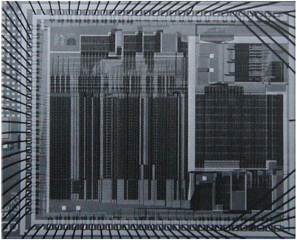

# 5.4 Bộ thông dịch điều khiển tường minh (The Explicit-Control Evaluator)

Trong 5.1, chúng ta đã thấy cách biến đổi các chương trình Scheme đơn giản thành các mô tả của register machine (máy thanh ghi). Giờ đây, chúng ta sẽ thực hiện phép biến đổi này trên một chương trình phức tạp hơn — *metacircular evaluator* (bộ thông dịch siêu vòng) ở các mục 4.1.1–4.1.4, chương trình này cho thấy cách hành vi của một Scheme interpreter (bộ thông dịch Scheme) có thể được mô tả thông qua các procedure (thủ tục) `eval` và `apply`.  

*Explicit-control evaluator* (bộ thông dịch điều khiển tường minh) mà chúng ta phát triển trong phần này cho thấy cách các cơ chế gọi procedure và truyền đối số được sử dụng trong quá trình đánh giá (evaluation) có thể được mô tả dưới dạng các thao tác trên register và stack. Ngoài ra, explicit-control evaluator có thể đóng vai trò như một hiện thực của Scheme interpreter, được viết bằng một ngôn ngữ rất giống với ngôn ngữ máy gốc của các máy tính thông thường. Bộ thông dịch này có thể được thực thi bởi register-machine simulator (trình mô phỏng máy thanh ghi) ở 5.2. Ngoài ra, nó có thể được dùng làm điểm khởi đầu để xây dựng một hiện thực bằng ngôn ngữ máy của Scheme evaluator, hoặc thậm chí một máy chuyên dụng để đánh giá các biểu thức Scheme.  

Hình 5.16 cho thấy một hiện thực phần cứng như vậy: một chip silicon đóng vai trò là evaluator cho Scheme. Các kỹ sư thiết kế chip bắt đầu với đặc tả data-path (đường dữ liệu) và controller (bộ điều khiển) cho một register machine tương tự như evaluator được mô tả trong phần này, và sử dụng các chương trình thiết kế tự động để xây dựng sơ đồ mạch tích hợp^[1].

^[1]: Xem Batali et al. 1982 để biết thêm thông tin về con chip và phương pháp thiết kế.  

  

**Figure 5.16:** A silicon-chip implementation of an evaluator for Scheme.  


### Registers và operations

Khi thiết kế explicit-control evaluator, chúng ta phải chỉ rõ các operation sẽ được sử dụng trong register machine. Chúng ta đã mô tả metacircular evaluator theo cú pháp trừu tượng (abstract syntax), sử dụng các procedure như `quoted?` và `make-procedure`. Khi hiện thực register machine, chúng ta có thể triển khai các procedure này thành các chuỗi thao tác bộ nhớ cấu trúc danh sách (list-structure memory operations) cơ bản, và hiện thực các thao tác này trên register machine.  

Tuy nhiên, điều này sẽ khiến evaluator của chúng ta trở nên rất dài, làm lu mờ cấu trúc cơ bản bởi các chi tiết. Để trình bày rõ ràng hơn, chúng ta sẽ đưa vào như các operation nguyên thủy của register machine các syntax procedure đã nêu trong 4.1.2 và các procedure để biểu diễn environment và các dữ liệu thời gian chạy khác được nêu trong các mục 4.1.3 và 4.1.4. Để đặc tả đầy đủ một evaluator có thể được lập trình bằng ngôn ngữ máy mức thấp hoặc hiện thực bằng phần cứng, chúng ta sẽ thay thế các operation này bằng các operation cơ bản hơn, sử dụng hiện thực cấu trúc danh sách đã mô tả trong 5.3.  

Register machine của Scheme evaluator bao gồm một stack và bảy register: `exp`, `env`, `val`, `continue`, `proc`, `argl`, và `unev`.  
- `exp` được dùng để giữ biểu thức cần đánh giá.  
- `env` chứa environment trong đó việc đánh giá sẽ được thực hiện.  
- Khi kết thúc đánh giá, `val` chứa giá trị thu được từ việc đánh giá biểu thức trong environment đã chỉ định.  
- Register `continue` được dùng để hiện thực đệ quy, như đã giải thích trong 5.1.4. (Evaluator cần tự gọi lại chính nó, vì việc đánh giá một biểu thức đòi hỏi phải đánh giá các biểu thức con của nó.)  
- Các register `proc`, `argl`, và `unev` được dùng trong việc đánh giá các combination (tổ hợp).  

Chúng ta sẽ không cung cấp sơ đồ data-path để chỉ ra cách các register và operation của evaluator được kết nối, cũng như không đưa ra danh sách đầy đủ các operation của máy. Những điều này đã được ngầm định trong controller của evaluator, sẽ được trình bày chi tiết.  


## 5.4.1 Lõi của Explicit-Control Evaluator

Thành phần trung tâm trong evaluator là chuỗi các lệnh bắt đầu tại `eval-dispatch`. Thành phần này tương ứng với procedure `eval` của metacircular evaluator được mô tả trong 4.1.1. Khi controller bắt đầu tại `eval-dispatch`, nó sẽ đánh giá biểu thức được chỉ định bởi `exp` trong environment được chỉ định bởi `env`. Khi việc đánh giá hoàn tất, controller sẽ chuyển đến điểm vào được lưu trong `continue`, và register `val` sẽ chứa giá trị của biểu thức.  

Giống như `eval` trong metacircular evaluator, cấu trúc của `eval-dispatch` là một phân tích theo trường hợp (case analysis) dựa trên loại cú pháp của biểu thức cần đánh giá^[2].

^[2]: Trong controller của chúng ta, việc phân nhánh (dispatch) được viết dưới dạng một chuỗi các lệnh `test` và `branch`. Ngoài ra, nó cũng có thể được viết theo phong cách *data-directed* (hướng dữ liệu) (và trong một hệ thống thực tế có lẽ sẽ được viết như vậy) để tránh việc phải thực hiện các phép kiểm tra tuần tự và để dễ dàng định nghĩa các loại biểu thức mới. Một máy được thiết kế để chạy Lisp có thể sẽ bao gồm một lệnh `dispatch-on-type` để thực thi hiệu quả các phân nhánh hướng dữ liệu như vậy.  


``` {.scheme}
eval-dispatch
  (test (op self-evaluating?) (reg exp))
  (branch (label ev-self-eval))
  (test (op variable?) (reg exp))
  (branch (label ev-variable))
  (test (op quoted?) (reg exp))
  (branch (label ev-quoted))
  (test (op assignment?) (reg exp))
  (branch (label ev-assignment))
  (test (op definition?) (reg exp))
  (branch (label ev-definition))
  (test (op if?) (reg exp))
  (branch (label ev-if))
  (test (op lambda?) (reg exp))
  (branch (label ev-lambda))
  (test (op begin?) (reg exp))
  (branch (label ev-begin))
  (test (op application?) (reg exp))
  (branch (label ev-application))
  (goto (label unknown-expression-type))
```


### Đánh giá các biểu thức đơn giản

Các số và chuỗi (là các biểu thức tự đánh giá), biến, biểu thức trích dẫn (quotation), và biểu thức `lambda` không có các biểu thức con cần đánh giá. Với các trường hợp này, evaluator chỉ cần đặt giá trị đúng vào register `val` và tiếp tục thực thi tại điểm vào được chỉ định bởi `continue`. Việc đánh giá các biểu thức đơn giản được thực hiện bởi đoạn mã controller sau:  

``` {.scheme}
ev-self-eval
  (assign val (reg exp))
  (goto (reg continue))
ev-variable
  (assign val
          (op lookup-variable-value)
          (reg exp)
          (reg env))
  (goto (reg continue))
ev-quoted
  (assign val
          (op text-of-quotation)
          (reg exp))
  (goto (reg continue))
ev-lambda
  (assign unev
          (op lambda-parameters)
          (reg exp))
  (assign exp 
          (op lambda-body)
          (reg exp))
  (assign val 
          (op make-procedure)
          (reg unev)
          (reg exp)
          (reg env))
  (goto (reg continue))
```

Hãy chú ý cách `ev-lambda` sử dụng các register `unev` và `exp` để giữ các tham số và thân của biểu thức lambda, để chúng có thể được truyền cho operation `make-procedure`, cùng với environment trong `env`.  

### Đánh giá các lời gọi procedure

Một lời gọi procedure (procedure application) được xác định bởi một combination (tổ hợp) chứa một operator (toán tử) và các operand (toán hạng). Operator là một biểu thức con mà giá trị của nó là một procedure, và các operand là các biểu thức con mà giá trị của chúng là các đối số sẽ được truyền vào procedure đó.  

Metacircular `eval` xử lý các lời gọi bằng cách tự gọi đệ quy để đánh giá từng phần tử của combination, sau đó truyền các kết quả cho `apply`, thủ tục thực hiện việc gọi procedure thực sự. Explicit-control evaluator cũng làm điều tương tự; các lời gọi đệ quy này được hiện thực bằng các lệnh `goto`, kết hợp với việc sử dụng stack để lưu các register sẽ được khôi phục sau khi lời gọi đệ quy trả về. Trước mỗi lời gọi, chúng ta sẽ cẩn thận xác định những register nào cần lưu (vì giá trị của chúng sẽ cần dùng sau này) ^[3].

^[3]: Đây là một điểm quan trọng nhưng tinh tế khi dịch các thuật toán từ một ngôn ngữ thủ tục như Lisp sang ngôn ngữ register-machine. Thay vì chỉ lưu những gì cần thiết, chúng ta có thể lưu tất cả các register (trừ `val`) trước mỗi lời gọi đệ quy. Điều này được gọi là *framed-stack* discipline. Cách này sẽ hoạt động nhưng có thể lưu nhiều register hơn mức cần thiết; đây có thể là một yếu tố quan trọng trong hệ thống mà các thao tác stack tốn kém. Lưu các register có nội dung không cần thiết sau này cũng có thể giữ lại dữ liệu vô ích mà lẽ ra có thể được garbage-collected, giải phóng bộ nhớ để tái sử dụng.  

Chúng ta bắt đầu việc đánh giá một application bằng cách đánh giá operator để tạo ra một procedure, procedure này sau đó sẽ được áp dụng cho các operand đã được đánh giá. Để đánh giá operator, chúng ta đưa nó vào register `exp` và chuyển đến `eval-dispatch`. Environment trong register `env` đã là environment đúng để đánh giá operator. Tuy nhiên, chúng ta lưu `env` vì sẽ cần nó sau để đánh giá các operand. Chúng ta cũng trích xuất các operand vào `unev` và lưu nó trên stack. Chúng ta thiết lập `continue` để `eval-dispatch` sẽ tiếp tục tại `ev-appl-did-operator` sau khi operator đã được đánh giá. Trước hết, chúng ta lưu giá trị cũ của `continue`, giá trị này cho controller biết sẽ tiếp tục ở đâu sau khi application hoàn tất.

```scheme
ev-application
  (save continue)
  (save env)
  (assign unev (op operands) (reg exp))
  (save unev)
  (assign exp (op operator) (reg exp))
  (assign
   continue (label ev-appl-did-operator))
  (goto (label eval-dispatch))
```

Khi quay lại từ việc đánh giá biểu thức con operator, chúng ta tiếp tục đánh giá các operand của combination và tích lũy các đối số thu được vào một danh sách, được giữ trong `argl`. Trước tiên, chúng ta khôi phục các operand chưa đánh giá và environment. Chúng ta khởi tạo `argl` thành danh sách rỗng. Sau đó, chúng ta gán vào register `proc` procedure được tạo ra từ việc đánh giá operator. Nếu không có operand nào, chúng ta đi thẳng đến `apply-dispatch`. Ngược lại, chúng ta lưu `proc` trên stack và bắt đầu vòng lặp đánh giá đối số^[4]:

^[4]: Chúng ta bổ sung vào các procedure cấu trúc dữ liệu của evaluator trong 4.1.3 hai procedure sau để thao tác danh sách đối số:...

```scheme
ev-appl-did-operator
  (restore unev)             ; the operands
  (restore env)
  (assign argl (op empty-arglist))
  (assign proc (reg val))    ; the operator
  (test (op no-operands?) (reg unev))
  (branch (label apply-dispatch))
  (save proc)
```

Mỗi vòng lặp đánh giá đối số sẽ đánh giá một operand từ danh sách trong `unev` và tích lũy kết quả vào `argl`. Để đánh giá một operand, chúng ta đặt nó vào register `exp` và chuyển đến `eval-dispatch`, sau khi thiết lập `continue` để việc thực thi sẽ tiếp tục với giai đoạn tích lũy đối số. Nhưng trước hết, chúng ta lưu các đối số đã tích lũy cho đến thời điểm này (trong `argl`), environment (trong `env`), và các operand còn lại cần đánh giá (trong `unev`). Một trường hợp đặc biệt được xử lý cho operand cuối cùng, được thực hiện tại `ev-appl-last-arg`.

```scheme
ev-appl-operand-loop
  (save argl)
  (assign exp
          (op first-operand)
          (reg unev))
  (test (op last-operand?) (reg unev))
  (branch (label ev-appl-last-arg))
  (save env)
  (save unev)
  (assign continue 
          (label ev-appl-accumulate-arg))
  (goto (label eval-dispatch))
```

Khi một operand đã được đánh giá, giá trị của nó được tích lũy vào danh sách trong `argl`. Operand đó sau đó được loại bỏ khỏi danh sách các operand chưa đánh giá trong `unev`, và việc đánh giá đối số tiếp tục.

```scheme
ev-appl-accumulate-arg
  (restore unev)
  (restore env)
  (restore argl)
  (assign argl 
          (op adjoin-arg)
          (reg val)
          (reg argl))
  (assign unev
          (op rest-operands)
          (reg unev))
  (goto (label ev-appl-operand-loop))
```

Việc đánh giá đối số cuối cùng được xử lý khác đi. Không cần lưu environment hoặc danh sách các operand chưa đánh giá trước khi chuyển đến `eval-dispatch`, vì chúng sẽ không cần thiết sau khi operand cuối cùng được đánh giá. Do đó, chúng ta quay lại từ việc đánh giá đến một điểm vào đặc biệt `ev-appl-accum-last-arg`, nơi khôi phục danh sách đối số, tích lũy đối số mới, khôi phục procedure đã lưu, và chuyển sang thực hiện application^[5].

^[5]: Việc tối ưu hóa xử lý riêng operand cuối cùng được gọi là *evlis tail recursion* (xem Wand 1980). Chúng ta có thể hiệu quả hơn một chút trong vòng lặp đánh giá đối số nếu cũng xử lý riêng operand đầu tiên. Điều này sẽ cho phép trì hoãn việc khởi tạo `argl` cho đến sau khi đánh giá operand đầu tiên, để tránh phải lưu `argl` trong trường hợp này. Trình biên dịch ở 5.5 thực hiện tối ưu hóa này. (So sánh với procedure `construct-arglist` ở 5.5.3.)

```scheme
ev-appl-last-arg
  (assign continue 
          (label ev-appl-accum-last-arg))
  (goto (label eval-dispatch))
ev-appl-accum-last-arg
  (restore argl)
  (assign argl 
          (op adjoin-arg)
          (reg val)
          (reg argl))
  (restore proc)
  (goto (label apply-dispatch))
```

Chi tiết của vòng lặp đánh giá đối số quyết định thứ tự mà interpreter đánh giá các operand của một combination (ví dụ, từ trái sang phải hoặc từ phải sang trái — xem Bài tập 3.8). Thứ tự này không được xác định bởi metacircular evaluator, vốn kế thừa cấu trúc điều khiển từ Scheme nền tảng mà nó được hiện thực^[6]. Bởi vì selector `first-operand` (được dùng trong `ev-appl-operand-loop` để trích xuất các operand liên tiếp từ `unev`) được hiện thực bằng `car` và selector `rest-operands` được hiện thực bằng `cdr`, explicit-control evaluator sẽ đánh giá các operand của một combination theo thứ tự từ trái sang phải.

^[6]: Thứ tự đánh giá operand trong metacircular evaluator được xác định bởi thứ tự đánh giá các đối số của `cons` trong procedure `list-of-values` ở 4.1.1 (xem Bài tập 4.1).

### Lời gọi procedure

Điểm vào `apply-dispatch` tương ứng với procedure `apply` của *metacircular evaluator*. Tại thời điểm chúng ta đến `apply-dispatch`, register `proc` chứa procedure cần được gọi và `argl` chứa danh sách các đối số đã được đánh giá mà procedure này sẽ áp dụng. Giá trị đã lưu của `continue` (ban đầu được truyền cho `eval-dispatch` và lưu tại `ev-application`), giá trị này cho biết sẽ quay lại đâu với kết quả của lời gọi procedure, đang nằm trên stack. Khi việc gọi hoàn tất, controller sẽ chuyển đến điểm vào được chỉ định bởi giá trị `continue` đã lưu, với kết quả của lời gọi nằm trong `val`. Giống như `apply` trong metacircular evaluator, có hai trường hợp cần xem xét: hoặc procedure được gọi là một primitive, hoặc nó là một compound procedure.

``` {.scheme}
apply-dispatch
  (test (op primitive-procedure?) (reg proc))
  (branch (label primitive-apply))
  (test (op compound-procedure?) (reg proc))
  (branch (label compound-apply))
  (goto (label unknown-procedure-type))
```

Chúng ta giả định rằng mỗi primitive được hiện thực sao cho nó lấy các đối số từ `argl` và đặt kết quả vào `val`. Để chỉ rõ cách máy xử lý các primitive, chúng ta sẽ phải cung cấp một chuỗi các lệnh controller để hiện thực từng primitive và sắp xếp để `primitive-apply` phân nhánh đến các lệnh của primitive được xác định bởi nội dung của `proc`. Vì chúng ta quan tâm đến cấu trúc của quá trình đánh giá hơn là chi tiết của các primitive, nên thay vào đó chúng ta chỉ sử dụng một operation `apply-primitive-procedure` để áp dụng procedure trong `proc` cho các đối số trong `argl`.  

Để mô phỏng evaluator bằng simulator ở 5.2, chúng ta sử dụng procedure `apply-primitive-procedure`, procedure này gọi hệ thống Scheme nền tảng để thực hiện lời gọi, giống như chúng ta đã làm với metacircular evaluator trong 4.1.4. Sau khi tính toán giá trị của lời gọi primitive, chúng ta khôi phục `continue` và chuyển đến điểm vào được chỉ định.

``` {.scheme}
primitive-apply
  (assign val (op apply-primitive-procedure)
              (reg proc)
              (reg argl))
  (restore continue)
  (goto (reg continue))
```

Để áp dụng một compound procedure, chúng ta tiến hành giống như với metacircular evaluator. Chúng ta tạo một frame để ràng buộc các tham số của procedure với các đối số, sử dụng frame này để mở rộng environment mà procedure mang theo, và đánh giá trong environment đã mở rộng này chuỗi các biểu thức tạo thành thân của procedure. `Ev-sequence`, được mô tả bên dưới trong 5.4.2, xử lý việc đánh giá chuỗi này.

``` {.scheme}
compound-apply
  (assign unev 
          (op procedure-parameters)
          (reg proc))
  (assign env
          (op procedure-environment)
          (reg proc))
  (assign env
          (op extend-environment)
          (reg unev)
          (reg argl)
          (reg env))
  (assign unev
          (op procedure-body)
          (reg proc))
  (goto (label ev-sequence))
```

`Compound-apply` là nơi duy nhất trong interpreter mà register `env` được gán một giá trị mới. Giống như trong metacircular evaluator, environment mới được tạo từ environment mà procedure mang theo, cùng với danh sách đối số và danh sách biến tương ứng cần được ràng buộc.


## 5.4.2 Đánh giá chuỗi lệnh và đệ quy đuôi (Tail Recursion)

Phần của explicit-control evaluator tại `ev-sequence` tương tự với procedure `eval-sequence` của metacircular evaluator. Nó xử lý các chuỗi biểu thức trong thân procedure hoặc trong các biểu thức `begin` tường minh.

Các biểu thức `begin` tường minh được đánh giá bằng cách đặt chuỗi các biểu thức cần đánh giá vào `unev`, lưu `continue` trên stack, và nhảy đến `ev-sequence`.

``` {.scheme}
ev-begin
  (assign unev
          (op begin-actions)
          (reg exp))
  (save continue)
  (goto (label ev-sequence))
```

Các chuỗi ngầm trong thân procedure được xử lý bằng cách nhảy đến `ev-sequence` từ `compound-apply`, tại thời điểm đó `continue` đã nằm trên stack, do đã được lưu tại `ev-application`.

Các điểm vào `ev-sequence` và `ev-sequence-continue` tạo thành một vòng lặp lần lượt đánh giá từng biểu thức trong một chuỗi. Danh sách các biểu thức chưa đánh giá được giữ trong `unev`. Trước khi đánh giá mỗi biểu thức, chúng ta kiểm tra xem còn biểu thức nào khác cần đánh giá trong chuỗi hay không. Nếu còn, chúng ta lưu phần còn lại của các biểu thức chưa đánh giá (trong `unev`) và environment mà chúng cần được đánh giá (trong `env`), rồi gọi `eval-dispatch` để đánh giá biểu thức. Hai register đã lưu sẽ được khôi phục khi quay lại từ việc đánh giá này, tại `ev-sequence-continue`.

Biểu thức cuối cùng trong chuỗi được xử lý khác đi, tại điểm vào `ev-sequence-last-exp`. Vì không còn biểu thức nào cần đánh giá sau biểu thức này, chúng ta không cần lưu `unev` hoặc `env` trước khi chuyển đến `eval-dispatch`. Giá trị của toàn bộ chuỗi chính là giá trị của biểu thức cuối cùng, nên sau khi đánh giá biểu thức cuối cùng, không còn gì để làm ngoài việc tiếp tục tại điểm vào hiện đang nằm trên stack (điểm này đã được lưu bởi `ev-application` hoặc `ev-begin`). Thay vì thiết lập `continue` để sắp xếp cho `eval-dispatch` quay lại đây rồi khôi phục `continue` từ stack và tiếp tục tại điểm đó, chúng ta khôi phục `continue` từ stack trước khi chuyển đến `eval-dispatch`, để `eval-dispatch` sẽ tiếp tục tại điểm đó sau khi đánh giá xong biểu thức.


``` {.scheme}
ev-sequence
  (assign exp (op first-exp) (reg unev))
  (test (op last-exp?) (reg unev))
  (branch (label ev-sequence-last-exp))
  (save unev)
  (save env)
  (assign continue
          (label ev-sequence-continue))
  (goto (label eval-dispatch))
ev-sequence-continue
  (restore env)
  (restore unev)
  (assign unev
          (op rest-exps)
          (reg unev))
  (goto (label ev-sequence))
ev-sequence-last-exp
  (restore continue)
  (goto (label eval-dispatch))
```


### Đệ quy đuôi (Tail recursion)

Trong Chương 1, chúng ta đã nói rằng quá trình được mô tả bởi một procedure (thủ tục) như:

``` {.scheme}
(define (sqrt-iter guess x)
  (if (good-enough? guess x)
      guess
      (sqrt-iter (improve guess x) x)))
```

là một quá trình lặp (iterative process). Mặc dù procedure này về mặt cú pháp là đệ quy (được định nghĩa dựa trên chính nó), nhưng về mặt logic, evaluator không nhất thiết phải lưu thông tin khi chuyển từ một lần gọi `sqrt-iter` sang lần tiếp theo^[7]. Một evaluator có thể thực thi một procedure như `sqrt-iter` mà không cần thêm bộ nhớ khi procedure tiếp tục tự gọi chính nó được gọi là *tail-recursive* evaluator (bộ thông dịch đệ quy đuôi). Hiện thực metacircular của evaluator trong Chương 4 không chỉ rõ liệu evaluator có tail-recursive hay không, bởi vì evaluator đó kế thừa cơ chế lưu trạng thái từ Scheme nền tảng. Tuy nhiên, với explicit-control evaluator, chúng ta có thể lần theo quá trình đánh giá để xem khi nào các lời gọi procedure gây ra sự tích lũy thông tin trên stack.

^[7]: Chúng ta đã thấy trong 5.1 cách hiện thực một quá trình như vậy bằng một register machine không có stack; trạng thái của quá trình được lưu trong một tập hợp cố định các register.

Evaluator của chúng ta là tail-recursive, bởi vì để đánh giá biểu thức cuối cùng của một chuỗi, chúng ta chuyển trực tiếp đến `eval-dispatch` mà không lưu bất kỳ thông tin nào trên stack. Do đó, việc đánh giá biểu thức cuối cùng trong một chuỗi — ngay cả khi đó là một lời gọi procedure (như trong `sqrt-iter`, nơi biểu thức `if`, vốn là biểu thức cuối cùng trong thân procedure, rút gọn thành một lời gọi `sqrt-iter`) — sẽ không làm tích lũy thông tin trên stack^[8].

^[8]: Việc hiện thực tail recursion trong `ev-sequence` này là một dạng của kỹ thuật tối ưu hóa nổi tiếng được nhiều trình biên dịch sử dụng. Khi biên dịch một procedure kết thúc bằng một lời gọi procedure, ta có thể thay lời gọi đó bằng một lệnh nhảy (jump) đến điểm vào của procedure được gọi. Việc xây dựng chiến lược này vào interpreter, như chúng ta đã làm trong phần này, cung cấp tối ưu hóa này một cách đồng nhất trong toàn bộ ngôn ngữ.

Nếu chúng ta không tận dụng được thực tế rằng không cần lưu thông tin trong trường hợp này, chúng ta có thể đã hiện thực `eval-sequence` bằng cách xử lý tất cả các biểu thức trong một chuỗi theo cùng một cách — lưu các register, đánh giá biểu thức, quay lại để khôi phục các register, và lặp lại cho đến khi tất cả các biểu thức được đánh giá ^[9]:

^[9]: Chúng ta có thể định nghĩa `no-more-exps?` như sau:...

``` {.scheme}
ev-sequence
  (test (op no-more-exps?) (reg unev))
  (branch (label ev-sequence-end))
  (assign exp (op first-exp) (reg unev))
  (save unev)
  (save env)
  (assign continue
          (label ev-sequence-continue))
  (goto (label eval-dispatch))
ev-sequence-continue
  (restore env)
  (restore unev)
  (assign unev (op rest-exps) (reg unev))
  (goto (label ev-sequence))
ev-sequence-end
  (restore continue)
  (goto (reg continue))
```


Điều này có vẻ chỉ là một thay đổi nhỏ so với mã trước đây để đánh giá một chuỗi: Sự khác biệt duy nhất là chúng ta thực hiện chu trình lưu–khôi phục cho cả biểu thức cuối cùng trong chuỗi cũng như các biểu thức khác. Interpreter vẫn sẽ cho cùng một giá trị với bất kỳ biểu thức nào. Nhưng thay đổi này lại phá vỡ hiện thực tail-recursive, bởi vì giờ đây chúng ta phải quay lại sau khi đánh giá biểu thức cuối cùng trong chuỗi để hoàn tác các thao tác lưu register (vốn là vô ích). Các thao tác lưu thừa này sẽ tích lũy trong quá trình lồng nhau của các lời gọi procedure. Do đó, các quá trình như `sqrt-iter` sẽ cần bộ nhớ tỉ lệ với số vòng lặp thay vì chỉ cần bộ nhớ hằng số. Sự khác biệt này có thể rất đáng kể. Ví dụ, với tail recursion, một vòng lặp vô hạn có thể được biểu diễn chỉ bằng cơ chế gọi procedure:

``` {.scheme}
(define (count n)
  (newline)
  (display n)
  (count (+ n 1)))
```

Không có tail recursion, một procedure như vậy cuối cùng sẽ hết không gian stack, và để biểu diễn một vòng lặp thực sự sẽ cần một cơ chế điều khiển khác ngoài lời gọi procedure.


## 5.4.3 Cấu trúc điều kiện, gán và định nghĩa

Giống như trong metacircular evaluator, các special form (dạng đặc biệt) được xử lý bằng cách chọn lọc đánh giá các phần của biểu thức. Với một biểu thức `if`, chúng ta phải đánh giá predicate (mệnh đề điều kiện) và quyết định, dựa trên giá trị của predicate, sẽ đánh giá consequent (nhánh đúng) hay alternative (nhánh sai).

Trước khi đánh giá predicate, chúng ta lưu chính biểu thức `if` để sau này có thể trích xuất consequent hoặc alternative. Chúng ta cũng lưu environment, vì sẽ cần nó sau này để đánh giá consequent hoặc alternative, và lưu `continue`, vì sẽ cần nó để quay lại đánh giá biểu thức đang chờ giá trị của `if`.

``` {.scheme}
ev-if
  (save exp)   ; save expression for later
  (save env)
  (save continue)
  (assign continue (label ev-if-decide))
  (assign exp (op if-predicate) (reg exp))
  ; evaluate the predicate:
  (goto (label eval-dispatch))  
```

Khi quay lại từ việc đánh giá predicate, chúng ta kiểm tra xem nó đúng hay sai và, tùy thuộc vào kết quả, đặt consequent hoặc alternative vào `exp` trước khi chuyển đến `eval-dispatch`. Lưu ý rằng việc khôi phục `env` và `continue` ở đây giúp `eval-dispatch` có environment đúng và tiếp tục ở vị trí thích hợp để nhận giá trị của biểu thức `if`.

``` {.scheme}
ev-if-decide
  (restore continue)
  (restore env)
  (restore exp)
  (test (op true?) (reg val))
  (branch (label ev-if-consequent))
ev-if-alternative
  (assign exp (op if-alternative) (reg exp))
  (goto (label eval-dispatch))
ev-if-consequent
  (assign exp (op if-consequent) (reg exp))
  (goto (label eval-dispatch))
```


### Gán và định nghĩa

Các phép gán được xử lý bởi `ev-assignment`, được gọi từ `eval-dispatch` với biểu thức gán trong `exp`. Mã tại `ev-assignment` trước tiên đánh giá phần giá trị của biểu thức, sau đó cài đặt giá trị mới vào environment. `Set-variable-value!` được giả định là có sẵn như một operation của máy.

``` {.scheme}
ev-assignment
  (assign unev 
          (op assignment-variable)
          (reg exp))
  (save unev)   ; save variable for later
  (assign exp
          (op assignment-value)
          (reg exp))
  (save env)
  (save continue)
  (assign continue
          (label ev-assignment-1))
  ; evaluate the assignment value:
  (goto (label eval-dispatch))  
ev-assignment-1
  (restore continue)
  (restore env)
  (restore unev)
  (perform (op set-variable-value!)
           (reg unev)
           (reg val)
           (reg env))
  (assign val
          (const ok))
  (goto (reg continue))
```

Các định nghĩa được xử lý theo cách tương tự:

``` {.scheme}
ev-definition
  (assign unev 
          (op definition-variable)
          (reg exp))
  (save unev)   ; save variable for later
  (assign exp 
          (op definition-value)
          (reg exp))
  (save env)
  (save continue)
  (assign continue (label ev-definition-1))
  ; evaluate the definition value:
  (goto (label eval-dispatch))  
ev-definition-1
  (restore continue)
  (restore env)
  (restore unev)
  (perform (op define-variable!)
           (reg unev)
           (reg val)
           (reg env))
  (assign val (const ok))
  (goto (reg continue))
```

## 5.4.4 Chạy Evaluator

Với việc hiện thực explicit-control evaluator (bộ thông dịch điều khiển tường minh), chúng ta đi đến phần kết thúc của một quá trình phát triển bắt đầu từ Chương 1, trong đó chúng ta đã lần lượt khám phá các mô hình ngày càng chính xác hơn của quá trình đánh giá (evaluation). Chúng ta bắt đầu với mô hình thay thế (substitution model) tương đối phi hình thức, sau đó mở rộng nó trong Chương 3 thành mô hình môi trường (environment model), cho phép chúng ta xử lý trạng thái và sự thay đổi. Trong metacircular evaluator của Chương 4, chúng ta sử dụng chính Scheme như một ngôn ngữ để làm rõ hơn cấu trúc môi trường được tạo ra trong quá trình đánh giá một biểu thức. Giờ đây, với register machine, chúng ta đã xem xét kỹ lưỡng các cơ chế của evaluator cho việc quản lý bộ nhớ, truyền đối số và điều khiển. Ở mỗi cấp độ mô tả mới, chúng ta phải đặt ra các vấn đề và giải quyết những điểm mơ hồ vốn chưa xuất hiện ở các cách tiếp cận trước đó, ít chính xác hơn. Để hiểu hành vi của explicit-control evaluator, chúng ta có thể mô phỏng nó và theo dõi hiệu năng của nó.

Chúng ta sẽ cài đặt một driver loop (vòng lặp điều khiển) trong evaluator machine. Vòng lặp này đóng vai trò của procedure `driver-loop` ở 4.1.4. Evaluator sẽ lặp lại việc in ra một prompt, đọc một biểu thức, đánh giá biểu thức đó bằng cách chuyển đến `eval-dispatch`, và in ra kết quả. Các lệnh sau đây tạo thành phần mở đầu của chuỗi lệnh controller của explicit-control evaluator^[10]:

^[10]: Chúng ta giả định ở đây rằng `read` và các thao tác in ấn khác nhau có sẵn như các operation nguyên thủy của máy, điều này hữu ích cho việc mô phỏng của chúng ta, nhưng hoàn toàn không thực tế trong thực tiễn. Đây thực chất là các thao tác cực kỳ phức tạp. Trong thực tế, chúng sẽ được hiện thực bằng các thao tác nhập/xuất mức thấp như truyền từng ký tự đến và từ một thiết bị.

``` {.scheme}
read-eval-print-loop
  (perform (op initialize-stack))
  (perform (op prompt-for-input)
           (const ";;; EC-Eval input:"))
  (assign exp (op read))
  (assign env (op get-global-environment))
  (assign continue (label print-result))
  (goto (label eval-dispatch))
print-result
  (perform (op announce-output)
           (const ";;; EC-Eval value:"))
  (perform (op user-print) (reg val))
  (goto (label read-eval-print-loop))
```

Khi gặp lỗi trong một procedure (chẳng hạn như lỗi “unknown procedure type error” được chỉ ra tại `apply-dispatch`), chúng ta in ra thông báo lỗi và quay lại driver loop^[11].

^[11]: Có những lỗi khác mà chúng ta muốn interpreter xử lý, nhưng chúng không đơn giản như vậy. Xem Bài tập 5.30.

``` {.scheme}
unknown-expression-type
  (assign 
   val
   (const unknown-expression-type-error))
  (goto (label signal-error))
unknown-procedure-type
  ; clean up stack (from apply-dispatch):
  (restore continue)    
  (assign 
   val
   (const unknown-procedure-type-error))
  (goto (label signal-error))
signal-error
  (perform (op user-print) (reg val))
  (goto (label read-eval-print-loop))
```

Vì mục đích mô phỏng, chúng ta khởi tạo stack mỗi lần qua driver loop, vì nó có thể không rỗng sau khi một lỗi (chẳng hạn như biến chưa được định nghĩa) làm gián đoạn quá trình đánh giá^[12].

^[12]: Chúng ta có thể thực hiện việc khởi tạo stack chỉ sau khi xảy ra lỗi, nhưng làm điều đó trong driver loop sẽ thuận tiện cho việc theo dõi hiệu năng của evaluator, như mô tả bên dưới.

Nếu kết hợp tất cả các đoạn mã được trình bày trong 5.4.1–5.4.4, chúng ta có thể tạo ra một mô hình evaluator machine mà chúng ta có thể chạy bằng register-machine simulator ở 5.2.

``` {.scheme}
(define eceval
  (make-machine
   '(exp env val proc argl continue unev)
   eceval-operations
   '(read-eval-print-loop
     ⟨entire machine controller 
      as given above⟩)))
```

Chúng ta phải định nghĩa các procedure Scheme để mô phỏng các operation được sử dụng như các primitive bởi evaluator. Đây là các procedure giống như chúng ta đã dùng cho metacircular evaluator ở 4.1, cùng với một vài procedure bổ sung được định nghĩa trong các chú thích suốt phần 5.4.

``` {.scheme}
(define eceval-operations
  (list (list 'self-evaluating? 
              self-evaluating)
        ⟨complete list of operations 
         for eceval machine⟩))
```

Cuối cùng, chúng ta có thể khởi tạo global environment và chạy evaluator:

``` {.scheme}
(define the-global-environment
  (setup-environment))

(start eceval)

;;; EC-Eval input:
(define (append x y)
  (if (null? x)
      y
      (cons (car x) (append (cdr x) y))))

;;; EC-Eval value:
ok

;;; EC-Eval input:
(append '(a b c) '(d e f))

;;; EC-Eval value:
(a b c d e f)
```

Tất nhiên, việc đánh giá các biểu thức theo cách này sẽ mất nhiều thời gian hơn so với việc gõ trực tiếp chúng vào Scheme, bởi vì có nhiều tầng mô phỏng liên quan. Các biểu thức của chúng ta được đánh giá bởi explicit-control-evaluator machine, vốn đang được mô phỏng bởi một chương trình Scheme, và bản thân chương trình này lại đang được đánh giá bởi Scheme interpreter.


### Theo dõi hiệu năng của evaluator

Mô phỏng có thể là một công cụ mạnh mẽ để định hướng việc hiện thực các evaluator. Mô phỏng giúp dễ dàng không chỉ khám phá các biến thể của thiết kế register-machine mà còn theo dõi hiệu năng của evaluator được mô phỏng. Ví dụ, một yếu tố quan trọng trong hiệu năng là mức độ sử dụng stack hiệu quả của evaluator. Chúng ta có thể quan sát số lượng thao tác stack cần thiết để đánh giá các biểu thức khác nhau bằng cách định nghĩa evaluator register machine với phiên bản simulator có thu thập thống kê về việc sử dụng stack (5.2.4), và thêm một lệnh tại điểm vào `print-result` của evaluator để in ra các thống kê:

``` {.scheme}
print-result
  ; added instruction:
  (perform (op print-stack-statistics))
  (perform (op announce-output)
           (const ";;; EC-Eval value:"))
  … ; same as before
```

Tương tác với evaluator bây giờ sẽ như sau:

``` {.scheme}
;;; EC-Eval input:
(define (factorial n)
  (if (= n 1) 1 (* (factorial (- n 1)) n)))
(total-pushes = 3, maximum-depth = 3)

;;; EC-Eval value:
ok

;;; EC-Eval input:
(factorial 5)
(total-pushes = 144, maximum-depth = 28)

;;; EC-Eval value:
120
```

Lưu ý rằng driver loop của evaluator khởi tạo lại stack ở đầu mỗi lần tương tác, để các thống kê được in ra chỉ liên quan đến các thao tác stack được sử dụng để đánh giá biểu thức trước đó.