# 3.2 Mô hình Environment (môi trường) của Evaluation (thực thi)

Khi chúng ta giới thiệu compound procedures (thủ tục hợp thành) trong Chương 1, chúng ta đã sử dụng substitution model of evaluation (mô hình thay thế của thực thi) (1.1.5) để định nghĩa ý nghĩa của việc áp dụng một procedure cho các đối số:

- Để áp dụng một compound procedure cho các đối số, thực thi phần thân của procedure với mỗi formal parameter (tham số hình thức) được thay thế bằng đối số tương ứng.

Khi chúng ta đưa assignment (gán giá trị) vào ngôn ngữ lập trình, định nghĩa như vậy không còn đầy đủ nữa. Đặc biệt, mục 3.1.3 đã lập luận rằng, khi có assignment, một biến không còn có thể được coi chỉ đơn thuần là một tên cho một giá trị. Thay vào đó, một biến phải bằng cách nào đó chỉ định một “vị trí” nơi giá trị có thể được lưu trữ. Trong mô hình evaluation mới của chúng ta, các vị trí này sẽ được duy trì trong các cấu trúc gọi là *environments* (môi trường).

Một environment là một dãy các *frames* (khung). Mỗi frame là một bảng (có thể rỗng) của các *bindings* (ràng buộc), liên kết tên biến với giá trị tương ứng của chúng. (Một frame chỉ có thể chứa tối đa một binding cho mỗi biến.) Mỗi frame cũng có một con trỏ tới *enclosing environment* (môi trường bao quanh), trừ khi, vì mục đích thảo luận, frame được coi là *global* (toàn cục). *Value of a variable* (giá trị của một biến) đối với một environment là giá trị được cung cấp bởi binding của biến đó trong frame đầu tiên của environment chứa binding cho biến đó. Nếu không có frame nào trong dãy chỉ định binding cho biến, thì biến đó được coi là *unbound* (chưa ràng buộc) trong environment.

Hình 3.1 minh họa một cấu trúc environment đơn giản gồm ba frame, được gán nhãn I, II và III. Trong sơ đồ, A, B, C và D là các con trỏ tới environment. C và D trỏ tới cùng một environment. Các biến `z` và `x` được ràng buộc trong frame II, trong khi `y` và `x` được ràng buộc trong frame I. Giá trị của `x` trong environment D là 3. Giá trị của `x` đối với environment B cũng là 3. Điều này được xác định như sau: Chúng ta xem xét frame đầu tiên trong dãy (frame III) và không tìm thấy binding cho `x`, vì vậy chúng ta tiếp tục tới enclosing environment D và tìm thấy binding trong frame I. Mặt khác, giá trị của `x` trong environment A là 7, bởi vì frame đầu tiên trong dãy (frame II) chứa binding của `x` tới 7. Đối với environment A, binding của `x` tới 7 trong frame II được gọi là *shadow* (che khuất) binding của `x` tới 3 trong frame I.

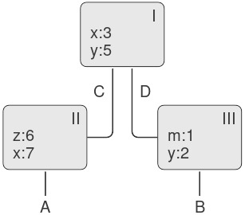

**Figure 3.1:** A simple environment structure.

Environment đóng vai trò then chốt trong quá trình evaluation, bởi vì nó xác định ngữ cảnh mà một biểu thức sẽ được thực thi. Thật vậy, có thể nói rằng các biểu thức trong một ngôn ngữ lập trình tự thân chúng không có ý nghĩa gì. Thay vào đó, một biểu thức chỉ có ý nghĩa khi xét trong một environment nào đó mà nó được thực thi. Ngay cả việc diễn giải một biểu thức đơn giản như `(+ 1 1)` cũng phụ thuộc vào việc hiểu rằng ta đang hoạt động trong một ngữ cảnh mà `+` là ký hiệu cho phép cộng. Do đó, trong mô hình evaluation của chúng ta, chúng ta sẽ luôn nói về việc thực thi một biểu thức đối với một environment nào đó. Để mô tả các tương tác với interpreter (trình thông dịch), chúng ta giả định rằng có một global environment, gồm một frame duy nhất (không có enclosing environment) chứa các giá trị cho các ký hiệu liên kết với các primitive procedures (thủ tục nguyên thủy). Ví dụ, ý tưởng rằng `+` là ký hiệu cho phép cộng được thể hiện bằng cách nói rằng ký hiệu `+` được ràng buộc trong global environment tới primitive addition procedure.

## 3.2.1 The Rules for Evaluation (Các quy tắc của Evaluation)

Đặc tả tổng thể về cách interpreter thực thi một combination (tổ hợp) vẫn giữ nguyên như khi chúng ta lần đầu giới thiệu nó ở 1.1.3:

- Để thực thi một combination:

1.  Thực thi các subexpressions (biểu thức con) của combination.^[1]
2.  Áp dụng giá trị của operator subexpression (biểu thức toán tử) cho các giá trị của operand subexpressions (biểu thức toán hạng).

Environment model of evaluation thay thế substitution model trong việc xác định ý nghĩa của việc áp dụng một compound procedure cho các đối số.

Trong environment model of evaluation, một procedure luôn là một cặp gồm một phần code và một con trỏ tới một environment. Procedures chỉ được tạo ra theo một cách duy nhất: bằng cách thực thi một λ-expression (biểu thức lambda). Điều này tạo ra một procedure có phần code được lấy từ văn bản của λ-expression và environment là environment mà λ-expression được thực thi để tạo ra procedure. Ví dụ, xét định nghĩa procedure sau:

``` {.scheme}
(define (square x)
  (* x x))
```

được thực thi trong global environment. Cú pháp định nghĩa procedure chỉ là syntactic sugar (cú pháp rút gọn) cho một λ-expression ngầm bên dưới. Nó tương đương với việc sử dụng:

``` {.scheme}
(define square
  (lambda (x) (* x x)))
```

câu lệnh này thực thi `(lambda (x) (* x x))` và ràng buộc `square` tới giá trị kết quả, tất cả đều trong global environment.

Hình 3.2 minh họa kết quả của việc thực thi biểu thức `define` này. Đối tượng procedure là một cặp, trong đó phần code chỉ ra rằng procedure có một formal parameter là `x`, và một procedure body `(* x x)`. Phần environment của procedure là một con trỏ tới global environment, vì đó là environment mà λ-expression được thực thi để tạo ra procedure. Một binding mới, liên kết đối tượng procedure với ký hiệu `square`, đã được thêm vào global frame. Nói chung, `define` tạo ra các định nghĩa bằng cách thêm bindings vào các frames.


^[1]: Assignment (gán giá trị) tạo ra một điểm tinh tế trong bước 1 của quy tắc evaluation. Như được chỉ ra trong Bài tập 3.8, sự xuất hiện của assignment cho phép chúng ta viết các biểu thức có thể tạo ra các giá trị khác nhau tùy thuộc vào thứ tự mà các subexpressions trong một combination được thực thi. Do đó, để chính xác, chúng ta nên chỉ rõ thứ tự evaluation trong bước 1 (ví dụ, từ trái sang phải hoặc từ phải sang trái). Tuy nhiên, thứ tự này luôn được coi là một chi tiết của implementation (cài đặt), và không nên viết các chương trình phụ thuộc vào một thứ tự cụ thể nào. Ví dụ, một compiler (trình biên dịch) tinh vi có thể tối ưu hóa chương trình bằng cách thay đổi thứ tự thực thi các subexpressions.


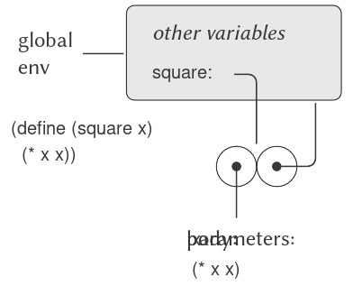

**Figure 3.2:** Environment structure produced by evaluating `(define (square x) (* x x))` in the global environment.

Bây giờ, khi chúng ta đã thấy cách các procedures (thủ tục) được tạo ra, chúng ta có thể mô tả cách các procedures được áp dụng. Environment model (mô hình môi trường) quy định: Để áp dụng một procedure cho các đối số, tạo ra một environment mới chứa một frame ràng buộc các parameters (tham số) với các giá trị của đối số. Enclosing environment (môi trường bao quanh) của frame này là environment được chỉ định bởi procedure. Sau đó, trong environment mới này, thực thi phần thân của procedure.

Để minh họa cách quy tắc này được tuân theo, Hình 3.3 mô tả cấu trúc environment được tạo ra khi thực thi biểu thức `(square 5)` trong global environment, nơi `square` là procedure được tạo ra trong Hình 3.2. Việc áp dụng procedure dẫn đến việc tạo ra một environment mới, được gán nhãn E1 trong hình, bắt đầu với một frame trong đó `x`, tham số hình thức của procedure, được ràng buộc với đối số 5. Con trỏ hướng lên từ frame này cho thấy enclosing environment của frame là global environment. Global environment được chọn ở đây vì đây là environment được chỉ định như một phần của đối tượng procedure `square`. Trong E1, chúng ta thực thi phần thân của procedure, `(* x x)`. Vì giá trị của `x` trong E1 là 5, kết quả là `(* 5 5)`, tức 25.

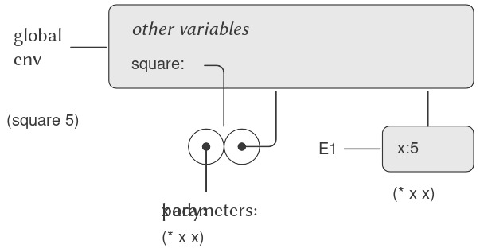

**Figure 3.3:** Environment created by evaluating `(square 5)` in the global environment.

Environment model của việc áp dụng procedure có thể được tóm tắt bằng hai quy tắc:

- Một procedure object (đối tượng thủ tục) được áp dụng cho một tập hợp các đối số bằng cách tạo ra một frame, ràng buộc các formal parameters của procedure với các đối số của lời gọi, và sau đó thực thi phần thân của procedure trong ngữ cảnh của environment mới được tạo ra. Frame mới này có enclosing environment là phần environment của procedure object đang được áp dụng.
- Một procedure được tạo ra bằng cách thực thi một λ-expression (biểu thức lambda) tương ứng với một environment cho trước. Procedure object kết quả là một cặp gồm văn bản của λ-expression và một con trỏ tới environment mà procedure được tạo ra.

Chúng ta cũng quy định rằng việc định nghĩa một symbol bằng `define` sẽ tạo ra một binding trong frame của environment hiện tại và gán cho symbol giá trị được chỉ định.^[2] Cuối cùng, chúng ta quy định hành vi của `set!`, thao tác đã buộc chúng ta phải giới thiệu environment model ngay từ đầu. Thực thi biểu thức `(set! ⟨variable⟩ ⟨value⟩)` trong một environment nào đó sẽ tìm binding của biến trong environment và thay đổi binding đó để biểu thị giá trị mới. Nghĩa là, ta tìm frame đầu tiên trong environment chứa binding cho biến và sửa đổi frame đó. Nếu biến chưa được ràng buộc trong environment, thì `set!` sẽ báo lỗi.

Các quy tắc evaluation này, mặc dù phức tạp hơn đáng kể so với substitution model, nhưng vẫn tương đối dễ hiểu. Hơn nữa, evaluation model, dù mang tính trừu tượng, vẫn cung cấp một mô tả chính xác về cách interpreter thực thi các biểu thức. Trong Chương 4, chúng ta sẽ thấy mô hình này có thể đóng vai trò như một bản thiết kế để triển khai một interpreter hoạt động. Các phần tiếp theo sẽ làm rõ chi tiết của mô hình bằng cách phân tích một số chương trình minh họa.

## 3.2.2 Applying Simple Procedures (Áp dụng các thủ tục đơn giản)

Khi chúng ta giới thiệu substitution model ở 1.1.5, chúng ta đã chỉ ra cách combination `(f 5)` được thực thi ra 136, với các định nghĩa procedure sau:

``` {.scheme}
(define (square x)
  (* x x))
(define (sum-of-squares x y)
  (+ (square x) (square y)))
(define (f a)
  (sum-of-squares (+ a 1) (* a 2)))
```

Chúng ta có thể phân tích cùng ví dụ này bằng cách sử dụng environment model. Hình 3.4 cho thấy ba procedure objects được tạo ra bằng cách thực thi các định nghĩa của `f`, `square`, và `sum-of-squares` trong global environment. Mỗi procedure object bao gồm một phần code, cùng với một con trỏ tới global environment.

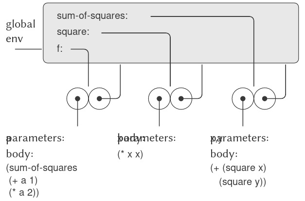

**Figure 3.4:** Procedure objects in the global frame.

Trong Hình 3.5, chúng ta thấy cấu trúc environment được tạo ra khi thực thi biểu thức `(f 5)`. Lời gọi tới `f` tạo ra một environment mới E1 bắt đầu với một frame trong đó `a`, tham số hình thức của `f`, được ràng buộc với đối số 5. Trong E1, chúng ta thực thi phần thân của `f`:

``` {.scheme}
(sum-of-squares (+ a 1) (* a 2))
```


^[2]: Nếu đã tồn tại một binding cho biến trong frame hiện tại, thì binding đó sẽ bị thay đổi. Điều này thuận tiện vì nó cho phép định nghĩa lại các symbol; tuy nhiên, nó cũng có nghĩa là `define` có thể được sử dụng để thay đổi giá trị, và điều này dẫn đến các vấn đề của assignment mà không cần dùng trực tiếp `set!`. Vì lý do này, một số người thích việc định nghĩa lại các symbol đã tồn tại sẽ báo lỗi hoặc cảnh báo.

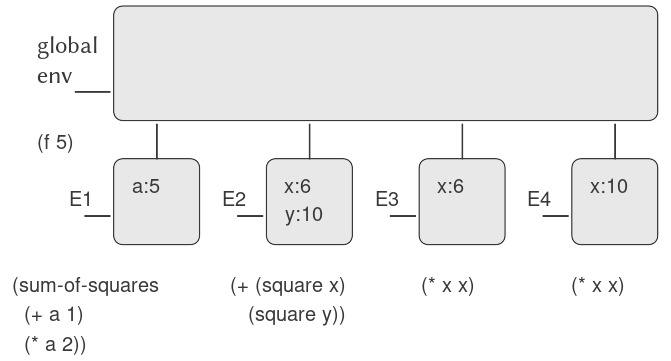

**Figure 3.5:** Environments created by evaluating `(f 5)` using the procedures in Figure 3.4.

Để thực thi combination (tổ hợp) này, trước tiên chúng ta thực thi các subexpressions (biểu thức con). Biểu thức con đầu tiên, `sum-of-squares`, có giá trị là một procedure object (đối tượng thủ tục). (Lưu ý cách tìm ra giá trị này: Trước tiên, chúng ta tìm trong frame đầu tiên của E1, vốn không chứa binding cho `sum-of-squares`. Sau đó, chúng ta tiếp tục tới enclosing environment, tức global environment, và tìm thấy binding được thể hiện trong Hình 3.4.) Hai biểu thức con còn lại được thực thi bằng cách áp dụng các primitive operations (toán tử nguyên thủy) `+` và `*` để tính hai combination `(+ a 1)` và `(* a 2)`, lần lượt thu được 6 và 10.

Bây giờ, chúng ta áp dụng procedure object `sum-of-squares` cho các đối số 6 và 10. Điều này tạo ra một environment mới E2, trong đó các formal parameters `x` và `y` được ràng buộc với các đối số. Bên trong E2, chúng ta thực thi combination `(+ (square x) (square y))`. Điều này dẫn đến việc thực thi `(square x)`, trong đó `square` được tìm thấy trong global frame và `x` là 6. Một lần nữa, chúng ta thiết lập một environment mới, E3, trong đó `x` được ràng buộc với 6, và bên trong đó chúng ta thực thi phần thân của `square`, là `(* x x)`. Cũng như một phần của việc áp dụng `sum-of-squares`, chúng ta phải thực thi biểu thức con `(square y)`, trong đó `y` là 10. Lời gọi thứ hai tới `square` này tạo ra một environment khác, E4, trong đó `x`, tham số hình thức của `square`, được ràng buộc với 10. Và bên trong E4, chúng ta phải thực thi `(* x x)`.

Điểm quan trọng cần lưu ý là mỗi lần gọi `square` sẽ tạo ra một environment mới chứa binding cho `x`. Chúng ta có thể thấy ở đây cách các frame khác nhau giúp tách biệt các biến cục bộ khác nhau đều có tên `x`. Lưu ý rằng mỗi frame được tạo ra bởi `square` đều trỏ tới global environment, vì đây là environment được chỉ định bởi procedure object `square`.

Sau khi các subexpressions được thực thi, kết quả được trả về. Các giá trị được tạo ra bởi hai lần gọi `square` được cộng lại bởi `sum-of-squares`, và kết quả này được trả về bởi `f`. Vì trọng tâm của chúng ta ở đây là các cấu trúc environment, chúng ta sẽ không đi sâu vào cách các giá trị trả về này được truyền từ lời gọi này sang lời gọi khác; tuy nhiên, đây cũng là một khía cạnh quan trọng của quá trình evaluation, và chúng ta sẽ quay lại chi tiết vấn đề này trong Chương 5.

## 3.2.3 Frames as the Repository of Local State (Frame như kho lưu trữ trạng thái cục bộ)

Chúng ta có thể dựa vào environment model để thấy cách procedures và assignment có thể được sử dụng để biểu diễn các đối tượng với local state (trạng thái cục bộ). Ví dụ, hãy xét “withdrawal processor” (bộ xử lý rút tiền) từ 3.1.1 được tạo ra bằng cách gọi procedure:

``` {.scheme}
(define (make-withdraw balance)
  (lambda (amount)
    (if (>= balance amount)
        (begin (set! balance 
                     (- balance amount))
               balance)
        "Insufficient funds")))
```

Hãy mô tả quá trình thực thi:

``` {.scheme}
(define W1 (make-withdraw 100))
```

tiếp theo là:

``` {.scheme}
(W1 50)
50
```

Hình 3.6 cho thấy kết quả của việc định nghĩa procedure `make-withdraw` trong global environment. Điều này tạo ra một procedure object chứa một con trỏ tới global environment. Cho đến đây, điều này không khác gì các ví dụ chúng ta đã thấy, ngoại trừ việc phần thân của procedure này bản thân nó là một λ-expression.

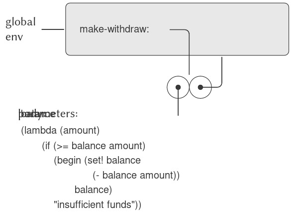

**Figure 3.6:** Result of defining `make-withdraw` in the global environment.

Phần thú vị của quá trình tính toán xảy ra khi chúng ta áp dụng procedure `make-withdraw` cho một đối số:

``` {.scheme}
(define W1 (make-withdraw 100))
```

Chúng ta bắt đầu, như thường lệ, bằng cách thiết lập một environment E1 trong đó formal parameter `balance` được ràng buộc với đối số 100. Bên trong environment này, chúng ta thực thi phần thân của `make-withdraw`, cụ thể là λ-expression. Điều này tạo ra một procedure object mới, với phần code được xác định bởi `lambda` và environment là E1, environment mà `lambda` được thực thi để tạo ra procedure. Procedure object kết quả là giá trị được trả về bởi lời gọi `make-withdraw`. Giá trị này được ràng buộc với `W1` trong global environment, vì bản thân `define` đang được thực thi trong global environment. Hình 3.7 cho thấy cấu trúc environment kết quả.

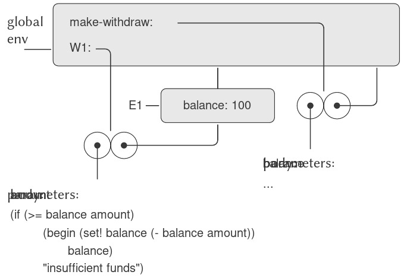

**Figure 3.7:** Result of evaluating `(define W1 (make-withdraw 100))`.

Bây giờ, chúng ta có thể phân tích điều gì xảy ra khi `W1` được áp dụng cho một đối số:

``` {.scheme}
(W1 50)
50
```

Chúng ta bắt đầu bằng cách tạo ra một frame trong đó `amount`, tham số hình thức của `W1`, được ràng buộc với đối số 50. Điểm then chốt cần lưu ý là frame này có enclosing environment không phải là global environment, mà là environment E1, vì đây là environment được chỉ định bởi procedure object `W1`. Bên trong environment mới này, chúng ta thực thi phần thân của procedure:

``` {.scheme}
(if (>= balance amount)
    (begin (set! balance (- balance amount))
           balance)
    "Insufficient funds")
```

Cấu trúc environment kết quả được thể hiện trong Hình 3.8. Biểu thức đang được thực thi tham chiếu cả `amount` và `balance`. `Amount` sẽ được tìm thấy trong frame đầu tiên của environment, trong khi `balance` sẽ được tìm thấy bằng cách lần theo con trỏ enclosing-environment tới E1.

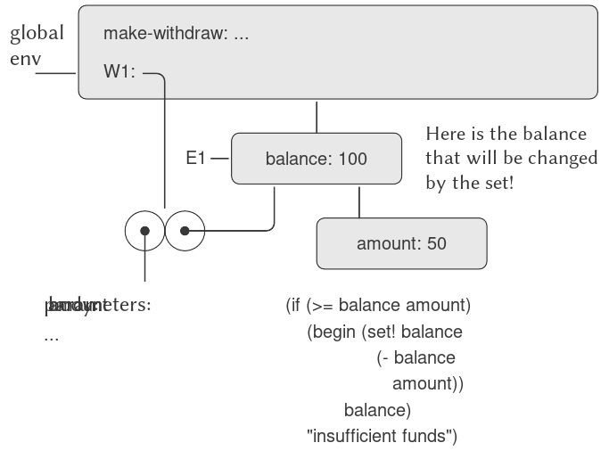

**Figure 3.8:** Environments created by applying the procedure object `W1`.

Khi `set!` được thực thi, binding của `balance` trong E1 bị thay đổi. Khi kết thúc lời gọi tới `W1`, `balance` là 50, và frame chứa `balance` vẫn được trỏ tới bởi procedure object `W1`. Frame ràng buộc `amount` (nơi chúng ta thực thi đoạn code thay đổi `balance`) không còn liên quan nữa, vì lời gọi procedure đã tạo ra nó đã kết thúc, và không có con trỏ nào từ các phần khác của environment trỏ tới frame đó. Lần tiếp theo `W1` được gọi, một frame mới sẽ được tạo ra để ràng buộc `amount` và có enclosing environment là E1. Chúng ta thấy rằng E1 đóng vai trò như một “nơi” lưu giữ biến trạng thái cục bộ cho procedure object `W1`. Hình 3.9 cho thấy tình huống sau lời gọi tới `W1`.

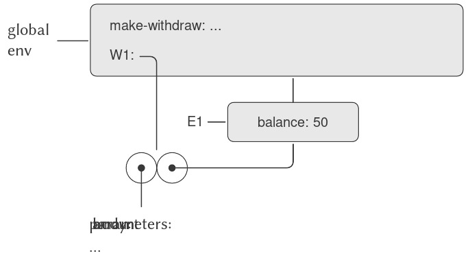

**Figure 3.9:** Environments after the call to `W1`.

Quan sát điều gì xảy ra khi chúng ta tạo một đối tượng “withdraw” (rút tiền) thứ hai bằng cách thực hiện một lời gọi khác tới `make-withdraw`:

``` {.scheme}
(define W2 (make-withdraw 100))
```

Điều này tạo ra cấu trúc environment (môi trường) như trong Hình 3.10, cho thấy rằng `W2` là một procedure object (đối tượng thủ tục), tức là một cặp gồm một phần code và một environment. Environment E2 của `W2` được tạo ra bởi lời gọi tới `make-withdraw`. Nó chứa một frame với binding (ràng buộc) cục bộ riêng cho `balance`. Mặt khác, `W1` và `W2` có cùng phần code: phần code được xác định bởi λ-expression (biểu thức lambda) trong phần thân của `make-withdraw`.^[3] Chúng ta thấy ở đây lý do tại sao `W1` và `W2` hoạt động như các đối tượng độc lập. Các lời gọi tới `W1` tham chiếu tới biến trạng thái `balance` được lưu trong E1, trong khi các lời gọi tới `W2` tham chiếu tới `balance` được lưu trong E2. Do đó, các thay đổi đối với trạng thái cục bộ của một đối tượng sẽ không ảnh hưởng tới đối tượng kia.

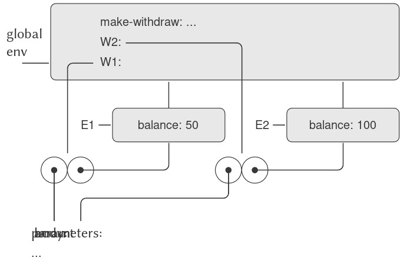

**Figure 3.10:** Using `(define W2 (make-withdraw 100))` to create a second object.

## 3.2.4 Internal Definitions (Các định nghĩa nội bộ)

Mục 1.1.8 đã giới thiệu ý tưởng rằng các procedures có thể có internal definitions (định nghĩa nội bộ), từ đó dẫn đến một cấu trúc khối như trong procedure sau để tính căn bậc hai:

``` {.scheme}
(define (sqrt x)
  (define (good-enough? guess)
    (< (abs (- (square guess) x)) 0.001))
  (define (improve guess)
    (average guess (/ x guess)))
  (define (sqrt-iter guess)
    (if (good-enough? guess)
        guess
        (sqrt-iter (improve guess))))
  (sqrt-iter 1.0))
```

Bây giờ chúng ta có thể sử dụng environment model để thấy tại sao các internal definitions này hoạt động như mong muốn. Hình 3.11 cho thấy thời điểm trong quá trình thực thi biểu thức `(sqrt 2)` khi procedure nội bộ `good-enough?` được gọi lần đầu tiên với `guess` bằng 1.

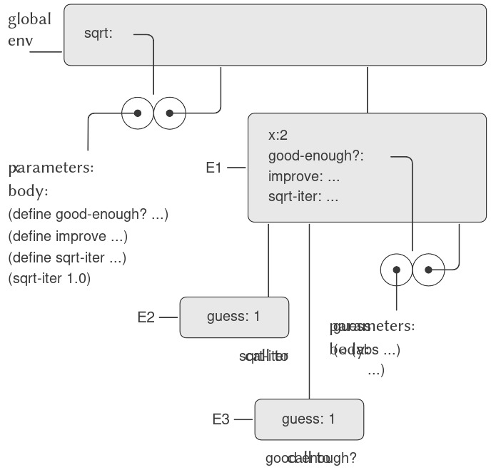

**Figure 3.11:** `Sqrt` procedure with internal definitions.

Quan sát cấu trúc của environment. `Sqrt` là một symbol trong global environment, được ràng buộc với một procedure object có environment liên kết là global environment. Khi `sqrt` được gọi, một environment mới E1 được tạo ra, trực thuộc global environment, trong đó tham số `x` được ràng buộc với giá trị 2. Phần thân của `sqrt` sau đó được thực thi trong E1. Vì biểu thức đầu tiên trong phần thân của `sqrt` là

``` {.scheme}
(define (good-enough? guess)
  (< (abs (- (square guess) x)) 0.001))
```

nên việc thực thi biểu thức này đã định nghĩa procedure `good-enough?` trong environment E1. Cụ thể hơn, symbol `good-enough?` được thêm vào frame đầu tiên của E1, ràng buộc với một procedure object có environment liên kết là E1. Tương tự, `improve` và `sqrt-iter` được định nghĩa là các procedures trong E1. Để ngắn gọn, Hình 3.11 chỉ hiển thị procedure object cho `good-enough?`.

Sau khi các local procedures (thủ tục cục bộ) được định nghĩa, biểu thức `(sqrt-iter 1.0)` được thực thi, vẫn trong environment E1. Do đó, procedure object được ràng buộc với `sqrt-iter` trong E1 được gọi với đối số 1. Điều này tạo ra một environment E2, trong đó `guess`, tham số của `sqrt-iter`, được ràng buộc với 1. `Sqrt-iter` sau đó gọi `good-enough?` với giá trị của `guess` (từ E2) làm đối số cho `good-enough?`. Điều này thiết lập một environment khác, E3, trong đó `guess` (tham số của `good-enough?`) được ràng buộc với 1. Mặc dù `sqrt-iter` và `good-enough?` đều có một tham số tên là `guess`, đây là hai biến cục bộ khác nhau nằm trong các frame khác nhau. Ngoài ra, cả E2 và E3 đều có E1 là enclosing environment, vì cả hai procedures `sqrt-iter` và `good-enough?` đều có E1 là phần environment của chúng. Một hệ quả của điều này là symbol `x` xuất hiện trong phần thân của `good-enough?` sẽ tham chiếu tới binding của `x` xuất hiện trong E1, tức là giá trị của `x` mà procedure `sqrt` ban đầu được gọi với nó.

Environment model do đó giải thích hai đặc tính then chốt khiến cho định nghĩa procedure cục bộ trở thành một kỹ thuật hữu ích để mô-đun hóa chương trình:

- Tên của các local procedures không gây xung đột với các tên bên ngoài procedure bao quanh, vì các tên procedure cục bộ sẽ được ràng buộc trong frame mà procedure tạo ra khi nó chạy, thay vì được ràng buộc trong global environment.
- Các local procedures có thể truy cập các đối số của procedure bao quanh, chỉ đơn giản bằng cách sử dụng tên tham số như các free variables (biến tự do). Điều này là do phần thân của local procedure được thực thi trong một environment trực thuộc environment thực thi của procedure bao quanh.


^[3]: Việc `W1` và `W2` có chia sẻ cùng một phần code vật lý được lưu trong máy tính hay mỗi cái giữ một bản sao của code là một chi tiết của implementation (cài đặt). Đối với interpreter mà chúng ta triển khai trong Chương 4, phần code thực tế được chia sẻ.