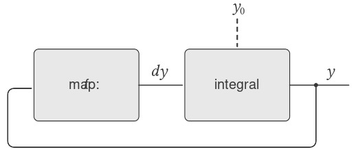
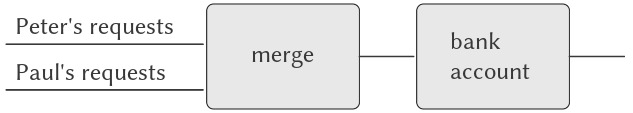

# 3.5 Streams

Chúng ta đã có được một sự hiểu biết tốt về assignment (gán) như một công cụ trong việc mô hình hóa, cũng như nhận thức được những vấn đề phức tạp mà assignment gây ra. Đã đến lúc đặt câu hỏi liệu chúng ta có thể tiếp cận vấn đề theo một cách khác, để tránh một số vấn đề này hay không. Trong phần này, chúng ta sẽ khám phá một cách tiếp cận thay thế để mô hình hóa state (trạng thái), dựa trên các cấu trúc dữ liệu gọi là *streams* (“luồng”). Như chúng ta sẽ thấy, streams có thể giảm bớt một số độ phức tạp của việc mô hình hóa state.

Hãy lùi lại và xem xét nguồn gốc của sự phức tạp này. Trong nỗ lực mô hình hóa các hiện tượng trong thế giới thực, chúng ta đã đưa ra một số quyết định có vẻ hợp lý: Chúng ta mô hình hóa các đối tượng trong thế giới thực với local state (trạng thái cục bộ) bằng các computational objects (đối tượng tính toán) với local variables (biến cục bộ). Chúng ta đồng nhất sự thay đổi theo thời gian trong thế giới thực với sự thay đổi theo thời gian trong máy tính. Chúng ta hiện thực hóa sự thay đổi theo thời gian của trạng thái của các đối tượng mô hình trong máy tính bằng các assignment tới các local variables của các đối tượng mô hình.

Liệu có cách tiếp cận nào khác không? Chúng ta có thể tránh việc đồng nhất thời gian trong máy tính với thời gian trong thế giới được mô hình hóa không? Chúng ta có bắt buộc phải làm cho mô hình thay đổi theo thời gian để mô hình hóa các hiện tượng trong một thế giới đang thay đổi không? Hãy suy nghĩ về vấn đề này dưới góc độ các hàm toán học. Chúng ta có thể mô tả hành vi thay đổi theo thời gian của một đại lượng $x$ như một hàm của thời gian $x(t)$. Nếu chúng ta tập trung vào $x$ tại từng thời điểm, chúng ta sẽ nghĩ về nó như một đại lượng đang thay đổi. Tuy nhiên, nếu chúng ta tập trung vào toàn bộ lịch sử giá trị theo thời gian, chúng ta sẽ không nhấn mạnh sự thay đổi — bản thân hàm đó không thay đổi.^[1]

Nếu thời gian được đo bằng các bước rời rạc, thì chúng ta có thể mô hình hóa một hàm theo thời gian như một sequence (dãy) (có thể là vô hạn). Trong phần này, chúng ta sẽ thấy cách mô hình hóa sự thay đổi thông qua các sequence biểu diễn lịch sử thời gian của các hệ thống đang được mô hình hóa. Để làm được điều này, chúng ta giới thiệu các cấu trúc dữ liệu mới gọi là *streams*. Ở góc độ trừu tượng, một stream đơn giản chỉ là một sequence. Tuy nhiên, chúng ta sẽ thấy rằng việc hiện thực trực tiếp streams như lists (danh sách) (như trong 2.2.1) không bộc lộ hết sức mạnh của stream processing (xử lý luồng). Như một giải pháp thay thế, chúng ta giới thiệu kỹ thuật *delayed evaluation* (đánh giá trì hoãn), cho phép chúng ta biểu diễn các sequence rất lớn (thậm chí vô hạn) dưới dạng streams.

Stream processing cho phép chúng ta mô hình hóa các hệ thống có state mà không bao giờ sử dụng assignment hoặc mutable data (dữ liệu có thể thay đổi). Điều này có những ý nghĩa quan trọng, cả về lý thuyết lẫn thực tiễn, vì chúng ta có thể xây dựng các mô hình tránh được những nhược điểm vốn có khi đưa assignment vào. Mặt khác, framework (khuôn khổ) stream cũng đặt ra những khó khăn riêng, và câu hỏi về việc kỹ thuật mô hình hóa nào dẫn đến các hệ thống có tính module cao hơn và dễ bảo trì hơn vẫn còn bỏ ngỏ.


## 3.5.1 Streams Are Delayed Lists

Như chúng ta đã thấy trong 2.2.3, sequences có thể đóng vai trò như các giao diện chuẩn để kết hợp các program modules (mô-đun chương trình). Chúng ta đã xây dựng các abstraction (trừu tượng hóa) mạnh mẽ để thao tác với sequences, chẳng hạn như `map`, `filter`, và `accumulate`, giúp nắm bắt nhiều loại thao tác theo cách vừa súc tích vừa tao nhã.

Thật không may, nếu chúng ta biểu diễn sequences dưới dạng lists, sự tao nhã này phải trả giá bằng sự kém hiệu quả nghiêm trọng cả về thời gian và bộ nhớ cần thiết cho các phép tính. Khi chúng ta biểu diễn các thao tác trên sequences như các phép biến đổi của lists, chương trình của chúng ta phải tạo và sao chép các cấu trúc dữ liệu (có thể rất lớn) ở mỗi bước của quá trình.

Để thấy tại sao điều này đúng, hãy so sánh hai chương trình tính tổng tất cả các số nguyên tố trong một khoảng. Chương trình đầu tiên được viết theo phong cách iterative (lặp) tiêu chuẩn:^[2]

``` {.scheme}
(define (sum-primes a b)
  (define (iter count accum)
    (cond ((> count b) accum)
          ((prime? count)
           (iter (+ count 1)
                 (+ count accum)))
          (else (iter (+ count 1) accum))))
  (iter a 0))
```

Chương trình thứ hai thực hiện cùng phép tính đó bằng cách sử dụng các thao tác sequence trong 2.2.3:

``` {.scheme}
(define (sum-primes a b)
  (accumulate 
   +
   0
   (filter prime? (enumerate-interval a b))))
```

Khi thực hiện phép tính, chương trình đầu tiên chỉ cần lưu trữ tổng đang được cộng dồn. Ngược lại, `filter` trong chương trình thứ hai không thể thực hiện bất kỳ kiểm tra nào cho đến khi `enumerate-interval` đã tạo ra toàn bộ list các số trong khoảng. `filter` tạo ra một list khác, sau đó được truyền cho `accumulate` trước khi được rút gọn để tạo thành tổng. Việc lưu trữ trung gian lớn như vậy là không cần thiết đối với chương trình đầu tiên, mà chúng ta có thể coi như đang liệt kê khoảng một cách tuần tự, cộng từng số nguyên tố vào tổng ngay khi nó được tạo ra.

Sự kém hiệu quả khi sử dụng lists trở nên rõ rệt nếu chúng ta dùng mô hình sequence để tính số nguyên tố thứ hai trong khoảng từ 10.000 đến 1.000.000 bằng cách đánh giá biểu thức:

``` {.scheme}
(car (cdr 
      (filter 
       prime?
       (enumerate-interval 10000 1000000))))
```

Biểu thức này đúng là tìm ra số nguyên tố thứ hai, nhưng chi phí tính toán là quá lớn. Chúng ta tạo ra một list gần một triệu số nguyên, lọc list này bằng cách kiểm tra tính nguyên tố của từng phần tử, rồi bỏ qua gần như toàn bộ kết quả. Trong một phong cách lập trình truyền thống hơn, chúng ta sẽ xen kẽ việc liệt kê và lọc, và dừng lại khi tìm được số nguyên tố thứ hai.

Streams là một ý tưởng thông minh cho phép sử dụng các thao tác sequence mà không phải chịu chi phí của việc thao tác sequences dưới dạng lists. Với streams, chúng ta có thể đạt được cả hai ưu điểm: Viết chương trình một cách tao nhã như các thao tác sequence, đồng thời đạt hiệu quả của tính toán tuần tự. Ý tưởng cơ bản là chỉ tạo một phần của stream, và truyền phần đã tạo đó cho chương trình tiêu thụ stream. Nếu chương trình tiêu thụ cố gắng truy cập một phần của stream chưa được tạo, stream sẽ tự động tạo thêm vừa đủ để sinh ra phần cần thiết, nhờ đó duy trì ảo giác rằng toàn bộ stream đã tồn tại. Nói cách khác, mặc dù chúng ta viết chương trình như thể đang xử lý toàn bộ sequence, nhưng chúng ta thiết kế việc hiện thực stream để tự động và minh bạch xen kẽ việc tạo stream với việc sử dụng nó.

Bề ngoài, streams chỉ là lists với các tên khác cho các procedure thao tác trên chúng. Có một constructor (hàm tạo) `cons-stream`, và hai selectors (hàm chọn) `stream-car` và `stream-cdr`, thỏa mãn các ràng buộc:

``` {.example}
(stream-car (cons-stream x y)) = x
(stream-cdr (cons-stream x y)) = y
```

Có một đối tượng đặc biệt, `the-empty-stream`, không thể là kết quả của bất kỳ phép `cons-stream` nào, và có thể được nhận diện bằng predicate `stream-null?`.^[3] Do đó, chúng ta có thể tạo và sử dụng streams, giống như cách chúng ta tạo và sử dụng lists, để biểu diễn dữ liệu tổng hợp được sắp xếp theo một sequence. Đặc biệt, chúng ta có thể xây dựng các phiên bản stream tương tự như các phép toán trên list từ Chương 2, chẳng hạn như `list-ref`, `map`, và `for-each`:^[4]  


^[1]: Physicists đôi khi áp dụng quan điểm này bằng cách giới thiệu “world lines” (đường thế giới) của các hạt như một công cụ để suy luận về chuyển động...
^[2]: ...
^[3]: ...
^[4]: ...


``` {.scheme}
(define (stream-ref s n)
  (if (= n 0)
      (stream-car s)
      (stream-ref (stream-cdr s) (- n 1))))

(define (stream-map proc s)
  (if (stream-null? s)
      the-empty-stream
      (cons-stream 
       (proc (stream-car s))
       (stream-map proc (stream-cdr s)))))

(define (stream-for-each proc s)
  (if (stream-null? s)
      'done
      (begin 
        (proc (stream-car s))
        (stream-for-each proc 
                         (stream-cdr s)))))
```

`Stream-for-each` rất hữu ích để quan sát streams:

``` {.scheme}
(define (display-stream s)
  (stream-for-each display-line s))

(define (display-line x)
  (newline)
  (display x))
```

Để làm cho việc hiện thực stream tự động và minh bạch xen kẽ việc xây dựng một stream với việc sử dụng nó, chúng ta sẽ sắp xếp để `cdr` của một stream chỉ được đánh giá khi nó được truy cập bởi procedure (thủ tục) `stream-cdr` thay vì khi stream được tạo bởi `cons-stream`. Lựa chọn hiện thực này gợi nhớ đến phần thảo luận của chúng ta về rational numbers (số hữu tỉ) trong 2.1.2, nơi chúng ta thấy rằng có thể chọn cách hiện thực rational numbers sao cho việc rút gọn tử số và mẫu số về dạng tối giản được thực hiện hoặc tại thời điểm tạo, hoặc tại thời điểm truy xuất. Hai cách hiện thực rational-number này tạo ra cùng một data abstraction (trừu tượng hóa dữ liệu), nhưng lựa chọn này ảnh hưởng đến hiệu năng. Có một mối quan hệ tương tự giữa streams và ordinary lists (danh sách thông thường). Về mặt data abstraction, streams giống hệt lists. Sự khác biệt nằm ở thời điểm các phần tử được đánh giá. Với ordinary lists, cả `car` và `cdr` đều được đánh giá tại thời điểm tạo. Với streams, `cdr` được đánh giá tại thời điểm truy xuất.

Việc hiện thực streams của chúng ta sẽ dựa trên một special form (dạng đặc biệt) gọi là `delay`. Việc đánh giá `(delay ⟨exp⟩)` sẽ không đánh giá biểu thức `⟨`exp`⟩`, mà thay vào đó trả về một *delayed object* (đối tượng trì hoãn), mà ta có thể coi như một “lời hứa” sẽ đánh giá `⟨`exp`⟩` vào một thời điểm nào đó trong tương lai. Đi kèm với `delay`, có một procedure gọi là `force` nhận một delayed object làm đối số và thực hiện việc đánh giá — thực chất là buộc `delay` thực hiện lời hứa của nó. Chúng ta sẽ thấy bên dưới cách `delay` và `force` có thể được hiện thực, nhưng trước hết hãy sử dụng chúng để xây dựng streams.

`Cons-stream` là một special form được định nghĩa sao cho

``` {.scheme}
(cons-stream ⟨a⟩ ⟨b⟩)
```

tương đương với

``` {.scheme}
(cons ⟨a⟩ (delay ⟨b⟩))
```

Điều này có nghĩa là chúng ta sẽ xây dựng streams bằng các cặp (pairs). Tuy nhiên, thay vì đặt giá trị của phần còn lại của stream vào `cdr` của cặp, chúng ta sẽ đặt vào đó một lời hứa sẽ tính toán phần còn lại nếu nó được yêu cầu. `Stream-car` và `stream-cdr` bây giờ có thể được định nghĩa như các procedures:

``` {.scheme}
(define (stream-car stream) 
  (car stream))

(define (stream-cdr stream) 
  (force (cdr stream)))
```

`Stream-car` chọn `car` của cặp; `stream-cdr` chọn `cdr` của cặp và đánh giá biểu thức bị trì hoãn được tìm thấy ở đó để lấy phần còn lại của stream.^[5]


### The stream implementation in action

Để thấy cách hiện thực này hoạt động, hãy phân tích phép tính số nguyên tố “quá mức” mà chúng ta đã thấy ở trên, được viết lại theo dạng streams:

``` {.scheme}
(stream-car 
 (stream-cdr
  (stream-filter 
   prime? (stream-enumerate-interval 
           10000 1000000))))
```

Chúng ta sẽ thấy rằng nó thực sự hoạt động hiệu quả.

Chúng ta bắt đầu bằng cách gọi `stream-enumerate-interval` với các đối số 10.000 và 1.000.000. `Stream-enumerate-interval` là phiên bản stream của `enumerate-interval` (2.2.3):

``` {.scheme}
(define (stream-enumerate-interval low high)
  (if (> low high)
      the-empty-stream
      (cons-stream
       low
       (stream-enumerate-interval (+ low 1)
                                  high))))
```

và do đó kết quả trả về bởi `stream-enumerate-interval`, được tạo bởi `cons-stream`, là^[6]

``` {.scheme}
(cons 10000
      (delay 
        (stream-enumerate-interval 
         10001 
         1000000)))
```

Nghĩa là, `stream-enumerate-interval` trả về một stream được biểu diễn như một cặp có `car` là 10.000 và `cdr` là một lời hứa sẽ liệt kê thêm phần còn lại của khoảng nếu được yêu cầu. Stream này bây giờ được lọc để lấy các số nguyên tố, sử dụng phiên bản stream của procedure `filter` (2.2.3):

``` {.scheme}
(define (stream-filter pred stream)
  (cond ((stream-null? stream) 
         the-empty-stream)
        ((pred (stream-car stream))
         (cons-stream 
          (stream-car stream)
          (stream-filter 
           pred
           (stream-cdr stream))))
        (else (stream-filter 
               pred 
               (stream-cdr stream)))))
```

`Stream-filter` kiểm tra `stream-car` của stream (tức `car` của cặp, là 10.000). Vì đây không phải số nguyên tố, `stream-filter` xem xét `stream-cdr` của stream đầu vào. Lời gọi `stream-cdr` buộc đánh giá `stream-enumerate-interval` bị trì hoãn, và bây giờ trả về:

``` {.scheme}
(cons 10001
      (delay 
        (stream-enumerate-interval 
         10002 
         1000000)))
```

`Stream-filter` bây giờ xem `stream-car` của stream này, 10.001, thấy rằng đây cũng không phải số nguyên tố, buộc thêm một `stream-cdr` nữa, và cứ thế tiếp tục, cho đến khi `stream-enumerate-interval` tạo ra số nguyên tố 10.007, khi đó `stream-filter`, theo định nghĩa của nó, trả về:

``` {.scheme}
(cons-stream 
 (stream-car stream)
 (stream-filter pred (stream-cdr stream)))
```

trong trường hợp này là:

``` {.scheme}
(cons 10007
      (delay
        (stream-filter
         prime?
         (cons 10008
               (delay
                 (stream-enumerate-interval 
                  10009 1000000))))))
```

Kết quả này bây giờ được truyền cho `stream-cdr` trong biểu thức gốc của chúng ta. Điều này buộc `stream-filter` bị trì hoãn, và nó tiếp tục buộc `stream-enumerate-interval` bị trì hoãn cho đến khi tìm thấy số nguyên tố tiếp theo, là 10.009. Cuối cùng, kết quả được truyền cho `stream-car` trong biểu thức gốc của chúng ta là:

``` {.scheme}
(cons 10009
      (delay
        (stream-filter
         prime?
         (cons 10010
               (delay
                 (stream-enumerate-interval 
                  10011 1000000))))))
```

`Stream-car` trả về 10.009, và phép tính hoàn tất. Chỉ có đúng số lượng số nguyên cần thiết được kiểm tra tính nguyên tố để tìm số nguyên tố thứ hai, và khoảng được liệt kê chỉ đến mức cần thiết để cung cấp cho bộ lọc nguyên tố.

Nói chung, chúng ta có thể coi delayed evaluation (đánh giá trì hoãn) như lập trình “demand-driven” (theo nhu cầu), trong đó mỗi giai đoạn trong quá trình xử lý stream chỉ được kích hoạt vừa đủ để thỏa mãn giai đoạn tiếp theo. Điều chúng ta đã làm là tách rời thứ tự thực tế của các sự kiện trong phép tính khỏi cấu trúc bề ngoài của các procedures. Chúng ta viết procedures như thể các streams tồn tại “ngay lập tức” trong khi thực tế, phép tính được thực hiện từng bước, giống như trong các phong cách lập trình truyền thống.


^[5]: Mặc dù `stream-car` và `stream-cdr` có thể được định nghĩa như các procedures, `cons-stream` phải là một special form. Nếu `cons-stream` là một procedure, thì theo mô hình đánh giá của chúng ta, việc đánh giá `(cons-stream ⟨a⟩ ⟨b⟩)` sẽ tự động khiến `⟨`b`⟩` được đánh giá, điều này chính là điều chúng ta không muốn xảy ra. Vì cùng lý do đó, `delay` phải là một special form, mặc dù `force` có thể là một procedure thông thường.

^[6]: Các số được hiển thị ở đây thực tế không xuất hiện trong biểu thức bị trì hoãn...

### Implementing `delay` and `force`

Mặc dù `delay` và `force` có thể trông như những thao tác bí ẩn, nhưng việc hiện thực chúng thực ra khá đơn giản. `Delay` phải đóng gói một biểu thức để nó có thể được đánh giá sau này khi cần, và chúng ta có thể thực hiện điều này đơn giản bằng cách coi biểu thức như phần thân của một procedure (thủ tục). `Delay` có thể là một special form (dạng đặc biệt) sao cho

``` {.scheme}
(delay ⟨exp⟩)
```

là cú pháp rút gọn (syntactic sugar) cho

``` {.scheme}
(lambda () ⟨exp⟩)
```

`Force` đơn giản chỉ gọi procedure (không có đối số) được tạo ra bởi `delay`, vì vậy chúng ta có thể hiện thực `force` như một procedure:

``` {.scheme}
(define (force delayed-object)
  (delayed-object))
```

Việc hiện thực này là đủ để `delay` và `force` hoạt động như đã mô tả, nhưng có một tối ưu hóa quan trọng mà chúng ta có thể bổ sung. Trong nhiều ứng dụng, chúng ta thường xuyên buộc (force) cùng một delayed object nhiều lần. Điều này có thể dẫn đến sự kém hiệu quả nghiêm trọng trong các chương trình đệ quy liên quan đến streams. (Xem Bài tập 3.57.) Giải pháp là xây dựng các delayed object sao cho lần đầu tiên chúng được buộc, chúng sẽ lưu trữ giá trị đã tính toán. Các lần buộc sau đó sẽ chỉ trả về giá trị đã lưu mà không lặp lại phép tính. Nói cách khác, chúng ta hiện thực `delay` như một procedure có chức năng memoization (ghi nhớ kết quả) đặc biệt, tương tự như procedure được mô tả trong Bài tập 3.27. Một cách để thực hiện điều này là sử dụng procedure sau, nhận một procedure (không có đối số) làm tham số và trả về một phiên bản có memoization của procedure đó. Lần đầu tiên procedure có memoization này chạy, nó sẽ lưu kết quả tính toán. Ở các lần đánh giá sau, nó chỉ đơn giản trả về kết quả đó.

``` {.scheme}
(define (memo-proc proc)
  (let ((already-run? false) (result false))
    (lambda ()
      (if (not already-run?)
          (begin (set! result (proc))
                 (set! already-run? true)
                 result)
          result))))
```

`Delay` sau đó được định nghĩa sao cho `(delay ⟨exp⟩)` tương đương với

``` {.scheme}
(memo-proc (lambda () ⟨exp⟩))
```

và `force` được định nghĩa như trước đây.^[7]  


^[7]: Có nhiều cách hiện thực streams khác ngoài cách được mô tả trong phần này. Delayed evaluation (đánh giá trì hoãn), yếu tố then chốt để làm cho streams trở nên khả thi, vốn có trong phương pháp truyền tham số *call-by-name* của Algol 60. Việc sử dụng cơ chế này để hiện thực streams lần đầu tiên được mô tả bởi Landin (1965). Delayed evaluation cho streams được đưa vào Lisp bởi Friedman và Wise (1976). Trong hiện thực của họ, `cons` luôn trì hoãn việc đánh giá các đối số của nó, để các lists tự động hoạt động như streams. Tối ưu hóa memoization này còn được gọi là *call-by-need*. Cộng đồng Algol sẽ gọi các delayed object ban đầu của chúng ta là *call-by-name thunks* và các phiên bản đã tối ưu hóa là *call-by-need thunks*.

## 3.5.2 Infinite Streams

Chúng ta đã thấy cách duy trì ảo giác rằng đang thao tác với streams như những thực thể hoàn chỉnh, mặc dù trên thực tế, chúng ta chỉ tính toán đúng phần của stream mà ta cần truy cập. Chúng ta có thể khai thác kỹ thuật này để biểu diễn các sequences (dãy) một cách hiệu quả dưới dạng streams, ngay cả khi các sequences này rất dài. Điều đáng chú ý hơn nữa là chúng ta có thể sử dụng streams để biểu diễn các sequences có độ dài vô hạn. Ví dụ, hãy xem định nghĩa sau về stream các số nguyên dương:

``` {.scheme}
(define (integers-starting-from n)
  (cons-stream 
   n (integers-starting-from (+ n 1))))
(define integers (integers-starting-from 1))
```

Điều này hợp lý vì `integers` sẽ là một cặp có `car` là 1 và `cdr` là một lời hứa sẽ sinh ra các số nguyên bắt đầu từ 2. Đây là một stream vô hạn, nhưng tại bất kỳ thời điểm nào, chúng ta chỉ có thể xem xét một phần hữu hạn của nó. Do đó, các chương trình của chúng ta sẽ không bao giờ “biết” rằng toàn bộ stream vô hạn này thực ra không tồn tại đầy đủ.

Sử dụng `integers`, chúng ta có thể định nghĩa các streams vô hạn khác, chẳng hạn như stream các số nguyên không chia hết cho 7:

``` {.scheme}
(define (divisible? x y) (= (remainder x y) 0))
(define no-sevens
  (stream-filter (lambda (x) 
                   (not (divisible? x 7)))
                 integers))
```

Khi đó, chúng ta có thể tìm các số nguyên không chia hết cho 7 đơn giản bằng cách truy cập các phần tử của stream này:

``` {.scheme}
(stream-ref no-sevens 100)
117
```

Tương tự như `integers`, chúng ta có thể định nghĩa stream vô hạn các số Fibonacci:

``` {.scheme}
(define (fibgen a b)
  (cons-stream a (fibgen b (+ a b))))
(define fibs (fibgen 0 1))
```

`Fibs` là một cặp có `car` là 0 và `cdr` là một lời hứa sẽ đánh giá `(fibgen 1 1)`. Khi chúng ta đánh giá `(fibgen 1 1)` bị trì hoãn này, nó sẽ tạo ra một cặp có `car` là 1 và `cdr` là một lời hứa sẽ đánh giá `(fibgen 1 2)`, và cứ thế tiếp tục.

Để xem một stream vô hạn thú vị hơn, chúng ta có thể tổng quát hóa ví dụ `no-sevens` để xây dựng stream vô hạn các số nguyên tố, sử dụng một phương pháp gọi là *sieve of Eratosthenes* (“thuật toán sàng Eratosthenes”).^[8] Chúng ta bắt đầu với các số nguyên từ 2, là số nguyên tố đầu tiên. Để lấy các số nguyên tố tiếp theo, trước tiên chúng ta lọc bỏ các bội số của 2 khỏi phần còn lại của các số nguyên. Điều này để lại một stream bắt đầu từ 3, là số nguyên tố tiếp theo. Bây giờ chúng ta lọc bỏ các bội số của 3 khỏi phần còn lại của stream này. Điều này để lại một stream bắt đầu từ 5, là số nguyên tố tiếp theo, và cứ thế tiếp tục. Nói cách khác, chúng ta xây dựng các số nguyên tố bằng một quá trình sàng, được mô tả như sau: Để sàng một stream `S`, tạo một stream có phần tử đầu tiên là phần tử đầu tiên của `S` và phần còn lại thu được bằng cách lọc bỏ tất cả các bội số của phần tử đầu tiên của `S` khỏi phần còn lại của `S` rồi tiếp tục sàng kết quả. Quá trình này có thể được mô tả dễ dàng bằng các thao tác trên stream:

``` {.scheme}
(define (sieve stream)
  (cons-stream
   (stream-car stream)
   (sieve (stream-filter
           (lambda (x)
             (not (divisible? 
                   x (stream-car stream))))
           (stream-cdr stream)))))

(define primes 
  (sieve (integers-starting-from 2)))
```

Bây giờ, để tìm một số nguyên tố cụ thể, chúng ta chỉ cần yêu cầu nó:

``` {.scheme}
(stream-ref primes 50)
233
```

Thật thú vị khi suy ngẫm về hệ thống xử lý tín hiệu (signal-processing system) được thiết lập bởi `sieve`, được minh họa trong “Henderson diagram” ở Hình 3.31.^[9] Stream đầu vào đi vào một “un`cons`er” tách phần tử đầu tiên của stream khỏi phần còn lại. Phần tử đầu tiên này được dùng để tạo một bộ lọc chia hết (divisibility filter), qua đó phần còn lại được truyền, và đầu ra của bộ lọc được đưa vào một hộp sàng khác. Sau đó, phần tử đầu tiên ban đầu được `cons` vào đầu ra của bộ sàng bên trong để tạo thành stream đầu ra. Do đó, không chỉ stream là vô hạn, mà bộ xử lý tín hiệu cũng là vô hạn, vì bên trong một bộ sàng lại chứa một bộ sàng khác.


**Figure 3.31:** The prime sieve viewed as a signal-processing system.


^[8]: Eratosthenes, một triết gia Hy Lạp ở Alexandria thế kỷ thứ 3 trước Công nguyên, nổi tiếng vì đã đưa ra ước tính chính xác đầu tiên về chu vi Trái Đất, được ông tính toán bằng cách quan sát bóng đổ vào buổi trưa ngày hạ chí. Phương pháp sàng của Eratosthenes, mặc dù cổ xưa, đã tạo nền tảng cho các phần cứng “sàng” chuyên dụng mà cho đến gần đây vẫn là công cụ mạnh nhất để tìm các số nguyên tố lớn. Tuy nhiên, từ những năm 1970, các phương pháp này đã được thay thế bởi các biến thể của các kỹ thuật xác suất được thảo luận trong 1.2.6.

^[9]: Chúng tôi đặt tên cho các hình này theo Peter Henderson, người đầu tiên cho chúng tôi thấy các sơ đồ dạng này như một cách để suy nghĩ về xử lý stream. Mỗi đường liền nét biểu diễn một stream các giá trị đang được truyền. Đường gạch nối từ `car` đến `cons` và `filter` cho biết đây là một giá trị đơn lẻ chứ không phải một stream.

### Defining streams implicitly

Các streams `integers` và `fibs` ở trên được định nghĩa bằng cách chỉ rõ các procedure (thủ tục) “sinh” ra các phần tử của stream một cách tường minh, từng phần tử một. Một cách thay thế để chỉ định streams là tận dụng delayed evaluation (đánh giá trì hoãn) để định nghĩa streams một cách ngầm định. Ví dụ, biểu thức sau định nghĩa stream `ones` là một stream vô hạn gồm toàn số 1:

``` {.scheme}
(define ones (cons-stream 1 ones))
```

Điều này hoạt động gần giống như định nghĩa của một recursive procedure (thủ tục đệ quy): `ones` là một cặp có `car` là 1 và `cdr` là một lời hứa sẽ đánh giá `ones`. Việc đánh giá `cdr` lại cho ta một số 1 và một lời hứa sẽ đánh giá `ones`, và cứ thế tiếp tục.

Chúng ta có thể làm những điều thú vị hơn bằng cách thao tác trên streams với các phép toán như `add-streams`, phép này tạo ra tổng từng phần tử của hai streams cho trước:^[10]

``` {.scheme}
(define (add-streams s1 s2) 
  (stream-map + s1 s2))
```

Bây giờ chúng ta có thể định nghĩa các số nguyên như sau:

``` {.scheme}
(define integers 
  (cons-stream 1 (add-streams ones integers)))
```

Định nghĩa này cho `integers` là một stream có phần tử đầu tiên là 1 và phần còn lại là tổng của `ones` và `integers`. Do đó, phần tử thứ hai của `integers` là 1 cộng với phần tử đầu tiên của `integers`, tức 2; phần tử thứ ba của `integers` là 1 cộng với phần tử thứ hai của `integers`, tức 3; và cứ thế tiếp tục. Định nghĩa này hoạt động vì, tại bất kỳ thời điểm nào, đã có đủ phần của stream `integers` được sinh ra để chúng ta có thể đưa nó trở lại định nghĩa nhằm tạo ra số nguyên tiếp theo.

Chúng ta có thể định nghĩa các số Fibonacci theo cùng phong cách:

``` {.scheme}
(define fibs 
  (cons-stream 
   0 (cons-stream
      1 (add-streams 
         (stream-cdr fibs) fibs))))
```

Định nghĩa này nói rằng `fibs` là một stream bắt đầu với 0 và 1, sao cho phần còn lại của stream có thể được tạo ra bằng cách cộng `fibs` với chính nó nhưng dịch sang phải một vị trí:

``` {.example}
    1 1 2 3 5  8 13 21 … = (stream-cdr fibs)
    0 1 1 2 3  5  8 13 … = fibs
0 1 1 2 3 5 8 13 21 34 … = fibs
```

`Scale-stream` là một procedure hữu ích khác trong việc xây dựng các định nghĩa stream như vậy. Nó nhân mỗi phần tử trong một stream với một hằng số cho trước:

``` {.scheme}
(define (scale-stream stream factor)
  (stream-map
   (lambda (x) (* x factor))
   stream))
```

Ví dụ:

``` {.scheme}
(define double 
  (cons-stream 1 (scale-stream double 2)))
```

tạo ra stream các lũy thừa của 2: 1, 2, 4, 8, 16, 32, ….

Một định nghĩa khác của stream các số nguyên tố có thể được đưa ra bằng cách bắt đầu với các số nguyên và lọc chúng bằng cách kiểm tra tính nguyên tố. Chúng ta sẽ cần số nguyên tố đầu tiên, 2, để bắt đầu:

``` {.scheme}
(define primes
  (cons-stream
   2 (stream-filter 
      prime? (integers-starting-from 3))))
```

Định nghĩa này không đơn giản như vẻ bề ngoài, vì chúng ta sẽ kiểm tra một số $n$ có phải là số nguyên tố hay không bằng cách xem $n$ có chia hết cho một số nguyên tố (không phải bất kỳ số nguyên nào) nhỏ hơn hoặc bằng $\sqrt{n}$ hay không:

``` {.scheme}
(define (prime? n)
  (define (iter ps)
    (cond ((> (square (stream-car ps)) n) true)
          ((divisible? n (stream-car ps)) false)
          (else (iter (stream-cdr ps)))))
  (iter primes))
```

Đây là một định nghĩa đệ quy, vì `primes` được định nghĩa dựa trên predicate `prime?`, mà bản thân nó lại sử dụng stream `primes`. Lý do procedure này hoạt động là vì, tại bất kỳ thời điểm nào, đã có đủ phần của stream `primes` được sinh ra để kiểm tra tính nguyên tố của các số mà chúng ta cần kiểm tra tiếp theo. Nghĩa là, với mỗi $n$ được kiểm tra tính nguyên tố, hoặc $n$ không phải là số nguyên tố (trong trường hợp này đã tồn tại một số nguyên tố được sinh ra chia hết cho nó) hoặc $n$ là số nguyên tố (trong trường hợp này đã tồn tại một số nguyên tố được sinh ra — tức là một số nguyên tố nhỏ hơn $n$ — mà lớn hơn $\sqrt{n}$).^[11]  


^[10]: Điều này sử dụng phiên bản tổng quát của `stream-map` từ Bài tập 3.50.

^[11]: Điểm cuối cùng này rất tinh tế và dựa trên thực tế rằng ${p_{n + 1} \leq p_{n}^{2}}.$ (Ở đây, $p_{k}$ ký hiệu số nguyên tố thứ $k$). Các ước lượng như thế này rất khó chứng minh. Chứng minh cổ xưa của Euclid rằng có vô hạn số nguyên tố cho thấy $p_{n + 1} \leq {p_{1}p_{2}\cdots p_{n} + 1}$, và không có kết quả nào tốt hơn đáng kể được chứng minh cho đến năm 1851, khi nhà toán học Nga P. L. Chebyshev chứng minh rằng $p_{n + 1} \leq 2p_{n}$ với mọi $n$. Kết quả này, ban đầu được dự đoán vào năm 1845, được gọi là *Bertrand’s hypothesis*. Một chứng minh có thể được tìm thấy trong mục 22.3 của Hardy và Wright 1960.

## 3.5.3 Exploiting the Stream Paradigm

Streams với delayed evaluation (đánh giá trì hoãn) có thể là một công cụ mô hình hóa mạnh mẽ, mang lại nhiều lợi ích của local state (trạng thái cục bộ) và assignment (gán). Hơn nữa, chúng tránh được một số rắc rối lý thuyết đi kèm với việc đưa assignment vào một ngôn ngữ lập trình.

Cách tiếp cận bằng stream có thể mang tính khai sáng vì nó cho phép chúng ta xây dựng các hệ thống với ranh giới module khác so với các hệ thống được tổ chức xoay quanh việc gán cho các state variables (biến trạng thái). Ví dụ, chúng ta có thể coi toàn bộ một chuỗi thời gian (time series) hoặc một tín hiệu (signal) là trọng tâm của sự quan tâm, thay vì các giá trị của các state variables tại từng thời điểm riêng lẻ. Điều này giúp thuận tiện trong việc kết hợp và so sánh các thành phần trạng thái từ những thời điểm khác nhau.


### Formulating iterations as stream processes

Trong mục 1.2.1, chúng ta đã giới thiệu iterative processes (quá trình lặp), tiến hành bằng cách cập nhật các state variables. Giờ đây, chúng ta biết rằng có thể biểu diễn state như một stream “phi thời gian” (timeless) của các giá trị thay vì như một tập hợp các biến cần cập nhật. Hãy áp dụng góc nhìn này khi xem lại procedure (thủ tục) tính căn bậc hai từ 1.1.7. Nhớ rằng ý tưởng là tạo ra một sequence (dãy) các giá trị dự đoán ngày càng tốt hơn cho căn bậc hai của $x$ bằng cách áp dụng lặp đi lặp lại procedure cải thiện dự đoán:

``` {.scheme}
(define (sqrt-improve guess x)
  (average guess (/ x guess)))
```

Trong procedure `sqrt` ban đầu, chúng ta để các giá trị dự đoán này là các giá trị liên tiếp của một state variable. Thay vào đó, chúng ta có thể tạo ra stream vô hạn các giá trị dự đoán, bắt đầu với giá trị dự đoán ban đầu là 1:^[12]

``` {.scheme}
(define (sqrt-stream x)
  (define guesses
    (cons-stream 
     1.0 (stream-map
          (lambda (guess)
            (sqrt-improve guess x))
          guesses)))
  guesses)

(display-stream (sqrt-stream 2))
1.
1.5
1.4166666666666665
1.4142156862745097
1.4142135623746899
…
```

Chúng ta có thể tạo ra nhiều và nhiều hơn nữa các phần tử của stream để có các giá trị dự đoán ngày càng chính xác hơn. Nếu muốn, chúng ta có thể viết một procedure tiếp tục tạo ra các phần tử cho đến khi câu trả lời đủ chính xác. (Xem Bài tập 3.64.)

Một phép lặp khác mà chúng ta có thể xử lý theo cùng cách là tạo ra một giá trị xấp xỉ $\pi$, dựa trên chuỗi luân phiên dấu mà chúng ta đã thấy trong 1.3.1:

$$\frac{\pi}{4}\, = \, 1 - \frac{1}{3} + \frac{1}{5} - \frac{1}{7} + {\ldots.}$$

Trước tiên, chúng ta tạo ra stream các số hạng của chuỗi (nghịch đảo của các số lẻ, với dấu luân phiên). Sau đó, chúng ta lấy stream các tổng của ngày càng nhiều số hạng (sử dụng procedure `partial-sums` trong Bài tập 3.55) và nhân kết quả với 4:

``` {.scheme}
(define (pi-summands n)
  (cons-stream 
   (/ 1.0 n)
   (stream-map - (pi-summands (+ n 2)))))

(define pi-stream
  (scale-stream 
   (partial-sums (pi-summands 1)) 4))

(display-stream pi-stream)
4.
2.666666666666667
3.466666666666667
2.8952380952380956
3.3396825396825403
2.9760461760461765
3.2837384837384844
3.017071817071818
…
```

Điều này cho chúng ta một stream các giá trị xấp xỉ $\pi$ ngày càng tốt hơn, mặc dù các giá trị này hội tụ khá chậm. Tám số hạng của dãy giới hạn giá trị của $\pi$ trong khoảng từ 3.284 đến 3.017.

Cho đến giờ, việc sử dụng cách tiếp cận stream của các trạng thái không khác nhiều so với việc cập nhật các state variables. Nhưng streams cho chúng ta cơ hội thực hiện một số thủ thuật thú vị. Ví dụ, chúng ta có thể biến đổi một stream bằng một *sequence accelerator* (bộ tăng tốc dãy) để chuyển một dãy các giá trị xấp xỉ thành một dãy mới hội tụ đến cùng giá trị với dãy ban đầu, nhưng nhanh hơn.

Một bộ tăng tốc như vậy, do nhà toán học Thụy Sĩ thế kỷ 18 Leonhard Euler đề xuất, hoạt động tốt với các dãy là tổng từng phần của các chuỗi luân phiên dấu (các chuỗi có các số hạng luân phiên dấu). Trong kỹ thuật của Euler, nếu $S_{n}$ là số hạng thứ $n$ của dãy tổng ban đầu, thì dãy được tăng tốc có các số hạng:

$$S_{n + 1} - {\frac{(S_{n + 1} - S_{n})^{2}}{S_{n - 1} - 2S_{n} + S_{n + 1}}.}$$

Do đó, nếu dãy ban đầu được biểu diễn như một stream các giá trị, thì dãy đã biến đổi được cho bởi:

``` {.scheme}
(define (euler-transform s)
  (let ((s0 (stream-ref s 0))     ; Sₙ₋₁
        (s1 (stream-ref s 1))     ; Sₙ
        (s2 (stream-ref s 2)))    ; Sₙ₊₁
    (cons-stream 
     (- s2 (/ (square (- s2 s1))
              (+ s0 (* -2 s1) s2)))
     (euler-transform (stream-cdr s)))))
```

Chúng ta có thể minh họa việc tăng tốc Euler với dãy xấp xỉ $\pi$ của mình:

``` {.scheme}
(display-stream 
 (euler-transform pi-stream))
3.166666666666667
3.1333333333333337
3.1452380952380956
3.13968253968254
3.1427128427128435
3.1408813408813416
3.142071817071818
3.1412548236077655
…
```

Thậm chí tốt hơn, chúng ta có thể tăng tốc dãy đã được tăng tốc, rồi đệ quy tăng tốc tiếp, và cứ thế. Cụ thể, chúng ta tạo ra một stream của các streams (một cấu trúc mà chúng ta sẽ gọi là *tableau*), trong đó mỗi stream là kết quả biến đổi của stream trước đó:

``` {.scheme}
(define (make-tableau transform s)
  (cons-stream 
   s
   (make-tableau
    transform
    (transform s))))
```

Tableau có dạng:

$$\begin{array}{llllll}
s_{00} & s_{01} & s_{02} & s_{03} & s_{04} & \ldots \\
 & s_{10} & s_{11} & s_{12} & s_{13} & \ldots \\
 & & s_{20} & s_{21} & s_{22} & \ldots \\
 & & & \ldots & & \\
\end{array}$$

Cuối cùng, chúng ta tạo ra một dãy bằng cách lấy phần tử đầu tiên trong mỗi hàng của tableau:

``` {.scheme}
(define (accelerated-sequence transform s)
  (stream-map stream-car
              (make-tableau transform s)))
```

Chúng ta có thể minh họa kiểu “siêu tăng tốc” này với dãy $\pi$:

``` {.scheme}
(display-stream 
 (accelerated-sequence euler-transform
                       pi-stream))
4.
3.166666666666667
3.142105263157895
3.141599357319005
3.1415927140337785
3.1415926539752927
3.1415926535911765
3.141592653589778
…
```

Kết quả thật ấn tượng. Lấy tám số hạng của dãy cho ra giá trị chính xác của $\pi$ đến 14 chữ số thập phân. Nếu chỉ dùng dãy $\pi$ ban đầu, chúng ta sẽ cần tính khoảng $10^{13}$ số hạng (tức là khai triển chuỗi đủ xa để các số hạng riêng lẻ nhỏ hơn $10^{- 13}$) để đạt được độ chính xác đó!

Chúng ta hoàn toàn có thể hiện thực các kỹ thuật tăng tốc này mà không cần dùng streams. Nhưng cách diễn đạt bằng streams đặc biệt tao nhã và tiện lợi vì toàn bộ... (But the stream formulation is particularly elegant and convenient because the entire sequence of states is available to us as a data structure that can be manipulated with a uniform set of operations).

### Streams as signals

Chúng ta bắt đầu thảo luận về streams bằng cách mô tả chúng như các tương đồng tính toán (computational analogs) của “signals” (tín hiệu) trong các hệ thống signal-processing (xử lý tín hiệu). Thực tế, chúng ta có thể sử dụng streams để mô hình hóa các hệ thống signal-processing một cách trực tiếp, bằng cách biểu diễn các giá trị của một tín hiệu tại các khoảng thời gian liên tiếp như các phần tử liên tiếp của một stream. Ví dụ, chúng ta có thể hiện thực một *integrator* (bộ tích phân) hoặc *summer* (bộ cộng dồn) sao cho, với một input stream $x = (x_{i})$, một giá trị ban đầu $C$, và một bước tăng nhỏ $dt$, sẽ cộng dồn tổng

$$S_{i}\, = \, C + {\sum\limits_{j = 1}^{i}x_{j}\, dt}$$

và trả về stream các giá trị $S = (S_{i})$. Procedure (thủ tục) `integral` dưới đây gợi nhớ đến định nghĩa “implicit style” (phong cách ngầm định) của stream các số nguyên (3.5.2):

``` {.scheme}
(define (integral integrand initial-value dt)
  (define int
    (cons-stream 
     initial-value
     (add-streams (scale-stream integrand dt)
                  int)))
  int)
```

Figure 3.32 là hình ảnh của một hệ thống signal-processing tương ứng với procedure `integral`. Input stream được nhân với $dt$ và truyền qua một adder (bộ cộng), đầu ra của nó lại được đưa ngược trở lại qua cùng adder đó. Sự tự tham chiếu trong định nghĩa của `int` được phản ánh trong hình bởi vòng phản hồi (feedback loop) nối đầu ra của adder với một trong các đầu vào của nó.


**Figure 3.32:** The `integral` procedure viewed as a signal-processing system.

## 3.5.4 Streams and Delayed Evaluation

Procedure `integral` ở cuối phần trước cho thấy cách chúng ta có thể sử dụng streams để mô hình hóa các hệ thống signal-processing có chứa các feedback loops (vòng phản hồi). Feedback loop cho adder được minh họa trong Hình 3.32 được mô hình hóa bởi thực tế là stream nội bộ `int` của `integral` được định nghĩa dựa trên chính nó:

``` {.scheme}
(define int
  (cons-stream 
   initial-value
   (add-streams 
    (scale-stream integrand dt) int)))
```

Khả năng của interpreter (trình thông dịch) trong việc xử lý một định nghĩa ngầm định như vậy phụ thuộc vào `delay` được tích hợp trong `cons-stream`. Nếu không có `delay` này, interpreter sẽ không thể tạo ra `int` trước khi đánh giá cả hai đối số của `cons-stream`, điều này sẽ yêu cầu `int` đã được định nghĩa từ trước. Nói chung, `delay` là yếu tố then chốt để sử dụng streams nhằm mô hình hóa các hệ thống signal-processing có chứa vòng lặp. Nếu không có `delay`, các mô hình của chúng ta sẽ phải được xây dựng sao cho các input của bất kỳ thành phần signal-processing nào đều phải được đánh giá đầy đủ trước khi output có thể được tạo ra. Điều này sẽ loại bỏ khả năng có vòng lặp.

Thật không may, các mô hình stream của hệ thống có vòng lặp đôi khi đòi hỏi việc sử dụng `delay` vượt ra ngoài `delay` “ẩn” được cung cấp bởi `cons-stream`. Ví dụ, Hình 3.34 cho thấy một hệ thống signal-processing để giải phương trình vi phân $dy/dt = f(y)$, trong đó $f$ là một hàm cho trước. Hình này cho thấy một thành phần mapping (ánh xạ), áp dụng $f$ cho tín hiệu đầu vào của nó, được nối trong một vòng phản hồi với một integrator theo cách rất giống với các mạch analog computer (máy tính tương tự) thực tế được sử dụng để giải các phương trình như vậy.



**Figure 3.34:** An “analog computer circuit” that solves the equation $dy/dt = f(y)$.

Giả sử chúng ta được cho một giá trị ban đầu $y_{0}$ cho $y$, ta có thể thử mô hình hóa hệ thống này bằng procedure:

``` {.scheme}
(define (solve f y0 dt)
  (define y (integral dy y0 dt))
  (define dy (stream-map f y))
  y)
```

Procedure này không hoạt động, vì ở dòng đầu tiên của `solve`, lời gọi `integral` yêu cầu input `dy` phải được định nghĩa, điều này chưa xảy ra cho đến dòng thứ hai của `solve`.

Mặt khác, ý định của định nghĩa này là hợp lý, vì về nguyên tắc, chúng ta có thể bắt đầu tạo ra stream `y` mà không cần biết `dy`. Thật vậy, `integral` và nhiều thao tác stream khác có các đặc tính tương tự như `cons-stream`, ở chỗ chúng ta có thể tạo ra một phần của kết quả chỉ với thông tin một phần về các đối số. Với `integral`, phần tử đầu tiên của output stream là `initial-value` được chỉ định. Do đó, chúng ta có thể tạo ra phần tử đầu tiên của output stream mà không cần đánh giá integrand `dy`. Khi đã biết phần tử đầu tiên của `y`, `stream-map` ở dòng thứ hai của `solve` có thể bắt đầu hoạt động để tạo ra phần tử đầu tiên của `dy`, từ đó tạo ra phần tử tiếp theo của `y`, và cứ thế tiếp tục.

Để tận dụng ý tưởng này, chúng ta sẽ định nghĩa lại `integral` để mong đợi integrand stream là một *delayed argument* (đối số bị trì hoãn). `Integral` sẽ `force` integrand được đánh giá chỉ khi cần tạo ra nhiều hơn phần tử đầu tiên của output stream:

``` {.scheme}
(define (integral
         delayed-integrand initial-value dt)
  (define int
    (cons-stream 
     initial-value
     (let ((integrand 
            (force delayed-integrand)))
       (add-streams 
        (scale-stream integrand dt)
        int))))
  int)
```

Bây giờ chúng ta có thể hiện thực procedure `solve` bằng cách trì hoãn việc đánh giá `dy` trong định nghĩa của `y`:^[13]

``` {.scheme}
(define (solve f y0 dt)
  (define y (integral (delay dy) y0 dt))
  (define dy (stream-map f y))
  y)
```

Nói chung, mọi lời gọi `integral` bây giờ đều phải `delay` đối số integrand. Chúng ta có thể chứng minh rằng procedure `solve` hoạt động bằng cách xấp xỉ $e \approx 2.718$ thông qua việc tính giá trị tại $y = 1$ của nghiệm phương trình vi phân $dy/dt = y$ với điều kiện ban đầu $y(0) = 1$:

``` {.scheme}
(stream-ref 
 (solve (lambda (y) y) 1 0.001) 1000)
2.716924
```


^[13]: Procedure này không được đảm bảo hoạt động trong mọi hiện thực Scheme, mặc dù với bất kỳ hiện thực nào cũng có một biến thể đơn giản sẽ hoạt động. Vấn đề liên quan đến sự khác biệt tinh vi trong cách các hiện thực Scheme xử lý các định nghĩa nội bộ. (Xem 4.1.6.)

### Normal-order evaluation

Các ví dụ trong phần này minh họa cách việc sử dụng tường minh `delay` và `force` mang lại sự linh hoạt lớn trong lập trình, nhưng cũng cho thấy điều này có thể làm chương trình của chúng ta trở nên phức tạp hơn. Ví dụ, procedure (thủ tục) `integral` mới của chúng ta cho phép mô hình hóa các hệ thống có vòng lặp, nhưng giờ đây chúng ta phải nhớ rằng `integral` cần được gọi với một integrand (hàm tích phân) bị trì hoãn, và mọi procedure sử dụng `integral` đều phải nhận thức được điều này. Thực chất, chúng ta đã tạo ra hai loại procedure: các ordinary procedures (thủ tục thông thường) và các procedures nhận delayed arguments (đối số bị trì hoãn). Nói chung, việc tạo ra các loại procedure riêng biệt buộc chúng ta cũng phải tạo ra các loại higher-order procedures (thủ tục bậc cao) riêng biệt.^[14]  

Một cách để tránh nhu cầu có hai loại procedure khác nhau là làm cho tất cả các procedure đều nhận delayed arguments. Chúng ta có thể áp dụng một mô hình evaluation (đánh giá) trong đó mọi đối số truyền vào procedure đều tự động bị trì hoãn và chỉ được `force` khi thực sự cần thiết (ví dụ, khi được yêu cầu bởi một primitive operation). Điều này sẽ biến đổi ngôn ngữ của chúng ta sang sử dụng normal-order evaluation (đánh giá theo thứ tự chuẩn), mà chúng ta đã mô tả lần đầu khi giới thiệu substitution model (mô hình thế) cho evaluation trong 1.1.5. Việc chuyển sang normal-order evaluation mang lại một cách tiếp cận thống nhất và tao nhã để đơn giản hóa việc sử dụng delayed evaluation, và đây sẽ là một chiến lược tự nhiên nếu chúng ta chỉ quan tâm đến stream processing. Trong 4.2, sau khi nghiên cứu evaluator, chúng ta sẽ thấy cách biến đổi ngôn ngữ theo hướng này. Thật không may, việc đưa delays vào các lời gọi procedure sẽ phá vỡ khả năng thiết kế các chương trình phụ thuộc vào thứ tự sự kiện, chẳng hạn như các chương trình sử dụng assignment, thay đổi dữ liệu (mutate data), hoặc thực hiện input/output. Ngay cả một `delay` duy nhất trong `cons-stream` cũng có thể gây ra sự nhầm lẫn lớn, như minh họa trong Bài tập 3.51 và Bài tập 3.52. Theo như mọi người biết, mutability (tính thay đổi) và delayed evaluation không kết hợp tốt trong các ngôn ngữ lập trình, và việc tìm ra cách xử lý cả hai cùng lúc vẫn là một lĩnh vực nghiên cứu đang diễn ra.


## 3.5.5 Modularity of Functional Programs and Modularity of Objects

Như chúng ta đã thấy trong 3.1.2, một trong những lợi ích lớn của việc đưa assignment vào là chúng ta có thể tăng tính modularity (tính mô-đun) của hệ thống bằng cách đóng gói (encapsulating), hay “ẩn” một phần state (trạng thái) của một hệ thống lớn bên trong các local variables (biến cục bộ). Các mô hình stream có thể cung cấp tính modularity tương đương mà không cần sử dụng assignment. Để minh họa, chúng ta có thể hiện thực lại phép ước lượng Monte Carlo cho $\pi$, mà chúng ta đã xem xét trong 3.1.2, từ góc nhìn stream-processing.

Vấn đề modularity chính là chúng ta muốn ẩn state nội bộ của một random-number generator (bộ sinh số ngẫu nhiên) khỏi các chương trình sử dụng số ngẫu nhiên. Chúng ta bắt đầu với một procedure `rand-update`, các giá trị liên tiếp của nó cung cấp nguồn số ngẫu nhiên, và sử dụng nó để tạo ra một random-number generator:

``` {.scheme}
(define rand
  (let ((x random-init))
    (lambda ()
      (set! x (rand-update x))
      x)))
```

Trong cách diễn đạt bằng stream, không có random-number generator *per se* (tự thân), chỉ có một stream các số ngẫu nhiên được tạo ra bởi các lời gọi liên tiếp tới `rand-update`:

``` {.scheme}
(define random-numbers
  (cons-stream random-init
               (stream-map rand-update 
                           random-numbers)))
```

Chúng ta sử dụng stream này để tạo ra stream kết quả của thí nghiệm Cesàro được thực hiện trên các cặp liên tiếp trong stream `random-numbers`:

``` {.scheme}
(define cesaro-stream
  (map-successive-pairs
   (lambda (r1 r2) (= (gcd r1 r2) 1))
   random-numbers))

(define (map-successive-pairs f s)
  (cons-stream
   (f (stream-car s) 
      (stream-car (stream-cdr s)))
   (map-successive-pairs 
    f (stream-cdr (stream-cdr s)))))
```

`Cesaro-stream` sau đó được đưa vào procedure `monte-carlo`, procedure này tạo ra một stream các ước lượng xác suất. Các kết quả sau đó được chuyển đổi thành một stream các ước lượng của $\pi$. Phiên bản chương trình này không cần một tham số cho biết cần thực hiện bao nhiêu phép thử. Các ước lượng tốt hơn của $\pi$ (từ việc thực hiện nhiều thí nghiệm hơn) được thu nhận bằng cách xem sâu hơn vào stream `pi`:

``` {.scheme}
(define (monte-carlo experiment-stream 
                     passed 
                     failed)
  (define (next passed failed)
    (cons-stream
     (/ passed (+ passed failed))
     (monte-carlo
      (stream-cdr experiment-stream) 
      passed 
      failed)))
  (if (stream-car experiment-stream)
      (next (+ passed 1) failed)
      (next passed (+ failed 1))))

(define pi
  (stream-map
   (lambda (p) (sqrt (/ 6 p)))
   (monte-carlo cesaro-stream 0 0)))
```

Cách tiếp cận này có tính modularity đáng kể, vì chúng ta vẫn có thể xây dựng một procedure `monte-carlo` tổng quát có thể xử lý các thí nghiệm bất kỳ. Tuy nhiên, không hề có assignment hay local state.


^[14]: Đây là một phản ánh nhỏ, trong Lisp, về những khó khăn mà các ngôn ngữ strongly typed (kiểu dữ liệu chặt chẽ) truyền thống như Pascal gặp phải khi xử lý higher-order procedures. Trong các ngôn ngữ như vậy, lập trình viên phải chỉ rõ kiểu dữ liệu của các đối số và kết quả của mỗi procedure: số, giá trị logic, sequence, v.v. Do đó, chúng ta không thể biểu diễn một abstraction như “áp dụng một procedure `proc` cho tất cả các phần tử trong một sequence” bằng một higher-order procedure duy nhất như `stream-map`. Thay vào đó, chúng ta sẽ cần một mapping procedure khác nhau cho mỗi tổ hợp kiểu dữ liệu đối số và kết quả có thể được chỉ định cho một `proc`. Việc duy trì một khái niệm “kiểu dữ liệu” thực tiễn trong bối cảnh có higher-order procedures đặt ra nhiều vấn đề khó khăn. Một cách xử lý vấn đề này được minh họa bởi ngôn ngữ ML (Gordon et al. 1979), với “polymorphic data types” bao gồm các mẫu cho các phép biến đổi bậc cao giữa các kiểu dữ liệu. Hơn nữa, kiểu dữ liệu cho hầu hết các procedure trong ML không bao giờ được lập trình viên khai báo tường minh. Thay vào đó, ML bao gồm một cơ chế *type-inferencing* sử dụng thông tin trong môi trường để suy ra kiểu dữ liệu cho các procedure mới được định nghĩa.

### A functional-programming view of time

Bây giờ, chúng ta hãy quay lại các vấn đề về objects (đối tượng) và state (trạng thái) đã được nêu ra ở đầu chương này và xem xét chúng dưới một góc nhìn mới. Chúng ta đã giới thiệu assignment (gán) và mutable objects (đối tượng có thể thay đổi) để cung cấp một cơ chế cho việc xây dựng mô-đun các chương trình mô hình hóa các hệ thống có state. Chúng ta đã xây dựng các computational objects (đối tượng tính toán) với các local state variables (biến trạng thái cục bộ) và sử dụng assignment để thay đổi các biến này. Chúng ta đã mô hình hóa hành vi theo thời gian của các đối tượng trong thế giới thực bằng hành vi theo thời gian của các computational objects tương ứng.

Giờ đây, chúng ta đã thấy rằng streams cung cấp một cách tiếp cận thay thế để mô hình hóa các objects với local state. Chúng ta có thể mô hình hóa một đại lượng thay đổi, chẳng hạn như local state của một object, bằng cách sử dụng một stream biểu diễn lịch sử thời gian của các trạng thái liên tiếp. Về bản chất, chúng ta biểu diễn thời gian một cách tường minh, sử dụng streams, để tách rời thời gian trong thế giới mô phỏng khỏi chuỗi các sự kiện diễn ra trong quá trình evaluation (đánh giá). Thật vậy, do sự hiện diện của `delay`, có thể sẽ có rất ít mối liên hệ giữa thời gian mô phỏng trong mô hình và thứ tự các sự kiện trong quá trình evaluation.

Để so sánh hai cách tiếp cận này trong việc mô hình hóa, hãy xem xét lại việc hiện thực một “withdrawal processor” (bộ xử lý rút tiền) theo dõi số dư trong một tài khoản ngân hàng. Trong 3.1.3, chúng ta đã hiện thực một phiên bản đơn giản hóa của bộ xử lý này:

``` {.scheme}
(define (make-simplified-withdraw balance)
  (lambda (amount)
    (set! balance (- balance amount))
    balance))
```

Các lời gọi tới `make-simplified-withdraw` tạo ra các computational objects, mỗi object có một local state variable `balance` được giảm dần qua các lần gọi liên tiếp tới object đó. Object nhận một `amount` làm đối số và trả về số dư mới. Chúng ta có thể hình dung người dùng của một tài khoản ngân hàng nhập một chuỗi các giá trị vào object này và quan sát chuỗi giá trị trả về hiển thị trên màn hình.

Ngoài ra, chúng ta có thể mô hình hóa một withdrawal processor như một procedure nhận vào một số dư và một stream các khoản tiền cần rút, và tạo ra stream các số dư liên tiếp trong tài khoản:

``` {.scheme}
(define (stream-withdraw balance amount-stream)
  (cons-stream
   balance
   (stream-withdraw 
    (- balance (stream-car amount-stream))
    (stream-cdr amount-stream))))
```

`Stream-withdraw` hiện thực một hàm toán học được xác định rõ ràng, trong đó output được xác định hoàn toàn bởi input. Tuy nhiên, giả sử rằng input `amount-stream` là stream các giá trị liên tiếp được người dùng nhập vào và stream số dư kết quả được hiển thị. Khi đó, từ góc nhìn của người dùng đang nhập giá trị và quan sát kết quả, quá trình stream này có cùng hành vi như object được tạo bởi `make-simplified-withdraw`. Tuy nhiên, với phiên bản stream, không có assignment, không có local state variable, và do đó không có những khó khăn lý thuyết mà chúng ta đã gặp trong 3.1.3. Thế nhưng hệ thống vẫn có state!

Điều này thực sự đáng chú ý. Mặc dù `stream-withdraw` hiện thực một hàm toán học được xác định rõ ràng với hành vi không thay đổi, nhưng cảm nhận của người dùng ở đây lại là đang tương tác với một hệ thống có state thay đổi. Một cách để giải quyết nghịch lý này là nhận ra rằng chính sự tồn tại theo thời gian của người dùng đã áp đặt state lên hệ thống. Nếu người dùng có thể tách mình ra khỏi quá trình tương tác và suy nghĩ theo các streams của số dư thay vì các giao dịch riêng lẻ, hệ thống sẽ có vẻ như không có state.^[15]  

Từ góc nhìn của một phần trong một quá trình phức tạp, các phần khác có vẻ thay đổi theo thời gian. Chúng có local state ẩn thay đổi theo thời gian. Nếu chúng ta muốn viết các chương trình mô hình hóa kiểu phân rã tự nhiên này trong thế giới của chúng ta (như chúng ta nhìn thấy nó từ góc nhìn của mình như một phần của thế giới đó) bằng các cấu trúc trong máy tính, chúng ta tạo ra các computational objects không phải là functional — chúng phải thay đổi theo thời gian. Chúng ta mô hình hóa state bằng các local state variables, và mô hình hóa sự thay đổi của state bằng các assignment tới các biến đó. Bằng cách này, chúng ta làm cho thời gian thực thi của một phép tính mô hình hóa thời gian trong thế giới mà chúng ta là một phần của nó, và do đó chúng ta có được các “objects” trong máy tính của mình.


^[15]: Tương tự trong vật lý, khi chúng ta quan sát một hạt đang chuyển động, chúng ta nói rằng vị trí (state) của hạt đang thay đổi. Tuy nhiên, từ góc nhìn của world line (đường thế giới) của hạt trong không-thời gian, không có sự thay đổi nào xảy ra.

Việc mô hình hóa bằng objects (đối tượng) là mạnh mẽ và trực quan, phần lớn vì điều này phù hợp với nhận thức về việc tương tác với một thế giới mà chúng ta là một phần của nó. Tuy nhiên, như chúng ta đã thấy nhiều lần trong suốt chương này, các mô hình này nảy sinh những vấn đề nan giải về việc ràng buộc thứ tự các sự kiện và đồng bộ hóa nhiều tiến trình. Khả năng tránh được những vấn đề này đã thúc đẩy sự phát triển của *functional programming languages* (“ngôn ngữ lập trình hàm”), vốn không bao gồm bất kỳ cơ chế nào cho assignment (gán) hoặc mutable data (dữ liệu có thể thay đổi). Trong một ngôn ngữ như vậy, tất cả các procedures (thủ tục) đều hiện thực các hàm toán học được xác định rõ ràng của các đối số của chúng, với hành vi không thay đổi. Cách tiếp cận functional đặc biệt hấp dẫn khi xử lý các hệ thống đồng thời.^[16]  

Mặt khác, nếu quan sát kỹ, chúng ta có thể thấy các vấn đề liên quan đến thời gian cũng len lỏi vào các mô hình functional. Một lĩnh vực đặc biệt rắc rối xuất hiện khi chúng ta muốn thiết kế các hệ thống tương tác, đặc biệt là những hệ thống mô hình hóa sự tương tác giữa các thực thể độc lập. Ví dụ, hãy xem xét lại việc hiện thực một hệ thống ngân hàng cho phép các tài khoản chung. Trong một hệ thống thông thường sử dụng assignment và objects, chúng ta sẽ mô hình hóa việc Peter và Paul chia sẻ một tài khoản bằng cách để cả Peter và Paul gửi các yêu cầu giao dịch của họ tới cùng một bank-account object (đối tượng tài khoản ngân hàng), như chúng ta đã thấy trong 3.1.3. Từ góc nhìn stream, nơi không có “objects” *per se* (tự thân), chúng ta đã chỉ ra rằng một tài khoản ngân hàng có thể được mô hình hóa như một process (tiến trình) hoạt động trên một stream các yêu cầu giao dịch để tạo ra một stream các phản hồi. Theo đó, chúng ta có thể mô hình hóa việc Peter và Paul có một tài khoản chung bằng cách trộn (merge) stream các yêu cầu giao dịch của Peter với stream các yêu cầu của Paul và đưa kết quả vào process stream của tài khoản ngân hàng, như minh họa trong Hình 3.38.



**Figure 3.38:** A joint bank account, modeled by merging two streams of transaction requests.

Vấn đề với cách diễn đạt này nằm ở khái niệm *merge*. Không thể chỉ đơn giản trộn hai stream bằng cách lần lượt lấy một yêu cầu từ Peter rồi một yêu cầu từ Paul. Giả sử Paul chỉ truy cập tài khoản rất hiếm khi. Chúng ta khó có thể bắt Peter phải đợi Paul truy cập tài khoản trước khi anh ta có thể thực hiện giao dịch thứ hai. Dù merge được hiện thực theo cách nào, nó phải xen kẽ hai stream giao dịch theo một cách nào đó bị ràng buộc bởi “thời gian thực” như Peter và Paul cảm nhận, theo nghĩa là, nếu Peter và Paul gặp nhau, họ có thể đồng ý rằng một số giao dịch đã được xử lý trước khi gặp, và các giao dịch khác được xử lý sau khi gặp.^[17] Đây chính xác là cùng một ràng buộc mà chúng ta đã phải xử lý trong 3.4.1, nơi chúng ta nhận thấy cần phải đưa vào cơ chế đồng bộ hóa tường minh để đảm bảo một thứ tự sự kiện “đúng” trong xử lý đồng thời các objects có state. Do đó, trong nỗ lực hỗ trợ phong cách functional, nhu cầu trộn các input từ các tác nhân khác nhau lại tái đưa vào những vấn đề mà phong cách functional vốn nhằm loại bỏ.

Chúng ta bắt đầu chương này với mục tiêu xây dựng các mô hình tính toán có cấu trúc phù hợp với nhận thức của chúng ta về thế giới thực mà chúng ta đang cố gắng mô hình hóa. Chúng ta có thể mô hình hóa thế giới như một tập hợp các objects riêng biệt, bị ràng buộc bởi thời gian, tương tác với nhau và có state, hoặc chúng ta có thể mô hình hóa thế giới như một thể thống nhất, phi thời gian, không có state. Mỗi góc nhìn đều có những ưu điểm mạnh mẽ, nhưng không góc nhìn nào tự nó là hoàn toàn thỏa đáng. Một sự thống nhất lớn vẫn chưa xuất hiện.^[18]  


^[16]: John Backus, nhà phát minh Fortran, đã đưa lập trình hàm lên vị trí nổi bật khi ông được trao giải ACM Turing năm 1978. Bài phát biểu nhận giải của ông (Backus 1978) đã mạnh mẽ ủng hộ cách tiếp cận functional. Một cái nhìn tổng quan tốt về lập trình hàm được trình bày trong Henderson 1980 và Darlington et al. 1982.

^[17]: Lưu ý rằng, với bất kỳ hai stream nào, nói chung sẽ có nhiều hơn một thứ tự xen kẽ chấp nhận được. Do đó, về mặt kỹ thuật, “merge” là một quan hệ hơn là một hàm — câu trả lời không phải là một hàm xác định của các input. Chúng ta đã đề cập (Footnote 167) rằng tính không xác định (nondeterminism) là điều thiết yếu khi xử lý tính đồng thời. Quan hệ merge minh họa cùng một tính không xác định thiết yếu đó, từ góc nhìn functional. Trong 4.3, chúng ta sẽ xem xét tính không xác định từ một góc nhìn khác.

^[18]: Mô hình object mô phỏng thế giới bằng cách chia nó thành các phần riêng biệt. Mô hình functional không phân mô-đun theo ranh giới object. Mô hình object hữu ích khi phần state không chia sẻ của các “objects” lớn hơn nhiều so với phần state mà chúng chia sẻ. Một ví dụ về nơi góc nhìn object thất bại là cơ học lượng tử, nơi việc nghĩ về sự vật như các hạt riêng lẻ dẫn đến nghịch lý và nhầm lẫn. Việc thống nhất góc nhìn object với góc nhìn functional có thể ít liên quan đến lập trình, mà nhiều hơn đến các vấn đề nhận thức luận cơ bản.