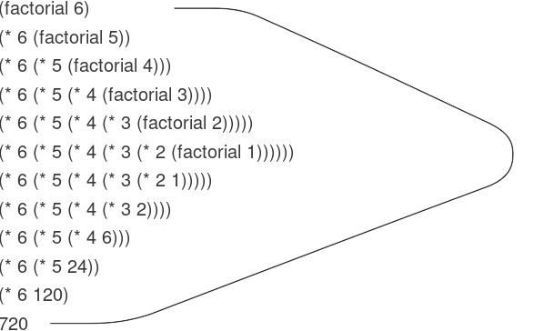
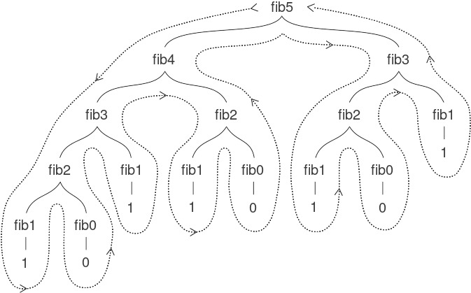

# 1.2 Procedures (thủ tục) and the Processes They Generate

Chúng ta vừa xem xét các thành phần của lập trình: Chúng ta đã sử dụng các phép toán số học nguyên thủy, đã kết hợp các phép toán này, và đã trừu tượng hóa các phép toán phức hợp này bằng cách định nghĩa chúng như các compound procedures (thủ tục hợp thành). Nhưng chừng đó vẫn chưa đủ để có thể nói rằng chúng ta biết lập trình. Tình huống của chúng ta giống như một người đã học được luật di chuyển của các quân cờ trong cờ vua nhưng không biết gì về các khai cuộc, chiến thuật hay chiến lược điển hình. Giống như người chơi cờ mới, chúng ta vẫn chưa biết các mẫu hình sử dụng phổ biến trong lĩnh vực này. Chúng ta thiếu kiến thức về những nước đi nào đáng thực hiện (những procedures nào đáng định nghĩa). Chúng ta thiếu kinh nghiệm để dự đoán hậu quả của việc thực hiện một nước đi (thực thi một procedure).

Khả năng hình dung trước hậu quả của các hành động đang xem xét là yếu tố then chốt để trở thành một lập trình viên giỏi, cũng như trong bất kỳ hoạt động sáng tạo, tổng hợp nào khác. Chẳng hạn, để trở thành một nhiếp ảnh gia chuyên nghiệp, người ta phải học cách nhìn vào một khung cảnh và biết được mỗi vùng sẽ tối đến mức nào trên bản in đối với từng lựa chọn phơi sáng và điều kiện tráng rửa khác nhau. Chỉ khi đó mới có thể suy luận ngược, lên kế hoạch bố cục, ánh sáng, phơi sáng và tráng rửa để đạt được hiệu ứng mong muốn. Lập trình cũng tương tự, nơi chúng ta lập kế hoạch cho chuỗi hành động mà một process (tiến trình) sẽ thực hiện và điều khiển process đó thông qua một program (chương trình). Để trở thành chuyên gia, chúng ta phải học cách hình dung các process được tạo ra bởi nhiều loại procedures khác nhau. Chỉ sau khi phát triển được kỹ năng này, chúng ta mới có thể xây dựng một cách đáng tin cậy các programs thể hiện hành vi mong muốn.

Một procedure là một mẫu hình cho *local evolution* (tiến hóa cục bộ) của một computational process (tiến trình tính toán). Nó chỉ ra cách mỗi giai đoạn của process được xây dựng dựa trên giai đoạn trước đó. Chúng ta muốn có thể đưa ra những nhận định về hành vi tổng thể, hay *global* (toàn cục), của một process mà local evolution đã được xác định bởi một procedure. Điều này nói chung là rất khó, nhưng ít nhất chúng ta có thể cố gắng mô tả một số mẫu hình điển hình của sự tiến hóa process.

Trong phần này, chúng ta sẽ xem xét một số “hình dạng” phổ biến của các process được tạo ra bởi các procedures đơn giản. Chúng ta cũng sẽ khảo sát tốc độ mà các process này tiêu thụ những tài nguyên tính toán quan trọng là thời gian và bộ nhớ. Các procedures mà chúng ta sẽ xét đến rất đơn giản. Vai trò của chúng giống như các mẫu thử trong nhiếp ảnh: là những mẫu hình nguyên mẫu được đơn giản hóa quá mức, hơn là các ví dụ thực tiễn tự thân.


## 1.2.1 Linear Recursion (đệ quy tuyến tính) and Iteration (lặp)

Chúng ta bắt đầu bằng cách xét hàm factorial (giai thừa), được định nghĩa bởi

$$n!\, = \,{n \cdot (n - 1)} \cdot {(n - 2)}\cdots{3 \cdot 2 \cdot 1.}$$

Có nhiều cách để tính giai thừa. Một cách là sử dụng nhận xét rằng $n!$ bằng $n$ nhân với $(n - 1)!$ đối với mọi số nguyên dương $n$:

$$n!\, = \,{n \cdot \lbrack(n - 1)} \cdot {(n - 2)}\cdots{3 \cdot 2 \cdot 1\rbrack}\, = \,{n \cdot (n - 1)!.}$$

Do đó, chúng ta có thể tính $n!$ bằng cách tính $(n - 1)!$ rồi nhân kết quả với $n$. Nếu thêm điều kiện rằng 1! bằng 1, thì nhận xét này được chuyển trực tiếp thành một procedure:

``` {.scheme}
(define (factorial n)
  (if (= n 1) 
      1 
      (* n (factorial (- n 1)))))
```

Chúng ta có thể sử dụng substitution model (mô hình thế) của mục 1.1.5 để quan sát procedure này hoạt động khi tính 6!, như minh họa ở Hình 1.3.



**Figure 1.3:** A linear recursive process for computing 6!.

Bây giờ, hãy tiếp cận việc tính giai thừa theo một góc nhìn khác. Chúng ta có thể mô tả một quy tắc để tính $n!$ bằng cách chỉ ra rằng trước tiên nhân 1 với 2, sau đó nhân kết quả với 3, rồi với 4, và cứ thế cho đến khi đạt đến $n$. Một cách chính xác hơn, chúng ta duy trì một tích đang chạy (running product), cùng với một bộ đếm (counter) đếm từ 1 đến $n$. Chúng ta có thể mô tả phép tính này bằng cách nói rằng counter và product đồng thời thay đổi từ bước này sang bước tiếp theo theo quy tắc:

``` {.example}
product 
  ←
 counter * product
counter 
  ←
 counter + 1
```

và quy định rằng $n!$ là giá trị của product khi counter vượt quá $n$.

Một lần nữa, chúng ta có thể viết lại mô tả này thành một procedure để tính giai thừa:[^12]

``` {.scheme}
(define (factorial n) 
  (fact-iter 1 1 n))

(define (fact-iter product counter max-count)
  (if (> counter max-count)
      product
      (fact-iter (* counter product)
                 (+ counter 1)
                 max-count)))
```

Như trước, chúng ta có thể sử dụng substitution model để hình dung quá trình tính 6!, như minh họa ở Hình 1.4.


**Figure 1.4:** A linear iterative process for computing 6!.

[^12]: In a real program we would probably use the block structure introduced in the last section to hide the definition of `fact-iter`.

So sánh hai process (tiến trình). Ở một góc nhìn, chúng dường như hầu như không khác nhau. Cả hai đều tính cùng một hàm toán học trên cùng một miền, và mỗi cái đều cần số bước tỉ lệ với $n$ để tính $n!$. Thật vậy, cả hai process thậm chí còn thực hiện cùng một chuỗi phép nhân, thu được cùng một dãy tích từng phần. Mặt khác, khi chúng ta xét đến “hình dạng” của hai process, ta thấy rằng chúng tiến triển rất khác nhau.

Xét process đầu tiên. Substitution model (mô hình thế) cho thấy một dạng mở rộng rồi thu hẹp, được biểu thị bằng mũi tên trong Hình 1.3. Sự mở rộng xảy ra khi process xây dựng một chuỗi các *deferred operations* (các phép toán trì hoãn) — trong trường hợp này là một chuỗi phép nhân. Sự thu hẹp xảy ra khi các phép toán thực sự được thực hiện. Loại process này, được đặc trưng bởi một chuỗi các deferred operations, được gọi là *recursive process*. Việc thực hiện process này đòi hỏi interpreter (bộ thông dịch) phải theo dõi các phép toán sẽ được thực hiện sau đó. Trong phép tính $n!$, độ dài của chuỗi các phép nhân trì hoãn, và do đó lượng thông tin cần để theo dõi nó, tăng tuyến tính theo $n$ (tỉ lệ với $n$), giống như số bước. Một process như vậy được gọi là *linear recursive process*.

Ngược lại, process thứ hai không phình ra rồi co lại. Ở mỗi bước, tất cả những gì chúng ta cần theo dõi, với bất kỳ $n$ nào, là giá trị hiện tại của các biến `product`, `counter`, và `max-count`. Chúng ta gọi đây là *iterative process*. Nói chung, một iterative process là process mà trạng thái của nó có thể được tóm tắt bằng một số cố định các *state variables* (biến trạng thái), cùng với một quy tắc cố định mô tả cách các state variables được cập nhật khi process chuyển từ trạng thái này sang trạng thái khác, và một phép kiểm tra kết thúc (tùy chọn) xác định điều kiện mà process nên dừng lại. Trong việc tính $n!$, số bước cần thiết tăng tuyến tính theo $n$. Một process như vậy được gọi là *linear iterative process*.

Sự tương phản giữa hai process có thể được thấy theo một cách khác. Trong trường hợp iterative, các program variables (biến chương trình) cung cấp một mô tả đầy đủ về trạng thái của process tại bất kỳ thời điểm nào. Nếu chúng ta dừng việc tính toán giữa các bước, tất cả những gì cần làm để tiếp tục là cung cấp cho interpreter giá trị của ba program variables. Không giống như vậy với recursive process. Trong trường hợp này, có một số thông tin “ẩn” bổ sung, được interpreter duy trì và không nằm trong các program variables, thông tin này cho biết “process đang ở đâu” trong việc xử lý chuỗi các deferred operations. Chuỗi càng dài, càng cần duy trì nhiều thông tin hơn.[^13]

Khi so sánh iteration và recursion, chúng ta phải cẩn thận để không nhầm lẫn khái niệm recursive *process* với khái niệm recursive *procedure* (thủ tục). Khi chúng ta mô tả một procedure là recursive, chúng ta đang nói đến thực tế cú pháp rằng định nghĩa procedure đó tham chiếu (trực tiếp hoặc gián tiếp) đến chính nó. Nhưng khi chúng ta mô tả một process là tuân theo một mẫu hình, chẳng hạn, linearly recursive, chúng ta đang nói về cách process tiến triển, chứ không phải về cú pháp của cách viết procedure. Có thể sẽ gây bối rối khi chúng ta gọi một recursive procedure như `fact-iter` là tạo ra một iterative process. Tuy nhiên, process này thực sự là iterative: Trạng thái của nó được nắm bắt hoàn toàn bởi ba state variables, và interpreter chỉ cần theo dõi ba biến này để thực thi process.

Một lý do khiến sự phân biệt giữa process và procedure có thể gây nhầm lẫn là hầu hết các implementation (cài đặt) của các ngôn ngữ phổ biến (bao gồm Ada, Pascal, và C) được thiết kế theo cách mà việc thông dịch bất kỳ recursive procedure nào cũng tiêu tốn một lượng bộ nhớ tăng theo số lần gọi procedure, ngay cả khi process được mô tả về nguyên tắc là iterative. Do đó, các ngôn ngữ này chỉ có thể mô tả iterative processes bằng cách sử dụng các “looping constructs” (cấu trúc lặp) chuyên biệt như `do`, `repeat`, `until`, `for`, và `while`. Implementation của Scheme mà chúng ta sẽ xét trong Chương 5 không mắc phải nhược điểm này. Nó sẽ thực thi một iterative process trong không gian bộ nhớ hằng số, ngay cả khi iterative process đó được mô tả bằng một recursive procedure. Một implementation có đặc tính này được gọi là *tail-recursive*. Với một tail-recursive implementation, iteration có thể được biểu đạt bằng cơ chế gọi procedure thông thường, do đó các iteration constructs đặc biệt chỉ hữu ích như một dạng syntactic sugar (cú pháp rút gọn).[^14]

[^13]: When we discuss the implementation of procedures on register machines in Chapter 5, we will see that any iterative process can be realized “in hardware” as a machine that has a fixed set of registers and no auxiliary memory. In contrast, realizing a recursive process requires a machine that uses an auxiliary data structure known as a *stack*.

[^14]: Tail recursion has long been known as a compiler optimization trick. A coherent semantic basis for tail recursion was provided by Carl Hewitt (1977), who explained it in terms of the “message-passing” model of computation that we shall discuss in Chapter 3. Inspired by this, Gerald Jay Sussman and Guy Lewis Steele Jr. (see Steele and Sussman 1975) constructed a tail-recursive interpreter for Scheme. Steele later showed how tail recursion is a consequence of the natural way to compile procedure calls (Steele 1977). The IEEE standard for Scheme requires that Scheme implementations be tail-recursive.

## 1.2.2 Tree Recursion (đệ quy dạng cây)

Một mẫu hình tính toán phổ biến khác được gọi là *tree recursion*. Ví dụ, hãy xét việc tính dãy số Fibonacci, trong đó mỗi số là tổng của hai số liền trước:

0, 1, 1, 2, 3, 5, 8, 13, 21, ….

Nói chung, các số Fibonacci có thể được định nghĩa bởi quy tắc

$$\text{Fib}(n)\; = \;\begin{cases}
0 & {\;\text{if}\;\; n = 0,} \\
1 & {\;\text{if}\;\; n = 1,} \\
{\text{Fib}(n - 1) + \text{Fib}(n - 2)} & {\;\text{otherwise}.} \\
\end{cases}$$

Chúng ta có thể ngay lập tức chuyển định nghĩa này thành một recursive procedure (thủ tục đệ quy) để tính các số Fibonacci:

``` {.scheme}
(define (fib n)
  (cond ((= n 0) 0)
        ((= n 1) 1)
        (else (+ (fib (- n 1))
                 (fib (- n 2))))))
```

Hãy xét mẫu hình của phép tính này. Để tính `(fib 5)`, chúng ta tính `(fib 4)` và `(fib 3)`. Để tính `(fib 4)`, chúng ta tính `(fib 3)` và `(fib 2)`. Nói chung, process (tiến trình) phát triển trông giống như một cái cây, như minh họa ở Hình 1.5. Lưu ý rằng các nhánh tách đôi ở mỗi cấp (trừ cấp cuối); điều này phản ánh thực tế rằng procedure `fib` tự gọi chính nó hai lần mỗi khi được thực thi.



**Figure 1.5:** The tree-recursive process generated in computing `(fib 5)`.

Procedure này mang tính hướng dẫn như một ví dụ nguyên mẫu của tree recursion, nhưng nó là một cách rất tệ để tính các số Fibonacci vì nó thực hiện quá nhiều phép tính dư thừa. Hãy chú ý trong Hình 1.5 rằng toàn bộ phép tính `(fib 3)` — gần một nửa khối lượng công việc — bị lặp lại. Thực tế, không khó để chỉ ra rằng số lần procedure này tính `(fib 1)` hoặc `(fib 0)` (số lượng lá trong cây trên, nói chung) chính xác là $\text{Fib}(n + 1)$. Để hình dung mức độ tệ hại, có thể chứng minh rằng giá trị của $\text{Fib}(n)$ tăng theo hàm mũ với $n$. Cụ thể hơn (xem Bài tập 1.13), $\text{Fib}(n)$ là số nguyên gần nhất với $\varphi^{n}/\sqrt{5}$, trong đó

$$\varphi\, = \,\frac{1 + \sqrt{5}}{2}\, \approx \, 1.6180$$

là *golden ratio* (tỉ lệ vàng), thỏa mãn phương trình

$$\varphi^{2}\, = \,{\varphi + 1.}$$

Do đó, process này sử dụng số bước tăng theo hàm mũ với đầu vào. Mặt khác, lượng bộ nhớ cần thiết chỉ tăng tuyến tính với đầu vào, vì chúng ta chỉ cần theo dõi các node (nút) nằm phía trên trong cây tại bất kỳ thời điểm nào của phép tính. Nói chung, số bước cần thiết của một tree-recursive process sẽ tỉ lệ với số node trong cây, trong khi bộ nhớ cần thiết sẽ tỉ lệ với độ sâu lớn nhất của cây.

Chúng ta cũng có thể xây dựng một iterative process (tiến trình lặp) để tính các số Fibonacci. Ý tưởng là sử dụng một cặp số nguyên $a$ và $b$, khởi tạo với $\text{Fib(1)\ =\ 1}$ và $\text{Fib(0)\ =\ 0}$, và lặp lại việc áp dụng các phép biến đổi đồng thời:

$$\begin{array}{l}
{a\;\leftarrow\; a + b,} \\
{b\;\leftarrow\; a.} \\
\end{array}$$

Không khó để chứng minh rằng, sau khi áp dụng phép biến đổi này $n$ lần, $a$ và $b$ sẽ lần lượt bằng $\text{Fib}(n + 1)$ và $\text{Fib}(n)$. Do đó, chúng ta có thể tính các số Fibonacci theo cách lặp bằng procedure:

``` {.scheme}
(define (fib n) 
  (fib-iter 1 0 n))

(define (fib-iter a b count)
  (if (= count 0)
      b
      (fib-iter (+ a b) a (- count 1))))
```

Phương pháp thứ hai này để tính $\text{Fib}(n)$ là một linear iteration (lặp tuyến tính). Sự khác biệt về số bước cần thiết giữa hai phương pháp — một tuyến tính theo $n$, một tăng nhanh như chính $\text{Fib}(n)$ — là rất lớn, ngay cả với các đầu vào nhỏ.

Tuy nhiên, không nên kết luận từ đây rằng tree-recursive processes là vô dụng. Khi chúng ta xét các process hoạt động trên dữ liệu có cấu trúc phân cấp thay vì chỉ là số, chúng ta sẽ thấy tree recursion là một công cụ tự nhiên và mạnh mẽ.[^15] Ngay cả trong các phép toán số học, tree-recursive processes cũng có thể hữu ích trong việc giúp chúng ta hiểu và thiết kế chương trình. Ví dụ, mặc dù procedure `fib` đầu tiên kém hiệu quả hơn nhiều so với procedure thứ hai, nhưng nó lại trực quan hơn, gần như chỉ là bản dịch sang Lisp của định nghĩa dãy Fibonacci. Để xây dựng thuật toán lặp, cần nhận ra rằng phép tính có thể được viết lại thành một iteration với ba state variables.


[^15]: An example of this was hinted at in 1.1.3. The interpreter itself evaluates expressions using a tree-recursive process.

### Example: Counting change (Đếm số cách đổi tiền)

Chỉ cần một chút khéo léo là có thể nghĩ ra thuật toán Fibonacci dạng iterative (lặp). Ngược lại, hãy xét bài toán sau: Có bao nhiêu cách khác nhau để đổi ra \$1.00, nếu ta có các đồng half-dollars (50 xu), quarters (25 xu), dimes (10 xu), nickels (5 xu), và pennies (1 xu)? Tổng quát hơn, liệu ta có thể viết một procedure (thủ tục) để tính số cách đổi cho bất kỳ số tiền nào cho trước không?

Bài toán này có một lời giải đơn giản dưới dạng recursive procedure (thủ tục đệ quy). Giả sử ta coi các loại tiền xu có sẵn được sắp xếp theo một thứ tự nào đó. Khi đó, mối quan hệ sau sẽ đúng:

Số cách đổi số tiền $a$ bằng $n$ loại tiền xu bằng:

- số cách đổi số tiền $a$ khi dùng tất cả trừ loại tiền xu thứ nhất, cộng với
- số cách đổi số tiền $a - d$ khi dùng cả $n$ loại tiền xu, trong đó $d$ là mệnh giá của loại tiền xu thứ nhất.

Để thấy tại sao điều này đúng, hãy nhận xét rằng các cách đổi tiền có thể chia thành hai nhóm: nhóm không dùng bất kỳ đồng xu loại thứ nhất nào, và nhóm có dùng. Do đó, tổng số cách đổi tiền cho một số tiền nào đó bằng số cách đổi tiền mà không dùng đồng xu loại thứ nhất, cộng với số cách đổi tiền giả sử ta có dùng đồng xu loại thứ nhất. Nhưng con số thứ hai này chính là số cách đổi tiền cho số tiền còn lại sau khi đã dùng một đồng xu loại thứ nhất.

Như vậy, ta có thể đệ quy rút gọn bài toán đổi một số tiền cho trước thành bài toán đổi các số tiền nhỏ hơn với ít loại tiền xu hơn. Hãy xem xét kỹ quy tắc rút gọn này, và tự thuyết phục rằng ta có thể dùng nó để mô tả một thuật toán nếu ta chỉ rõ các trường hợp suy biến sau đây:[^16]

- Nếu $a$ đúng bằng 0, ta tính đó là 1 cách đổi tiền.
- Nếu $a$ nhỏ hơn 0, ta tính đó là 0 cách đổi tiền.
- Nếu $n$ bằng 0, ta tính đó là 0 cách đổi tiền.

Chúng ta có thể dễ dàng chuyển mô tả này thành một recursive procedure:

``` {.scheme}
(define (count-change amount)
  (cc amount 5))

(define (cc amount kinds-of-coins)
  (cond ((= amount 0) 1)
        ((or (< amount 0) 
             (= kinds-of-coins 0)) 
         0)
        (else 
         (+ (cc amount (- kinds-of-coins 1))
            (cc (- amount (first-denomination 
                           kinds-of-coins))
                kinds-of-coins)))))

(define (first-denomination kinds-of-coins)
  (cond ((= kinds-of-coins 1) 1)
        ((= kinds-of-coins 2) 5)
        ((= kinds-of-coins 3) 10)
        ((= kinds-of-coins 4) 25)
        ((= kinds-of-coins 5) 50)))
```

(Procedure `first-denomination` nhận vào số loại tiền xu có sẵn và trả về mệnh giá của loại thứ nhất. Ở đây ta coi các đồng xu được sắp xếp theo thứ tự từ lớn đến nhỏ, nhưng bất kỳ thứ tự nào cũng được.) Giờ ta có thể trả lời câu hỏi ban đầu về việc đổi một đô-la:

``` {.scheme}
(count-change 100)
292
```

`Count-change` tạo ra một tree-recursive process (tiến trình đệ quy dạng cây) với các phép tính dư thừa tương tự như trong cách cài đặt đầu tiên của `fib`. (Sẽ mất khá nhiều thời gian để tính ra con số 292 đó.) Mặt khác, không rõ ràng cách thiết kế một thuật toán tốt hơn để tính kết quả, và chúng tôi để lại bài toán này như một thử thách. Nhận xét rằng một tree-recursive process có thể rất kém hiệu quả nhưng thường dễ mô tả và dễ hiểu đã dẫn đến đề xuất rằng ta có thể đạt được cả hai ưu điểm bằng cách thiết kế một “smart compiler” (trình biên dịch thông minh) có thể biến đổi các tree-recursive procedures thành các procedures hiệu quả hơn nhưng tính ra cùng kết quả.[^17]


[^16]: For example, work through in detail how the reduction rule applies to the problem of making change for 10 cents using pennies and nickels.

[^17]: One approach to coping with redundant computations is to arrange matters so that we automatically construct a table of values as they are computed. Each time we are asked to apply the procedure to some argument, we first look to see if the value is already stored in the table, in which case we avoid performing the redundant computation. This strategy, known as *tabulation* or *memoization*, can be implemented in a straightforward way. Tabulation can sometimes be used to transform processes that require an exponential number of steps (such as `count-change`) into processes whose space and time requirements grow linearly with the input. See Exercise 3.27.


## 1.2.3 Orders of Growth (Bậc tăng trưởng)

Các ví dụ trước minh họa rằng các process (tiến trình) có thể khác nhau đáng kể về tốc độ tiêu thụ tài nguyên tính toán. Một cách thuận tiện để mô tả sự khác biệt này là sử dụng khái niệm *order of growth* (bậc tăng trưởng) để có được một thước đo tổng quát về lượng tài nguyên mà một process cần khi kích thước đầu vào tăng lên.

Gọi $n$ là một tham số đo kích thước của bài toán, và gọi $R(n)$ là lượng tài nguyên mà process yêu cầu cho một bài toán có kích thước $n$. Trong các ví dụ trước, chúng ta lấy $n$ là con số mà một hàm cho trước cần được tính, nhưng cũng có những khả năng khác. Chẳng hạn, nếu mục tiêu của chúng ta là tính gần đúng căn bậc hai của một số, ta có thể lấy $n$ là số chữ số chính xác cần đạt. Đối với phép nhân ma trận, ta có thể lấy $n$ là số hàng của các ma trận. Nói chung, có nhiều thuộc tính của bài toán mà theo đó sẽ hữu ích khi phân tích một process cho trước. Tương tự, $R(n)$ có thể đo số lượng thanh ghi lưu trữ bên trong được sử dụng, số lượng phép toán máy cơ bản được thực hiện, v.v. Trên các máy tính chỉ thực hiện một số lượng cố định các phép toán tại một thời điểm, thời gian yêu cầu sẽ tỉ lệ với số lượng phép toán máy cơ bản được thực hiện.

Ta nói rằng $R(n)$ có order of growth $\Theta(f(n))$, viết là ${R(n)} = {\Theta(f(n))}$ (đọc là “theta của $f(n)$”), nếu tồn tại các hằng số dương $k_{1}$ và $k_{2}$ độc lập với $n$ sao cho ${k_{1}f(n)} \leq {R(n)} \leq {k_{2}f(n)}$ với mọi giá trị $n$ đủ lớn. (Nói cách khác, với $n$ lớn, giá trị $R(n)$ bị kẹp giữa $k_{1}f(n)$ và $k_{2}f(n)$.)

Ví dụ, với linear recursive process (tiến trình đệ quy tuyến tính) để tính giai thừa được mô tả ở 1.2.1, số bước tăng tỉ lệ với đầu vào $n$. Do đó, số bước cần cho process này tăng theo $\Theta(n)$. Chúng ta cũng đã thấy rằng bộ nhớ cần thiết tăng theo $\Theta(n)$. Đối với iterative factorial (giai thừa dạng lặp), số bước vẫn là $\Theta(n)$ nhưng bộ nhớ là $\Theta(1)$ — tức là hằng số.[^18] Phép tính Fibonacci dạng tree-recursive (đệ quy dạng cây) yêu cầu $\Theta(\varphi^{n})$ bước và bộ nhớ $\Theta(n)$, trong đó $\varphi$ là golden ratio (tỉ lệ vàng) được mô tả ở 1.2.2.

Orders of growth chỉ cung cấp một mô tả thô về hành vi của một process. Ví dụ, một process cần $n^{2}$ bước, một process cần $1000n^{2}$ bước, và một process cần ${3n^{2}} + {10n} + 17$ bước đều có order of growth là $\Theta(n^{2})$. Mặt khác, order of growth cung cấp một chỉ báo hữu ích về cách chúng ta có thể kỳ vọng hành vi của process thay đổi khi thay đổi kích thước bài toán. Với một process $\Theta(n)$ (tuyến tính), việc tăng gấp đôi kích thước sẽ xấp xỉ tăng gấp đôi lượng tài nguyên sử dụng. Với một process dạng hàm mũ, mỗi lần tăng kích thước bài toán sẽ nhân lượng tài nguyên sử dụng lên một hệ số cố định. Trong phần còn lại của 1.2, chúng ta sẽ xét hai thuật toán có order of growth dạng logarithmic (logarit), sao cho việc tăng gấp đôi kích thước bài toán chỉ làm tăng lượng tài nguyên yêu cầu thêm một lượng cố định.


[^18]: These statements mask a great deal of oversimplification. For instance, if we count process steps as “machine operations” we are making the assumption that the number of machine operations needed to perform, say, a multiplication is independent of the size of the numbers to be multiplied, which is false if the numbers are sufficiently large. Similar remarks hold for the estimates of space. Like the design and description of a process, the analysis of a process can be carried out at various levels of abstraction.

## 1.2.4 Exponentiation (Lũy thừa)

Xét bài toán tính lũy thừa của một số cho trước. Chúng ta muốn có một procedure (thủ tục) nhận vào hai đối số: cơ số $b$ và số mũ nguyên dương $n$, và tính $b^{n}$. Một cách để làm điều này là sử dụng định nghĩa đệ quy:

$$\begin{array}{l}
{b^{n}\, = \, b \cdot b^{n - 1},} \\
{b^{0}\, = \, 1,} \\
\end{array}$$

Điều này có thể dễ dàng chuyển thành procedure:

``` {.scheme}
(define (expt b n)
  (if (= n 0) 
      1 
      (* b (expt b (- n 1)))))
```

Đây là một linear recursive process (tiến trình đệ quy tuyến tính), cần $\Theta(n)$ bước và $\Theta(n)$ bộ nhớ. Giống như với factorial, ta có thể dễ dàng xây dựng một linear iteration (lặp tuyến tính) tương đương:

``` {.scheme}
(define (expt b n) 
  (expt-iter b n 1))

(define (expt-iter b counter product)
  (if (= counter 0)
      product
      (expt-iter b
                 (- counter 1)
                 (* b product))))
```

Phiên bản này cần $\Theta(n)$ bước và $\Theta(1)$ bộ nhớ.

Chúng ta có thể tính lũy thừa với ít bước hơn bằng cách sử dụng successive squaring (bình phương liên tiếp). Ví dụ, thay vì tính $b^{8}$ như:

$${b \cdot (b \cdot (b} \cdot {(b \cdot (b \cdot (b} \cdot {(b \cdot b)))))),}$$

chúng ta có thể tính nó chỉ với ba phép nhân:

$$\begin{array}{l}
{b^{2}\, = \, b \cdot b,} \\
{b^{4}\, = \, b^{2} \cdot b^{2},} \\
{b^{8}\, = \, b^{4} \cdot b^{4}.} \\
\end{array}$$

Phương pháp này hoạt động tốt với các số mũ là lũy thừa của 2. Chúng ta cũng có thể tận dụng successive squaring để tính lũy thừa nói chung nếu sử dụng quy tắc:

$$\begin{array}{ll}
{b^{n}\, = \,(b^{n/2})^{2}} & {\text{if}\; n\;\text{is\ even},} \\
{b^{n}\, = \, b \cdot b^{n - 1}} & {\text{if}\; n\;\text{is\ odd}.} \\
\end{array}$$

Chúng ta có thể biểu diễn phương pháp này thành procedure:

``` {.scheme}
(define (fast-expt b n)
  (cond ((= n 0) 
         1)
        ((even? n) 
         (square (fast-expt b (/ n 2))))
        (else 
         (* b (fast-expt b (- n 1))))))
```

trong đó, predicate (mệnh đề kiểm tra) để xác định một số nguyên có phải là số chẵn hay không được định nghĩa dựa trên primitive procedure `remainder` như sau:

``` {.scheme}
(define (even? n)
  (= (remainder n 2) 0))
```

Process được tạo ra bởi `fast-expt` tăng trưởng theo logarit của $n$ cả về bộ nhớ và số bước. Để thấy điều này, hãy nhận xét rằng việc tính $b^{2n}$ bằng `fast-expt` chỉ cần thêm một phép nhân so với việc tính $b^{n}$. Kích thước số mũ mà ta có thể tính được do đó tăng gấp đôi (xấp xỉ) với mỗi phép nhân mới được thực hiện. Vì vậy, số phép nhân cần thiết cho một số mũ $n$ tăng xấp xỉ nhanh như logarit cơ số 2 của $n$. Process này có bậc tăng trưởng $\Theta(\log n)$.[^19]

Sự khác biệt giữa bậc tăng trưởng $\Theta(\log n)$ và $\Theta(n)$ trở nên rõ rệt khi $n$ lớn. Ví dụ, `fast-expt` với $n$ = 1000 chỉ cần 14 phép nhân.[^20] Cũng có thể sử dụng ý tưởng successive squaring để xây dựng một thuật toán iterative tính lũy thừa với số bước tăng trưởng logarit (xem Bài tập 1.16), mặc dù, như thường thấy với các thuật toán iterative, cách viết không đơn giản và trực quan như thuật toán recursive.[^21]


[^19]: More precisely, the number of multiplications required is equal to 1 less than the log base 2 of $n$ plus the number of ones in the binary representation of $n$. This total is always less than twice the log base 2 of $n$. The arbitrary constants $k_{1}$ and $k_{2}$ in the definition of order notation imply that, for a logarithmic process, the base to which logarithms are taken does not matter, so all such processes are described as $\Theta(\log n)$.

[^20]: You may wonder why anyone would care about raising numbers to the 1000th power. See 1.2.6.

[^21]: This iterative algorithm is ancient. It appears in the Chandah-sutra by Áchárya Pingala, written before 200 B.C. See Knuth 1981, section 4.6.3, for a full discussion and analysis of this and other methods of exponentiation.

## 1.2.5 Greatest Common Divisors (Ước số chung lớn nhất)

Greatest common divisor (GCD) của hai số nguyên $a$ và $b$ được định nghĩa là số nguyên lớn nhất chia hết cả $a$ và $b$ mà không để lại số dư. Ví dụ, GCD của 16 và 28 là 4. Trong Chương 2, khi chúng ta nghiên cứu cách cài đặt phép toán số hữu tỉ, chúng ta sẽ cần có khả năng tính GCD để rút gọn số hữu tỉ về dạng tối giản. (Để rút gọn một số hữu tỉ về dạng tối giản, ta phải chia cả tử số và mẫu số cho GCD của chúng. Ví dụ, 16/28 rút gọn thành 4/7.) Một cách để tìm GCD của hai số nguyên là phân tích chúng ra thừa số và tìm các thừa số chung, nhưng có một thuật toán nổi tiếng hiệu quả hơn nhiều.

Ý tưởng của thuật toán dựa trên nhận xét rằng, nếu $r$ là số dư khi $a$ chia cho $b$, thì các ước số chung của $a$ và $b$ chính là các ước số chung của $b$ và $r$. Do đó, ta có thể sử dụng phương trình

``` {.example}
GCD(a,b) = GCD(b,r)
```

để liên tiếp rút gọn bài toán tính GCD thành bài toán tính GCD của các cặp số nguyên ngày càng nhỏ hơn. Ví dụ:

``` {.example}
GCD(206,40) = GCD(40,6)
            = GCD(6,4)
            = GCD(4,2)
            = GCD(2,0) = 2
```

rút gọn GCD(206, 40) thành GCD(2, 0), là 2. Có thể chứng minh rằng, bắt đầu với bất kỳ hai số nguyên dương nào và thực hiện các bước rút gọn lặp lại, ta sẽ luôn thu được một cặp mà số thứ hai là 0. Khi đó, GCD chính là số còn lại trong cặp. Phương pháp tính GCD này được gọi là *Euclid’s Algorithm*.[^22]

Ta có thể dễ dàng biểu diễn Euclid’s Algorithm dưới dạng một procedure:

``` {.scheme}
(define (gcd a b)
  (if (= b 0)
      a
      (gcd b (remainder a b))))
```

Thuật toán này tạo ra một iterative process (tiến trình lặp), với số bước tăng trưởng theo logarit của các số liên quan.

Việc số bước cần thiết của Euclid’s Algorithm tăng trưởng theo logarit có một mối liên hệ thú vị với các số Fibonacci:

> **Lamé’s Theorem:** Nếu Euclid’s Algorithm cần $k$ bước để tính GCD của một cặp số, thì số nhỏ hơn trong cặp đó phải lớn hơn hoặc bằng số Fibonacci thứ $k$.[^23]

Chúng ta có thể sử dụng định lý này để ước lượng bậc tăng trưởng của Euclid’s Algorithm. Gọi $n$ là số nhỏ hơn trong hai đầu vào của procedure. Nếu process mất $k$ bước, thì ta phải có $n \geq {\text{Fib}(k)} \approx {\varphi^{k}/\sqrt{5}}$. Do đó, số bước $k$ tăng trưởng theo logarit (cơ số $\varphi$) của $n$. Vì vậy, bậc tăng trưởng là $\Theta(\log n)$.


## 1.2.6 Example: Testing for Primality (Kiểm tra số nguyên tố)

Phần này mô tả hai phương pháp kiểm tra tính nguyên tố của một số nguyên $n$: một phương pháp có bậc tăng trưởng $\Theta(\sqrt{n})$, và một thuật toán “probabilistic” (xác suất) có bậc tăng trưởng $\Theta(\log n)$. Các bài tập ở cuối phần này gợi ý các dự án lập trình dựa trên các thuật toán này.

### Searching for divisors (Tìm ước số)

Từ thời cổ đại, các nhà toán học đã bị cuốn hút bởi các bài toán liên quan đến số nguyên tố, và nhiều người đã nghiên cứu bài toán tìm cách kiểm tra một số có phải là số nguyên tố hay không. Một cách để kiểm tra là tìm các ước số của số đó. Chương trình sau tìm ước số nguyên nhỏ nhất (lớn hơn 1) của một số $n$ cho trước. Nó thực hiện điều này theo cách trực tiếp, bằng cách kiểm tra tính chia hết của $n$ cho các số nguyên liên tiếp bắt đầu từ 2.

``` {.scheme}
(define (smallest-divisor n)
  (find-divisor n 2))

(define (find-divisor n test-divisor)
  (cond ((> (square test-divisor) n) 
         n)
        ((divides? test-divisor n) 
         test-divisor)
        (else (find-divisor 
               n 
               (+ test-divisor 1)))))

(define (divides? a b)
  (= (remainder b a) 0))
```

Chúng ta có thể kiểm tra một số có phải là số nguyên tố hay không như sau: $n$ là số nguyên tố khi và chỉ khi $n$ là ước số nhỏ nhất của chính nó.

``` {.scheme}
(define (prime? n)
  (= n (smallest-divisor n)))
```

Điều kiện kết thúc cho `find-divisor` dựa trên thực tế rằng nếu $n$ không phải là số nguyên tố thì nó phải có một ước số nhỏ hơn hoặc bằng $\sqrt{n}$.[^24] Điều này có nghĩa là thuật toán chỉ cần kiểm tra các ước số từ 1 đến $\sqrt{n}$. Do đó, số bước cần thiết để xác định $n$ là số nguyên tố sẽ có bậc tăng trưởng $\Theta(\sqrt{n})$.


[^22]: Euclid’s Algorithm is so called because it appears in Euclid’s Elements (Book 7, ca. 300 B.C.). According to Knuth (1973), it can be considered the oldest known nontrivial algorithm. The ancient Egyptian method of multiplication (Exercise 1.18) is surely older, but, as Knuth explains, Euclid’s algorithm is the oldest known to have been presented as a general algorithm, rather than as a set of illustrative examples.

[^23]: This theorem was proved in 1845 by Gabriel Lamé, a French mathematician and engineer known chiefly for his contributions to mathematical physics. To prove the theorem, we consider pairs $(a_{k},b_{k})$, where $a_{k} \geq b_{k}$, for which Euclid’s Algorithm terminates in $k$ steps. The proof is based on the claim that, if ${(a_{k + 1},b_{k + 1})}\rightarrow{(a_{k},b_{k})}\rightarrow{(a_{k - 1},b_{k - 1})}$ are three successive pairs in the reduction process, then we must have $b_{k + 1} \geq b_{k} + b_{k - 1}$. To verify the claim, consider that a reduction step is defined by applying the transformation $a_{k - 1} = b_{k}$, $b_{k - 1} =$ remainder of $a_{k}$ divided by $b_{k}$. The second equation means that $a_{k} = {qb_{k}} + b_{k - 1}$ for some positive integer $q$. And since $q$ must be at least 1 we have $a_{k} = {qb_{k}} + b_{k - 1} \geq b_{k} + b_{k - 1}$. But in the previous reduction step we have $b_{k + 1} = a_{k}$. Therefore, $b_{k + 1} = a_{k} \geq b_{k} + b_{k - 1}$. This verifies the claim. Now we can prove the theorem by induction on $k$, the number of steps that the algorithm requires to terminate. The result is true for $k = 1$, since this merely requires that $b$ be at least as large as $\text{Fib}(1) = 1$. Now, assume that the result is true for all integers less than or equal to $k$ and establish the result for $k + 1$. Let ${(a_{k + 1},b_{k + 1})}\rightarrow{(a_{k},b_{k})}\rightarrow{(a_{k - 1},b_{k - 1})}$ be successive pairs in the reduction process. By our induction hypotheses, we have $b_{k - 1} \geq {\text{Fib}(k - 1)}$ and $b_{k} \geq {\text{Fib}(k)}$. Thus, applying the claim we just proved together with the definition of the Fibonacci numbers gives $b_{k + 1} \geq b_{k} + b_{k - 1} \geq {\text{Fib}(k)} + {\text{Fib}(k - 1)} = {\text{Fib}(k + 1)}$, which completes the proof of Lamé’s Theorem.

[^24]: If $d$ is a divisor of


### The Fermat test (Kiểm tra Fermat)

Bài kiểm tra tính nguyên tố có bậc tăng trưởng $\Theta(\log n)$ này dựa trên một kết quả trong số học (number theory) được gọi là Fermat’s Little Theorem (Định lý nhỏ của Fermat).[^25]

> **Fermat’s Little Theorem:** Nếu $n$ là một số nguyên tố và $a$ là một số nguyên dương bất kỳ nhỏ hơn $n$, thì $a$ lũy thừa $n^{\text{th}}$ đồng dư với $a$ theo modulo $n$.

(Hai số được gọi là *congruent modulo* $n$ nếu chúng có cùng số dư khi chia cho $n$. Số dư của một số $a$ khi chia cho $n$ cũng được gọi là *remainder of* $a$ *modulo* $n$, hoặc đơn giản là $a$ *modulo* $n$.)

Nếu $n$ không phải là số nguyên tố, thì nói chung, hầu hết các số $a < n$ sẽ không thỏa mãn quan hệ trên. Điều này dẫn đến thuật toán kiểm tra tính nguyên tố sau: Cho một số $n$, chọn ngẫu nhiên một số $a < n$ và tính số dư của $a^{n}$ theo modulo $n$. Nếu kết quả khác $a$, thì chắc chắn $n$ không phải là số nguyên tố. Nếu kết quả bằng $a$, thì có khả năng cao $n$ là số nguyên tố. Tiếp tục chọn một số $a$ ngẫu nhiên khác và kiểm tra lại bằng cùng phương pháp. Nếu nó cũng thỏa mãn phương trình, thì ta càng có cơ sở tin rằng $n$ là số nguyên tố. Bằng cách thử nhiều giá trị $a$ hơn, ta có thể tăng độ tin cậy của kết quả. Thuật toán này được gọi là Fermat test.

Để cài đặt Fermat test, chúng ta cần một procedure tính lũy thừa của một số theo modulo của một số khác:

``` {.scheme}
(define (expmod base exp m)
  (cond ((= exp 0) 1)
        ((even? exp)
         (remainder 
          (square (expmod base (/ exp 2) m))
          m))
        (else
         (remainder 
          (* base (expmod base (- exp 1) m))
          m))))
```

Điều này rất giống với procedure `fast-expt` ở mục 1.2.4. Nó sử dụng successive squaring, do đó số bước tăng trưởng theo logarit của số mũ.[^26]

Fermat test được thực hiện bằng cách chọn ngẫu nhiên một số $a$ trong khoảng từ 1 đến $n - 1$ (bao gồm cả hai đầu) và kiểm tra xem số dư modulo $n$ của $a^{n}$ có bằng $a$ hay không. Số ngẫu nhiên $a$ được chọn bằng procedure `random`, mà ta giả định là primitive có sẵn trong Scheme. `Random` trả về một số nguyên không âm nhỏ hơn đối số nguyên được truyền vào. Do đó, để lấy một số ngẫu nhiên trong khoảng từ 1 đến $n - 1$, ta gọi `random` với đối số $n - 1$ và cộng thêm 1 vào kết quả:

``` {.scheme}
(define (fermat-test n)
  (define (try-it a)
    (= (expmod a n n) a))
  (try-it (+ 1 (random (- n 1)))))
```

Procedure sau đây chạy phép kiểm tra một số lần nhất định, được chỉ định bởi một tham số. Giá trị trả về là true nếu phép kiểm tra thành công mọi lần, và false nếu không.

``` {.scheme}
(define (fast-prime? n times)
  (cond ((= times 0) true)
        ((fermat-test n) 
         (fast-prime? n (- times 1)))
        (else false)))
```


[^25]: Pierre de Fermat (1601-1665) được coi là người sáng lập số học hiện đại. Ông đạt được nhiều kết quả quan trọng trong số học, nhưng thường chỉ công bố kết quả mà không đưa ra chứng minh. Fermat’s Little Theorem được ông nêu trong một bức thư viết năm 1640. Bằng chứng đầu tiên được công bố do Euler đưa ra năm 1736 (và một bằng chứng giống hệt, sớm hơn, được tìm thấy trong các bản thảo chưa xuất bản của Leibniz). Kết quả nổi tiếng nhất của Fermat — được biết đến với tên Fermat’s Last Theorem — được ông ghi lại năm 1637 trong bản sao cuốn *Arithmetic* (của nhà toán học Hy Lạp thế kỷ thứ 3 Diophantus) với lời chú thích “Tôi đã tìm ra một chứng minh thực sự phi thường, nhưng lề sách này quá nhỏ để chứa nó.” Việc tìm ra chứng minh cho Fermat’s Last Theorem trở thành một trong những thách thức nổi tiếng nhất trong số học. Lời giải hoàn chỉnh cuối cùng được Andrew Wiles (Đại học Princeton) đưa ra năm 1995.

[^26]: The reduction steps in the cases where the exponent $e$ is greater than 1 are based on the fact that, for any integers $x$, $y$, and $m$, we can find the remainder of $x$ times $y$ modulo $m$ by computing separately the remainders of $x$ modulo $m$ and $y$ modulo $m$, multiplying these, and then taking the remainder of the result modulo $m$. For instance, in the case where $e$ is even, we compute the remainder of $b^{e/2}$ modulo $m$, square this, and take the remainder modulo $m$. This technique is useful because it means we can perform our computation without ever having to deal with numbers much larger than $m$. (Compare Exercise 1.25.)

### Probabilistic methods (Các phương pháp xác suất)

Fermat test khác về bản chất so với hầu hết các thuật toán quen thuộc, nơi mà ta tính ra một đáp án được đảm bảo là chính xác. Ở đây, đáp án thu được chỉ *có khả năng* đúng. Cụ thể hơn, nếu $n$ từng thất bại trong Fermat test, ta có thể chắc chắn rằng $n$ không phải là số nguyên tố. Nhưng việc $n$ vượt qua bài kiểm tra, mặc dù là một dấu hiệu cực kỳ mạnh mẽ, vẫn không phải là sự đảm bảo tuyệt đối rằng $n$ là số nguyên tố. Điều chúng ta muốn nói là: với bất kỳ số $n$ nào, nếu ta thực hiện bài kiểm tra đủ nhiều lần và thấy rằng $n$ luôn vượt qua, thì xác suất sai sót trong phép kiểm tra tính nguyên tố của ta có thể được làm nhỏ tùy ý.

Thật không may, khẳng định này không hoàn toàn đúng. Thực tế tồn tại những số đánh lừa được Fermat test: các số $n$ không phải nguyên tố nhưng lại có tính chất $a^{n}$ đồng dư với $a$ theo modulo $n$ với mọi số nguyên $a < n$. Những số như vậy cực kỳ hiếm, vì thế Fermat test vẫn khá đáng tin cậy trong thực tế.[^27]

Có những biến thể của Fermat test mà không thể bị đánh lừa. Trong các phép kiểm tra này, cũng giống như phương pháp Fermat, ta kiểm tra tính nguyên tố của một số nguyên $n$ bằng cách chọn ngẫu nhiên một số nguyên $a < n$ và kiểm tra một điều kiện nào đó phụ thuộc vào $n$ và $a$. (Xem Bài tập 1.28 để biết ví dụ về một phép kiểm tra như vậy.) Mặt khác, trái ngược với Fermat test, ta có thể chứng minh rằng, với bất kỳ $n$ nào, điều kiện đó sẽ không đúng với hầu hết các số nguyên $a < n$ trừ khi $n$ là số nguyên tố. Do đó, nếu $n$ vượt qua phép kiểm tra với một giá trị $a$ được chọn ngẫu nhiên, khả năng $n$ là số nguyên tố sẽ lớn hơn 50%. Nếu $n$ vượt qua với hai giá trị $a$ ngẫu nhiên, khả năng này sẽ lớn hơn 3/4. Bằng cách chạy phép kiểm tra với nhiều giá trị $a$ được chọn ngẫu nhiên hơn nữa, ta có thể làm cho xác suất sai sót nhỏ tùy ý.

Sự tồn tại của các phép kiểm tra mà ta có thể chứng minh rằng xác suất sai sót có thể giảm tùy ý đã khơi dậy sự quan tâm đến các thuật toán thuộc loại này, vốn được gọi là *probabilistic algorithms* (thuật toán xác suất). Có rất nhiều hoạt động nghiên cứu trong lĩnh vực này, và các probabilistic algorithms đã được áp dụng thành công vào nhiều lĩnh vực.[^28]


[^27]: Numbers that fool the Fermat test are called *Carmichael numbers*, và rất ít điều được biết về chúng ngoài việc chúng cực kỳ hiếm. Có 255 Carmichael numbers nhỏ hơn 100.000.000. Một vài số nhỏ nhất là 561, 1105, 1729, 2465, 2821, và 6601. Khi kiểm tra tính nguyên tố của các số rất lớn được chọn ngẫu nhiên, khả năng gặp phải một giá trị đánh lừa được Fermat test còn nhỏ hơn khả năng bức xạ vũ trụ khiến máy tính mắc lỗi khi thực hiện một thuật toán “đúng”. Việc coi một thuật toán là không đủ tốt vì lý do thứ nhất nhưng không vì lý do thứ hai minh họa sự khác biệt giữa toán học và kỹ thuật.

[^28]: One of the most striking applications of probabilistic prime testing has been to the field of cryptography. Although it is now computationally infeasible to factor an arbitrary 200-digit number, the primality of such a number can be checked in a few seconds with the Fermat test. This fact forms the basis of a technique for constructing “unbreakable codes” suggested by Rivest et al. (1977). The resulting *RSA algorithm* has become a widely used technique for enhancing the security of electronic communications. Because of this and related developments, the study of prime numbers, once considered the epitome of a topic in “pure” mathematics to be studied only for its own sake, now turns out to have important practical applications to cryptography, electronic funds transfer, and information retrieval.