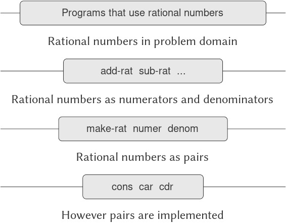

# 2.1 Giới thiệu về Data Abstraction (trừu tượng hóa dữ liệu)

Trong 1.1.8, chúng ta đã lưu ý rằng một procedure (thủ tục) được sử dụng như một thành phần trong việc tạo ra một procedure phức tạp hơn có thể được xem không chỉ như một tập hợp các thao tác cụ thể mà còn như một *procedural abstraction* (trừu tượng hóa thủ tục). Nghĩa là, các chi tiết về cách procedure đó được hiện thực có thể được ẩn đi, và chính procedure cụ thể đó có thể được thay thế bằng bất kỳ procedure nào khác có cùng hành vi tổng thể. Nói cách khác, chúng ta có thể tạo ra một abstraction (trừu tượng hóa) tách biệt cách procedure được sử dụng khỏi các chi tiết về cách procedure được hiện thực dựa trên các procedure nguyên thủy hơn. Khái niệm tương tự đối với compound data (dữ liệu phức hợp) được gọi là *data abstraction*. Data abstraction là một phương pháp cho phép chúng ta tách biệt cách một đối tượng dữ liệu phức hợp được sử dụng khỏi các chi tiết về cách nó được cấu thành từ các đối tượng dữ liệu nguyên thủy hơn.

Ý tưởng cơ bản của data abstraction là cấu trúc các chương trình sẽ sử dụng các đối tượng dữ liệu phức hợp sao cho chúng hoạt động trên “abstract data” (dữ liệu trừu tượng). Nghĩa là, chương trình của chúng ta nên sử dụng dữ liệu theo cách không đưa ra các giả định về dữ liệu ngoài những gì thực sự cần thiết để thực hiện nhiệm vụ. Đồng thời, một “concrete” data representation (biểu diễn dữ liệu cụ thể) được định nghĩa độc lập với các chương trình sử dụng dữ liệu đó. Giao diện giữa hai phần này của hệ thống sẽ là một tập hợp các procedure, gọi là *selectors* (bộ chọn) và *constructors* (bộ tạo), dùng để hiện thực dữ liệu trừu tượng dựa trên biểu diễn cụ thể. Để minh họa kỹ thuật này, chúng ta sẽ xem xét cách thiết kế một tập hợp các procedure để thao tác với rational numbers (số hữu tỉ).

## 2.1.1 Ví dụ: Các phép toán số học cho Rational Numbers

Giả sử chúng ta muốn thực hiện các phép toán số học với rational numbers. Chúng ta muốn có khả năng cộng, trừ, nhân, chia chúng và kiểm tra xem hai rational numbers có bằng nhau hay không.

Hãy bắt đầu bằng cách giả định rằng chúng ta đã có một cách để tạo ra một rational number từ một numerator (tử số) và một denominator (mẫu số). Chúng ta cũng giả định rằng, khi có một rational number, chúng ta có cách để trích xuất (hoặc chọn) tử số và mẫu số của nó. Giả sử thêm rằng constructor và selectors này có sẵn dưới dạng các procedure:

- `(make-rat ⟨n⟩ ⟨d⟩)` trả về rational number có numerator là số nguyên `⟨n⟩` và denominator là số nguyên `⟨d⟩`.
- `(numer ⟨x⟩)` trả về numerator của rational number `⟨x⟩`.
- `(denom ⟨x⟩)` trả về denominator của rational number `⟨x⟩`.

Ở đây chúng ta đang sử dụng một chiến lược tổng hợp mạnh mẽ: *wishful thinking* (tư duy giả định). Chúng ta chưa nói rational number được biểu diễn như thế nào, hoặc các procedure `numer`, `denom`, và `make-rat` sẽ được hiện thực ra sao. Tuy nhiên, nếu chúng ta có ba procedure này, chúng ta có thể cộng, trừ, nhân, chia và kiểm tra bằng nhau bằng cách sử dụng các công thức sau:

$$\begin{array}{lll}
{\frac{n_{1}}{d_{1}} + \frac{n_{2}}{d_{2}}} & = & {\frac{n_{1}d_{2} + n_{2}d_{1}}{d_{1}d_{2}},} \\
{\frac{n_{1}}{d_{1}} - \frac{n_{2}}{d_{2}}} & = & {\frac{n_{1}d_{2} - n_{2}d_{1}}{d_{1}d_{2}},} \\
{\frac{n_{1}}{d_{1}} \times \frac{n_{2}}{d_{2}}} & = & {\frac{n_{1}n_{2}}{d_{1}d_{2}},} \\
\frac{n_{1}\,/\, d_{1}}{n_{2}\,/\, d_{2}} & = & {\frac{n_{1}d_{2}}{d_{1}n_{2}},} \\
\frac{n_{1}}{d_{1}} & = & {\frac{n_{2}}{d_{2}}\quad{\ if\ and\ only\ if\quad}n_{1}d_{2} = n_{2}d_{1}.} \\
\end{array}$$

Chúng ta có thể biểu diễn các quy tắc này dưới dạng các procedure:

``` {.scheme}
(define (add-rat x y)
  (make-rat (+ (* (numer x) (denom y))
               (* (numer y) (denom x)))
            (* (denom x) (denom y))))

(define (sub-rat x y)
  (make-rat (- (* (numer x) (denom y))
               (* (numer y) (denom x)))
            (* (denom x) (denom y))))

(define (mul-rat x y)
  (make-rat (* (numer x) (numer y))
            (* (denom x) (denom y))))

(define (div-rat x y)
  (make-rat (* (numer x) (denom y))
            (* (denom x) (numer y))))

(define (equal-rat? x y)
  (= (* (numer x) (denom y))
     (* (numer y) (denom x))))
```

Bây giờ chúng ta đã có các phép toán trên rational numbers được định nghĩa dựa trên các selector và constructor `numer`, `denom`, và `make-rat`. Nhưng chúng ta vẫn chưa định nghĩa chúng. Điều chúng ta cần là một cách để “gắn” một numerator và một denominator lại với nhau để tạo thành một rational number.

### Pairs

Để cho phép chúng ta hiện thực tầng cụ thể của data abstraction, ngôn ngữ của chúng ta cung cấp một cấu trúc phức hợp gọi là *pair* (cặp), có thể được tạo ra bằng primitive procedure (thủ tục nguyên thủy) `cons`. Procedure này nhận hai đối số và trả về một đối tượng dữ liệu phức hợp chứa hai đối số đó như các thành phần. Khi có một pair, chúng ta có thể trích xuất các thành phần bằng các primitive procedure `car` và `cdr`.[^1] Do đó, chúng ta có thể sử dụng `cons`, `car`, và `cdr` như sau:

``` {.scheme}
(define x (cons 1 2))

(car x)
1

(cdr x)
2
```

Lưu ý rằng một pair là một đối tượng dữ liệu có thể được đặt tên và thao tác, giống như một đối tượng dữ liệu nguyên thủy. Hơn nữa, `cons` có thể được dùng để tạo ra các pair mà các phần tử của nó cũng là pair, và cứ thế tiếp tục:

``` {.scheme}
(define x (cons 1 2))
(define y (cons 3 4))
(define z (cons x y))

(car (car z))
1

(car (cdr z))
3
```

Trong 2.2, chúng ta sẽ thấy khả năng kết hợp các pair này có nghĩa là pair có thể được sử dụng như các khối xây dựng đa dụng để tạo ra mọi loại cấu trúc dữ liệu phức tạp. Primitive compound-data (dữ liệu phức hợp nguyên thủy) duy nhất *pair*, được hiện thực bởi các procedure `cons`, `car`, và `cdr`, là “chất keo” duy nhất mà chúng ta cần. Các đối tượng dữ liệu được tạo từ pair được gọi là *list-structured* data (dữ liệu có cấu trúc danh sách).


[^1]: Tên `cons` là viết tắt của “construct.” Các tên `car` và `cdr` bắt nguồn từ hiện thực ban đầu của Lisp trên máy IBM 704. Máy này có một sơ đồ định địa chỉ cho phép tham chiếu đến phần “address” và “decrement” của một ô nhớ. `Car` là viết tắt của “Contents of Address part of Register” và `cdr` (phát âm là “could-er”) là viết tắt của “Contents of Decrement part of Register.”


### Representing rational numbers

Pairs (cặp) cung cấp một cách tự nhiên để hoàn thiện hệ thống rational-number (số hữu tỉ). Chỉ cần biểu diễn một rational number như một pair gồm hai số nguyên: một numerator (tử số) và một denominator (mẫu số). Khi đó `make-rat`, `numer`, và `denom` có thể dễ dàng được hiện thực như sau:[^2]  

``` {.scheme}
(define (make-rat n d) (cons n d))
(define (numer x) (car x))
(define (denom x) (cdr x))
```

Ngoài ra, để hiển thị kết quả của các phép tính, chúng ta có thể in ra rational numbers bằng cách in numerator, một dấu gạch chéo, và denominator:[^3]  

``` {.scheme}
(define (print-rat x)
  (newline)
  (display (numer x))
  (display "/")
  (display (denom x)))
```

Bây giờ chúng ta có thể thử các procedure cho rational number:

``` {.scheme}
(define one-half (make-rat 1 2))
(print-rat one-half)
1/2

(define one-third (make-rat 1 3))
(print-rat
 (add-rat one-half one-third))
5/6

(print-rat
 (mul-rat one-half one-third))
1/6

(print-rat
 (add-rat one-third one-third))
6/9
```

Như ví dụ cuối cùng cho thấy, hiện thực rational number của chúng ta không rút gọn chúng về dạng tối giản. Chúng ta có thể khắc phục điều này bằng cách thay đổi `make-rat`. Nếu chúng ta có một procedure `gcd` như trong 1.2.5, trả về ước số chung lớn nhất của hai số nguyên, chúng ta có thể dùng `gcd` để rút gọn numerator và denominator về dạng tối giản trước khi tạo pair:

``` {.scheme}
(define (make-rat n d)
  (let ((g (gcd n d)))
    (cons (/ n g) 
          (/ d g))))
```

Bây giờ chúng ta có:

``` {.scheme}
(print-rat 
 (add-rat one-third one-third))
2/3
```

như mong muốn. Sự thay đổi này được thực hiện bằng cách chỉnh sửa constructor `make-rat` mà không cần thay đổi bất kỳ procedure nào (như `add-rat` và `mul-rat`) hiện thực các phép toán thực sự.

**Bài tập 2.1:** Định nghĩa một phiên bản tốt hơn của `make-rat` có thể xử lý cả đối số dương và âm. `Make-rat` nên chuẩn hóa dấu sao cho nếu rational number là số dương thì cả numerator và denominator đều dương, và nếu rational number là số âm thì chỉ numerator là số âm.


## 2.1.2 Abstraction Barriers

Trước khi tiếp tục với nhiều ví dụ hơn về compound data (dữ liệu phức hợp) và data abstraction (trừu tượng hóa dữ liệu), hãy xem xét một số vấn đề được nêu ra bởi ví dụ rational number. Chúng ta đã định nghĩa các phép toán trên rational number dựa trên một constructor `make-rat` và các selector `numer` và `denom`. Nói chung, ý tưởng cốt lõi của data abstraction là xác định cho mỗi kiểu đối tượng dữ liệu một tập hợp cơ bản các phép toán, dựa trên đó mọi thao tác với đối tượng dữ liệu thuộc kiểu đó sẽ được biểu diễn, và sau đó chỉ sử dụng những phép toán này khi thao tác dữ liệu.

Chúng ta có thể hình dung cấu trúc của hệ thống rational number như trong Hình 2.1. Các đường ngang biểu diễn *abstraction barriers* (rào chắn trừu tượng) tách biệt các “tầng” khác nhau của hệ thống. Ở mỗi tầng, rào chắn phân tách các chương trình (ở trên) sử dụng data abstraction khỏi các chương trình (ở dưới) hiện thực data abstraction. Các chương trình sử dụng rational number chỉ thao tác với chúng thông qua các procedure được cung cấp “cho sử dụng công khai” bởi gói rational number: `add-rat`, `sub-rat`, `mul-rat`, `div-rat`, và `equal-rat?`. Các procedure này lại chỉ được hiện thực dựa trên constructor và các selector `make-rat`, `numer`, và `denom`, vốn được hiện thực dựa trên pairs. Chi tiết về cách pairs được hiện thực là không liên quan đến phần còn lại của gói rational number miễn là pairs có thể được thao tác bằng `cons`, `car`, và `cdr`. Thực chất, các procedure ở mỗi tầng chính là giao diện định nghĩa abstraction barriers và kết nối các tầng khác nhau.



**Figure 2.1:** Data-abstraction barriers in the rational-number package.

Ý tưởng đơn giản này có nhiều ưu điểm. Một ưu điểm là nó giúp chương trình dễ bảo trì và sửa đổi hơn nhiều. Bất kỳ cấu trúc dữ liệu phức tạp nào cũng có thể được biểu diễn theo nhiều cách khác nhau bằng các cấu trúc dữ liệu nguyên thủy do ngôn ngữ lập trình cung cấp. Tất nhiên, lựa chọn cách biểu diễn sẽ ảnh hưởng đến các chương trình thao tác trên nó; do đó, nếu cách biểu diễn thay đổi về sau, tất cả các chương trình như vậy có thể phải được chỉnh sửa tương ứng. Công việc này có thể tốn nhiều thời gian và chi phí trong trường hợp các chương trình lớn, trừ khi sự phụ thuộc vào cách biểu diễn được giới hạn ngay từ thiết kế trong một số rất ít module chương trình.

Ví dụ, một cách khác để giải quyết vấn đề rút gọn rational number về dạng tối giản là thực hiện việc rút gọn mỗi khi chúng ta truy cập các thành phần của một rational number, thay vì khi tạo nó. Điều này dẫn đến các constructor và selector khác:

``` {.scheme}
(define (make-rat n d)
  (cons n d))

(define (numer x)
  (let ((g (gcd (car x) (cdr x))))
    (/ (car x) g)))

(define (denom x)
  (let ((g (gcd (car x) (cdr x))))
    (/ (cdr x) g)))
```

Sự khác biệt giữa hiện thực này và hiện thực trước nằm ở thời điểm chúng ta tính `gcd`. Nếu trong cách sử dụng thông thường, chúng ta truy cập numerator và denominator của cùng một rational number nhiều lần, sẽ tốt hơn nếu tính `gcd` khi tạo rational number. Nếu không, có thể tốt hơn là đợi đến lúc truy cập mới tính `gcd`. Dù thế nào, khi chúng ta thay đổi từ cách biểu diễn này sang cách biểu diễn khác, các procedure như `add-rat`, `sub-rat`, v.v. hoàn toàn không cần chỉnh sửa.

Giới hạn sự phụ thuộc vào cách biểu diễn trong một số ít procedure giao diện giúp chúng ta vừa thiết kế vừa chỉnh sửa chương trình dễ dàng hơn, vì nó cho phép duy trì tính linh hoạt để xem xét các hiện thực thay thế. Tiếp tục với ví dụ đơn giản này, giả sử chúng ta đang thiết kế một gói rational number và ban đầu chưa thể quyết định nên tính `gcd` tại thời điểm tạo hay tại thời điểm truy cập. Phương pháp data abstraction cho chúng ta một cách để trì hoãn quyết định đó mà không làm mất khả năng tiếp tục phát triển các phần còn lại của hệ thống.


[^2]: Another way to define the selectors and constructor is  
[^3]: `Display` là primitive của Scheme để in dữ liệu. Primitive `newline` của Scheme bắt đầu một dòng mới để in. Cả hai procedure này đều không trả về giá trị hữu ích, vì vậy trong các ví dụ sử dụng `print-rat` bên dưới, chúng ta chỉ hiển thị những gì `print-rat` in ra, không hiển thị giá trị mà trình thông dịch trả về khi gọi `print-rat`.

## 2.1.3 Ý nghĩa của khái niệm Data (dữ liệu) là gì?

Chúng ta đã bắt đầu việc hiện thực rational number (số hữu tỉ) trong 2.1.1 bằng cách hiện thực các phép toán trên rational number như `add-rat`, `sub-rat`, v.v. dựa trên ba procedure (thủ tục) chưa được xác định: `make-rat`, `numer`, và `denom`. Tại thời điểm đó, chúng ta có thể xem các phép toán này được định nghĩa dựa trên các data object (đối tượng dữ liệu) — numerator (tử số), denominator (mẫu số), và rational number — mà hành vi của chúng được xác định bởi ba procedure vừa nêu.

Nhưng chính xác thì *data* (dữ liệu) nghĩa là gì? Chỉ nói “bất cứ thứ gì được hiện thực bởi các selector và constructor đã cho” là chưa đủ. Rõ ràng, không phải bất kỳ tập hợp tùy ý nào gồm ba procedure cũng có thể đóng vai trò nền tảng thích hợp cho việc hiện thực rational number. Chúng ta cần đảm bảo rằng, nếu tạo một rational number `x` từ một cặp số nguyên `n` và `d`, thì khi trích xuất `numer` và `denom` của `x` và chia chúng, kết quả phải giống với phép chia `n` cho `d`. Nói cách khác, `make-rat`, `numer`, và `denom` phải thỏa mãn điều kiện rằng, với mọi số nguyên `n` và mọi số nguyên khác 0 `d`, nếu `x` là `(make-rat n d)`, thì

$$\frac{\text{(numer\ x)}}{\text{(denom\ x)}} = {\frac{\text{n}}{\text{d}}.}$$

Thực tế, đây là điều kiện duy nhất mà `make-rat`, `numer`, và `denom` phải thỏa mãn để tạo thành một nền tảng thích hợp cho việc biểu diễn rational number. Nói chung, chúng ta có thể xem data được định nghĩa bởi một tập hợp các selector và constructor, cùng với các điều kiện mà các procedure này phải thỏa mãn để trở thành một biểu diễn hợp lệ.[^4]  

Quan điểm này có thể được dùng để định nghĩa không chỉ các data object “cấp cao” như rational number, mà cả các đối tượng cấp thấp hơn. Hãy xem xét khái niệm pair (cặp), mà chúng ta đã dùng để định nghĩa rational number. Chúng ta chưa bao giờ thực sự nói pair là gì, chỉ biết rằng ngôn ngữ cung cấp các procedure `cons`, `car`, và `cdr` để thao tác trên pair. Nhưng điều duy nhất chúng ta cần biết về ba phép toán này là: nếu chúng ta “gắn” hai đối tượng lại với nhau bằng `cons`, thì có thể lấy lại các đối tượng đó bằng `car` và `cdr`. Nghĩa là, các phép toán này thỏa mãn điều kiện rằng, với mọi đối tượng `x` và `y`, nếu `z` là `(cons x y)` thì `(car z)` là `x` và `(cdr z)` là `y`. Thật vậy, chúng ta đã đề cập rằng ba procedure này được bao gồm như các primitive (nguyên thủy) trong ngôn ngữ. Tuy nhiên, bất kỳ bộ ba procedure nào thỏa mãn điều kiện trên đều có thể được dùng làm nền tảng để hiện thực pair. Điều này được minh họa rõ rệt bởi thực tế rằng chúng ta có thể hiện thực `cons`, `car`, và `cdr` mà không cần dùng bất kỳ cấu trúc dữ liệu nào, chỉ dùng procedure. Dưới đây là định nghĩa:

``` {.scheme}
(define (cons x y)
  (define (dispatch m)
    (cond ((= m 0) x)
          ((= m 1) y)
          (else 
           (error "Argument not 0 or 1:
                   CONS" m))))
  dispatch)

(define (car z) (z 0))
(define (cdr z) (z 1))
```

Cách sử dụng procedure này hoàn toàn không giống với khái niệm trực quan của chúng ta về dữ liệu. Tuy nhiên, tất cả những gì cần làm để chứng minh đây là một cách biểu diễn hợp lệ của pair là xác minh rằng các procedure này thỏa mãn điều kiện đã nêu ở trên.

Điểm tinh tế cần chú ý là giá trị trả về của `(cons x y)` là một procedure — cụ thể là procedure `dispatch` được định nghĩa bên trong, nhận một đối số và trả về `x` hoặc `y` tùy thuộc vào việc đối số đó là 0 hay 1. Tương ứng, `(car z)` được định nghĩa để áp dụng `z` cho 0. Do đó, nếu `z` là procedure được tạo bởi `(cons x y)`, thì `z` áp dụng cho 0 sẽ trả về `x`. Như vậy, chúng ta đã chứng minh rằng `(car (cons x y))` trả về `x`, như mong muốn. Tương tự, `(cdr (cons x y))` áp dụng procedure trả về từ `(cons x y)` cho 1, và trả về `y`. Vì vậy, hiện thực pair bằng procedure này là hợp lệ, và nếu chúng ta truy cập pair chỉ thông qua `cons`, `car`, và `cdr` thì không thể phân biệt hiện thực này với hiện thực dùng “cấu trúc dữ liệu thật”.

Mục đích của việc trình bày cách biểu diễn pair bằng procedure không phải để nói rằng ngôn ngữ của chúng ta hoạt động theo cách này (Scheme, và các hệ thống Lisp nói chung, hiện thực pair trực tiếp vì lý do hiệu năng) mà là để chỉ ra rằng nó *có thể* hoạt động theo cách này. Cách biểu diễn bằng procedure, dù khó hiểu, vẫn là một cách hoàn toàn đầy đủ để biểu diễn pair, vì nó thỏa mãn các điều kiện duy nhất mà pair cần thỏa mãn. Ví dụ này cũng cho thấy rằng khả năng thao tác procedure như đối tượng tự động mang lại khả năng biểu diễn compound data (dữ liệu phức hợp). Điều này có thể chỉ là một sự tò mò ở thời điểm hiện tại, nhưng cách biểu diễn dữ liệu bằng procedure sẽ đóng vai trò trung tâm trong kho tàng lập trình của chúng ta. Phong cách lập trình này thường được gọi là *message passing* (truyền thông điệp), và chúng ta sẽ sử dụng nó như một công cụ cơ bản trong Chương 3 khi bàn về các vấn đề mô hình hóa và mô phỏng.


[^4]: Thật đáng ngạc nhiên, ý tưởng này rất khó để diễn đạt một cách chặt chẽ. Có hai cách tiếp cận để đưa ra một diễn đạt như vậy. Cách thứ nhất, được khởi xướng bởi C. A. R. Hoare (1972), được gọi là phương pháp *abstract models* (mô hình trừu tượng). Nó hình thức hóa đặc tả “procedures cộng điều kiện” như đã phác thảo trong ví dụ rational number ở trên. Lưu ý rằng điều kiện về biểu diễn rational number được phát biểu dựa trên các sự kiện về số nguyên (bằng nhau và phép chia). Nói chung, abstract models định nghĩa các kiểu data object mới dựa trên các kiểu data object đã được định nghĩa trước đó. Các mệnh đề về data object do đó có thể được kiểm tra bằng cách quy chúng về các mệnh đề về data object đã được định nghĩa trước. Cách tiếp cận thứ hai, được giới thiệu bởi Zilles tại MIT, bởi Goguen, Thatcher, Wagner, và Wright tại IBM (xem Thatcher et al. 1978), và bởi Guttag tại Toronto (xem Guttag 1977), được gọi là *algebraic specification* (đặc tả đại số). Nó xem “procedures” như các phần tử của một hệ thống đại số trừu tượng mà hành vi được xác định bởi các tiên đề tương ứng với “điều kiện” của chúng ta, và sử dụng các kỹ thuật của đại số trừu tượng để kiểm tra các mệnh đề về data object. Cả hai phương pháp đều được khảo sát trong bài báo của Liskov và Zilles (1975).

## 2.1.4 Bài tập mở rộng: Interval Arithmetic (số học khoảng)

Alyssa P. Hacker đang thiết kế một hệ thống để giúp mọi người giải quyết các bài toán kỹ thuật. Một tính năng mà cô ấy muốn cung cấp trong hệ thống của mình là khả năng thao tác với các đại lượng không chính xác (chẳng hạn như các tham số đo được của các thiết bị vật lý) nhưng có độ chính xác đã biết, để khi thực hiện các phép tính với những đại lượng xấp xỉ này, kết quả thu được sẽ là các con số có độ chính xác đã biết.

Các kỹ sư điện sẽ sử dụng hệ thống của Alyssa để tính toán các đại lượng điện. Đôi khi họ cần tính giá trị điện trở tương đương song song $R_{p}$ của hai điện trở $R_{1}$ và $R_{2}$ bằng công thức

$$R_{p}\, = \,{\frac{1}{1/R_{1} + 1/R_{2}}.}$$

Giá trị điện trở thường chỉ được biết với một sai số nhất định do nhà sản xuất điện trở đảm bảo. Ví dụ, nếu bạn mua một điện trở được ghi nhãn “6.8 ohms với sai số 10%” thì bạn chỉ có thể chắc chắn rằng điện trở đó có giá trị nằm trong khoảng từ 6.8 $-$ 0.68 = 6.12 đến 6.8 + 0.68 = 7.48 ohms. Do đó, nếu bạn có một điện trở 6.8 ohm sai số 10% mắc song song với một điện trở 4.7 ohm sai số 5%, thì điện trở tương đương của tổ hợp này có thể nằm trong khoảng từ khoảng 2.58 ohms (nếu cả hai điện trở đều ở giới hạn dưới) đến khoảng 2.97 ohms (nếu cả hai ở giới hạn trên).

Ý tưởng của Alyssa là hiện thực “interval arithmetic” (số học khoảng) như một tập hợp các phép toán số học để kết hợp các “interval” (khoảng) — các đối tượng biểu diễn miền giá trị có thể có của một đại lượng không chính xác. Kết quả của phép cộng, trừ, nhân hoặc chia hai khoảng cũng là một khoảng, biểu diễn miền giá trị của kết quả.

Alyssa giả định sự tồn tại của một đối tượng trừu tượng gọi là “interval” có hai điểm mút: một cận dưới và một cận trên. Cô cũng giả định rằng, khi biết các điểm mút của một khoảng, cô có thể tạo ra khoảng đó bằng data constructor `make-interval`. Alyssa trước tiên viết một procedure để cộng hai khoảng. Cô lập luận rằng giá trị nhỏ nhất mà tổng có thể đạt được là tổng của hai cận dưới, và giá trị lớn nhất có thể đạt được là tổng của hai cận trên:

``` {.scheme}
(define (add-interval x y)
  (make-interval (+ (lower-bound x) 
                    (lower-bound y))
                 (+ (upper-bound x) 
                    (upper-bound y))))
```

Alyssa cũng tìm ra cách tính tích của hai khoảng bằng cách tìm giá trị nhỏ nhất và lớn nhất của các tích giữa các cận, rồi dùng chúng làm cận của khoảng kết quả. (`Min` và `max` là các primitive tìm giá trị nhỏ nhất hoặc lớn nhất của bất kỳ số lượng đối số nào.)

``` {.scheme}
(define (mul-interval x y)
  (let ((p1 (* (lower-bound x) 
               (lower-bound y)))
        (p2 (* (lower-bound x) 
               (upper-bound y)))
        (p3 (* (upper-bound x) 
               (lower-bound y)))
        (p4 (* (upper-bound x) 
               (upper-bound y))))
    (make-interval (min p1 p2 p3 p4)
                   (max p1 p2 p3 p4))))
```

Để chia hai khoảng, Alyssa nhân khoảng thứ nhất với nghịch đảo của khoảng thứ hai. Lưu ý rằng các cận của khoảng nghịch đảo là nghịch đảo của cận trên và nghịch đảo của cận dưới, theo thứ tự đó.

``` {.scheme}
(define (div-interval x y)
  (mul-interval x 
                (make-interval 
                 (/ 1.0 (upper-bound y)) 
                 (/ 1.0 (lower-bound y)))))
```