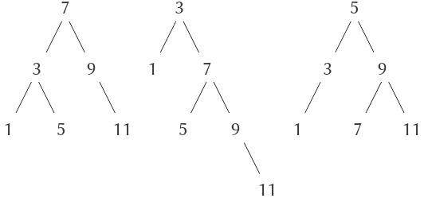
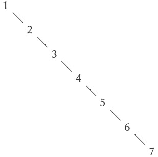
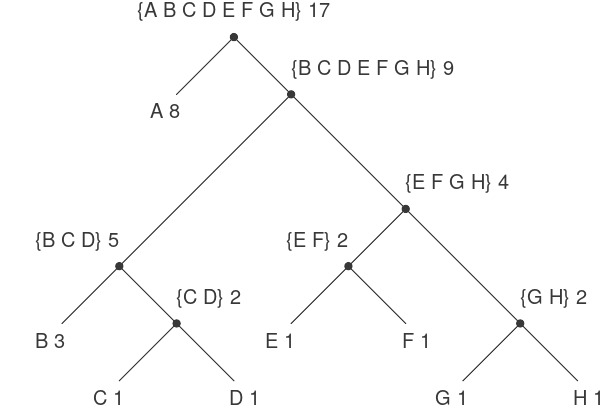

# 2.3 Dữ liệu Symbolic

Tất cả các đối tượng dữ liệu hợp (compound data objects) mà chúng ta đã sử dụng cho đến nay đều được xây dựng cuối cùng từ các số. Trong phần này, chúng ta sẽ mở rộng khả năng biểu diễn của ngôn ngữ bằng cách giới thiệu khả năng làm việc với các symbol tùy ý như dữ liệu.


## 2.3.1 Quotation

Nếu chúng ta có thể tạo dữ liệu hợp bằng cách sử dụng symbol, chúng ta có thể có các list như:

``` {.scheme}
(a b c d)
(23 45 17)
((Norah 12) 
 (Molly 9) 
 (Anna 7) 
 (Lauren 6) 
 (Charlotte 4))
```

Các list chứa symbol có thể trông giống hệt như các expression (biểu thức) của ngôn ngữ:

``` {.scheme}
(* (+ 23 45) (+ x 9))
(define (fact n) 
  (if (= n 1) 
      1 
      (* n (fact (- n 1)))))
```

Để thao tác với symbol, chúng ta cần một yếu tố mới trong ngôn ngữ: khả năng *quote* (trích dẫn) một đối tượng dữ liệu. Giả sử chúng ta muốn tạo list `(a b)`. Chúng ta không thể làm điều này với `(list a b)`, vì expression này tạo một list các *giá trị* của `a` và `b` thay vì chính các symbol đó. Vấn đề này rất quen thuộc trong ngữ cảnh ngôn ngữ tự nhiên, nơi từ và câu có thể được coi là các thực thể ngữ nghĩa hoặc là các chuỗi ký tự (thực thể cú pháp). Thực hành phổ biến trong ngôn ngữ tự nhiên là sử dụng dấu ngoặc kép để chỉ ra rằng một từ hoặc một câu cần được hiểu theo nghĩa đen như một chuỗi ký tự. Ví dụ, chữ cái đầu tiên của “John” rõ ràng là “J.” Nếu chúng ta bảo ai đó “hãy nói to tên của bạn”, chúng ta mong nghe tên của người đó. Tuy nhiên, nếu chúng ta bảo ai đó “hãy nói to ‘tên của bạn’”, chúng ta mong nghe các từ “tên của bạn”. Lưu ý rằng chúng ta buộc phải lồng dấu ngoặc kép để mô tả điều mà ai đó có thể nói.[^1]  

Chúng ta có thể áp dụng cùng cách này để xác định các list và symbol sẽ được xử lý như các đối tượng dữ liệu thay vì các expression cần được đánh giá. Tuy nhiên, định dạng quote của chúng ta khác với ngôn ngữ tự nhiên ở chỗ chúng ta đặt dấu ngoặc đơn (truyền thống là ký hiệu nháy đơn `'`) chỉ ở đầu đối tượng cần quote. Chúng ta có thể làm vậy trong cú pháp Scheme vì chúng ta dựa vào khoảng trắng và dấu ngoặc đơn để phân tách đối tượng. Do đó, ý nghĩa của ký tự nháy đơn là quote đối tượng tiếp theo.[^2]  

Bây giờ chúng ta có thể phân biệt giữa symbol và giá trị của chúng:

``` {.scheme}
(define a 1)
(define b 2)

(list a b)
(1 2)

(list 'a 'b)
(a b)

(list 'a b)
(a 2)
```

Quotation cũng cho phép chúng ta nhập vào các đối tượng hợp, sử dụng dạng biểu diễn in ấn thông thường cho list:[^3]  

``` {.scheme}
(car '(a b c))
a

(cdr '(a b c))
(b c)
```

Theo đó, chúng ta có thể thu được list rỗng bằng cách đánh giá `'()`, và do đó không cần dùng biến `nil`.

Một primitive (nguyên thủy) bổ sung được dùng để thao tác với symbol là `eq?`, nhận hai symbol làm đối số và kiểm tra xem chúng có giống nhau không.[^4] Sử dụng `eq?`, chúng ta có thể cài đặt một procedure hữu ích gọi là `memq`. Procedure này nhận hai đối số, một symbol và một list. Nếu symbol không nằm trong list (tức là không `eq?` với bất kỳ phần tử nào trong list), thì `memq` trả về false. Ngược lại, nó trả về sublist của list bắt đầu từ lần xuất hiện đầu tiên của symbol:

``` {.scheme}
(define (memq item x)
  (cond ((null? x) false)
        ((eq? item (car x)) x)
        (else (memq item (cdr x)))))
```

Ví dụ, giá trị của

``` {.scheme}
(memq 'apple '(pear banana prune))
```

là false, trong khi giá trị của

``` {.scheme}
(memq 'apple '(x (apple sauce) y apple pear))
```

là `(apple pear)`.


[^1]: Việc cho phép quotation trong một ngôn ngữ gây ra nhiều khó khăn cho khả năng lập luận về ngôn ngữ đó theo cách đơn giản, vì nó phá vỡ khái niệm rằng các biểu thức bằng nhau có thể thay thế cho nhau. Ví dụ, ba là một cộng hai, nhưng từ “three” không phải là cụm từ “one plus two”. Quotation mạnh mẽ vì nó cho phép chúng ta xây dựng các expression thao tác với các expression khác (như chúng ta sẽ thấy khi viết một interpreter ở Chương 4). Nhưng việc cho phép các câu lệnh trong một ngôn ngữ nói về các câu lệnh khác trong cùng ngôn ngữ khiến rất khó duy trì nguyên tắc nhất quán về ý nghĩa của “bằng nhau có thể thay thế cho nhau”. Ví dụ, nếu chúng ta biết sao hôm là sao mai, thì từ câu “sao hôm là sao Kim” ta có thể suy ra “sao mai là sao Kim”. Tuy nhiên, nếu biết rằng “John biết sao hôm là sao Kim” thì ta không thể suy ra rằng “John biết sao mai là sao Kim”.

[^2]: Nháy đơn khác với nháy kép mà chúng ta đã dùng để bao quanh các chuỗi ký tự cần in ra. Trong khi nháy đơn có thể được dùng để biểu diễn list hoặc symbol, nháy kép chỉ được dùng với chuỗi ký tự. Trong cuốn sách này, mục đích duy nhất của chuỗi ký tự là làm các mục cần in ra.

[^3]: Nói một cách nghiêm ngặt, việc sử dụng dấu nháy đơn của chúng ta vi phạm quy tắc chung rằng tất cả các expression hợp trong ngôn ngữ phải được bao bởi dấu ngoặc đơn và trông giống như list. Chúng ta có thể khôi phục tính nhất quán này bằng cách giới thiệu một special form `quote`, có cùng mục đích với dấu nháy đơn. Do đó, chúng ta sẽ gõ `(quote a)` thay vì `'a`, và `(quote (a b c))` thay vì `'(a b c)`. Đây chính xác là cách interpreter hoạt động. Dấu nháy đơn chỉ là một ký hiệu viết tắt một ký tự cho việc bao expression tiếp theo bằng `quote` để tạo `(quote ⟨expression⟩)`. Điều này quan trọng vì nó duy trì nguyên tắc rằng bất kỳ expression nào được interpreter nhìn thấy đều có thể được thao tác như một đối tượng dữ liệu. Ví dụ, chúng ta có thể tạo expression `(car '(a b c))`, vốn giống với `(car (quote (a b c)))`, bằng cách đánh giá `(list 'car (list 'quote '(a b c)))`.

[^4]: Chúng ta có thể coi hai symbol là “giống nhau” nếu chúng gồm cùng các ký tự theo cùng thứ tự. Định nghĩa như vậy bỏ qua một vấn đề sâu hơn mà chúng ta chưa sẵn sàng giải quyết: ý nghĩa của “giống nhau” trong một ngôn ngữ lập trình. Chúng ta sẽ quay lại vấn đề này ở Chương 3 (3.1.3).

## 2.3.2 Ví dụ: Symbolic Differentiation (vi phân ký hiệu)

Như một minh họa cho việc thao tác với symbol và cũng là một minh họa bổ sung cho khái niệm data abstraction (trừu tượng hóa dữ liệu), hãy xem xét việc thiết kế một procedure (thủ tục) thực hiện symbolic differentiation của các biểu thức đại số. Chúng ta muốn procedure này nhận vào hai đối số: một biểu thức đại số và một biến, sau đó trả về đạo hàm của biểu thức theo biến đó. Ví dụ, nếu các đối số của procedure là $ax^{2} + bx + c$ và $x$, thì procedure sẽ trả về $2ax + b$. Symbolic differentiation có ý nghĩa lịch sử đặc biệt trong Lisp. Đây là một trong những ví dụ tạo động lực cho việc phát triển một ngôn ngữ máy tính dành cho thao tác symbol. Hơn nữa, nó đánh dấu sự khởi đầu của một hướng nghiên cứu dẫn đến sự ra đời của các hệ thống mạnh mẽ cho công việc toán học ký hiệu, hiện đang được sử dụng bởi ngày càng nhiều nhà toán học ứng dụng và nhà vật lý.

Khi phát triển chương trình symbolic-differentiation, chúng ta sẽ tuân theo cùng chiến lược data abstraction mà chúng ta đã áp dụng khi phát triển hệ thống rational-number (số hữu tỉ) ở mục 2.1.1. Nghĩa là, trước tiên chúng ta sẽ định nghĩa một thuật toán vi phân hoạt động trên các đối tượng trừu tượng như “sums” (tổng), “products” (tích) và “variables” (biến) mà không cần quan tâm đến cách chúng được biểu diễn. Chỉ sau đó chúng ta mới giải quyết vấn đề biểu diễn.


### Chương trình vi phân với dữ liệu trừu tượng

Để giữ mọi thứ đơn giản, chúng ta sẽ xét một chương trình symbolic-differentiation rất đơn giản, xử lý các biểu thức được xây dựng chỉ bằng phép cộng và phép nhân với hai đối số. Việc vi phân bất kỳ biểu thức nào như vậy có thể được thực hiện bằng cách áp dụng các quy tắc rút gọn sau:

$${\frac{dc}{dx}\, = \, 0,}\quad{\text{for~}c\text{~a\ constant~}}\text{or\ a\ variable~}{\text{different\ from~}x,}$$

$$\begin{array}{lll}
\frac{dx}{dx} & = & {1,} \\
\frac{d(u + v)}{dx} & = & {\frac{du}{dx} + \frac{dv}{dx},} \\
\frac{d(uv)}{dx} & = & {u\mspace{2mu}\frac{dv}{dx} + v\mspace{2mu}\frac{du}{dx}.} \\
\end{array}$$

Hãy lưu ý rằng hai quy tắc sau có tính chất đệ quy. Nghĩa là, để tìm đạo hàm của một tổng, trước tiên chúng ta tìm đạo hàm của từng hạng tử rồi cộng chúng lại. Mỗi hạng tử lại có thể là một biểu thức cần được phân tách. Việc phân tách thành các phần nhỏ hơn và nhỏ hơn nữa cuối cùng sẽ tạo ra các phần tử là hằng số hoặc biến, mà đạo hàm của chúng sẽ là 0 hoặc 1.

Để hiện thực các quy tắc này trong một procedure, chúng ta sẽ “nghĩ trước” một chút, giống như khi thiết kế phần cài đặt rational-number. Nếu chúng ta có một cách để biểu diễn các biểu thức đại số, chúng ta cần có khả năng xác định xem một biểu thức là tổng, tích, hằng số hay biến. Chúng ta cần có khả năng trích xuất các phần của một biểu thức. Ví dụ, với một tổng, chúng ta muốn trích ra addend (hạng tử thứ nhất) và augend (hạng tử thứ hai). Chúng ta cũng cần có khả năng xây dựng biểu thức từ các phần. Giả sử rằng chúng ta đã có các procedure để cài đặt các selector (bộ chọn), constructor (bộ tạo) và predicate (hàm kiểm tra) sau:

``` {.example}
(variable? e)          Is e a variable?
(same-variable? v1 v2) Are v1 and v2 the same variable?
(sum? e)               Is e a sum?
(addend e)             Addend of the sum e.
(augend e)             Augend of the sum e.
(make-sum a1 a2)       Construct the sum of a1 and a2.
(product? e)           Is e a product?
(multiplier e)         Multiplier of the product e.
(multiplicand e)       Multiplicand of the product e.
(make-product m1 m2)   Construct the product of m1 and m2.
```

Sử dụng các hàm này, cùng với primitive predicate `number?` (hàm kiểm tra nguyên thủy xác định số), chúng ta có thể biểu diễn các quy tắc vi phân dưới dạng procedure sau:

``` {.scheme}
(define (deriv exp var)
  (cond ((number? exp) 0)
        ((variable? exp)
         (if (same-variable? exp var) 1 0))
        ((sum? exp)
         (make-sum (deriv (addend exp) var)
                   (deriv (augend exp) var)))
        ((product? exp)
         (make-sum
          (make-product 
           (multiplier exp)
           (deriv (multiplicand exp) var))
          (make-product 
           (deriv (multiplier exp) var)
           (multiplicand exp))))
        (else (error "unknown expression 
                      type: DERIV" exp))))
```

Procedure `deriv` này bao hàm toàn bộ thuật toán vi phân. Vì nó được biểu diễn theo dạng dữ liệu trừu tượng, nên nó sẽ hoạt động bất kể chúng ta chọn cách biểu diễn biểu thức đại số như thế nào, miễn là chúng ta thiết kế được một tập hợp selector và constructor phù hợp. Đây chính là vấn đề mà chúng ta sẽ giải quyết tiếp theo.

### Biểu diễn các biểu thức đại số

Chúng ta có thể hình dung nhiều cách sử dụng cấu trúc list để biểu diễn các biểu thức đại số. Ví dụ, chúng ta có thể dùng các list chứa symbol phản ánh ký pháp đại số thông thường, biểu diễn $ax + b$ dưới dạng list `(a * x + b)`. Tuy nhiên, một lựa chọn đặc biệt đơn giản là sử dụng cùng ký pháp prefix có ngoặc đơn mà Lisp dùng cho các combination (tổ hợp); tức là, biểu diễn $ax + b$ dưới dạng `(+ (* a x) b)`. Khi đó, cách biểu diễn dữ liệu cho bài toán vi phân của chúng ta như sau:

- Các variable (biến) là các symbol. Chúng được nhận diện bởi primitive predicate `symbol?`:
    ``` {.scheme}
    (define (variable? x) (symbol? x))
    ```

- Hai variable là giống nhau nếu các symbol biểu diễn chúng là `eq?`:
    ``` {.scheme}
    (define (same-variable? v1 v2)
      (and (variable? v1)
           (variable? v2)
           (eq? v1 v2)))
    ```

- Các sum (tổng) và product (tích) được tạo thành dưới dạng list:
    ``` {.scheme}
    (define (make-sum a1 a2) (list '+ a1 a2))
    (define (make-product m1 m2) (list '* m1 m2))
    ```

- Một sum là một list mà phần tử đầu tiên là symbol `+`:
    ``` {.scheme}
    (define (sum? x)
      (and (pair? x) (eq? (car x) '+)))
    ```

- Addend (hạng tử thứ nhất) là phần tử thứ hai của list sum:
    ``` {.scheme}
    (define (addend s) (cadr s))
    ```

- Augend (hạng tử thứ hai) là phần tử thứ ba của list sum:
    ``` {.scheme}
    (define (augend s) (caddr s))
    ```

- Một product là một list mà phần tử đầu tiên là symbol `*`:
    ``` {.scheme}
    (define (product? x)
      (and (pair? x) (eq? (car x) '*)))
    ```

- Multiplier (thừa số thứ nhất) là phần tử thứ hai của list product:
    ``` {.scheme}
    (define (multiplier p) (cadr p))
    ```

- Multiplicand (thừa số thứ hai) là phần tử thứ ba của list product:
    ``` {.scheme}
    (define (multiplicand p) (caddr p))
    ```

Như vậy, chúng ta chỉ cần kết hợp các phần này với thuật toán được hiện thực trong `deriv` là đã có một chương trình symbolic-differentiation hoạt động. Hãy xem một số ví dụ về cách chương trình hoạt động:

``` {.scheme}
(deriv '(+ x 3) 'x)
(+ 1 0)

(deriv '(* x y) 'x)
(+ (* x 0) (* 1 y))

(deriv '(* (* x y) (+ x 3)) 'x)
(+ (* (* x y) (+ 1 0))
   (* (+ (* x 0) (* 1 y))
      (+  x 3)))
```

Chương trình tạo ra các kết quả đúng; tuy nhiên, chúng chưa được rút gọn. Đúng là 

$$\frac{d(xy)}{dx}\, = \,{x \cdot 0} + {1 \cdot y,}$$

 nhưng chúng ta muốn chương trình biết rằng $x \cdot 0 = 0$, $1 \cdot y = y$, và $0 + y = y$. Kết quả cho ví dụ thứ hai lẽ ra chỉ nên là `y`. Như ví dụ thứ ba cho thấy, điều này trở thành một vấn đề nghiêm trọng khi các biểu thức phức tạp.

Khó khăn này rất giống với vấn đề chúng ta gặp phải trong phần cài đặt rational-number: chúng ta chưa rút gọn kết quả về dạng đơn giản nhất. Để thực hiện việc rút gọn rational-number, chúng ta chỉ cần thay đổi constructor và selector của phần cài đặt. Chúng ta có thể áp dụng chiến lược tương tự ở đây. Chúng ta sẽ không thay đổi `deriv` mà thay đổi `make-sum` để nếu cả hai hạng tử đều là số, `make-sum` sẽ cộng chúng và trả về tổng. Ngoài ra, nếu một trong hai hạng tử là 0, thì `make-sum` sẽ trả về hạng tử còn lại:

``` {.scheme}
(define (make-sum a1 a2)
  (cond ((=number? a1 0) a2)
        ((=number? a2 0) a1)
        ((and (number? a1) (number? a2)) 
         (+ a1 a2))
        (else (list '+ a1 a2))))
```

Điều này sử dụng procedure `=number?`, kiểm tra xem một biểu thức có bằng một số cho trước hay không:

``` {.scheme}
(define (=number? exp num)
  (and (number? exp) (= exp num)))
```

Tương tự, chúng ta sẽ thay đổi `make-product` để xây dựng sẵn các quy tắc: 0 nhân với bất kỳ gì cũng bằng 0 và 1 nhân với bất kỳ gì cũng bằng chính nó:

``` {.scheme}
(define (make-product m1 m2)
  (cond ((or (=number? m1 0) 
             (=number? m2 0)) 
         0)
        ((=number? m1 1) m2)
        ((=number? m2 1) m1)
        ((and (number? m1) (number? m2)) 
         (* m1 m2))
        (else (list '* m1 m2))))
```

Dưới đây là cách phiên bản này hoạt động với ba ví dụ của chúng ta:

``` {.scheme}
(deriv '(+ x 3) 'x)
1

(deriv '(* x y) 'x)
y

(deriv '(* (* x y) (+ x 3)) 'x)
(+ (* x y) (* y (+ x 3)))
```

Mặc dù đây là một cải thiện đáng kể, ví dụ thứ ba cho thấy vẫn còn một chặng đường dài trước khi chúng ta có một chương trình đưa biểu thức về dạng mà chúng ta có thể đồng ý là “đơn giản nhất”. Vấn đề của việc rút gọn đại số là phức tạp vì, ngoài những lý do khác, một dạng có thể là đơn giản nhất cho mục đích này nhưng lại không phải cho mục đích khác.

## 2.3.3 Ví dụ: Representing Sets (biểu diễn tập hợp)

Trong các ví dụ trước, chúng ta đã xây dựng cách biểu diễn cho hai loại compound data objects (đối tượng dữ liệu hợp): rational numbers (số hữu tỉ) và algebraic expressions (biểu thức đại số). Trong một trong các ví dụ đó, chúng ta có thể lựa chọn việc đơn giản hóa (rút gọn) các biểu thức tại thời điểm construction (xây dựng) hoặc selection (lựa chọn), nhưng ngoài điều đó ra thì việc chọn cách biểu diễn các cấu trúc này bằng list là khá trực tiếp. Khi chuyển sang việc biểu diễn set (tập hợp), lựa chọn cách biểu diễn không còn rõ ràng như vậy. Thật vậy, có nhiều cách biểu diễn khả thi, và chúng khác nhau đáng kể ở một số khía cạnh.

Một cách không chính thức, set đơn giản là một tập hợp các đối tượng phân biệt. Để đưa ra một định nghĩa chính xác hơn, chúng ta có thể áp dụng phương pháp data abstraction (trừu tượng hóa dữ liệu). Nghĩa là, chúng ta định nghĩa “set” bằng cách chỉ rõ các phép toán sẽ được sử dụng trên set. Các phép toán này là `union-set`, `intersection-set`, `element-of-set?`, và `adjoin-set`. `Element-of-set?` là một predicate (hàm kiểm tra) xác định xem một phần tử cho trước có phải là thành viên của set hay không. `Adjoin-set` nhận một đối tượng và một set làm đối số, trả về một set chứa tất cả các phần tử của set ban đầu và thêm cả phần tử mới. `Union-set` tính hợp của hai set, tức là set chứa tất cả các phần tử xuất hiện trong ít nhất một trong hai đối số. `Intersection-set` tính giao của hai set, tức là set chỉ chứa các phần tử xuất hiện trong cả hai đối số. Từ góc độ data abstraction, chúng ta được tự do thiết kế bất kỳ cách biểu diễn nào hiện thực các phép toán này theo cách nhất quán với các diễn giải ở trên.[^5]  


### Sets dưới dạng unordered lists (danh sách không có thứ tự)

Một cách để biểu diễn set là dưới dạng list các phần tử của nó, trong đó không có phần tử nào xuất hiện quá một lần. Set rỗng được biểu diễn bằng list rỗng. Trong cách biểu diễn này, `element-of-set?` tương tự như procedure `memq` ở mục 2.3.1. Nó sử dụng `equal?` thay vì `eq?` để các phần tử của set không nhất thiết phải là symbol:

``` {.scheme}
(define (element-of-set? x set)
  (cond ((null? set) false)
        ((equal? x (car set)) true)
        (else (element-of-set? x (cdr set)))))
```

Sử dụng điều này, chúng ta có thể viết `adjoin-set`. Nếu đối tượng cần thêm đã có trong set, chúng ta chỉ cần trả về set. Ngược lại, chúng ta dùng `cons` để thêm đối tượng vào list biểu diễn set:

``` {.scheme}
(define (adjoin-set x set)
  (if (element-of-set? x set)
      set
      (cons x set)))
```

Với `intersection-set`, chúng ta có thể dùng chiến lược đệ quy. Nếu chúng ta biết cách tạo giao của `set2` và `cdr` của `set1`, thì chỉ cần quyết định có đưa `car` của `set1` vào hay không. Điều này phụ thuộc vào việc `(car set1)` có nằm trong `set2` hay không. Dưới đây là procedure thu được:

``` {.scheme}
(define (intersection-set set1 set2)
  (cond ((or (null? set1) (null? set2)) 
         '())
        ((element-of-set? (car set1) set2)
         (cons (car set1)
               (intersection-set (cdr set1) 
                                 set2)))
        (else (intersection-set (cdr set1) 
                                set2))))
```

Khi thiết kế một cách biểu diễn, một trong những vấn đề chúng ta cần quan tâm là hiệu năng. Hãy xét số bước cần thiết cho các phép toán trên set. Vì tất cả chúng đều sử dụng `element-of-set?`, tốc độ của phép toán này có ảnh hưởng lớn đến hiệu năng của toàn bộ phần cài đặt set. Để kiểm tra xem một đối tượng có phải là phần tử của set hay không, `element-of-set?` có thể phải duyệt toàn bộ set. (Trong trường hợp xấu nhất, đối tượng đó không nằm trong set.) Do đó, nếu set có $n$ phần tử, `element-of-set?` có thể mất tới $n$ bước. Như vậy, số bước cần thiết tăng theo $\Theta(n)$. Số bước cần cho `adjoin-set`, vốn sử dụng phép toán này, cũng tăng theo $\Theta(n)`. Với `intersection-set`, vốn thực hiện kiểm tra `element-of-set?` cho mỗi phần tử của `set1`, số bước cần thiết tăng theo tích của kích thước các set liên quan, tức là $\Theta(n^{2})$ cho hai set có kích thước $n$. Điều tương tự cũng đúng với `union-set`.


[^5]: Nếu muốn chính thức hơn, chúng ta có thể quy định “nhất quán với các diễn giải ở trên” nghĩa là các phép toán phải thỏa mãn một tập hợp các quy tắc như sau:

### Sets dưới dạng ordered lists (danh sách có thứ tự)

Một cách để tăng tốc các phép toán trên set là thay đổi cách biểu diễn sao cho các phần tử của set được liệt kê theo thứ tự tăng dần. Để làm điều này, chúng ta cần một cách so sánh hai đối tượng để xác định đối tượng nào lớn hơn. Ví dụ, chúng ta có thể so sánh các symbol theo thứ tự từ điển (lexicographically), hoặc thống nhất một phương pháp gán một số duy nhất cho mỗi đối tượng rồi so sánh các phần tử bằng cách so sánh các số tương ứng. Để đơn giản hóa phần thảo luận, chúng ta sẽ chỉ xét trường hợp các phần tử của set là số, để có thể so sánh chúng bằng `>` và `<`. Chúng ta sẽ biểu diễn một set các số bằng cách liệt kê các phần tử của nó theo thứ tự tăng dần. Trong khi cách biểu diễn đầu tiên ở trên cho phép chúng ta biểu diễn set $\{ 1,3,6,10\}$ bằng cách liệt kê các phần tử theo bất kỳ thứ tự nào, thì cách biểu diễn mới chỉ cho phép list `(1 3 6 10)`.

Một lợi thế của việc sắp xếp thể hiện rõ trong `element-of-set?`: Khi kiểm tra sự có mặt của một phần tử, chúng ta không còn phải duyệt toàn bộ set. Nếu gặp một phần tử trong set lớn hơn phần tử cần tìm, chúng ta biết ngay rằng phần tử đó không nằm trong set:

``` {.scheme}
(define (element-of-set? x set)
  (cond ((null? set) false)
        ((= x (car set)) true)
        ((< x (car set)) false)
        (else (element-of-set? x (cdr set)))))
```

Điều này tiết kiệm bao nhiêu bước? Trong trường hợp xấu nhất, phần tử cần tìm có thể là phần tử lớn nhất trong set, nên số bước vẫn giống như với cách biểu diễn không có thứ tự. Mặt khác, nếu chúng ta tìm kiếm các phần tử có nhiều giá trị khác nhau, đôi khi chúng ta có thể dừng tìm kiếm ở gần đầu list, và những lần khác vẫn cần duyệt hầu hết list. Trung bình, chúng ta sẽ phải duyệt khoảng một nửa số phần tử trong set. Do đó, số bước trung bình cần thiết sẽ vào khoảng $n/2$. Đây vẫn là tăng trưởng $\Theta(n)$, nhưng trung bình tiết kiệm được hệ số 2 về số bước so với cài đặt trước.

Chúng ta đạt được mức tăng tốc ấn tượng hơn với `intersection-set`. Trong cách biểu diễn không có thứ tự, phép toán này cần $\Theta(n^{2})$ bước, vì chúng ta phải duyệt toàn bộ `set2` cho mỗi phần tử của `set1`. Nhưng với cách biểu diễn có thứ tự, chúng ta có thể dùng một phương pháp khéo léo hơn. Bắt đầu bằng cách so sánh các phần tử đầu tiên, `x1` và `x2`, của hai set. Nếu `x1` bằng `x2`, thì đó là một phần tử của giao, và phần còn lại của giao là giao của các `cdr` của hai set. Tuy nhiên, giả sử `x1` nhỏ hơn `x2`. Vì `x2` là phần tử nhỏ nhất trong `set2`, chúng ta có thể kết luận ngay rằng `x1` không thể xuất hiện ở bất kỳ đâu trong `set2` và do đó không nằm trong giao. Vì vậy, giao bằng giao của `set2` với `cdr` của `set1`. Tương tự, nếu `x2` nhỏ hơn `x1`, thì giao bằng giao của `set1` với `cdr` của `set2`. Dưới đây là procedure:

``` {.scheme}
(define (intersection-set set1 set2)
  (if (or (null? set1) (null? set2))
      '()
      (let ((x1 (car set1)) (x2 (car set2)))
        (cond ((= x1 x2)
               (cons x1 (intersection-set 
                         (cdr set1)
                         (cdr set2))))
              ((< x1 x2) (intersection-set 
                          (cdr set1) 
                          set2))
              ((< x2 x1) (intersection-set 
                          set1 
                          (cdr set2)))))))
```

Để ước lượng số bước cần thiết cho quá trình này, hãy lưu ý rằng ở mỗi bước chúng ta giảm bài toán giao xuống việc tính giao của các set nhỏ hơn — loại bỏ phần tử đầu tiên của `set1` hoặc `set2` hoặc cả hai. Do đó, số bước cần thiết nhiều nhất là tổng kích thước của `set1` và `set2`, thay vì tích kích thước như với cách biểu diễn không có thứ tự. Đây là tăng trưởng $\Theta(n)$ thay vì $\Theta(n^{2})$ — một mức tăng tốc đáng kể, ngay cả với các set có kích thước vừa phải.


### Sets dưới dạng binary trees (cây nhị phân)

Chúng ta có thể làm tốt hơn cách biểu diễn ordered-list bằng cách sắp xếp các phần tử của set dưới dạng cây. Mỗi node của cây chứa một phần tử của set, gọi là “entry” tại node đó, và một liên kết tới mỗi trong hai node khác (có thể rỗng). Liên kết “left” trỏ tới các phần tử nhỏ hơn phần tử tại node, và liên kết “right” trỏ tới các phần tử lớn hơn phần tử tại node. Hình 2.16 cho thấy một số cây biểu diễn set $\{ 1,3,5,7,9,11\}$. Cùng một set có thể được biểu diễn bằng nhiều dạng cây khác nhau. Điều kiện duy nhất để có một biểu diễn hợp lệ là tất cả các phần tử trong left subtree phải nhỏ hơn entry của node và tất cả các phần tử trong right subtree phải lớn hơn.



**Figure 2.16:** Various binary trees that represent the set $\{ 1,3,5,7,9,11\}$.

Ưu điểm của cách biểu diễn dạng cây là: Giả sử chúng ta muốn kiểm tra xem một số $x$ có nằm trong set hay không. Chúng ta bắt đầu bằng cách so sánh $x$ với entry ở node gốc. Nếu $x$ nhỏ hơn giá trị này, chúng ta chỉ cần tìm trong left subtree; nếu $x$ lớn hơn, chúng ta chỉ cần tìm trong right subtree. Giờ đây, nếu cây “balanced” (cân bằng), mỗi subtree sẽ có kích thước xấp xỉ một nửa cây ban đầu. Như vậy, chỉ trong một bước, chúng ta đã giảm bài toán tìm kiếm trong cây kích thước $n$ xuống tìm kiếm trong cây kích thước $n/2$. Vì kích thước cây giảm một nửa ở mỗi bước, chúng ta có thể kỳ vọng số bước cần để tìm kiếm trong cây kích thước $n$ tăng theo $\Theta(\log n)$[^6]. Với các set lớn, đây sẽ là một mức tăng tốc đáng kể so với các cách biểu diễn trước.

Chúng ta có thể biểu diễn cây bằng cách sử dụng list. Mỗi node sẽ là một list gồm ba phần tử: entry tại node, left subtree, và right subtree. Một left hoặc right subtree là list rỗng sẽ biểu thị rằng không có subtree nào được nối ở đó. Chúng ta có thể mô tả cách biểu diễn này bằng các procedure sau[^7]:  


[^6]: Việc giảm một nửa kích thước bài toán ở mỗi bước là đặc điểm nổi bật của tăng trưởng logarithmic, như chúng ta đã thấy với thuật toán fast-exponentiation ở mục 1.2.4 và phương pháp half-interval search ở mục 1.3.3.

[^7]: Chúng ta đang biểu diễn set dưới dạng cây, và cây dưới dạng list — thực chất là một data abstraction xây dựng trên một data abstraction khác. Chúng ta có thể coi các procedure `entry`, `left-branch`, `right-branch`, và `make-tree` như một cách để tách biệt abstraction của một “binary tree” khỏi cách cụ thể mà chúng ta muốn biểu diễn cây đó bằng cấu trúc list.

``` {.scheme}
(define (entry tree) (car tree))
(define (left-branch tree) (cadr tree))
(define (right-branch tree) (caddr tree))
(define (make-tree entry left right)
  (list entry left right))
```

Bây giờ chúng ta có thể viết procedure (thủ tục) `element-of-set?` sử dụng chiến lược đã mô tả ở trên:

``` {.scheme}
(define (element-of-set? x set)
  (cond ((null? set) false)
        ((= x (entry set)) true)
        ((< x (entry set))
         (element-of-set? 
          x 
          (left-branch set)))
        ((> x (entry set))
         (element-of-set? 
          x 
          (right-branch set)))))
```

Việc thêm (adjoin) một phần tử vào set được cài đặt tương tự và cũng yêu cầu $\Theta(\log n)$ bước. Để adjoin một phần tử `x`, chúng ta so sánh `x` với entry của node để xác định xem `x` nên được thêm vào nhánh phải hay nhánh trái, và sau khi adjoin `x` vào nhánh thích hợp, chúng ta ghép nhánh mới này với entry gốc và nhánh còn lại. Nếu `x` bằng với entry, chúng ta chỉ cần trả về node. Nếu được yêu cầu adjoin `x` vào một cây rỗng, chúng ta tạo ra một cây có `x` là entry và cả hai nhánh trái và phải đều rỗng. Dưới đây là procedure:

``` {.scheme}
(define (adjoin-set x set)
  (cond ((null? set) (make-tree x '() '()))
        ((= x (entry set)) set)
        ((< x (entry set))
         (make-tree 
          (entry set)
          (adjoin-set x (left-branch set))
          (right-branch set)))
        ((> x (entry set))
         (make-tree
          (entry set)
          (left-branch set)
          (adjoin-set x (right-branch set))))))
```

Khẳng định ở trên rằng việc tìm kiếm trong cây có thể được thực hiện với số bước tăng trưởng logarithmic dựa trên giả định rằng cây là “balanced” (cân bằng), tức là nhánh trái và nhánh phải của mỗi cây có số phần tử xấp xỉ bằng nhau, sao cho mỗi nhánh chứa khoảng một nửa số phần tử của node cha. Nhưng làm sao chúng ta chắc chắn rằng các cây được tạo ra sẽ cân bằng? Ngay cả khi bắt đầu với một cây cân bằng, việc thêm phần tử bằng `adjoin-set` có thể tạo ra kết quả mất cân bằng. Vì vị trí của phần tử mới thêm phụ thuộc vào cách nó so sánh với các phần tử đã có trong set, chúng ta có thể kỳ vọng rằng nếu thêm các phần tử một cách “ngẫu nhiên” thì trung bình cây sẽ có xu hướng cân bằng. Nhưng điều này không được đảm bảo. Ví dụ, nếu bắt đầu với một set rỗng và adjoin các số từ 1 đến 7 theo thứ tự, chúng ta sẽ thu được một cây mất cân bằng nghiêm trọng như trong Hình 2.17. Trong cây này, tất cả các nhánh trái đều rỗng, nên nó không có lợi thế gì so với một ordered list đơn giản. Một cách để giải quyết vấn đề này là định nghĩa một phép biến đổi từ một cây bất kỳ thành một cây cân bằng có cùng các phần tử. Sau đó, chúng ta có thể thực hiện phép biến đổi này sau mỗi vài thao tác `adjoin-set` để giữ cho set cân bằng. Cũng có những cách khác để giải quyết vấn đề này, hầu hết liên quan đến việc thiết kế các cấu trúc dữ liệu mới cho phép cả tìm kiếm và chèn đều được thực hiện trong $\Theta(\log n)$ bước.[^8]  



**Figure 2.17:** Unbalanced tree produced by adjoining 1 through 7 in sequence.

### Sets và information retrieval (truy xuất thông tin)

Chúng ta đã xem xét các lựa chọn sử dụng list để biểu diễn set và thấy rằng việc lựa chọn cách biểu diễn cho một data object (đối tượng dữ liệu) có thể ảnh hưởng lớn đến hiệu năng của các chương trình sử dụng dữ liệu đó. Một lý do khác để tập trung vào set là các kỹ thuật được thảo luận ở đây xuất hiện lặp đi lặp lại trong các ứng dụng liên quan đến information retrieval.

Hãy xét một data base (cơ sở dữ liệu) chứa một số lượng lớn các record (bản ghi) riêng lẻ, chẳng hạn như hồ sơ nhân sự của một công ty hoặc các giao dịch trong một hệ thống kế toán. Một hệ thống quản lý dữ liệu điển hình dành nhiều thời gian để truy cập hoặc sửa đổi dữ liệu trong các record và do đó yêu cầu một phương pháp hiệu quả để truy cập record. Điều này được thực hiện bằng cách xác định một phần của mỗi record để làm *key* (khóa) nhận dạng. Một key có thể là bất kỳ thứ gì xác định duy nhất record đó. Đối với hồ sơ nhân sự, nó có thể là số ID của nhân viên. Đối với hệ thống kế toán, nó có thể là số giao dịch. Dù key là gì, khi định nghĩa record như một cấu trúc dữ liệu, chúng ta nên bao gồm một procedure selector `key` để lấy key gắn với record đã cho.

Bây giờ chúng ta biểu diễn data base như một set các record. Để tìm record có key cho trước, chúng ta sử dụng procedure `lookup`, nhận vào một key và một data base, và trả về record có key đó, hoặc false nếu không có record nào như vậy. `Lookup` được cài đặt gần giống hệt như `element-of-set?`. Ví dụ, nếu set các record được cài đặt như một unordered list, chúng ta có thể dùng:

``` {.scheme}
(define (lookup given-key set-of-records)
  (cond ((null? set-of-records) false)
        ((equal? given-key 
                 (key (car set-of-records)))
         (car set-of-records))
        (else 
         (lookup given-key 
                 (cdr set-of-records)))))
```

Tất nhiên, có những cách tốt hơn để biểu diễn các set lớn thay vì dùng unordered list. Các hệ thống information-retrieval, trong đó các record cần được “truy cập ngẫu nhiên”, thường được cài đặt bằng phương pháp dựa trên cây, chẳng hạn như cách biểu diễn binary-tree đã thảo luận trước đó. Khi thiết kế một hệ thống như vậy, phương pháp luận của data abstraction có thể giúp ích rất nhiều. Nhà thiết kế có thể tạo một bản cài đặt ban đầu sử dụng cách biểu diễn đơn giản, trực tiếp như unordered list. Điều này sẽ không phù hợp cho hệ thống cuối cùng, nhưng có thể hữu ích để tạo ra một data base “nhanh và đơn giản” nhằm kiểm thử các phần còn lại của hệ thống. Sau đó, cách biểu diễn dữ liệu có thể được thay đổi để tinh vi hơn. Nếu data base được truy cập thông qua các selector và constructor trừu tượng, thì việc thay đổi cách biểu diễn này sẽ không đòi hỏi bất kỳ thay đổi nào đối với các phần còn lại của hệ thống.


[^8]: Ví dụ về các cấu trúc như vậy bao gồm *B-trees* và *red-black trees*. Có một lượng lớn tài liệu về cấu trúc dữ liệu dành riêng cho vấn đề này. Xem Cormen et al. 1990.

## 2.3.4 Ví dụ: Huffman Encoding Trees (cây mã hóa Huffman)

Phần này cung cấp bài tập thực hành về việc sử dụng cấu trúc list và data abstraction (trừu tượng hóa dữ liệu) để thao tác với set và tree. Ứng dụng ở đây là các phương pháp biểu diễn dữ liệu dưới dạng chuỗi các số 0 và 1 (bit). Ví dụ, mã chuẩn ASCII được dùng để biểu diễn văn bản trong máy tính mã hóa mỗi ký tự thành một chuỗi gồm bảy bit. Việc dùng bảy bit cho phép chúng ta phân biệt $2^{7}$, tức 128 ký tự khác nhau có thể có. Nói chung, nếu muốn phân biệt $n$ symbol khác nhau, chúng ta sẽ cần dùng $\log_{2}n$ bit cho mỗi symbol. Nếu tất cả thông điệp của chúng ta chỉ gồm tám symbol A, B, C, D, E, F, G và H, ta có thể chọn một mã với ba bit cho mỗi ký tự, ví dụ:

``` {.example}
A 000  C 010  E 100  G 110
B 001  D 011  F 101  H 111
```

Với mã này, thông điệp

``` {.example}
BACADAEAFABBAAAGAH
```

được mã hóa thành chuỗi 54 bit:

``` {.example}
001000010000011000100000101
000001001000000000110000111
```

Các mã như ASCII và mã từ A đến H ở trên được gọi là *fixed-length* codes (mã độ dài cố định), vì chúng biểu diễn mỗi symbol trong thông điệp bằng cùng một số bit. Đôi khi, việc sử dụng *variable-length* codes (mã độ dài thay đổi) lại có lợi, trong đó các symbol khác nhau có thể được biểu diễn bằng số bit khác nhau. Ví dụ, mã Morse không dùng cùng số lượng dấu chấm và dấu gạch cho mỗi chữ cái trong bảng chữ cái. Đặc biệt, chữ E — chữ cái xuất hiện nhiều nhất — được biểu diễn chỉ bằng một dấu chấm. Nói chung, nếu thông điệp của chúng ta có một số symbol xuất hiện rất thường xuyên và một số rất hiếm, ta có thể mã hóa dữ liệu hiệu quả hơn (tức là dùng ít bit hơn cho mỗi thông điệp) nếu gán mã ngắn hơn cho các symbol xuất hiện thường xuyên. Xét mã thay thế sau cho các chữ cái từ A đến H:

``` {.example}
A 0    C 1010  E 1100  G 1110
B 100  D 1011  F 1101  H 1111
```

Với mã này, cùng thông điệp ở trên được mã hóa thành chuỗi:

``` {.example}
100010100101101100011
010100100000111001111
```

Chuỗi này chứa 42 bit, do đó tiết kiệm hơn 20% dung lượng so với mã độ dài cố định ở trên.

Một trong những khó khăn khi dùng mã độ dài thay đổi là biết được khi nào đã đến cuối của một symbol khi đọc một chuỗi các số 0 và 1. Mã Morse giải quyết vấn đề này bằng cách sử dụng một *separator code* (mã phân tách) đặc biệt (trong trường hợp này là một khoảng dừng) sau chuỗi dấu chấm và dấu gạch của mỗi chữ cái. Một giải pháp khác là thiết kế mã sao cho không có mã hoàn chỉnh nào của một symbol lại là phần đầu (hay *prefix*) của mã cho một symbol khác. Mã như vậy được gọi là *prefix code*. Trong ví dụ trên, A được mã hóa bằng 0 và B được mã hóa bằng 100, nên không symbol nào khác có mã bắt đầu bằng 0 hoặc bằng 100.

Nói chung, chúng ta có thể đạt được mức tiết kiệm đáng kể nếu sử dụng variable-length prefix codes tận dụng tần suất tương đối của các symbol trong thông điệp cần mã hóa. Một phương pháp cụ thể để làm điều này được gọi là Huffman encoding method (phương pháp mã hóa Huffman), đặt theo tên người phát hiện ra nó, David Huffman. Một mã Huffman có thể được biểu diễn dưới dạng binary tree (cây nhị phân) mà các lá là các symbol được mã hóa. Tại mỗi node không phải lá của cây có một set chứa tất cả các symbol ở các lá nằm dưới node đó. Ngoài ra, mỗi symbol ở lá được gán một trọng số (weight) — chính là tần suất tương đối của nó — và mỗi node không phải lá chứa một trọng số là tổng tất cả các trọng số của các lá nằm dưới nó. Các trọng số này không được dùng trong quá trình mã hóa hay giải mã. Chúng ta sẽ thấy bên dưới cách chúng được dùng để hỗ trợ xây dựng cây.

Hình 2.18 cho thấy cây Huffman cho mã từ A đến H đã cho ở trên. Các trọng số ở các lá cho thấy cây được thiết kế cho thông điệp trong đó A xuất hiện với tần suất tương đối 8, B với tần suất 3, và các chữ cái khác mỗi chữ có tần suất 1.



**Figure 2.18:** A Huffman encoding tree.

Với một cây Huffman, chúng ta có thể tìm mã của bất kỳ symbol nào bằng cách bắt đầu từ gốc và đi xuống cho đến khi đến lá chứa symbol đó. Mỗi lần đi xuống nhánh trái, ta thêm một số 0 vào mã; mỗi lần đi xuống nhánh phải, ta thêm một số 1. (Chúng ta quyết định đi theo nhánh nào bằng cách kiểm tra xem nhánh đó có phải là node lá chứa symbol hay chứa symbol trong set của nó hay không.) Ví dụ, bắt đầu từ gốc của cây trong Hình 2.18, ta đến lá D bằng cách đi nhánh phải, rồi nhánh trái, rồi nhánh phải, rồi nhánh phải; do đó, mã cho D là 1011.

Để giải mã một chuỗi bit bằng cây Huffman, ta bắt đầu từ gốc và dùng các số 0 và 1 liên tiếp trong chuỗi bit để quyết định đi xuống nhánh trái hay nhánh phải. Mỗi khi đến một lá, ta đã tạo ra một symbol mới trong thông điệp, và tại thời điểm đó ta bắt đầu lại từ gốc của cây để tìm symbol tiếp theo. Ví dụ, giả sử ta có cây ở trên và chuỗi 10001010. Bắt đầu từ gốc, ta đi xuống nhánh phải (vì bit đầu tiên của chuỗi là 1), rồi xuống nhánh trái (vì bit thứ hai là 0), rồi xuống nhánh trái (vì bit thứ ba cũng là 0). Điều này đưa ta đến lá B, nên symbol đầu tiên của thông điệp giải mã là B. Giờ ta bắt đầu lại từ gốc, và đi sang trái vì bit tiếp theo trong chuỗi là 0. Điều này đưa ta đến lá A. Sau đó, ta lại bắt đầu từ gốc với phần còn lại của chuỗi 1010, nên ta đi phải, trái, phải, trái và đến C. Do đó, toàn bộ thông điệp là BAC.

### Tạo Huffman trees

Với một “alphabet” (bảng chữ cái) gồm các symbol và tần suất tương đối của chúng, làm thế nào để chúng ta xây dựng được mã “tốt nhất”? (Nói cách khác, cây nào sẽ mã hóa thông điệp với số bit ít nhất?) Huffman đã đưa ra một thuật toán để làm điều này và chứng minh rằng mã thu được thực sự là mã độ dài thay đổi tốt nhất cho các thông điệp mà tần suất tương đối của các symbol khớp với tần suất được dùng để xây dựng mã. Chúng ta sẽ không chứng minh tính tối ưu của mã Huffman ở đây, nhưng sẽ trình bày cách xây dựng Huffman trees.[^9]  

Thuật toán tạo Huffman tree rất đơn giản. Ý tưởng là sắp xếp cây sao cho các symbol có tần suất thấp nhất nằm xa gốc nhất. Bắt đầu với tập các node lá, chứa các symbol và tần suất của chúng, như được xác định bởi dữ liệu ban đầu từ đó mã sẽ được xây dựng. Sau đó, tìm hai lá có trọng số (weight) nhỏ nhất và gộp chúng lại để tạo ra một node có hai node này làm nhánh trái và nhánh phải. Trọng số của node mới là tổng của hai trọng số đó. Loại bỏ hai lá này khỏi tập ban đầu và thay thế chúng bằng node mới này. Tiếp tục quá trình này: ở mỗi bước, gộp hai node có trọng số nhỏ nhất, loại bỏ chúng khỏi tập và thay thế bằng một node có hai node này làm nhánh trái và nhánh phải. Quá trình dừng lại khi chỉ còn một node, đó là gốc của toàn bộ cây. Dưới đây là cách Huffman tree trong Hình 2.18 được tạo ra:

``` {.example}
Initial {(A 8) (B 3) (C 1) (D 1) 
leaves   (E 1) (F 1) (G 1) (H 1)}

Merge   {(A 8) (B 3) ({C D} 2) 
         (E 1) (F 1) (G 1) (H 1)}

Merge   {(A 8) (B 3) ({C D} 2) 
         ({E F} 2) (G 1) (H 1)}

Merge   {(A 8) (B 3) ({C D} 2) 
         ({E F} 2) ({G H} 2)}

Merge   {(A 8) (B 3) ({C D} 2) 
         ({E F G H} 4)}

Merge   {(A 8) ({B C D} 5) 
         ({E F G H} 4)}

Merge   {(A 8) ({B C D E F G H} 9)}

Final   {({A B C D E F G H} 17)}
merge    
```

Thuật toán này không phải lúc nào cũng xác định duy nhất một cây, vì có thể không tồn tại các node có trọng số nhỏ nhất duy nhất ở mỗi bước. Ngoài ra, việc chọn thứ tự gộp hai node (tức là node nào sẽ là nhánh phải và node nào sẽ là nhánh trái) là tùy ý.


### Biểu diễn Huffman trees

Trong các bài tập dưới đây, chúng ta sẽ làm việc với một hệ thống sử dụng Huffman trees để mã hóa và giải mã thông điệp, đồng thời tạo Huffman trees theo thuật toán đã nêu ở trên. Chúng ta sẽ bắt đầu bằng cách thảo luận cách biểu diễn cây.

Các lá của cây được biểu diễn bằng một list gồm symbol `leaf`, symbol tại lá, và trọng số:

``` {.scheme}
(define (make-leaf symbol weight)
  (list 'leaf symbol weight))
(define (leaf? object)
  (eq? (car object) 'leaf))
(define (symbol-leaf x) (cadr x))
(define (weight-leaf x) (caddr x))
```

Một cây tổng quát sẽ là một list gồm nhánh trái, nhánh phải, một set các symbol, và một trọng số. Set các symbol sẽ chỉ đơn giản là một list các symbol, thay vì một cách biểu diễn set phức tạp hơn. Khi chúng ta tạo một cây bằng cách gộp hai node, chúng ta thu được trọng số của cây bằng tổng trọng số của các node, và set các symbol bằng hợp của các set symbol của các node. Vì các set symbol của chúng ta được biểu diễn dưới dạng list, chúng ta có thể tạo hợp bằng cách sử dụng procedure `append` đã định nghĩa ở mục 2.2.1:

``` {.scheme}
(define (make-code-tree left right)
  (list left
        right
        (append (symbols left) 
                (symbols right))
        (+ (weight left) (weight right))))
```

Nếu chúng ta tạo cây theo cách này, chúng ta có các selector sau:

``` {.scheme}
(define (left-branch tree) (car tree))
(define (right-branch tree) (cadr tree))

(define (symbols tree)
  (if (leaf? tree)
      (list (symbol-leaf tree))
      (caddr tree)))

(define (weight tree)
  (if (leaf? tree)
      (weight-leaf tree)
      (cadddr tree)))
```

Các procedure `symbols` và `weight` phải thực hiện hơi khác nhau tùy thuộc vào việc chúng được gọi với một lá hay một cây tổng quát. Đây là những ví dụ đơn giản về *generic procedures* (các procedure có thể xử lý nhiều hơn một loại dữ liệu), mà chúng ta sẽ bàn nhiều hơn ở các mục 2.4 và 2.5.


[^9]: Xem Hamming 1980 để biết thảo luận về các tính chất toán học của mã Huffman.

### Thủ tục giải mã (decoding procedure)

Procedure (thủ tục) sau đây hiện thực thuật toán giải mã. Nó nhận vào hai đối số: một list các số 0 và 1, cùng với một Huffman tree.

``` {.scheme}
(define (decode bits tree)
  (define (decode-1 bits current-branch)
    (if (null? bits)
        '()
        (let ((next-branch
               (choose-branch 
                (car bits) 
                current-branch)))
          (if (leaf? next-branch)
              (cons 
               (symbol-leaf next-branch)
               (decode-1 (cdr bits) tree))
              (decode-1 (cdr bits) 
                        next-branch)))))
  (decode-1 bits tree))

(define (choose-branch bit branch)
  (cond ((= bit 0) (left-branch branch))
        ((= bit 1) (right-branch branch))
        (else (error "bad bit: 
               CHOOSE-BRANCH" bit))))
```

Procedure `decode-1` nhận hai đối số: list các bit còn lại và vị trí hiện tại trong cây. Nó liên tục di chuyển “xuống” cây, chọn nhánh trái hoặc nhánh phải tùy theo bit tiếp theo trong list là 0 hay 1. (Điều này được thực hiện bằng procedure `choose-branch`.) Khi đến một lá, nó trả về symbol tại lá đó như là symbol tiếp theo trong thông điệp bằng cách `cons` nó vào kết quả của việc giải mã phần còn lại của thông điệp, bắt đầu lại từ gốc của cây. Lưu ý phần kiểm tra lỗi trong mệnh đề cuối của `choose-branch`, phần này sẽ báo lỗi nếu procedure gặp một giá trị khác 0 hoặc 1 trong dữ liệu đầu vào.


### Các tập hợp phần tử có trọng số (sets of weighted elements)

Trong cách biểu diễn cây của chúng ta, mỗi node không phải lá chứa một set các symbol, được biểu diễn đơn giản dưới dạng list. Tuy nhiên, thuật toán tạo cây đã thảo luận ở trên yêu cầu chúng ta cũng phải làm việc với các set của lá và cây, liên tục gộp hai phần tử nhỏ nhất. Vì chúng ta sẽ cần tìm phần tử nhỏ nhất trong set nhiều lần, nên thuận tiện hơn nếu sử dụng cách biểu diễn có thứ tự cho loại set này.

Chúng ta sẽ biểu diễn một set các lá và cây dưới dạng một list các phần tử, được sắp xếp theo thứ tự tăng dần của trọng số. Procedure `adjoin-set` sau đây để xây dựng set tương tự như mô tả trong Bài tập 2.61; tuy nhiên, các phần tử được so sánh theo trọng số của chúng, và phần tử được thêm vào set sẽ không bao giờ là phần tử đã có trong đó.

``` {.scheme}
(define (adjoin-set x set)
  (cond ((null? set) (list x))
        ((< (weight x) (weight (car set))) 
         (cons x set))
        (else 
         (cons (car set)
               (adjoin-set x (cdr set))))))
```

Procedure sau đây nhận vào một list các cặp symbol–tần suất, chẳng hạn như `((A 4) (B 2) (C 1) (D 1))`, và tạo ra một set ban đầu có thứ tự gồm các lá, sẵn sàng để được gộp theo thuật toán Huffman:

``` {.scheme}
(define (make-leaf-set pairs)
  (if (null? pairs)
      '()
      (let ((pair (car pairs)))
        (adjoin-set 
         (make-leaf (car pair)    ; symbol
                    (cadr pair))  ; frequency
         (make-leaf-set (cdr pairs))))))
```