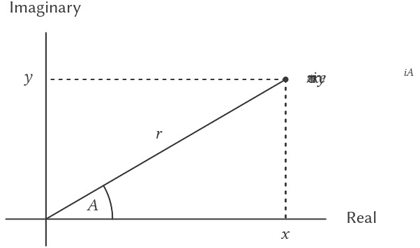

# 2.4 Nhiều cách biểu diễn cho Abstract Data (dữ liệu trừu tượng)

Chúng ta đã giới thiệu *data abstraction* (trừu tượng hóa dữ liệu), một phương pháp luận để cấu trúc hệ thống sao cho phần lớn chương trình có thể được đặc tả độc lập với các lựa chọn liên quan đến việc hiện thực các *data object* (đối tượng dữ liệu) mà chương trình thao tác.  
Ví dụ, trong 2.1.1 chúng ta đã thấy cách tách biệt nhiệm vụ thiết kế một chương trình sử dụng *rational numbers* (số hữu tỉ) khỏi nhiệm vụ hiện thực *rational numbers* dựa trên các cơ chế nguyên thủy của ngôn ngữ máy tính để xây dựng *compound data* (dữ liệu phức hợp).  
Ý tưởng then chốt là dựng nên một *abstraction barrier* (rào chắn trừu tượng) – trong trường hợp này là các *selector* (bộ chọn) và *constructor* (bộ dựng) cho *rational numbers* (`make-rat`, `numer`, `denom`) — nhằm tách biệt cách sử dụng *rational numbers* khỏi cách biểu diễn bên dưới của chúng dựa trên *list structure* (cấu trúc danh sách).  
Một *abstraction barrier* tương tự cũng tách biệt chi tiết của các *procedure* (thủ tục) thực hiện *rational arithmetic* (`add-rat`, `sub-rat`, `mul-rat`, và `div-rat`) khỏi các *procedure* “cấp cao hơn” sử dụng *rational numbers*. Chương trình thu được có cấu trúc như trong Hình 2.1.

Những *data-abstraction barrier* này là công cụ mạnh mẽ để kiểm soát độ phức tạp. Bằng cách cô lập các cách biểu diễn bên dưới của *data object*, chúng ta có thể chia nhiệm vụ thiết kế một chương trình lớn thành các nhiệm vụ nhỏ hơn có thể thực hiện độc lập.  
Tuy nhiên, dạng *data abstraction* này vẫn chưa đủ mạnh, vì không phải lúc nào cũng hợp lý khi nói về “cách biểu diễn bên dưới” của một *data object*.

Một lý do là có thể tồn tại nhiều cách biểu diễn hữu ích cho cùng một *data object*, và chúng ta có thể muốn thiết kế các hệ thống có khả năng xử lý nhiều cách biểu diễn.  
Lấy ví dụ đơn giản, *complex numbers* (số phức) có thể được biểu diễn theo hai cách gần như tương đương: dạng *rectangular form* (dạng hình chữ nhật – phần thực và phần ảo) và dạng *polar form* (dạng cực – độ lớn và góc).  
Đôi khi *rectangular form* phù hợp hơn, đôi khi *polar form* lại phù hợp hơn. Thực tế, hoàn toàn hợp lý khi hình dung một hệ thống mà trong đó *complex numbers* được biểu diễn theo cả hai cách, và các *procedure* thao tác trên *complex numbers* có thể làm việc với bất kỳ cách biểu diễn nào.

Quan trọng hơn, các hệ thống lập trình thường được thiết kế bởi nhiều người làm việc trong thời gian dài, chịu tác động của các yêu cầu thay đổi theo thời gian. Trong môi trường như vậy, đơn giản là không thể để mọi người thống nhất trước về lựa chọn cách biểu diễn dữ liệu.  
Vì vậy, ngoài các *data-abstraction barrier* tách biệt biểu diễn khỏi cách sử dụng, chúng ta cần các *abstraction barrier* tách biệt các lựa chọn thiết kế khác nhau và cho phép chúng cùng tồn tại trong một chương trình.  
Hơn nữa, vì các chương trình lớn thường được tạo ra bằng cách kết hợp các *module* (mô-đun) có sẵn được thiết kế độc lập, chúng ta cần các quy ước cho phép lập trình viên tích hợp các *module* vào hệ thống lớn hơn theo cách *additively* (bổ sung), tức là không cần thiết kế lại hoặc hiện thực lại các *module* này.

Trong phần này, chúng ta sẽ học cách xử lý dữ liệu có thể được biểu diễn theo nhiều cách khác nhau ở các phần khác nhau của chương trình. Điều này đòi hỏi xây dựng các *generic procedure* (thủ tục tổng quát) — các *procedure* có thể thao tác trên dữ liệu được biểu diễn theo nhiều cách.  
Kỹ thuật chính của chúng ta để xây dựng *generic procedure* sẽ là làm việc với các *data object* có *type tag* (nhãn kiểu), tức là các *data object* chứa thông tin tường minh về cách chúng cần được xử lý.  
Chúng ta cũng sẽ thảo luận về *data-directed* programming (lập trình điều hướng theo dữ liệu), một chiến lược hiện thực mạnh mẽ và tiện lợi để lắp ráp các hệ thống có *generic operation* (phép toán tổng quát) theo cách bổ sung.

Chúng ta bắt đầu với ví dụ đơn giản về *complex number*. Chúng ta sẽ thấy cách *type tag* và phong cách *data-directed* cho phép thiết kế riêng biệt *rectangular representation* và *polar representation* cho *complex numbers* trong khi vẫn duy trì khái niệm về một *complex-number* như một *data object* trừu tượng.  
Chúng ta sẽ thực hiện điều này bằng cách định nghĩa các *arithmetic procedure* cho *complex numbers* (`add-complex`, `sub-complex`, `mul-complex`, và `div-complex`) dựa trên các *generic selector* truy cập thành phần của một *complex number* mà không phụ thuộc vào cách biểu diễn của nó.  
Hệ thống *complex-number* thu được, như trong Hình 2.19, chứa hai loại *abstraction barrier* khác nhau. Các *abstraction barrier* “ngang” đóng vai trò giống như trong Hình 2.1: chúng tách biệt các phép toán “cấp cao” khỏi các biểu diễn “cấp thấp”. Ngoài ra, còn có một *barrier* “dọc” cho phép chúng ta thiết kế và cài đặt riêng biệt các cách biểu diễn thay thế.


**Figure 2.19:** Data-abstraction barriers in the complex-number system.

Trong 2.5, chúng ta sẽ chỉ ra cách sử dụng *type tag* và phong cách *data-directed* để phát triển một *generic arithmetic package* (gói số học tổng quát). Gói này cung cấp các *procedure* (`add`, `mul`, v.v.) có thể được dùng để thao tác mọi loại “số” và có thể dễ dàng mở rộng khi cần thêm một loại số mới.  
Trong 2.5.3, chúng ta sẽ chỉ ra cách sử dụng *generic arithmetic* trong một hệ thống thực hiện *symbolic algebra* (đại số ký hiệu).


## 2.4.1 Representations for Complex Numbers

Chúng ta sẽ phát triển một hệ thống thực hiện các phép toán số học trên *complex numbers* như một ví dụ đơn giản nhưng không thực tế của một chương trình sử dụng *generic operations*.  
Chúng ta bắt đầu bằng cách thảo luận hai cách biểu diễn hợp lý cho *complex numbers* dưới dạng *ordered pair* (cặp có thứ tự): *rectangular form* (phần thực và phần ảo) và *polar form* (độ lớn và góc).[^1]  
Phần 2.4.2 sẽ chỉ ra cách cả hai cách biểu diễn này có thể cùng tồn tại trong một hệ thống thông qua việc sử dụng *type tag* và *generic operation*.

Giống như *rational numbers*, *complex numbers* tự nhiên được biểu diễn dưới dạng *ordered pair*. Tập hợp *complex numbers* có thể được xem như một không gian hai chiều với hai trục vuông góc: trục “thực” và trục “ảo” (xem Hình 2.20).  
Từ góc nhìn này, *complex number* $z = x + iy$ (với $i^{\mspace{2mu} 2} = \text{−1}$) có thể được xem như điểm trong mặt phẳng có tọa độ thực là $x$ và tọa độ ảo là $y$.  
Phép cộng *complex numbers* trong cách biểu diễn này được rút gọn thành phép cộng tọa độ:

$$\begin{array}{lll}
{\text{Real-part}(z_{1} + z_{2})} & = & {\text{Real-part}(z_{1}) +} \\
 & & {\text{Real-part}(z_{2}),} \\
{\text{Imaginary-part}(z_{1} + z_{2})} & = & {\text{Imaginary-part}(z_{1}) +} \\
 & & {\text{Imaginary-part}(z_{2}).} \\
\end{array}$$



**Figure 2.20:** Complex numbers as points in the plane.


[^1]: Trong các hệ thống tính toán thực tế, *rectangular form* thường được ưa chuộng hơn *polar form* hầu hết thời gian vì lỗi làm tròn khi chuyển đổi giữa *rectangular form* và *polar form*. Đây là lý do tại sao ví dụ về *complex number* này là không thực tế. Tuy nhiên, nó cung cấp một minh họa rõ ràng về thiết kế của một hệ thống sử dụng *generic operations* và là ...

Khi nhân *complex numbers* (số phức), cách tự nhiên hơn là nghĩ đến việc biểu diễn một *complex number* ở dạng *polar form* (dạng cực), như một *magnitude* (độ lớn) và một *angle* (góc) ($r$ và $A$ trong Hình 2.20). Tích của hai *complex numbers* là véc-tơ thu được bằng cách kéo giãn một *complex number* theo độ dài của số kia và sau đó quay nó theo góc của số kia:

$$\begin{array}{lll}
{\text{Magnitude}(z_{1} \cdot z_{2})} & = & {\text{Magnitude}(z_{1}) \cdot \text{Magnitude}(z_{2}),} \\
{\text{Angle}(z_{1} \cdot z_{2})} & = & {\text{Angle}(z_{1}) + \text{Angle}(z_{2}).} \\
\end{array}$$

Như vậy, có hai cách biểu diễn khác nhau cho *complex numbers*, mỗi cách phù hợp cho các phép toán khác nhau. Tuy nhiên, từ góc nhìn của người viết chương trình sử dụng *complex numbers*, nguyên tắc của *data abstraction* (trừu tượng hóa dữ liệu) gợi ý rằng tất cả các phép toán để thao tác *complex numbers* nên khả dụng bất kể máy tính đang dùng cách biểu diễn nào.  
Ví dụ, thường rất hữu ích khi có thể tìm *magnitude* của một *complex number* được cho bởi tọa độ *rectangular* (hình chữ nhật). Tương tự, cũng thường hữu ích khi xác định *real part* (phần thực) của một *complex number* được cho bởi tọa độ *polar*.

Để thiết kế một hệ thống như vậy, ta có thể áp dụng cùng chiến lược *data abstraction* như khi thiết kế *rational-number package* (gói số hữu tỉ) ở 2.1.1.  
Giả sử rằng các phép toán trên *complex numbers* được hiện thực thông qua bốn *selector* (bộ chọn): `real-part`, `imag-part`, `magnitude`, và `angle`.  
Cũng giả sử rằng ta có hai *procedure* (thủ tục) để tạo *complex numbers*:  
- `make-from-real-imag` trả về một *complex number* với *real part* và *imaginary part* (phần ảo) được chỉ định.  
- `make-from-mag-ang` trả về một *complex number* với *magnitude* và *angle* được chỉ định.  

Các *procedure* này có tính chất rằng, với bất kỳ *complex number* `z` nào, cả

```scheme
(make-from-real-imag (real-part z) 
                     (imag-part z))
```

và

```scheme
(make-from-mag-ang (magnitude z) 
                   (angle z))
```

đều tạo ra *complex numbers* bằng với `z`.

Sử dụng các *constructor* (bộ dựng) và *selector* này, ta có thể hiện thực các phép toán số học trên *complex numbers* bằng “*abstract data*” (dữ liệu trừu tượng) được đặc tả bởi các *constructor* và *selector*, giống như đã làm với *rational numbers* ở 2.1.1.  
Như các công thức trên cho thấy, ta có thể cộng và trừ *complex numbers* dựa trên *real part* và *imaginary part*, trong khi nhân và chia *complex numbers* dựa trên *magnitude* và *angle*:

```scheme
(define (add-complex z1 z2)
  (make-from-real-imag 
   (+ (real-part z1) (real-part z2))
   (+ (imag-part z1) (imag-part z2))))

(define (sub-complex z1 z2)
  (make-from-real-imag 
   (- (real-part z1) (real-part z2))
   (- (imag-part z1) (imag-part z2))))

(define (mul-complex z1 z2)
  (make-from-mag-ang 
   (* (magnitude z1) (magnitude z2))
   (+ (angle z1) (angle z2))))

(define (div-complex z1 z2)
  (make-from-mag-ang 
   (/ (magnitude z1) (magnitude z2))
   (- (angle z1) (angle z2))))
```

Để hoàn thiện *complex-number package*, ta phải chọn một cách biểu diễn và hiện thực các *constructor* và *selector* dựa trên *primitive numbers* (số nguyên thủy) và *primitive list structure* (cấu trúc danh sách nguyên thủy).  
Có hai cách rõ ràng để làm điều này:  
- Biểu diễn một *complex number* ở dạng “*rectangular form*” như một cặp (*real part*, *imaginary part*).  
- Hoặc ở dạng “*polar form*” như một cặp (*magnitude*, *angle*).  

Vậy ta sẽ chọn cách nào?

Để làm rõ các lựa chọn khác nhau, hãy tưởng tượng có hai lập trình viên, **Ben Bitdiddle** và **Alyssa P. Hacker**, đang độc lập thiết kế các cách biểu diễn cho hệ thống *complex-number*.  
Ben chọn biểu diễn *complex numbers* ở dạng *rectangular form*. Với lựa chọn này, việc lấy *real part* và *imaginary part* của một *complex number* là đơn giản, cũng như việc tạo một *complex number* với *real part* và *imaginary part* cho trước.  
Để tìm *magnitude* và *angle*, hoặc để tạo một *complex number* với *magnitude* và *angle* cho trước, anh ấy sử dụng các công thức lượng giác:

$$\begin{array}{lll}
x & = & {r\cos A,} \\
y & = & {r\sin A,} \\
r & = & \sqrt{x^{2} + y^{2},} \\
A & = & {\arctan(y,x),} \\
\end{array}$$

các công thức này liên hệ *real part* và *imaginary part* $(x,y)$ với *magnitude* và *angle* $(r,A)$.[^2]  
Biểu diễn của Ben do đó được cho bởi các *selector* và *constructor* sau:

```scheme
(define (real-part z) (car z))
(define (imag-part z) (cdr z))

(define (magnitude z)
  (sqrt (+ (square (real-part z)) 
           (square (imag-part z)))))

(define (angle z)
  (atan (imag-part z) (real-part z)))

(define (make-from-real-imag x y) 
  (cons x y))

(define (make-from-mag-ang r a)
  (cons (* r (cos a)) (* r (sin a))))
```

Ngược lại, Alyssa chọn biểu diễn *complex numbers* ở dạng *polar form*. Với cô, việc lấy *magnitude* và *angle* là đơn giản, nhưng cô phải dùng các công thức lượng giác để lấy *real part* và *imaginary part*.  
Biểu diễn của Alyssa là:

```scheme
(define (real-part z)
  (* (magnitude z) (cos (angle z))))

(define (imag-part z)
  (* (magnitude z) (sin (angle z))))

(define (magnitude z) (car z))
(define (angle z) (cdr z))

(define (make-from-real-imag x y)
  (cons (sqrt (+ (square x) (square y)))
        (atan y x)))

(define (make-from-mag-ang r a) 
  (cons r a))
```

Nguyên tắc của *data abstraction* đảm bảo rằng cùng một hiện thực của `add-complex`, `sub-complex`, `mul-complex`, và `div-complex` sẽ hoạt động với cả biểu diễn của Ben hoặc của Alyssa.


[^2]: *The arctangent function referred to here, computed by Scheme’s `atan` procedure, is defined so as to take two arguments $y$ and $x$ and to return the angle whose tangent is $y/x$. The signs of the arguments determine the quadrant of the angle.*

## 2.4.2 Tagged data (dữ liệu có gắn nhãn)

Một cách để nhìn nhận *data abstraction* (trừu tượng hóa dữ liệu) là như một ứng dụng của “*principle of least commitment*” (nguyên tắc cam kết tối thiểu).  
Khi hiện thực hệ thống *complex-number* (số phức) ở 2.4.1, chúng ta có thể sử dụng hoặc *rectangular representation* (biểu diễn hình chữ nhật) của Ben hoặc *polar representation* (biểu diễn cực) của Alyssa.  
*Abstraction barrier* (rào chắn trừu tượng) được hình thành bởi các *selector* (bộ chọn) và *constructor* (bộ dựng) cho phép chúng ta trì hoãn đến thời điểm muộn nhất việc lựa chọn một cách biểu diễn cụ thể cho các *data object* (đối tượng dữ liệu) của mình, và nhờ đó giữ được sự linh hoạt tối đa trong thiết kế hệ thống.

Nguyên tắc cam kết tối thiểu có thể được đẩy đến mức cực đoan hơn nữa. Nếu muốn, chúng ta có thể duy trì sự mơ hồ về cách biểu diễn ngay cả *sau khi* đã thiết kế các *selector* và *constructor*, và quyết định sử dụng cả biểu diễn của Ben *lẫn* của Alyssa.  
Tuy nhiên, nếu cả hai cách biểu diễn được đưa vào cùng một hệ thống, chúng ta sẽ cần một cách để phân biệt dữ liệu ở dạng *polar* với dữ liệu ở dạng *rectangular*.  
Nếu không, chẳng hạn khi được yêu cầu tìm `magnitude` của cặp (3, 4), chúng ta sẽ không biết nên trả lời là 5 (diễn giải số đó ở dạng *rectangular*) hay 3 (diễn giải ở dạng *polar*).  
Một cách đơn giản để thực hiện sự phân biệt này là thêm một *type tag* (nhãn kiểu) — ký hiệu `rectangular` hoặc `polar` — như một phần của mỗi *complex number*. Khi cần thao tác trên một *complex number*, chúng ta có thể dùng nhãn này để quyết định áp dụng *selector* nào.

Để thao tác với *tagged data* (dữ liệu có gắn nhãn), chúng ta giả định rằng có các *procedure* (thủ tục) `type-tag` và `contents` dùng để trích xuất từ một *data object* phần nhãn và phần nội dung thực (tọa độ *polar* hoặc *rectangular* trong trường hợp *complex number*).  
Chúng ta cũng giả định có một *procedure* `attach-tag` nhận vào một nhãn và nội dung, rồi tạo ra một *tagged data object*.  
Một cách đơn giản để hiện thực điều này là sử dụng *list structure* (cấu trúc danh sách) thông thường:

```scheme
(define (attach-tag type-tag contents)
  (cons type-tag contents))

(define (type-tag datum)
  (if (pair? datum)
      (car datum)
      (error "Bad tagged datum: 
              TYPE-TAG" datum)))

(define (contents datum)
  (if (pair? datum)
      (cdr datum)
      (error "Bad tagged datum: 
              CONTENTS" datum)))
```

Sử dụng các *procedure* này, chúng ta có thể định nghĩa các *predicate* (mệnh đề kiểm tra) `rectangular?` và `polar?`, lần lượt nhận diện số ở dạng *rectangular* và *polar*:

```scheme
(define (rectangular? z)
  (eq? (type-tag z) 'rectangular))

(define (polar? z)
  (eq? (type-tag z) 'polar))
```

Với *type tag*, Ben và Alyssa giờ đây có thể chỉnh sửa mã của họ để hai cách biểu diễn khác nhau có thể cùng tồn tại trong cùng một hệ thống.  
Bất cứ khi nào Ben tạo một *complex number*, anh ấy gắn nhãn nó là *rectangular*.  
Bất cứ khi nào Alyssa tạo một *complex number*, cô ấy gắn nhãn nó là *polar*.  
Ngoài ra, Ben và Alyssa phải đảm bảo rằng tên các *procedure* của họ không bị trùng nhau.  
Một cách để làm điều này là Ben thêm hậu tố `rectangular` vào tên mỗi *procedure* biểu diễn của mình, còn Alyssa thêm hậu tố `polar` vào tên các *procedure* của cô.  
Dưới đây là phiên bản đã chỉnh sửa của *rectangular representation* của Ben từ 2.4.1:

```scheme
(define (real-part-rectangular z) (car z))
(define (imag-part-rectangular z) (cdr z))

(define (magnitude-rectangular z)
  (sqrt (+ (square (real-part-rectangular z))
           (square (imag-part-rectangular z)))))

(define (angle-rectangular z)
  (atan (imag-part-rectangular z)
        (real-part-rectangular z)))

(define (make-from-real-imag-rectangular x y)
  (attach-tag 'rectangular (cons x y)))

(define (make-from-mag-ang-rectangular r a)
  (attach-tag 
   'rectangular
   (cons (* r (cos a)) (* r (sin a)))))
```

và đây là phiên bản đã chỉnh sửa của *polar representation* của Alyssa:

```scheme
(define (real-part-polar z)
  (* (magnitude-polar z) 
     (cos (angle-polar z))))

(define (imag-part-polar z)
  (* (magnitude-polar z) 
     (sin (angle-polar z))))

(define (magnitude-polar z) (car z))
(define (angle-polar z) (cdr z))

(define (make-from-real-imag-polar x y)
  (attach-tag 
   'polar
   (cons (sqrt (+ (square x) (square y)))
         (atan y x))))

(define (make-from-mag-ang-polar r a)
  (attach-tag 'polar (cons r a)))
```

Mỗi *generic selector* (bộ chọn tổng quát) được hiện thực như một *procedure* kiểm tra *tag* của đối số và gọi *procedure* thích hợp để xử lý dữ liệu thuộc kiểu đó.  
Ví dụ, để lấy *real part* của một *complex number*, `real-part` sẽ kiểm tra *tag* để xác định nên dùng `real-part-rectangular` của Ben hay `real-part-polar` của Alyssa.  
Trong cả hai trường hợp, chúng ta dùng `contents` để trích xuất dữ liệu thô (không gắn nhãn) và gửi nó đến *procedure* *rectangular* hoặc *polar* tương ứng:

```scheme
(define (real-part z)
  (cond ((rectangular? z)
         (real-part-rectangular (contents z)))
        ((polar? z)
         (real-part-polar (contents z)))
        (else (error "Unknown type: 
               REAL-PART" z))))

(define (imag-part z)
  (cond ((rectangular? z)
         (imag-part-rectangular (contents z)))
        ((polar? z)
         (imag-part-polar (contents z)))
        (else (error "Unknown type: 
               IMAG-PART" z))))

(define (magnitude z)
  (cond ((rectangular? z)
         (magnitude-rectangular (contents z)))
        ((polar? z)
         (magnitude-polar (contents z)))
        (else (error "Unknown type: 
               MAGNITUDE" z))))

(define (angle z)
  (cond ((rectangular? z)
         (angle-rectangular (contents z)))
        ((polar? z)
         (angle-polar (contents z)))
        (else (error "Unknown type: 
               ANGLE" z))))
```

Để hiện thực các phép toán số học trên *complex number* (số phức), chúng ta có thể sử dụng lại các *procedure* (thủ tục) `add-complex`, `sub-complex`, `mul-complex`, và `div-complex` từ 2.4.1, bởi vì các *selector* (bộ chọn) mà chúng gọi là *generic* (tổng quát), nên sẽ hoạt động với bất kỳ cách biểu diễn nào.  
Ví dụ, *procedure* `add-complex` vẫn là:

```scheme
(define (add-complex z1 z2)
  (make-from-real-imag 
   (+ (real-part z1) (real-part z2))
   (+ (imag-part z1) (imag-part z2))))
```

Cuối cùng, chúng ta phải chọn xem sẽ tạo *complex number* bằng cách biểu diễn của Ben hay của Alyssa.  
Một lựa chọn hợp lý là tạo số ở dạng *rectangular* (hình chữ nhật) bất cứ khi nào chúng ta có *real part* (phần thực) và *imaginary part* (phần ảo), và tạo số ở dạng *polar* (cực) bất cứ khi nào chúng ta có *magnitude* (độ lớn) và *angle* (góc):

```scheme
(define (make-from-real-imag x y)
  (make-from-real-imag-rectangular x y))

(define (make-from-mag-ang r a)
  (make-from-mag-ang-polar r a))
```

Hệ thống *complex-number* thu được có cấu trúc như trong Hình 2.21.  
Hệ thống này được phân tách thành ba phần tương đối độc lập: các phép toán số học trên *complex number*, phần hiện thực *polar* của Alyssa, và phần hiện thực *rectangular* của Ben.  
Phần hiện thực *polar* và *rectangular* có thể được Ben và Alyssa viết riêng biệt, và cả hai đều có thể được sử dụng làm cách biểu diễn bên dưới bởi một lập trình viên thứ ba, người hiện thực các *procedure* số học phức dựa trên *abstract constructor/selector interface* (giao diện trừu tượng bộ dựng/bộ chọn).


**Figure 2.21:** Structure of the generic complex-arithmetic system.

Vì mỗi *data object* (đối tượng dữ liệu) được gắn nhãn kiểu (*type*), các *selector* hoạt động trên dữ liệu theo cách tổng quát.  
Nói cách khác, mỗi *selector* được định nghĩa để có hành vi phụ thuộc vào kiểu dữ liệu cụ thể mà nó được áp dụng.  
Hãy chú ý cơ chế tổng quát để giao tiếp giữa các cách biểu diễn riêng biệt:  
Bên trong một hiện thực biểu diễn nhất định (ví dụ, *polar package* của Alyssa), một *complex number* là một cặp không có nhãn (*untyped pair*) (*magnitude*, *angle*).  
Khi một *generic selector* hoạt động trên một số có *type* `polar`, nó sẽ gỡ bỏ nhãn và chuyển phần nội dung cho mã của Alyssa.  
Ngược lại, khi Alyssa tạo một số để sử dụng chung, cô gắn nhãn kiểu cho nó để có thể được nhận diện đúng bởi các *procedure* cấp cao hơn.  
Nguyên tắc gỡ bỏ và gắn nhãn khi các *data object* được truyền từ tầng này sang tầng khác có thể là một chiến lược tổ chức quan trọng, như chúng ta sẽ thấy ở 2.5.


## 2.4.3 Data-Directed Programming (lập trình điều hướng theo dữ liệu) và Additivity (tính bổ sung)

Chiến lược tổng quát của việc kiểm tra kiểu của một *datum* (dữ liệu) và gọi *procedure* thích hợp được gọi là *dispatching on type* (phân phối theo kiểu).  
Đây là một chiến lược mạnh mẽ để đạt được tính mô-đun trong thiết kế hệ thống.  
Mặt khác, việc hiện thực *dispatch* như trong 2.4.2 có hai điểm yếu đáng kể.

Một điểm yếu là các *generic interface procedure* (`real-part`, `imag-part`, `magnitude`, và `angle`) phải biết về tất cả các cách biểu diễn khác nhau.  
Ví dụ, giả sử chúng ta muốn tích hợp một cách biểu diễn mới cho *complex numbers* vào hệ thống *complex-number* của mình.  
Chúng ta sẽ cần gán cách biểu diễn mới này một *type*, và sau đó thêm một mệnh đề vào mỗi *generic interface procedure* để kiểm tra *type* mới và áp dụng *selector* thích hợp cho cách biểu diễn đó.

Một điểm yếu khác của kỹ thuật này là mặc dù các cách biểu diễn riêng lẻ có thể được thiết kế độc lập, chúng ta phải đảm bảo rằng không có hai *procedure* nào trong toàn bộ hệ thống trùng tên.  
Đây là lý do tại sao Ben và Alyssa phải đổi tên các *procedure* gốc của họ từ 2.4.1.

Vấn đề cơ bản của cả hai điểm yếu này là kỹ thuật hiện thực *generic interface* không mang tính *additive* (bổ sung).  
Người hiện thực các *generic selector procedure* phải chỉnh sửa các *procedure* này mỗi khi một cách biểu diễn mới được thêm vào, và những người giao tiếp với các cách biểu diễn riêng lẻ phải chỉnh sửa mã của họ để tránh xung đột tên.  
Trong cả hai trường hợp, các thay đổi cần thực hiện đối với mã đều đơn giản, nhưng vẫn phải thực hiện, và đây là nguồn gây bất tiện cũng như lỗi.  
Điều này không phải là vấn đề lớn đối với hệ thống *complex-number* hiện tại, nhưng giả sử không chỉ có hai mà có hàng trăm cách biểu diễn khác nhau cho *complex numbers*.  
Và giả sử có rất nhiều *generic selector* cần được duy trì trong *abstract-data interface* (giao diện dữ liệu trừu tượng).  
Giả sử, thực tế là, không một lập trình viên nào biết tất cả các *interface procedure* hoặc tất cả các cách biểu diễn.  
Vấn đề này là có thật và phải được giải quyết trong các chương trình như hệ thống quản lý cơ sở dữ liệu quy mô lớn (*large-scale data-base-management systems*).

Điều chúng ta cần là một phương pháp để mô-đun hóa thiết kế hệ thống hơn nữa.  
Điều này được cung cấp bởi kỹ thuật lập trình gọi là *data-directed programming*.  
Để hiểu cách *data-directed programming* hoạt động, hãy bắt đầu với nhận xét rằng bất cứ khi nào chúng ta xử lý một tập hợp các *generic operation* (phép toán tổng quát) chung cho một tập hợp các kiểu khác nhau, thì thực chất chúng ta đang xử lý một bảng hai chiều, trong đó một trục chứa các phép toán khả dĩ và trục kia chứa các kiểu khả dĩ.  
Các ô trong bảng là các *procedure* hiện thực mỗi phép toán cho mỗi kiểu đối số được đưa vào.  
Trong hệ thống *complex-number* được phát triển ở phần trước, sự tương ứng giữa tên phép toán, kiểu dữ liệu và *procedure* thực tế được phân tán trong các mệnh đề điều kiện khác nhau của các *generic interface procedure*.  
Nhưng cùng một thông tin đó có thể được tổ chức trong một bảng, như minh họa ở Hình 2.22.


**Figure 2.22:** Table of operations for the complex-number system.

*Data-directed programming* (lập trình điều hướng theo dữ liệu) là kỹ thuật thiết kế chương trình để làm việc trực tiếp với một bảng như vậy.  
Trước đây, chúng ta đã hiện thực cơ chế kết nối mã số học phức (*complex-arithmetic code*) với hai *representation package* (gói biểu diễn) dưới dạng một tập hợp các *procedure* (thủ tục), mỗi thủ tục thực hiện một phép *dispatch on type* (phân phối theo kiểu) tường minh.  
Ở đây, chúng ta sẽ hiện thực phần giao tiếp này như một *procedure* duy nhất, tra cứu sự kết hợp giữa tên phép toán và kiểu đối số trong bảng để tìm *procedure* đúng cần áp dụng, rồi áp dụng nó lên phần nội dung của đối số.  
Nếu làm như vậy, khi muốn thêm một *representation package* mới vào hệ thống, chúng ta không cần thay đổi bất kỳ *procedure* hiện có nào; chỉ cần thêm các mục mới vào bảng.

Để hiện thực kế hoạch này, giả sử chúng ta có hai *procedure* `put` và `get` để thao tác với bảng *operation-and-type* (phép toán và kiểu):

- `(put ⟨op⟩ ⟨type⟩ ⟨item⟩)` cài đặt `⟨item⟩` vào bảng, được đánh chỉ mục bởi `⟨op⟩` và `⟨type⟩`.
- `(get ⟨op⟩ ⟨type⟩)` tra cứu mục `⟨op⟩`, `⟨type⟩` trong bảng và trả về mục tìm thấy. Nếu không tìm thấy, `get` trả về false.

Hiện tại, chúng ta có thể giả định rằng `put` và `get` đã có sẵn trong ngôn ngữ. Trong Chương 3 (3.3.3) chúng ta sẽ thấy cách hiện thực các thao tác này và các thao tác khác để làm việc với bảng.

Dưới đây là cách *data-directed programming* có thể được sử dụng trong hệ thống *complex-number*.  
Ben, người phát triển *rectangular representation* (biểu diễn hình chữ nhật), hiện thực mã của mình giống như ban đầu.  
Anh định nghĩa một tập hợp các *procedure*, hay một *package*, và kết nối chúng với phần còn lại của hệ thống bằng cách thêm các mục vào bảng, cho hệ thống biết cách thao tác với các số *rectangular*.  
Điều này được thực hiện bằng cách gọi *procedure* sau:

```scheme
(define (install-rectangular-package)
  ;; internal procedures
  (define (real-part z) (car z))
  (define (imag-part z) (cdr z))
  (define (make-from-real-imag x y) 
    (cons x y))
  (define (magnitude z)
    (sqrt (+ (square (real-part z))
             (square (imag-part z)))))
  (define (angle z)
    (atan (imag-part z) (real-part z)))
  (define (make-from-mag-ang r a)
    (cons (* r (cos a)) (* r (sin a))))
  ;; interface to the rest of the system
  (define (tag x) 
    (attach-tag 'rectangular x))
  (put 'real-part '(rectangular) real-part)
  (put 'imag-part '(rectangular) imag-part)
  (put 'magnitude '(rectangular) magnitude)
  (put 'angle '(rectangular) angle)
  (put 'make-from-real-imag 'rectangular
       (lambda (x y) 
         (tag (make-from-real-imag x y))))
  (put 'make-from-mag-ang 'rectangular
       (lambda (r a) 
         (tag (make-from-mag-ang r a))))
  'done)
```

Hãy chú ý rằng các *internal procedure* (thủ tục nội bộ) ở đây chính là các *procedure* từ 2.4.1 mà Ben đã viết khi làm việc độc lập.  
Không cần thay đổi gì để kết nối chúng với phần còn lại của hệ thống.  
Hơn nữa, vì các định nghĩa *procedure* này là nội bộ trong *installation procedure* (thủ tục cài đặt), Ben không cần lo về xung đột tên với các *procedure* khác bên ngoài *rectangular package*.  
Để kết nối chúng với hệ thống, Ben cài đặt *procedure* `real-part` của mình dưới tên phép toán `real-part` và kiểu `(rectangular)`, và tương tự cho các *selector* khác.[^3]  
Phần giao tiếp cũng định nghĩa các *constructor* (bộ dựng) sẽ được hệ thống bên ngoài sử dụng.[^4]  
Chúng giống hệt các *constructor* nội bộ của Ben, ngoại trừ việc chúng gắn thêm *tag*.

*Polar package* của Alyssa là tương tự:

```scheme
(define (install-polar-package)
  ;; internal procedures
  (define (magnitude z) (car z))
  (define (angle z) (cdr z))
  (define (make-from-mag-ang r a) (cons r a))
  (define (real-part z)
    (* (magnitude z) (cos (angle z))))
  (define (imag-part z)
    (* (magnitude z) (sin (angle z))))
  (define (make-from-real-imag x y)
    (cons (sqrt (+ (square x) (square y)))
          (atan y x)))
  ;; interface to the rest of the system
  (define (tag x) (attach-tag 'polar x))
  (put 'real-part '(polar) real-part)
  (put 'imag-part '(polar) imag-part)
  (put 'magnitude '(polar) magnitude)
  (put 'angle '(polar) angle)
  (put 'make-from-real-imag 'polar
       (lambda (x y) 
         (tag (make-from-real-imag x y))))
  (put 'make-from-mag-ang 'polar
       (lambda (r a) 
         (tag (make-from-mag-ang r a))))
  'done)
```

Mặc dù Ben và Alyssa đều vẫn sử dụng các *procedure* gốc được định nghĩa với cùng tên như của nhau (ví dụ: `real-part`), nhưng các định nghĩa này giờ đây là nội bộ trong các *procedure* khác nhau (xem 1.1.8), nên không có xung đột tên.


[^3]: Chúng ta sử dụng danh sách `(rectangular)` thay vì ký hiệu `rectangular` để cho phép khả năng có các phép toán với nhiều đối số, không phải tất cả đều cùng kiểu.  
[^4]: Kiểu mà các *constructor* được cài đặt không cần là một danh sách vì một *constructor* luôn được dùng để tạo ra một đối tượng của một kiểu cụ thể.

Các *selector* (bộ chọn) của *complex-arithmetic* (số học phức) truy cập bảng thông qua một *procedure* (thủ tục) “operation” (phép toán) tổng quát gọi là `apply-generic`, thủ tục này áp dụng một *generic operation* (phép toán tổng quát) lên một số đối số.  
`Apply-generic` tra cứu trong bảng theo tên của phép toán và các kiểu của các đối số, rồi áp dụng *procedure* thu được nếu có tồn tại:[^5]

```scheme
(define (apply-generic op . args)
  (let ((type-tags (map type-tag args)))
    (let ((proc (get op type-tags)))
      (if proc
          (apply proc (map contents args))
          (error
            "No method for these types: 
             APPLY-GENERIC"
            (list op type-tags))))))
```

Sử dụng `apply-generic`, chúng ta có thể định nghĩa các *generic selector* như sau:

```scheme
(define (real-part z) 
  (apply-generic 'real-part z))
(define (imag-part z) 
  (apply-generic 'imag-part z))
(define (magnitude z) 
  (apply-generic 'magnitude z))
(define (angle z) 
  (apply-generic 'angle z))
```

Hãy lưu ý rằng các định nghĩa này hoàn toàn không thay đổi nếu một cách biểu diễn mới được thêm vào hệ thống.

Chúng ta cũng có thể lấy ra từ bảng các *constructor* (bộ dựng) để các chương trình bên ngoài các *package* sử dụng khi tạo *complex number* từ *real part* và *imaginary part*, hoặc từ *magnitude* và *angle*.  
Như trong 2.4.2, chúng ta tạo số *rectangular* bất cứ khi nào có *real part* và *imaginary part*, và tạo số *polar* bất cứ khi nào có *magnitude* và *angle*:

```scheme
(define (make-from-real-imag x y)
  ((get 'make-from-real-imag 
        'rectangular) 
   x y))

(define (make-from-mag-ang r a)
  ((get 'make-from-mag-ang 
        'polar) 
   r a))
```

### Message passing

Ý tưởng then chốt của *data-directed programming* (lập trình điều hướng theo dữ liệu) là xử lý các *generic operation* trong chương trình bằng cách làm việc tường minh với các bảng *operation-and-type* (phép toán và kiểu), như bảng trong Hình 2.22.  
Phong cách lập trình mà chúng ta đã sử dụng trong 2.4.2 tổ chức việc *dispatch on type* (phân phối theo kiểu) cần thiết bằng cách để mỗi phép toán tự xử lý việc phân phối của chính nó.  
Thực chất, điều này phân tách bảng *operation-and-type* thành các hàng, với mỗi *generic operation procedure* đại diện cho một hàng của bảng.

Một chiến lược hiện thực thay thế là phân tách bảng thành các cột và, thay vì sử dụng các “*intelligent operations*” (phép toán thông minh) phân phối theo kiểu dữ liệu, thì làm việc với các “*intelligent data objects*” (đối tượng dữ liệu thông minh) phân phối theo tên phép toán.  
Chúng ta có thể làm điều này bằng cách sắp xếp sao cho một *data object*, chẳng hạn một số *rectangular*, được biểu diễn như một *procedure* nhận vào tên phép toán cần thực hiện và thực hiện phép toán đó.  
Theo nguyên tắc này, `make-from-real-imag` có thể được viết như sau:

```scheme
(define (make-from-real-imag x y)
  (define (dispatch op)
    (cond ((eq? op 'real-part) x)
          ((eq? op 'imag-part) y)
          ((eq? op 'magnitude)
           (sqrt (+ (square x) (square y))))
          ((eq? op 'angle) (atan y x))
          (else
           (error "Unknown op: 
            MAKE-FROM-REAL-IMAG" op))))
  dispatch)
```

*Procedure* `apply-generic` tương ứng, áp dụng một *generic operation* lên một đối số, giờ đây chỉ đơn giản là truyền tên phép toán cho *data object* và để đối tượng đó thực hiện công việc:[^6]

```scheme
(define (apply-generic op arg) (arg op))
```

Hãy lưu ý rằng giá trị trả về của `make-from-real-imag` là một *procedure* — *procedure* nội bộ `dispatch`. Đây chính là *procedure* được gọi khi `apply-generic` yêu cầu thực hiện một phép toán.

Phong cách lập trình này được gọi là *message passing* (truyền thông điệp).  
Tên gọi xuất phát từ hình ảnh một *data object* là một thực thể nhận tên phép toán được yêu cầu như một “thông điệp”.  
Chúng ta đã thấy một ví dụ về *message passing* trong 2.1.3, nơi chúng ta thấy cách `cons`, `car`, và `cdr` có thể được định nghĩa mà không cần *data object* nào, chỉ với các *procedure*.  
Ở đây, chúng ta thấy rằng *message passing* không phải là một mẹo toán học, mà là một kỹ thuật hữu ích để tổ chức các hệ thống có *generic operation*.  
Trong phần còn lại của chương này, chúng ta sẽ tiếp tục sử dụng *data-directed programming* thay vì *message passing* để thảo luận về các phép toán số học tổng quát.  
Trong Chương 3, chúng ta sẽ quay lại *message passing* và sẽ thấy rằng nó có thể là một công cụ mạnh mẽ để cấu trúc các chương trình mô phỏng.


[^5]: `Apply-generic` sử dụng cú pháp *dotted-tail notation* (ký pháp đuôi chấm) được mô tả trong Bài tập 2.20, vì các *generic operation* khác nhau có thể nhận số lượng đối số khác nhau. Trong `apply-generic`, `op` có giá trị là đối số đầu tiên truyền vào `apply-generic` và `args` có giá trị là một danh sách các đối số còn lại.  
[^6]: Một hạn chế của cách tổ chức này là nó chỉ cho phép các *generic procedure* có một đối số.