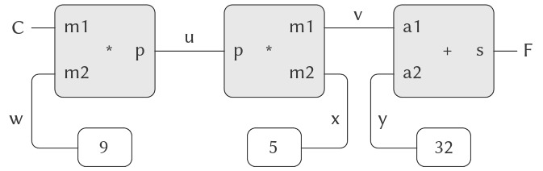

# 3.3 Mô hình hóa với Mutable Data (dữ liệu có thể thay đổi)

Chương 2 đã đề cập đến compound data (dữ liệu hợp) như một phương tiện để xây dựng các computational objects (đối tượng tính toán) có nhiều thành phần, nhằm mô hình hóa các đối tượng trong thế giới thực vốn có nhiều khía cạnh. Trong chương đó, chúng ta đã giới thiệu nguyên tắc của data abstraction (trừu tượng hóa dữ liệu), theo đó các cấu trúc dữ liệu được đặc tả thông qua các constructors (hàm tạo), dùng để tạo ra các data objects (đối tượng dữ liệu), và các selectors (hàm chọn), dùng để truy cập các phần của compound data objects. Nhưng giờ đây chúng ta biết rằng còn một khía cạnh khác của dữ liệu mà chương 2 chưa đề cập. Mong muốn mô hình hóa các hệ thống bao gồm các đối tượng có trạng thái thay đổi dẫn chúng ta đến nhu cầu phải **sửa đổi** các compound data objects, cũng như xây dựng và chọn lọc từ chúng. Để mô hình hóa các compound objects có trạng thái thay đổi, chúng ta sẽ thiết kế các data abstractions bao gồm, ngoài selectors và constructors, các phép toán gọi là *mutators* (bộ biến đổi), dùng để sửa đổi data objects.  

Ví dụ, mô hình hóa một hệ thống ngân hàng đòi hỏi chúng ta phải thay đổi số dư tài khoản. Do đó, một cấu trúc dữ liệu để biểu diễn tài khoản ngân hàng có thể cho phép một phép toán:

``` {.scheme}
(set-balance! ⟨account⟩ ⟨new-value⟩)
```

Phép toán này thay đổi số dư của tài khoản được chỉ định thành giá trị mới được chỉ định. Các data objects mà có định nghĩa mutators được gọi là *mutable data objects* (đối tượng dữ liệu có thể thay đổi).

Chương 2 đã giới thiệu pairs (cặp) như một “chất keo” đa dụng để tổng hợp compound data. Chúng ta bắt đầu phần này bằng cách định nghĩa các mutators cơ bản cho pairs, để pairs có thể đóng vai trò là các khối xây dựng cho việc tạo ra mutable data objects. Các mutators này tăng cường đáng kể khả năng biểu diễn của pairs, cho phép chúng ta xây dựng các cấu trúc dữ liệu khác ngoài các sequences (dãy) và trees (cây) mà chúng ta đã làm việc trong 2.2. Chúng ta cũng sẽ trình bày một số ví dụ về các mô phỏng, trong đó các hệ thống phức tạp được mô hình hóa như tập hợp các đối tượng có local state (trạng thái cục bộ).


## 3.3.1 Cấu trúc danh sách có thể thay đổi

Các phép toán cơ bản trên pairs — `cons`, `car`, và `cdr` — có thể được dùng để xây dựng list structure (cấu trúc danh sách) và để chọn các phần từ list structure, nhưng chúng không thể sửa đổi list structure. Điều này cũng đúng với các phép toán trên danh sách mà chúng ta đã dùng cho đến nay, như `append` và `list`, vì chúng có thể được định nghĩa dựa trên `cons`, `car`, và `cdr`. Để sửa đổi list structures, chúng ta cần các phép toán mới.

Các primitive mutators (bộ biến đổi nguyên thủy) cho pairs là `set-car!` và `set-cdr!`. `Set-car!` nhận hai đối số, trong đó đối số thứ nhất phải là một pair. Nó sửa đổi pair này, thay thế con trỏ `car` bằng một con trỏ tới đối số thứ hai của `set-car!` [^1].

Ví dụ, giả sử `x` được gán tới danh sách `((a b) c d)` và `y` tới danh sách `(e f)` như minh họa trong Hình 3.12. Việc thực thi biểu thức `(set-car! x y)` sẽ sửa đổi pair mà `x` trỏ tới, thay thế `car` của nó bằng giá trị của `y`. Kết quả của phép toán được thể hiện trong Hình 3.13. Cấu trúc `x` đã bị thay đổi và giờ sẽ được in ra là `((e f) c d)`. Các pairs biểu diễn danh sách `(a b)`, được xác định bởi con trỏ đã bị thay thế, giờ bị tách ra khỏi cấu trúc ban đầu [^2].


**Figure 3.12:** Lists `x`: `((a b) c d)` and `y`: `(e f)`.


**Figure 3.13:** Effect of `(set-car! x y)` on the lists in Figure 3.12.

So sánh Hình 3.13 với Hình 3.14, minh họa kết quả của việc thực thi `(define z (cons y (cdr x)))` khi `x` và `y` được gán tới các danh sách ban đầu của Hình 3.12. Biến `z` giờ được gán tới một pair mới được tạo bởi phép toán `cons`; danh sách mà `x` trỏ tới không thay đổi.


**Figure 3.14:** Effect of `(define z (cons y (cdr x)))` on the lists in Figure 3.12.

Phép toán `set-cdr!` tương tự như `set-car!`. Điểm khác biệt duy nhất là con trỏ `cdr` của pair, thay vì con trỏ `car`, sẽ bị thay thế. Kết quả của việc thực thi `(set-cdr! x y)` trên các danh sách của Hình 3.12 được thể hiện trong Hình 3.15. Ở đây, con trỏ `cdr` của `x` đã bị thay thế bằng con trỏ tới `(e f)`. Ngoài ra, danh sách `(c d)`, vốn trước đây là `cdr` của `x`, giờ bị tách ra khỏi cấu trúc.


**Figure 3.15:** Effect of `(set-cdr! x y)` on the lists in Figure 3.12.

`Cons` xây dựng list structure mới bằng cách tạo ra các pairs mới, trong khi `set-car!` và `set-cdr!` sửa đổi các pairs hiện có. Thực tế, chúng ta có thể cài đặt `cons` dựa trên hai mutators này, cùng với một procedure `get-new-pair`, trả về một pair mới không thuộc bất kỳ list structure nào hiện có. Chúng ta lấy pair mới, đặt các con trỏ `car` và `cdr` của nó tới các đối tượng được chỉ định, và trả về pair mới này như kết quả của `cons` [^3].

``` {.scheme}
(define (cons x y)
  (let ((new (get-new-pair)))
    (set-car! new x)
    (set-cdr! new y)
    new))
```


### Chia sẻ và định danh

Chúng ta đã đề cập trong 3.1.3 về các vấn đề lý thuyết của “sự đồng nhất” và “sự thay đổi” được đặt ra bởi việc giới thiệu assignment (gán). Những vấn đề này xuất hiện trong thực tế khi các pairs riêng lẻ được *shared* (chia sẻ) giữa các data objects khác nhau. Ví dụ, xét cấu trúc được tạo bởi:

``` {.scheme}
(define x (list 'a 'b))
(define z1 (cons x x))
```

Như thể hiện trong Hình 3.16, `z1` là một pair mà cả `car` và `cdr` đều trỏ tới cùng một pair `x`. Việc chia sẻ `x` bởi `car` và `cdr` của `z1` là hệ quả của cách cài đặt trực tiếp của `cons`. Nói chung, việc dùng `cons` để xây dựng danh sách sẽ tạo ra một cấu trúc liên kết của các pairs, trong đó nhiều pairs riêng lẻ được chia sẻ bởi nhiều cấu trúc khác nhau.


**Figure 3.16:** The list `z1` formed by `(cons x x)`.

Trái ngược với Hình 3.16, Hình 3.17 cho thấy cấu trúc được tạo bởi:

``` {.scheme}
(define z2 
  (cons (list 'a 'b) (list 'a 'b)))
```


**Figure 3.17:** The list `z2` formed by `(cons (list 'a 'b) (list 'a 'b))`.


[^1]: `Set-car!` và `set-cdr!` trả về các giá trị phụ thuộc vào cách cài đặt. Giống như `set!`, chúng chỉ nên được dùng cho tác dụng phụ của chúng.  
[^2]: Từ đây ta thấy rằng các phép toán thay đổi trên danh sách có thể tạo ra “garbage” (rác) không thuộc bất kỳ cấu trúc nào có thể truy cập. Chúng ta sẽ thấy trong 5.3.2 rằng các hệ thống quản lý bộ nhớ của Lisp bao gồm một *garbage collector* (bộ gom rác), dùng để xác định và tái sử dụng vùng nhớ được dùng bởi các pairs không còn cần thiết.  
[^3]: ....

Trong cấu trúc này, các pairs trong hai danh sách `(a b)` là khác nhau, mặc dù các symbol (ký hiệu) thực tế được chia sẻ [^4].

Khi được xem như một danh sách, `z1` và `z2` đều biểu diễn “cùng một” danh sách, `((a b) a b)`. Nói chung, việc chia sẻ là hoàn toàn không thể phát hiện nếu chúng ta thao tác trên danh sách chỉ bằng `cons`, `car`, và `cdr`. Tuy nhiên, nếu chúng ta cho phép các mutators trên list structure, việc chia sẻ trở nên quan trọng. Ví dụ về sự khác biệt mà chia sẻ có thể tạo ra, hãy xét procedure (thủ tục) sau, thủ tục này sửa đổi `car` của cấu trúc mà nó được áp dụng:

``` {.scheme}
(define (set-to-wow! x)
  (set-car! (car x) 'wow)
  x)
```

Mặc dù `z1` và `z2` là “cùng một” cấu trúc, việc áp dụng `set-to-wow!` cho chúng cho ra các kết quả khác nhau. Với `z1`, việc thay đổi `car` cũng thay đổi `cdr`, vì trong `z1` thì `car` và `cdr` là cùng một pair. Với `z2`, `car` và `cdr` là khác nhau, nên `set-to-wow!` chỉ sửa đổi `car`:

``` {.scheme}
z1
((a b) a b)

(set-to-wow! z1)
((wow b) wow b)

z2
((a b) a b)

(set-to-wow! z2)
((wow b) a b)
```

Một cách để phát hiện chia sẻ trong list structures là dùng predicate `eq?`, mà chúng ta đã giới thiệu trong 2.3.1 như một cách để kiểm tra xem hai symbols có bằng nhau hay không. Tổng quát hơn, `(eq? x y)` kiểm tra xem `x` và `y` có phải là cùng một object (nghĩa là, `x` và `y` có bằng nhau về con trỏ hay không). Do đó, với `z1` và `z2` như được định nghĩa trong Hình 3.16 và Hình 3.17, `(eq? (car z1) (cdr z1))` là đúng và `(eq? (car z2) (cdr z2))` là sai.

Như sẽ thấy trong các phần tiếp theo, chúng ta có thể khai thác việc chia sẻ để mở rộng đáng kể tập hợp các cấu trúc dữ liệu có thể được biểu diễn bằng pairs. Mặt khác, chia sẻ cũng có thể nguy hiểm, vì các sửa đổi được thực hiện trên một cấu trúc cũng sẽ ảnh hưởng đến các cấu trúc khác tình cờ chia sẻ các phần đã bị sửa đổi. Các phép toán mutation `set-car!` và `set-cdr!` nên được sử dụng cẩn thận; trừ khi chúng ta hiểu rõ cách các data objects của mình được chia sẻ, mutation có thể dẫn đến các kết quả không lường trước [^5].


### Mutation chỉ là assignment (gán)

Khi chúng ta giới thiệu compound data, chúng ta đã quan sát trong 2.1.3 rằng pairs có thể được biểu diễn hoàn toàn bằng procedures:

``` {.scheme}
(define (cons x y)
  (define (dispatch m)
    (cond ((eq? m 'car) x)
          ((eq? m 'cdr) y)
          (else (error "Undefined 
                 operation: CONS" m))))
  dispatch)

(define (car z) (z 'car))
(define (cdr z) (z 'cdr))
```

Quan sát tương tự cũng đúng với mutable data. Chúng ta có thể cài đặt mutable data objects dưới dạng procedures sử dụng assignment và local state. Ví dụ, chúng ta có thể mở rộng cài đặt pair ở trên để xử lý `set-car!` và `set-cdr!` theo cách tương tự như cách chúng ta đã cài đặt tài khoản ngân hàng bằng `make-account` trong 3.1.1:

``` {.scheme}
(define (cons x y)
  (define (set-x! v) (set! x v))
  (define (set-y! v) (set! y v))
  (define (dispatch m)
    (cond ((eq? m 'car) x)
          ((eq? m 'cdr) y)
          ((eq? m 'set-car!) set-x!)
          ((eq? m 'set-cdr!) set-y!)
          (else (error "Undefined 
                 operation: CONS" m))))
  dispatch)

(define (car z) (z 'car))
(define (cdr z) (z 'cdr))

(define (set-car! z new-value)
  ((z 'set-car!) new-value)
  z)

(define (set-cdr! z new-value)
  ((z 'set-cdr!) new-value)
  z)
```

Về mặt lý thuyết, assignment là tất cả những gì cần thiết để giải thích hành vi của mutable data. Ngay khi chúng ta chấp nhận `set!` vào ngôn ngữ, chúng ta đã đặt ra tất cả các vấn đề, không chỉ của assignment, mà còn của mutable data nói chung [^6].


[^4]: Hai pairs là khác nhau vì mỗi lần gọi `cons` trả về một pair mới. Các symbols được chia sẻ; trong Scheme chỉ tồn tại một symbol duy nhất cho mỗi tên cho trước. Vì Scheme không cung cấp cách nào để thay đổi một symbol, nên việc chia sẻ này là không thể phát hiện. Cũng cần lưu ý rằng việc chia sẻ này cho phép chúng ta so sánh các symbols bằng `eq?`, vốn chỉ đơn giản kiểm tra sự bằng nhau của các con trỏ.  
[^5]: Những tinh tế trong việc xử lý chia sẻ của mutable data objects phản ánh các vấn đề cơ bản về “sự đồng nhất” và “sự thay đổi” đã được nêu trong 3.1.3. Chúng ta đã đề cập rằng việc chấp nhận thay đổi trong ngôn ngữ đòi hỏi một compound object phải có một “identity” (định danh) khác với các phần cấu thành của nó. Trong Lisp, chúng ta coi “identity” này là thuộc tính được kiểm tra bởi `eq?`, tức là bằng nhau về con trỏ. Vì trong hầu hết các cài đặt Lisp, một con trỏ về cơ bản là một địa chỉ bộ nhớ, nên chúng ta “giải quyết vấn đề” định nghĩa định danh của các đối tượng bằng cách quy định rằng một data object “tự nó” là thông tin được lưu trữ trong một tập hợp vị trí bộ nhớ cụ thể trong máy tính. Điều này là đủ cho các chương trình Lisp đơn giản, nhưng khó có thể là một cách tổng quát để giải quyết vấn đề “sự đồng nhất” trong các mô hình tính toán.  
[^6]: Mặt khác, từ góc độ cài đặt, assignment yêu cầu chúng ta sửa đổi environment (môi trường), vốn tự nó là một mutable data structure. Do đó, assignment và mutation là tương đương về khả năng: mỗi cái có thể được cài đặt dựa trên cái kia.  

## 3.3.2 Biểu diễn Queues (hàng đợi)

Các mutators `set-car!` và `set-cdr!` cho phép chúng ta sử dụng pairs để xây dựng các cấu trúc dữ liệu mà không thể tạo ra chỉ với `cons`, `car`, và `cdr`. Phần này cho thấy cách sử dụng pairs để biểu diễn một cấu trúc dữ liệu gọi là queue (hàng đợi). Phần 3.3.3 sẽ trình bày cách biểu diễn các cấu trúc dữ liệu gọi là tables (bảng).

Một *queue* là một sequence (dãy) trong đó các phần tử được chèn vào ở một đầu (gọi là *rear* — cuối hàng đợi) và bị xóa ở đầu kia (gọi là *front* — đầu hàng đợi). Hình 3.18 cho thấy một queue ban đầu rỗng, trong đó các phần tử `a` và `b` được chèn vào. Sau đó `a` bị xóa, `c` và `d` được chèn vào, và `b` bị xóa. Bởi vì các phần tử luôn bị xóa theo đúng thứ tự mà chúng được chèn vào, một queue đôi khi được gọi là bộ đệm *FIFO* (first in, first out — vào trước, ra trước).


**Figure 3.18:** Queue operations.

Xét theo data abstraction (trừu tượng hóa dữ liệu), chúng ta có thể coi một queue được định nghĩa bởi tập hợp các phép toán sau:

- Một constructor: `(make-queue)` trả về một queue rỗng (một queue không chứa phần tử nào).
- Hai selectors:

    ``` {.scheme}
    (empty-queue? ⟨queue⟩)
    ```

    kiểm tra xem queue có rỗng hay không.

    ``` {.scheme}
    (front-queue ⟨queue⟩)
    ```

    trả về đối tượng ở đầu queue, báo lỗi nếu queue rỗng; phép toán này không sửa đổi queue.

- Hai mutators:

    ``` {.scheme}
    (insert-queue! ⟨queue⟩ ⟨item⟩)
    ```

    chèn phần tử vào cuối queue và trả về queue đã được sửa đổi như giá trị của nó.

    ``` {.scheme}
    (delete-queue! ⟨queue⟩)
    ```

    xóa phần tử ở đầu queue và trả về queue đã được sửa đổi như giá trị của nó, báo lỗi nếu queue rỗng trước khi xóa.

Bởi vì một queue là một sequence các phần tử, chúng ta hoàn toàn có thể biểu diễn nó như một danh sách thông thường; đầu queue sẽ là `car` của danh sách, chèn một phần tử vào queue sẽ tương đương với việc nối thêm một phần tử mới vào cuối danh sách, và xóa một phần tử khỏi queue sẽ chỉ là lấy `cdr` của danh sách. Tuy nhiên, cách biểu diễn này không hiệu quả, vì để chèn một phần tử chúng ta phải duyệt danh sách cho đến khi tới cuối. Do phương pháp duy nhất mà chúng ta có để duyệt danh sách là thực hiện liên tiếp các phép toán `cdr`, việc duyệt này cần $\Theta(n)$ bước đối với một danh sách có $n$ phần tử. Một chỉnh sửa đơn giản đối với cách biểu diễn danh sách có thể khắc phục nhược điểm này bằng cách cho phép các phép toán trên queue được cài đặt sao cho chúng chỉ cần $\Theta(1)$ bước; nghĩa là, số bước cần thiết không phụ thuộc vào độ dài của queue.

Khó khăn của cách biểu diễn bằng danh sách xuất phát từ việc cần phải duyệt để tìm phần cuối của danh sách. Lý do chúng ta cần duyệt là vì, mặc dù cách biểu diễn tiêu chuẩn của danh sách như một chuỗi các pairs cung cấp cho chúng ta một con trỏ tới phần đầu danh sách, nó không cho chúng ta một con trỏ dễ truy cập tới phần cuối. Chỉnh sửa để tránh nhược điểm này là biểu diễn queue như một danh sách, kèm theo một con trỏ bổ sung chỉ tới pair cuối cùng trong danh sách. Bằng cách đó, khi chèn một phần tử, chúng ta có thể dùng con trỏ rear và tránh phải duyệt danh sách.

Một queue được biểu diễn như một cặp con trỏ, `front-ptr` và `rear-ptr`, lần lượt chỉ tới pair đầu tiên và pair cuối cùng trong một danh sách thông thường. Vì chúng ta muốn queue là một đối tượng có thể nhận diện được, chúng ta có thể dùng `cons` để kết hợp hai con trỏ này. Do đó, bản thân queue sẽ là `cons` của hai con trỏ. Hình 3.19 minh họa cách biểu diễn này.


**Figure 3.19:** Implementation of a queue as a list with front and rear pointers.

Để định nghĩa các phép toán trên queue, chúng ta sử dụng các procedures sau, cho phép chọn và sửa đổi các con trỏ front và rear của một queue:

``` {.scheme}
(define (front-ptr queue) (car queue))
(define (rear-ptr queue) (cdr queue))
(define (set-front-ptr! queue item) 
  (set-car! queue item))
(define (set-rear-ptr! queue item) 
  (set-cdr! queue item))
```

Giờ chúng ta có thể cài đặt các phép toán queue thực sự. Chúng ta sẽ coi một queue là rỗng nếu con trỏ front của nó là danh sách rỗng:

``` {.scheme}
(define (empty-queue? queue) 
  (null? (front-ptr queue)))
```

Constructor `make-queue` trả về, như một queue ban đầu rỗng, một pair mà cả `car` và `cdr` đều là danh sách rỗng:

``` {.scheme}
(define (make-queue) (cons '() '()))
```

Để chọn phần tử ở đầu queue, chúng ta trả về `car` của pair được chỉ bởi con trỏ front:

``` {.scheme}
(define (front-queue queue)
  (if (empty-queue? queue)
      (error "FRONT called with an 
              empty queue" queue)
      (car (front-ptr queue))))
```

Để chèn một phần tử vào queue, chúng ta làm theo phương pháp mà kết quả được minh họa trong Hình 3.20. Trước tiên, chúng ta tạo một pair mới có `car` là phần tử cần chèn và `cdr` là danh sách rỗng. Nếu queue ban đầu rỗng, chúng ta đặt cả con trỏ front và rear của queue trỏ tới pair mới này. Ngược lại, chúng ta sửa đổi pair cuối cùng trong queue để trỏ tới pair mới, đồng thời đặt con trỏ rear trỏ tới pair mới đó.


**Figure 3.20:** Result of using `(insert-queue! q 'd)` on the queue of Figure 3.19.

``` {.scheme}
(define (insert-queue! queue item)
  (let ((new-pair (cons item '())))
    (cond ((empty-queue? queue)
           (set-front-ptr! queue new-pair)
           (set-rear-ptr! queue new-pair)
           queue)
          (else (set-cdr! (rear-ptr queue) 
                          new-pair)
                (set-rear-ptr! queue new-pair)
                queue))))
```

Để xóa phần tử ở đầu queue, chúng ta chỉ cần sửa đổi con trỏ front sao cho nó trỏ tới phần tử thứ hai trong queue, phần tử này có thể được tìm bằng cách lần theo con trỏ `cdr` của phần tử đầu tiên (xem Hình 3.21) [^7]:

``` {.scheme}
(define (delete-queue! queue)
  (cond ((empty-queue? queue)
         (error "DELETE! called with 
                 an empty queue" queue))
        (else (set-front-ptr! 
               queue 
               (cdr (front-ptr queue)))
              queue)))
```


**Figure 3.21:** Result of using `(delete-queue!  q)` on the queue of Figure 3.20.

## 3.3.3 Biểu diễn Tables (bảng)

Khi chúng ta nghiên cứu các cách khác nhau để biểu diễn sets (tập hợp) trong Chương 2, chúng ta đã đề cập trong 2.3.3 đến nhiệm vụ duy trì một bảng các records (bản ghi) được đánh chỉ mục bằng các keys (khóa) định danh. Trong việc cài đặt data-directed programming (lập trình điều khiển bởi dữ liệu) ở 2.4.3, chúng ta đã sử dụng nhiều các bảng hai chiều, trong đó thông tin được lưu trữ và truy xuất bằng hai keys. Ở đây, chúng ta sẽ thấy cách xây dựng tables như các mutable list structures (cấu trúc danh sách có thể thay đổi).

Trước tiên, chúng ta xét một bảng một chiều, trong đó mỗi giá trị được lưu dưới một key duy nhất. Chúng ta cài đặt bảng như một danh sách các records, mỗi record được cài đặt như một pair gồm một key và giá trị liên kết. Các records được nối lại để tạo thành một danh sách bằng các pairs mà `car` của chúng trỏ tới các records liên tiếp. Các pairs nối này được gọi là *backbone* (xương sống) của bảng. Để có một vị trí mà chúng ta có thể thay đổi khi thêm một record mới vào bảng, chúng ta xây dựng bảng như một *headed list* (danh sách có tiêu đề). Một headed list có một pair backbone đặc biệt ở đầu, chứa một “record” giả — trong trường hợp này là symbol được chọn tùy ý `*table*`. Hình 3.22 cho thấy sơ đồ box-and-pointer cho bảng:

``` {.scheme}
a:  1
b:  2
c:  3
```


**Figure 3.22:** A table represented as a headed list.

Để trích xuất thông tin từ một bảng, chúng ta sử dụng procedure `lookup`, nhận một key làm đối số và trả về giá trị liên kết (hoặc false nếu không có giá trị nào được lưu dưới key đó). `Lookup` được định nghĩa dựa trên phép toán `assoc`, phép toán này nhận một key và một danh sách các records làm đối số. Lưu ý rằng `assoc` không bao giờ thấy record giả. `Assoc` trả về record có key đã cho là `car` của nó [^8]. `Lookup` sau đó kiểm tra để đảm bảo record trả về từ `assoc` không phải là false, và trả về giá trị (phần `cdr`) của record.

``` {.scheme}
(define (lookup key table)
  (let ((record (assoc key (cdr table))))
    (if record
        (cdr record)
        false)))

(define (assoc key records)
  (cond ((null? records) false)
        ((equal? key (caar records)) 
         (car records))
        (else (assoc key (cdr records)))))
```

Để chèn một giá trị vào bảng dưới một key xác định, trước tiên chúng ta dùng `assoc` để xem đã có record nào trong bảng với key này chưa. Nếu chưa, chúng ta tạo một record mới bằng cách `cons` key với giá trị, và chèn record này vào đầu danh sách records của bảng, ngay sau record giả. Nếu đã có record với key này, chúng ta đặt `cdr` của record đó thành giá trị mới được chỉ định. Phần header của bảng cung cấp cho chúng ta một vị trí cố định để sửa đổi khi chèn record mới [^9].

``` {.scheme}
(define (insert! key value table)
  (let ((record (assoc key (cdr table))))
    (if record
        (set-cdr! record value)
        (set-cdr! table
                  (cons (cons key value) 
                        (cdr table)))))
  'ok)
```

Để tạo một bảng mới, chúng ta chỉ cần tạo một danh sách chứa symbol `*table*`:

``` {.scheme}
(define (make-table)
  (list '*table*))
```


[^7]: Nếu phần tử đầu tiên là phần tử cuối cùng trong queue, con trỏ front sẽ là danh sách rỗng sau khi xóa, điều này sẽ đánh dấu queue là rỗng; chúng ta không cần lo lắng về việc cập nhật con trỏ rear, vốn vẫn sẽ trỏ tới phần tử đã bị xóa, vì `empty-queue?` chỉ kiểm tra con trỏ front.  
[^8]: Vì `assoc` sử dụng `equal?`, nó có thể nhận diện các keys là symbols, numbers, hoặc list structure.  
[^9]: Do đó, pair backbone đầu tiên là đối tượng đại diện cho bảng “tự nó”; nghĩa là, một con trỏ tới bảng là một con trỏ tới pair này. Pair backbone này luôn bắt đầu bảng. Nếu chúng ta không sắp xếp theo cách này, `insert!` sẽ phải trả về một giá trị mới cho phần bắt đầu của bảng khi thêm một record mới.


### Two-dimensional tables (bảng hai chiều)

Trong một two-dimensional table, mỗi giá trị được đánh chỉ mục bởi hai keys. Chúng ta có thể xây dựng một bảng như vậy dưới dạng một one-dimensional table, trong đó mỗi key xác định một subtable (bảng con). Hình 3.23 cho thấy sơ đồ box-and-pointer cho bảng:

``` {.example}
math:  +: 43    letters:  a: 97
       -: 45              b: 98
       *: 42
```

Bảng này có hai subtables. (Các subtables không cần một header symbol đặc biệt, vì key xác định subtable đã đóng vai trò này.)


**Figure 3.23:** A two-dimensional table.

Khi tra cứu một mục, chúng ta dùng key thứ nhất để xác định subtable đúng. Sau đó, chúng ta dùng key thứ hai để xác định record trong subtable.

``` {.scheme}
(define (lookup key-1 key-2 table)
  (let ((subtable (assoc key-1 (cdr table))))
    (if subtable
        (let ((record 
               (assoc key-2 (cdr subtable))))
          (if record (cdr record) false))
        false)))
```

Để chèn một mục mới dưới một cặp keys, chúng ta dùng `assoc` để xem có subtable nào được lưu dưới key thứ nhất hay không. Nếu không, chúng ta tạo một subtable mới chứa một record duy nhất (`key-2`, `value`) và chèn nó vào bảng dưới key thứ nhất. Nếu đã tồn tại một subtable cho key thứ nhất, chúng ta chèn record mới vào subtable này, sử dụng phương pháp chèn cho one-dimensional tables đã mô tả ở trên:

``` {.scheme}
(define (insert! key-1 key-2 value table)
  (let ((subtable (assoc key-1 (cdr table))))
    (if subtable
        (let ((record 
               (assoc key-2 (cdr subtable))))
          (if record
              (set-cdr! record value)
              (set-cdr! 
               subtable
               (cons (cons key-2 value)
                     (cdr subtable)))))
        (set-cdr! 
         table
         (cons (list key-1 (cons key-2 value))
               (cdr table)))))
  'ok)
```


### Creating local tables (tạo bảng cục bộ)

Các phép toán `lookup` và `insert!` được định nghĩa ở trên nhận bảng làm đối số. Điều này cho phép chúng ta sử dụng các chương trình truy cập nhiều bảng. Một cách khác để xử lý nhiều bảng là có các procedures `lookup` và `insert!` riêng cho từng bảng. Chúng ta có thể làm điều này bằng cách biểu diễn một bảng theo kiểu procedural (thủ tục), như một đối tượng duy trì một bảng nội bộ như một phần của local state (trạng thái cục bộ) của nó. Khi nhận một thông điệp thích hợp, “table object” này sẽ cung cấp procedure để thao tác trên bảng nội bộ. Sau đây là một bộ sinh (generator) cho các two-dimensional tables được biểu diễn theo cách này:


``` {.scheme}
(define (make-table)
  (let ((local-table (list '*table*)))
    (define (lookup key-1 key-2)
      (let ((subtable 
             (assoc key-1 (cdr local-table))))
        (if subtable
            (let ((record 
                   (assoc key-2 
                          (cdr subtable))))
              (if record (cdr record) false))
            false)))
    (define (insert! key-1 key-2 value)
      (let ((subtable 
             (assoc key-1 (cdr local-table))))
        (if subtable
            (let ((record 
                   (assoc key-2 
                          (cdr subtable))))
              (if record
                  (set-cdr! record value)
                  (set-cdr! 
                   subtable
                   (cons (cons key-2 value)
                         (cdr subtable)))))
            (set-cdr! 
             local-table
             (cons (list key-1
                         (cons key-2 value))
                   (cdr local-table)))))
      'ok)
    (define (dispatch m)
      (cond ((eq? m 'lookup-proc) lookup)
            ((eq? m 'insert-proc!) insert!)
            (else (error "Unknown operation: 
                          TABLE" m))))
    dispatch))
```

Sử dụng `make-table`, chúng ta có thể cài đặt các phép toán `get` và `put` được dùng trong 2.4.3 cho data-directed programming, như sau:

``` {.scheme}
(define operation-table (make-table))
(define get (operation-table 'lookup-proc))
(define put (operation-table 'insert-proc!))
```

`Get` nhận hai keys làm đối số, và `put` nhận hai keys cùng một giá trị. Cả hai phép toán đều truy cập cùng một bảng cục bộ, bảng này được đóng gói bên trong đối tượng được tạo bởi lời gọi `make-table`.


## 3.3.4 A Simulator for Digital Circuits (một bộ mô phỏng mạch số)

Thiết kế các hệ thống số phức tạp, chẳng hạn như máy tính, là một hoạt động kỹ thuật quan trọng. Các hệ thống số được xây dựng bằng cách liên kết các phần tử đơn giản. Mặc dù hành vi của từng phần tử riêng lẻ là đơn giản, nhưng mạng lưới của chúng có thể có hành vi rất phức tạp. Việc mô phỏng trên máy tính các thiết kế mạch được đề xuất là một công cụ quan trọng được các kỹ sư hệ thống số sử dụng. Trong phần này, chúng ta thiết kế một hệ thống để thực hiện các mô phỏng logic số. Hệ thống này là điển hình cho một loại chương trình gọi là *event-driven simulation* (mô phỏng điều khiển bởi sự kiện), trong đó các hành động (“events”) kích hoạt các sự kiện tiếp theo xảy ra ở một thời điểm sau đó, và các sự kiện này lại kích hoạt thêm các sự kiện khác, cứ thế tiếp diễn.

Mô hình tính toán của chúng ta về một mạch sẽ bao gồm các objects tương ứng với các thành phần cơ bản cấu thành mạch. Có các *wires* (dây dẫn), mang *digital signals* (tín hiệu số). Một digital signal tại bất kỳ thời điểm nào chỉ có thể có một trong hai giá trị, 0 hoặc 1. Cũng có nhiều loại *function boxes* (hộp chức năng) số khác nhau, kết nối các dây mang tín hiệu đầu vào tới các dây đầu ra khác. Các hộp này tạo ra tín hiệu đầu ra được tính toán từ các tín hiệu đầu vào của chúng. Tín hiệu đầu ra bị trễ một khoảng thời gian phụ thuộc vào loại function box. Ví dụ, một *inverter* (mạch đảo) là một function box nguyên thủy đảo ngược đầu vào của nó. Nếu tín hiệu đầu vào của inverter thay đổi thành 0, thì sau một khoảng inverter-delay, inverter sẽ thay đổi tín hiệu đầu ra thành 1. Nếu tín hiệu đầu vào của inverter thay đổi thành 1, thì sau một khoảng inverter-delay, inverter sẽ thay đổi tín hiệu đầu ra thành 0. Chúng ta vẽ inverter một cách ký hiệu như trong Hình 3.24. Một *and-gate* (cổng AND), cũng được thể hiện trong Hình 3.24, là một function box nguyên thủy có hai đầu vào và một đầu ra. Nó điều khiển tín hiệu đầu ra thành giá trị là *logical and* (phép AND logic) của các đầu vào. Nghĩa là, nếu cả hai tín hiệu đầu vào đều trở thành 1, thì sau một khoảng and-gate-delay, and-gate sẽ buộc tín hiệu đầu ra thành 1; nếu không thì đầu ra sẽ là 0. Một *or-gate* (cổng OR) là một function box nguyên thủy hai đầu vào tương tự, điều khiển tín hiệu đầu ra thành giá trị là *logical or* (phép OR logic) của các đầu vào. Nghĩa là, đầu ra sẽ trở thành 1 nếu ít nhất một trong các tín hiệu đầu vào là 1; nếu không thì đầu ra sẽ là 0.


**Figure 3.24:** Primitive functions in the digital logic simulator.

Chúng ta có thể kết nối các primitive functions (hàm nguyên thủy) lại với nhau để tạo thành các hàm phức tạp hơn. Để thực hiện điều này, chúng ta nối đầu ra của một số function boxes (hộp chức năng) vào đầu vào của các function boxes khác. Ví dụ, mạch *half-adder* (bộ cộng nửa) được minh họa trong Hình 3.25 bao gồm một or-gate (cổng OR), hai and-gates (cổng AND), và một inverter (mạch đảo). Mạch này nhận hai tín hiệu đầu vào, A và B, và có hai tín hiệu đầu ra, S và C. S sẽ trở thành 1 khi và chỉ khi đúng một trong A hoặc B là 1, và C sẽ trở thành 1 khi cả A và B đều là 1. Từ hình vẽ, chúng ta có thể thấy rằng, do các khoảng trễ liên quan, các đầu ra có thể được tạo ra tại các thời điểm khác nhau. Nhiều khó khăn trong thiết kế mạch số bắt nguồn từ thực tế này.


**Figure 3.25:** A half-adder circuit.

Bây giờ chúng ta sẽ xây dựng một chương trình để mô hình hóa các mạch logic số mà chúng ta muốn nghiên cứu. Chương trình sẽ tạo ra các computational objects (đối tượng tính toán) mô hình hóa các wires (dây dẫn), vốn sẽ “giữ” các tín hiệu. Các function boxes sẽ được mô hình hóa bằng các procedures (thủ tục) đảm bảo mối quan hệ đúng đắn giữa các tín hiệu.

Một thành phần cơ bản của mô phỏng này sẽ là procedure `make-wire`, dùng để tạo các dây dẫn. Ví dụ, chúng ta có thể tạo sáu dây dẫn như sau:

``` {.scheme}
(define a (make-wire))
(define b (make-wire))
(define c (make-wire))
(define d (make-wire))
(define e (make-wire))
(define s (make-wire))
```

Chúng ta gắn một function box vào một tập các dây dẫn bằng cách gọi một procedure tạo ra loại hộp đó. Các đối số của constructor procedure là các dây dẫn sẽ được gắn vào hộp. Ví dụ, giả sử chúng ta có thể tạo and-gates, or-gates, và inverters, chúng ta có thể nối dây để tạo thành half-adder như trong Hình 3.25:

``` {.scheme}
(or-gate a b d)
ok

(and-gate a b c)
ok

(inverter c e)
ok

(and-gate d e s)
ok
```

Tốt hơn nữa, chúng ta có thể đặt tên rõ ràng cho thao tác này bằng cách định nghĩa một procedure `half-adder` tạo ra mạch này, với bốn dây dẫn bên ngoài được gắn vào half-adder:

``` {.scheme}
(define (half-adder a b s c)
  (let ((d (make-wire)) (e (make-wire)))
    (or-gate a b d)
    (and-gate a b c)
    (inverter c e)
    (and-gate d e s)
    'ok))
```

Ưu điểm của việc định nghĩa này là chúng ta có thể sử dụng `half-adder` như một khối xây dựng để tạo ra các mạch phức tạp hơn. Hình 3.26, chẳng hạn, cho thấy một *full-adder* (bộ cộng đầy đủ) được tạo thành từ hai half-adders và một or-gate [^10]. Chúng ta có thể tạo một full-adder như sau:

``` {.scheme}
(define (full-adder a b c-in sum c-out)
  (let ((c1 (make-wire)) 
        (c2 (make-wire))
        (s  (make-wire)))
    (half-adder b c-in s c1)
    (half-adder a s sum c2)
    (or-gate c1 c2 c-out)
    'ok))
```


**Figure 3.26:** A full-adder circuit.

Sau khi đã định nghĩa `full-adder` như một procedure, chúng ta có thể sử dụng nó như một khối xây dựng để tạo ra các mạch còn phức tạp hơn nữa. (Ví dụ, xem Bài tập 3.30.)

Về bản chất, bộ mô phỏng của chúng ta cung cấp các công cụ để xây dựng một ngôn ngữ của các mạch. Nếu chúng ta áp dụng quan điểm tổng quát về ngôn ngữ mà chúng ta đã dùng khi nghiên cứu Lisp trong 1.1, chúng ta có thể nói rằng các primitive function boxes tạo thành các phần tử nguyên thủy của ngôn ngữ, việc nối các hộp lại với nhau cung cấp một phương tiện kết hợp, và việc đặc tả các mẫu nối dây dưới dạng procedures đóng vai trò như một phương tiện trừu tượng hóa.


### Primitive function boxes

Các primitive function boxes thực hiện các “lực” mà qua đó sự thay đổi tín hiệu trên một dây dẫn ảnh hưởng đến các tín hiệu trên các dây dẫn khác. Để xây dựng các function boxes, chúng ta sử dụng các phép toán sau trên wires:

- `(get-signal ⟨wire⟩)`

    trả về giá trị hiện tại của tín hiệu trên dây dẫn.

- `(set-signal! ⟨wire⟩ ⟨new value⟩)`

    thay đổi giá trị của tín hiệu trên dây dẫn thành giá trị mới.

- `(add-action! ⟨wire⟩ ⟨procedure of no arguments⟩)`

    xác nhận rằng procedure được chỉ định sẽ được chạy bất cứ khi nào tín hiệu trên dây dẫn thay đổi giá trị. Các procedures như vậy là phương tiện để truyền đạt sự thay đổi giá trị tín hiệu trên dây dẫn tới các dây dẫn khác.

Ngoài ra, chúng ta sẽ sử dụng một procedure `after-delay` nhận một khoảng thời gian trễ và một procedure cần chạy, và thực thi procedure đó sau khoảng trễ đã cho.

Sử dụng các procedures này, chúng ta có thể định nghĩa các hàm logic số nguyên thủy. Để kết nối một đầu vào với một đầu ra thông qua một inverter, chúng ta dùng `add-action!` để gắn với dây đầu vào một procedure sẽ được chạy bất cứ khi nào tín hiệu trên dây đầu vào thay đổi giá trị. Procedure này tính `logical-not` của tín hiệu đầu vào, và sau một `inverter-delay`, đặt tín hiệu đầu ra thành giá trị mới này:


[^10]: A full-adder là một phần tử mạch cơ bản được dùng để cộng hai số nhị phân. Ở đây A và B là các bit tại các vị trí tương ứng trong hai số cần cộng, và $C_{in}$ là bit nhớ từ phép cộng ở vị trí bên phải. Mạch tạo ra SUM, là bit tổng tại vị trí tương ứng, và $C_{out}$, là bit nhớ được truyền sang bên trái.


``` {.scheme}
(define (inverter input output)
  (define (invert-input)
    (let ((new-value 
           (logical-not (get-signal input))))
      (after-delay 
       inverter-delay
       (lambda ()
         (set-signal! output new-value)))))
  (add-action! input invert-input)
  'ok)

(define (logical-not s)
  (cond ((= s 0) 1)
        ((= s 1) 0)
        (else (error "Invalid signal" s))))
```

Một and-gate (cổng AND) phức tạp hơn một chút. Action procedure (thủ tục hành động) phải được chạy nếu một trong hai đầu vào của cổng thay đổi. Nó tính `logical-and` (sử dụng một procedure tương tự như `logical-not`) của các giá trị tín hiệu trên các dây đầu vào và thiết lập một thay đổi sang giá trị mới sẽ xảy ra trên dây đầu ra sau một khoảng `and-gate-delay`.

``` {.scheme}
(define (and-gate a1 a2 output)
  (define (and-action-procedure)
    (let ((new-value
           (logical-and (get-signal a1) 
                        (get-signal a2))))
      (after-delay 
       and-gate-delay
       (lambda ()
         (set-signal! output new-value)))))
  (add-action! a1 and-action-procedure)
  (add-action! a2 and-action-procedure)
  'ok)
```

### Representing wires (biểu diễn dây dẫn)

Một wire (dây dẫn) trong mô phỏng của chúng ta sẽ là một computational object (đối tượng tính toán) với hai biến trạng thái cục bộ: một `signal-value` (giá trị tín hiệu, ban đầu được lấy là 0) và một tập hợp các `action-procedures` sẽ được chạy khi tín hiệu thay đổi giá trị. Chúng ta cài đặt wire này theo phong cách message-passing (truyền thông điệp), như một tập hợp các local procedures (thủ tục cục bộ) cùng với một procedure `dispatch` chọn thao tác cục bộ thích hợp, giống như chúng ta đã làm với đối tượng bank-account đơn giản trong 3.1.1:

``` {.scheme}
(define (make-wire)
  (let ((signal-value 0) 
        (action-procedures '()))
    (define (set-my-signal! new-value)
      (if (not (= signal-value new-value))
          (begin (set! signal-value new-value)
                 (call-each 
                  action-procedures))
          'done))
    (define (accept-action-procedure! proc)
      (set! action-procedures 
            (cons proc action-procedures))
      (proc))
    (define (dispatch m)
      (cond ((eq? m 'get-signal) 
             signal-value)
            ((eq? m 'set-signal!) 
             set-my-signal!)
            ((eq? m 'add-action!) 
             accept-action-procedure!)
            (else (error "Unknown operation: 
                          WIRE" m))))
    dispatch))
```

Local procedure `set-my-signal!` kiểm tra xem giá trị tín hiệu mới có thay đổi tín hiệu trên dây hay không. Nếu có, nó chạy từng action procedure, sử dụng procedure `call-each` dưới đây, procedure này gọi từng phần tử trong một danh sách các procedures không có đối số:

``` {.scheme}
(define (call-each procedures)
  (if (null? procedures)
      'done
      (begin ((car procedures))
             (call-each (cdr procedures)))))
```

Local procedure `accept-action-procedure!` thêm procedure được truyền vào vào danh sách các procedures sẽ được chạy, và sau đó chạy procedure mới này một lần. (Xem Bài tập 3.31.)

Với local procedure `dispatch` được thiết lập như đã mô tả, chúng ta có thể cung cấp các procedures sau để truy cập các thao tác cục bộ trên wires [^11]:

``` {.scheme}
(define (get-signal wire)
  (wire 'get-signal))
(define (set-signal! wire new-value)
  ((wire 'set-signal!) new-value))
(define (add-action! wire action-procedure)
  ((wire 'add-action!) action-procedure))
```

Các wires, vốn có tín hiệu thay đổi theo thời gian và có thể được gắn dần vào các thiết bị, là điển hình của các mutable objects (đối tượng có thể thay đổi). Chúng ta đã mô hình hóa chúng như các procedures với các biến trạng thái cục bộ được thay đổi bằng phép gán. Khi một wire mới được tạo, một tập biến trạng thái mới được cấp phát (bởi biểu thức `let` trong `make-wire`) và một procedure `dispatch` mới được tạo và trả về, đóng gói môi trường với các biến trạng thái mới này.

Các wires được chia sẻ giữa nhiều thiết bị khác nhau đã được kết nối với chúng. Do đó, một thay đổi được thực hiện bởi một thiết bị sẽ ảnh hưởng đến tất cả các thiết bị khác được gắn vào dây đó. Wire truyền đạt sự thay đổi này tới các thiết bị lân cận bằng cách gọi các action procedures đã được cung cấp cho nó khi các kết nối được thiết lập.


[^11]: Các procedures này chỉ đơn giản là *syntactic sugar* (cú pháp thuận tiện) cho phép chúng ta sử dụng cú pháp thủ tục thông thường để truy cập các local procedures của objects. Điều đáng chú ý là chúng ta có thể hoán đổi vai trò của “procedures” và “data” một cách đơn giản như vậy. Ví dụ, nếu chúng ta viết `(wire 'get-signal)` chúng ta coi `wire` như một procedure được gọi với thông điệp `get-signal` làm đầu vào. Ngược lại, viết `(get-signal wire)` khiến chúng ta coi `wire` như một data object là đầu vào của procedure `get-signal`. Thực tế là, trong một ngôn ngữ mà chúng ta có thể xử lý procedures như các objects, không có sự khác biệt cơ bản nào giữa “procedures” và “data”, và chúng ta có thể chọn cú pháp thuận tiện để lập trình theo bất kỳ phong cách nào mà chúng ta muốn.

### The agenda (lịch trình)

Điều duy nhất cần để hoàn thiện bộ mô phỏng là `after-delay`. Ý tưởng ở đây là chúng ta duy trì một cấu trúc dữ liệu gọi là *agenda* (lịch trình), chứa một danh sách các công việc cần thực hiện. Các phép toán sau được định nghĩa cho agendas:

- `(make-agenda)` trả về một agenda mới rỗng.
- `(empty-agenda? ⟨agenda⟩)` trả về true nếu agenda được chỉ định là rỗng.
- `(first-agenda-item ⟨agenda⟩)` trả về mục đầu tiên trong agenda.
- `(remove-first-agenda-item! ⟨agenda⟩)` sửa đổi agenda bằng cách xóa mục đầu tiên.
- `(add-to-agenda! ⟨time⟩ ⟨action⟩ ⟨agenda⟩)` sửa đổi agenda bằng cách thêm action procedure (thủ tục hành động) được chỉ định để chạy tại thời điểm đã cho.
- `(current-time ⟨agenda⟩)` trả về thời gian mô phỏng hiện tại.

Agenda cụ thể mà chúng ta sử dụng được ký hiệu là `the-agenda`. Procedure `after-delay` thêm các phần tử mới vào `the-agenda`:

``` {.scheme}
(define (after-delay delay action)
  (add-to-agenda! 
   (+ delay (current-time the-agenda))
   action
   the-agenda))
```

Quá trình mô phỏng được điều khiển bởi procedure `propagate`, hoạt động trên `the-agenda`, thực thi tuần tự từng procedure trong agenda. Nói chung, khi mô phỏng chạy, các mục mới sẽ được thêm vào agenda, và `propagate` sẽ tiếp tục mô phỏng miễn là còn các mục trong agenda:

``` {.scheme}
(define (propagate)
  (if (empty-agenda? the-agenda)
      'done
      (let ((first-item 
             (first-agenda-item the-agenda)))
        (first-item)
        (remove-first-agenda-item! the-agenda)
        (propagate))))
```


### A sample simulation (một mô phỏng mẫu)

Procedure sau đây, đặt một “probe” (đầu dò) lên một wire, cho thấy bộ mô phỏng hoạt động. Probe báo cho wire rằng, bất cứ khi nào tín hiệu của nó thay đổi giá trị, nó sẽ in ra giá trị tín hiệu mới, cùng với thời gian hiện tại và tên định danh của wire:

``` {.scheme}
(define (probe name wire)
  (add-action! 
   wire
   (lambda ()
     (newline)
     (display name)
     (display " ")
     (display (current-time the-agenda))
     (display "  New-value = ")
     (display (get-signal wire)))))
```

Chúng ta bắt đầu bằng cách khởi tạo agenda và chỉ định các khoảng trễ cho các primitive function boxes:

``` {.scheme}
(define the-agenda (make-agenda))
(define inverter-delay 2)
(define and-gate-delay 3)
(define or-gate-delay 5)
```

Bây giờ chúng ta định nghĩa bốn wires, đặt probes lên hai trong số đó:


``` {.scheme}
(define input-1 (make-wire))
(define input-2 (make-wire))
(define sum (make-wire))
(define carry (make-wire))

(probe 'sum sum)
sum 0  New-value = 0

(probe 'carry carry)
carry 0  New-value = 0
```

Tiếp theo, chúng ta kết nối các wires trong một mạch half-adder (như trong Hình 3.25), đặt tín hiệu trên `input-1` thành 1, và chạy mô phỏng:

``` {.scheme}
(half-adder input-1 input-2 sum carry)
ok

(set-signal! input-1 1)
done

(propagate)
sum 8  New-value = 1
done
```

Tín hiệu `sum` thay đổi thành 1 tại thời điểm 8. Chúng ta hiện đang ở thời điểm tám đơn vị thời gian kể từ khi bắt đầu mô phỏng. Tại thời điểm này, chúng ta có thể đặt tín hiệu trên `input-2` thành 1 và cho phép các giá trị lan truyền:

``` {.scheme}
(set-signal! input-2 1)
done

(propagate)
carry 11  New-value = 1
sum 16  New-value = 0
done
```

Tín hiệu `carry` thay đổi thành 1 tại thời điểm 11 và `sum` thay đổi thành 0 tại thời điểm 16.

### Implementing the agenda (Cài đặt agenda)

Cuối cùng, chúng ta trình bày chi tiết về cấu trúc dữ liệu agenda, cấu trúc này chứa các procedures được lên lịch để thực thi trong tương lai.

Agenda được tạo thành từ các *time segments* (đoạn thời gian). Mỗi time segment là một pair gồm một số (thời gian) và một queue (xem Bài tập 3.32) chứa các procedures được lên lịch chạy trong đoạn thời gian đó.

``` {.scheme}
(define (make-time-segment time queue)
  (cons time queue))
(define (segment-time s) (car s))
(define (segment-queue s) (cdr s))
```

Chúng ta sẽ thao tác trên các time-segment queues bằng cách sử dụng các phép toán trên queue đã được mô tả trong 3.3.2.

Bản thân agenda là một one-dimensional table (bảng một chiều) của các time segments. Nó khác với các bảng được mô tả trong 3.3.3 ở chỗ các segments sẽ được sắp xếp theo thứ tự thời gian tăng dần. Ngoài ra, chúng ta lưu trữ *current time* (thời gian hiện tại — tức là thời gian của hành động cuối cùng đã được xử lý) ở phần đầu của agenda. Một agenda mới được tạo sẽ không có time segments và có current time bằng 0 [^12]:

``` {.scheme}
(define (make-agenda) (list 0))
(define (current-time agenda) (car agenda))
(define (set-current-time! agenda time)
  (set-car! agenda time))
(define (segments agenda) (cdr agenda))
(define (set-segments! agenda segments)
  (set-cdr! agenda segments))
(define (first-segment agenda) 
  (car (segments agenda)))
(define (rest-segments agenda) 
  (cdr (segments agenda)))
```

Một agenda là rỗng nếu nó không có time segments:

``` {.scheme}
(define (empty-agenda? agenda)
  (null? (segments agenda)))
```

Để thêm một action vào agenda, trước tiên chúng ta kiểm tra xem agenda có rỗng hay không. Nếu rỗng, chúng ta tạo một time segment cho action và gắn nó vào agenda. Nếu không, chúng ta duyệt qua agenda, kiểm tra thời gian của từng segment. Nếu tìm thấy một segment cho thời gian đã định, chúng ta thêm action vào queue liên kết với segment đó. Nếu gặp một thời gian muộn hơn thời gian đã định, chúng ta chèn một time segment mới vào agenda ngay trước nó. Nếu đến cuối agenda, chúng ta phải tạo một time segment mới ở cuối.


[^12]: Agenda là một headed list (danh sách có tiêu đề), giống như các bảng trong 3.3.3, nhưng vì danh sách được bắt đầu bằng thời gian nên chúng ta không cần một header giả bổ sung (như symbol `*table*` được dùng với các bảng).


``` {.scheme}
(define (add-to-agenda! time action agenda)
  (define (belongs-before? segments)
    (or (null? segments)
        (< time 
           (segment-time (car segments)))))
  (define (make-new-time-segment time action)
    (let ((q (make-queue)))
      (insert-queue! q action)
      (make-time-segment time q)))
  (define (add-to-segments! segments)
    (if (= (segment-time (car segments)) time)
        (insert-queue! 
         (segment-queue (car segments))
         action)
        (let ((rest (cdr segments)))
          (if (belongs-before? rest)
              (set-cdr!
               segments
               (cons (make-new-time-segment 
                      time 
                      action)
                     (cdr segments)))
              (add-to-segments! rest)))))
  (let ((segments (segments agenda)))
    (if (belongs-before? segments)
        (set-segments!
         agenda
         (cons (make-new-time-segment 
                time 
                action)
               segments))
        (add-to-segments! segments))))
```

Procedure (thủ tục) xóa mục đầu tiên khỏi agenda sẽ xóa mục ở đầu queue trong time segment đầu tiên. Nếu việc xóa này làm cho time segment rỗng, chúng ta sẽ loại bỏ nó khỏi danh sách các segments [^13]:

``` {.scheme}
(define (remove-first-agenda-item! agenda)
  (let ((q (segment-queue 
            (first-segment agenda))))
    (delete-queue! q)
    (if (empty-queue? q)
        (set-segments! 
         agenda 
         (rest-segments agenda)))))
```

Mục đầu tiên của agenda được tìm thấy ở đầu queue trong time segment đầu tiên. Bất cứ khi nào chúng ta lấy một mục ra, chúng ta cũng cập nhật current time [^14]:

``` {.scheme}
(define (first-agenda-item agenda)
  (if (empty-agenda? agenda)
      (error "Agenda is empty: 
              FIRST-AGENDA-ITEM")
      (let ((first-seg 
             (first-segment agenda)))
        (set-current-time! 
         agenda 
         (segment-time first-seg))
        (front-queue 
         (segment-queue first-seg)))))
```


## 3.3.5 Propagation of Constraints (Lan truyền ràng buộc)

Các chương trình máy tính truyền thống thường được tổ chức như các phép tính một chiều, thực hiện các thao tác trên các đối số đã được chỉ định trước để tạo ra kết quả mong muốn. Mặt khác, chúng ta thường mô hình hóa các hệ thống theo các quan hệ giữa các đại lượng. Ví dụ, một mô hình toán học của một cấu trúc cơ khí có thể bao gồm thông tin rằng độ võng $d$ của một thanh kim loại liên quan đến lực $F$ tác dụng lên thanh, chiều dài $L$ của thanh, diện tích mặt cắt ngang $A$, và mô đun đàn hồi $E$ thông qua phương trình 

$${dAE}\, = \,{FL.}$$

Phương trình như vậy không phải là một chiều. Cho bất kỳ bốn trong số các đại lượng, chúng ta có thể sử dụng nó để tính đại lượng thứ năm. Tuy nhiên, việc dịch phương trình này sang một ngôn ngữ lập trình truyền thống sẽ buộc chúng ta phải chọn một trong các đại lượng để tính theo bốn đại lượng còn lại. Do đó, một procedure để tính diện tích $A$ sẽ không thể được sử dụng để tính độ võng $d$, mặc dù cả hai phép tính $A$ và $d$ đều xuất phát từ cùng một phương trình [^15].

Trong phần này, chúng ta phác thảo thiết kế của một ngôn ngữ cho phép chúng ta làm việc trực tiếp với các quan hệ. Các phần tử nguyên thủy của ngôn ngữ là *primitive constraints* (ràng buộc nguyên thủy), mô tả rằng một số quan hệ nhất định tồn tại giữa các đại lượng. Ví dụ, `(adder a b c)` chỉ ra rằng các đại lượng $a$, $b$, và $c$ phải có quan hệ theo phương trình $a + b = c$, `(multiplier x y z)` biểu diễn ràng buộc $xy = z$, và `(constant 3.14 x)` nói rằng giá trị của $x$ phải là 3.14.

Ngôn ngữ của chúng ta cung cấp một phương tiện để kết hợp các primitive constraints nhằm biểu diễn các quan hệ phức tạp hơn. Chúng ta kết hợp các constraints bằng cách xây dựng *constraint networks* (mạng ràng buộc), trong đó các constraints được nối với nhau bởi các *connectors* (bộ nối). Một connector là một đối tượng “giữ” một giá trị có thể tham gia vào một hoặc nhiều constraints. Ví dụ, chúng ta biết rằng mối quan hệ giữa nhiệt độ Fahrenheit và Celsius là 

$${9C}\, = \,{5(F - 32).}$$

Ràng buộc như vậy có thể được coi như một mạng bao gồm các constraints nguyên thủy adder, multiplier, và constant (Figure 3.28). Trong hình, ở bên trái là một multiplier box với ba đầu nối, được gắn nhãn $m1$, $m2$, và $p$. Chúng kết nối multiplier này với phần còn lại của mạng như sau: Đầu $m1$ được nối với một connector $C$, sẽ giữ giá trị nhiệt độ Celsius. Đầu $m2$ được nối với một connector $w$, connector này cũng được nối với một constant box chứa giá trị 9. Đầu $p$, mà multiplier box ràng buộc phải là tích của $m1$ và $m2$, được nối với đầu $p$ của một multiplier box khác, multiplier này có $m2$ nối với một constant 5 và $m1$ nối với một trong các hạng tử của một tổng.



**Figure 3.28:** The relation $9C = 5(F - 32)$ expressed as a constraint network.

Việc tính toán bởi một mạng như vậy diễn ra như sau: Khi một connector được gán một giá trị (bởi người dùng hoặc bởi một constraint box mà nó được nối tới), nó sẽ đánh thức tất cả các constraints liên kết với nó (ngoại trừ constraint vừa đánh thức nó) để thông báo rằng nó đã có giá trị. Mỗi constraint box được đánh thức sau đó sẽ kiểm tra các connectors của nó để xem có đủ thông tin để xác định giá trị cho một connector hay không. Nếu có, box đó sẽ đặt giá trị cho connector này, và connector đó lại đánh thức tất cả các constraints liên kết với nó, và cứ thế tiếp tục. Ví dụ, trong việc chuyển đổi giữa Celsius và Fahrenheit, $w$, $x$, và $y$ được các constant boxes đặt ngay lập tức thành 9, 5, và 32, tương ứng. Các connectors này đánh thức các multipliers và adder, nhưng chúng xác định rằng chưa đủ thông tin để tiếp tục. Nếu người dùng (hoặc một phần khác của mạng) đặt $C$ thành một giá trị (ví dụ 25), multiplier ngoài cùng bên trái sẽ được đánh thức, và nó sẽ đặt $u$ thành $25 \cdot 9 = 225$. Sau đó $u$ đánh thức multiplier thứ hai, multiplier này đặt $v$ thành 45, và $v$ đánh thức adder, adder này đặt $f$ thành 77.


[^13]: Lưu ý rằng biểu thức `if` trong procedure này không có biểu thức `⟨alternative⟩`. Một “one-armed if statement” (câu lệnh if một nhánh) được dùng để quyết định có thực hiện một việc hay không, thay vì chọn giữa hai biểu thức. Một biểu thức `if` trả về một giá trị không xác định nếu điều kiện sai và không có `⟨alternative⟩`.  
[^14]: Theo cách này, current time sẽ luôn là thời gian của hành động vừa được xử lý gần nhất. Việc lưu trữ thời gian này ở đầu agenda đảm bảo rằng nó vẫn có sẵn ngay cả khi time segment liên quan đã bị xóa.  
[^15]: Constraint propagation (lan truyền ràng buộc) lần đầu tiên xuất hiện trong hệ thống SKETCHPAD mang tính tiên phong của Ivan Sutherland (1963). Một hệ thống lan truyền ràng buộc tuyệt đẹp dựa trên ngôn ngữ Smalltalk được phát triển bởi Alan Borning (1977) tại Xerox Palo Alto Research Center. Sussman, Stallman, và Steele đã áp dụng lan truyền ràng buộc vào phân tích mạch điện (Sussman and Stallman 1975; Sussman and Steele 1980). TK!Solver (Konopasek and Jayaraman 1984) là một môi trường mô hình hóa phong phú dựa trên các ràng buộc.


### Using the constraint system (Sử dụng hệ thống ràng buộc)

Để sử dụng constraint system (hệ thống ràng buộc) thực hiện phép tính nhiệt độ đã mô tả ở trên, trước tiên chúng ta tạo hai connectors `C` và `F` bằng cách gọi constructor `make-connector`, và liên kết `C` và `F` trong một network (mạng) thích hợp:

``` {.scheme}
(define C (make-connector))
(define F (make-connector))
(celsius-fahrenheit-converter C F)
ok
```

Procedure tạo network này được định nghĩa như sau:

``` {.scheme}
(define (celsius-fahrenheit-converter c f)
  (let ((u (make-connector))
        (v (make-connector))
        (w (make-connector))
        (x (make-connector))
        (y (make-connector)))
    (multiplier c w u)
    (multiplier v x u)
    (adder v y f)
    (constant 9 w)
    (constant 5 x)
    (constant 32 y)
    'ok))
```

Procedure này tạo các connectors nội bộ `u`, `v`, `w`, `x`, và `y`, và liên kết chúng như minh họa trong Hình 3.28 bằng cách sử dụng các primitive constraint constructors `adder`, `multiplier`, và `constant`. Giống như với bộ mô phỏng mạch số ở 3.3.4, việc biểu diễn các tổ hợp phần tử nguyên thủy này dưới dạng procedures tự động cung cấp cho ngôn ngữ của chúng ta một phương tiện trừu tượng hóa cho các compound objects (đối tượng hợp).

Để quan sát network hoạt động, chúng ta có thể đặt probes lên các connectors `C` và `F`, sử dụng procedure `probe` tương tự như procedure đã dùng để giám sát wires trong 3.3.4. Đặt một probe lên một connector sẽ khiến một thông báo được in ra bất cứ khi nào connector đó được gán giá trị:

``` {.scheme}
(probe "Celsius temp" C)
(probe "Fahrenheit temp" F)
```

Tiếp theo, chúng ta đặt giá trị của `C` thành 25. (Đối số thứ ba của `set-value!` cho `C` biết rằng chỉ thị này đến từ `user`.)

``` {.scheme}
(set-value! C 25 'user)
Probe: Celsius temp = 25
Probe: Fahrenheit temp = 77
done
```

Probe trên `C` được kích hoạt và báo cáo giá trị. `C` cũng lan truyền giá trị của nó qua network như đã mô tả ở trên. Điều này đặt `F` thành 77, và giá trị này được báo cáo bởi probe trên `F`.

Bây giờ chúng ta thử đặt `F` thành một giá trị mới, chẳng hạn 212:

``` {.scheme}
(set-value! F 212 'user)
Error! Contradiction (77 212)
```

Connector báo rằng nó phát hiện mâu thuẫn: Giá trị hiện tại của nó là 77, và có ai đó đang cố gán nó thành 212. Nếu chúng ta thực sự muốn tái sử dụng network với các giá trị mới, chúng ta có thể yêu cầu `C` quên giá trị cũ:

``` {.scheme}
(forget-value! C 'user)
Probe: Celsius temp = ?
Probe: Fahrenheit temp = ?
done
```

`C` nhận thấy rằng `user`, người đã đặt giá trị ban đầu cho nó, hiện đang rút lại giá trị đó, nên `C` đồng ý bỏ giá trị của mình, như được thể hiện qua probe, và thông báo điều này cho phần còn lại của network. Thông tin này cuối cùng lan truyền đến `F`, và `F` nhận thấy rằng nó không còn lý do để tiếp tục giữ giá trị 77. Do đó, `F` cũng bỏ giá trị của mình, như được thể hiện qua probe.

Bây giờ khi `F` không còn giá trị, chúng ta có thể tự do đặt nó thành 212:

``` {.scheme}
(set-value! F 212 'user)
Probe: Fahrenheit temp = 212
Probe: Celsius temp = 100
done
```

Giá trị mới này, khi được lan truyền qua network, buộc `C` phải có giá trị 100, và điều này được ghi nhận bởi probe trên `C`. Lưu ý rằng cùng một network này đang được sử dụng để tính `C` khi biết `F` và để tính `F` khi biết `C`. Tính chất không định hướng của phép tính này là đặc điểm nổi bật của các hệ thống dựa trên ràng buộc.


### Implementing the constraint system (Cài đặt hệ thống ràng buộc)

Constraint system (hệ thống ràng buộc) được cài đặt thông qua các procedural objects (đối tượng thủ tục) với local state (trạng thái cục bộ), theo cách rất giống với bộ mô phỏng mạch số ở 3.3.4. Mặc dù các đối tượng nguyên thủy của constraint system phức tạp hơn đôi chút, nhưng toàn bộ hệ thống lại đơn giản hơn, vì không cần quan tâm đến agendas và logic delays (độ trễ logic).

Các phép toán cơ bản trên connectors (bộ nối) như sau:

- `(has-value? ⟨connector⟩)` cho biết connector có giá trị hay không.
- `(get-value ⟨connector⟩)` trả về giá trị hiện tại của connector.
- `(set-value! ⟨connector⟩ ⟨new-value⟩ ⟨informant⟩)` cho biết rằng informant (nguồn thông tin) đang yêu cầu connector đặt giá trị của nó thành giá trị mới.
- `(forget-value! ⟨connector⟩ ⟨retractor⟩)` báo cho connector rằng retractor (thành phần rút giá trị) đang yêu cầu nó quên giá trị của mình.
- `(connect ⟨connector⟩ ⟨new-constraint⟩)` báo cho connector tham gia vào new constraint (ràng buộc mới).

Các connectors giao tiếp với các constraints thông qua các procedures `inform-about-value`, báo cho constraint đã cho biết rằng connector có giá trị, và `inform-about-no-value`, báo cho constraint rằng connector đã mất giá trị.

`Adder` tạo một adder constraint (ràng buộc cộng) giữa các summand connectors `a1` và `a2` và một connector `sum`. Một adder được cài đặt như một procedure với local state (procedure `me` dưới đây):

``` {.scheme}
(define (adder a1 a2 sum)
  (define (process-new-value)
    (cond ((and (has-value? a1) 
                (has-value? a2))
           (set-value! sum
                       (+ (get-value a1) 
                          (get-value a2))
                       me))
          ((and (has-value? a1) 
                (has-value? sum))
           (set-value! a2
                       (- (get-value sum) 
                          (get-value a1))
                       me))
          ((and (has-value? a2) 
                (has-value? sum))
           (set-value! a1
                       (- (get-value sum) 
                          (get-value a2))
                       me))))
  (define (process-forget-value)
    (forget-value! sum me)
    (forget-value! a1 me)
    (forget-value! a2 me)
    (process-new-value))
  (define (me request)
    (cond ((eq? request 'I-have-a-value)
           (process-new-value))
          ((eq? request 'I-lost-my-value)
           (process-forget-value))
          (else (error "Unknown request: 
                        ADDER" request))))
  (connect a1 me)
  (connect a2 me)
  (connect sum me)
  me)
```

`Adder` kết nối adder mới với các connectors được chỉ định và trả về nó như giá trị của mình. Procedure `me`, đại diện cho adder, hoạt động như một bộ phân phối (dispatch) tới các local procedures. Các “syntax interfaces” (giao diện cú pháp) sau (xem Footnote 155 trong 3.3.4) được sử dụng kết hợp với dispatch:

``` {.scheme}
(define (inform-about-value constraint)
  (constraint 'I-have-a-value))
(define (inform-about-no-value constraint)
  (constraint 'I-lost-my-value))
```

Local procedure `process-new-value` của adder được gọi khi adder được thông báo rằng một trong các connectors của nó có giá trị. Adder trước tiên kiểm tra xem cả `a1` và `a2` có giá trị hay không. Nếu có, nó báo cho `sum` đặt giá trị của mình thành tổng của hai số hạng. Đối số `informant` của `set-value!` là `me`, tức chính đối tượng adder. Nếu `a1` và `a2` không đồng thời có giá trị, adder sẽ kiểm tra xem `a1` và `sum` có giá trị hay không. Nếu có, nó đặt `a2` thành hiệu của hai giá trị này. Cuối cùng, nếu `a2` và `sum` có giá trị, điều này cung cấp đủ thông tin để adder đặt `a1`. Nếu adder được thông báo rằng một trong các connectors của nó đã mất giá trị, nó sẽ yêu cầu tất cả các connectors của mình mất giá trị. (Chỉ những giá trị được đặt bởi adder này mới thực sự bị mất.) Sau đó, nó chạy `process-new-value`. Lý do cho bước cuối này là vì một hoặc nhiều connectors vẫn có thể giữ giá trị (tức là một connector có thể có giá trị không phải do adder đặt ban đầu), và các giá trị này có thể cần được lan truyền ngược qua adder.

Một multiplier (bộ nhân) rất giống với một adder. Nó sẽ đặt `product` (tích) của mình thành 0 nếu một trong các thừa số bằng 0, ngay cả khi thừa số còn lại chưa được biết.

``` {.scheme}
(define (multiplier m1 m2 product)
  (define (process-new-value)
    (cond ((or (and (has-value? m1) 
                    (= (get-value m1) 0))
               (and (has-value? m2) 
                    (= (get-value m2) 0)))
           (set-value! product 0 me))
          ((and (has-value? m1) 
                (has-value? m2))
           (set-value! product
                       (* (get-value m1) 
                          (get-value m2))
                       me))
          ((and (has-value? product) 
                (has-value? m1))
           (set-value! m2
                       (/ (get-value product) 
                          (get-value m1))
                       me))
          ((and (has-value? product) 
                (has-value? m2))
           (set-value! m1
                       (/ (get-value product) 
                          (get-value m2))
                       me))))
  (define (process-forget-value)
    (forget-value! product me)
    (forget-value! m1 me)
    (forget-value! m2 me)
    (process-new-value))
  (define (me request)
    (cond ((eq? request 'I-have-a-value)
           (process-new-value))
          ((eq? request 'I-lost-my-value)
           (process-forget-value))
          (else
           (error "Unknown request: 
                   MULTIPLIER" 
                  request))))
  (connect m1 me)
  (connect m2 me)
  (connect product me)
  me)
```


Một `constant` constructor (hàm tạo hằng số) đơn giản chỉ đặt giá trị cho connector (bộ nối) được chỉ định. Bất kỳ thông điệp `I-have-a-value` hoặc `I-lost-my-value` nào được gửi tới constant box sẽ tạo ra một lỗi.

``` {.scheme}
(define (constant value connector)
  (define (me request)
    (error "Unknown request: CONSTANT" 
           request))
  (connect connector me)
  (set-value! connector value me)
  me)
```

Cuối cùng, một probe (đầu dò) in ra thông báo về việc đặt hoặc bỏ đặt giá trị của connector được chỉ định:

``` {.scheme}
(define (probe name connector)
  (define (print-probe value)
    (newline) (display "Probe: ")
    (display name) (display " = ")
    (display value))
  (define (process-new-value)
    (print-probe (get-value connector)))
  (define (process-forget-value)
    (print-probe "?"))
  (define (me request)
    (cond ((eq? request 'I-have-a-value)
           (process-new-value))
          ((eq? request 'I-lost-my-value)
           (process-forget-value))
          (else (error "Unknown request: 
                        PROBE" request))))
  (connect connector me)
  me)
```


### Representing connectors (Biểu diễn connectors)

Một connector được biểu diễn như một procedural object (đối tượng thủ tục) với các biến trạng thái cục bộ `value` — giá trị hiện tại của connector; `informant` — đối tượng đã đặt giá trị cho connector; và `constraints` — danh sách các constraints (ràng buộc) mà connector tham gia.


``` {.scheme}
(define (make-connector)
  (let ((value false) 
        (informant false) 
        (constraints '()))
    (define (set-my-value newval setter)
      (cond ((not (has-value? me))
             (set! value newval)
             (set! informant setter)
             (for-each-except 
              setter
              inform-about-value
              constraints))
            ((not (= value newval))
             (error "Contradiction" 
                    (list value newval)))
            (else 'ignored)))
    (define (forget-my-value retractor)
      (if (eq? retractor informant)
          (begin (set! informant false)
                 (for-each-except 
                  retractor
                  inform-about-no-value
                  constraints))
          'ignored))
    (define (connect new-constraint)
      (if (not (memq new-constraint 
                     constraints))
          (set! constraints
                (cons new-constraint 
                      constraints)))
      (if (has-value? me)
          (inform-about-value new-constraint))
      'done)
    (define (me request)
      (cond ((eq? request 'has-value?)
             (if informant true false))
            ((eq? request 'value) value)
            ((eq? request 'set-value!) 
             set-my-value)
            ((eq? request 'forget) 
             forget-my-value)
            ((eq? request 'connect) connect)
            (else (error "Unknown operation: 
                          CONNECTOR"
                         request))))
    me))
```

Local procedure (thủ tục cục bộ) `set-my-value` của connector được gọi khi có yêu cầu đặt giá trị cho connector. Nếu connector hiện chưa có giá trị, nó sẽ đặt giá trị và ghi nhớ `informant` là constraint đã yêu cầu đặt giá trị đó [^Người `setter` (thiết lập giá trị) có thể không phải là một constraint. Trong ví dụ về nhiệt độ, chúng ta đã dùng `user` làm `setter`]. Sau đó, connector sẽ thông báo cho tất cả các constraints mà nó tham gia, ngoại trừ constraint đã yêu cầu đặt giá trị. Điều này được thực hiện bằng iterator (bộ lặp) sau, áp dụng một procedure được chỉ định cho tất cả các phần tử trong danh sách ngoại trừ một phần tử cho trước:

``` {.scheme}
(define (for-each-except exception 
                         procedure 
                         list)
  (define (loop items)
    (cond ((null? items) 'done)
          ((eq? (car items) exception) 
           (loop (cdr items)))
          (else (procedure (car items))
                (loop (cdr items)))))
  (loop list))
```

Nếu một connector được yêu cầu quên giá trị của nó, nó sẽ chạy local procedure `forget-my-value`, thủ tục này trước tiên kiểm tra để đảm bảo rằng yêu cầu đến từ cùng một đối tượng đã đặt giá trị ban đầu. Nếu đúng, connector sẽ thông báo cho các constraints liên kết của nó về việc mất giá trị.

Local procedure `connect` thêm constraint mới được chỉ định vào danh sách constraints nếu nó chưa có trong danh sách. Sau đó, nếu connector đang có giá trị, nó sẽ thông báo cho constraint mới về điều này.

Procedure `me` của connector đóng vai trò như một bộ phân phối (dispatch) tới các thủ tục nội bộ khác và cũng đại diện cho connector như một đối tượng. Các procedures sau cung cấp một giao diện cú pháp cho dispatch:

``` {.scheme}
(define (has-value? connector)
  (connector 'has-value?))
(define (get-value connector)
  (connector 'value))
(define (set-value! connector 
                    new-value 
                    informant)
  ((connector 'set-value!) 
   new-value 
   informant))
(define (forget-value! connector retractor)
  ((connector 'forget) retractor))
(define (connect connector new-constraint)
  ((connector 'connect) new-constraint))
```
