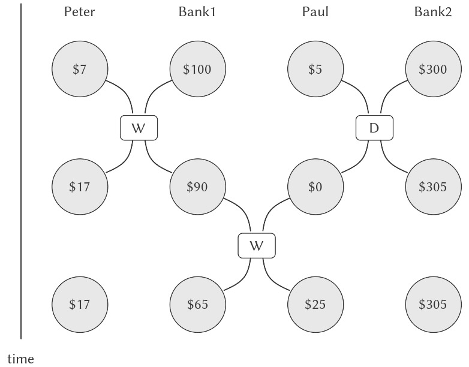

# 3.4 Concurrency: Time Is of the Essence

Chúng ta đã thấy sức mạnh của các computational object (đối tượng tính toán) với local state (trạng thái cục bộ) như những công cụ để mô hình hóa. Tuy nhiên, như 3.1.3 đã cảnh báo, sức mạnh này phải trả giá: sự mất đi của referential transparency ("tính trong suốt tham chiếu"), dẫn đến một loạt câu hỏi rắc rối về tính đồng nhất và sự thay đổi, và sự cần thiết phải từ bỏ substitution model (mô hình thay thế) của evaluation (quá trình đánh giá) để chuyển sang environment model (mô hình môi trường) phức tạp hơn.

Vấn đề cốt lõi ẩn dưới sự phức tạp của state, sameness và change là việc khi đưa assignment (gán) vào, chúng ta buộc phải thừa nhận *thời gian* trong các mô hình tính toán của mình. Trước khi đưa assignment vào, tất cả các chương trình của chúng ta đều "phi thời gian", theo nghĩa là bất kỳ biểu thức nào có giá trị thì luôn có cùng giá trị đó. Ngược lại, hãy nhớ lại ví dụ mô hình hóa việc rút tiền từ một tài khoản ngân hàng và trả về số dư còn lại, được giới thiệu ở đầu 3.1.1:

``` {.scheme}
(withdraw 25)
75

(withdraw 25)
50
```

Ở đây, các lần đánh giá liên tiếp của cùng một biểu thức cho ra các giá trị khác nhau. Hành vi này xuất phát từ thực tế rằng việc thực thi các assignment statement (câu lệnh gán) — trong trường hợp này là gán cho biến `balance` — xác định các *thời điểm* khi giá trị thay đổi. Kết quả của việc đánh giá một biểu thức không chỉ phụ thuộc vào chính biểu thức đó, mà còn phụ thuộc vào việc đánh giá diễn ra trước hay sau những thời điểm này. Việc xây dựng các mô hình dựa trên computational object với local state buộc chúng ta phải đối diện với thời gian như một khái niệm thiết yếu trong lập trình.

Chúng ta có thể tiến xa hơn trong việc cấu trúc các mô hình tính toán để phù hợp với nhận thức của mình về thế giới vật lý. Các đối tượng trong thế giới không thay đổi từng cái một theo trình tự. Thay vào đó, chúng ta nhận thức chúng như đang hoạt động *concurrently* (đồng thời) — tất cả cùng một lúc. Do đó, việc mô hình hóa các hệ thống như tập hợp các computational process (tiến trình tính toán) thực thi đồng thời thường là tự nhiên. Cũng giống như chúng ta có thể làm cho chương trình trở nên modular (mô-đun hóa) bằng cách tổ chức các mô hình theo các object với local state riêng biệt, thì việc chia các mô hình tính toán thành các phần tiến hóa riêng biệt và đồng thời cũng thường là phù hợp. Ngay cả khi các chương trình sẽ được thực thi trên một sequential computer (máy tính tuần tự), việc thực hành viết chương trình như thể chúng sẽ được thực thi đồng thời buộc lập trình viên phải tránh các ràng buộc thời gian không cần thiết, từ đó làm cho chương trình trở nên mô-đun hơn.

Ngoài việc làm cho chương trình mô-đun hơn, concurrent computation (tính toán đồng thời) có thể mang lại lợi thế về tốc độ so với sequential computation (tính toán tuần tự). Sequential computer chỉ thực hiện một thao tác tại một thời điểm, vì vậy thời gian cần để thực hiện một tác vụ tỷ lệ thuận với tổng số thao tác được thực hiện.[^1] Tuy nhiên, nếu có thể phân rã một vấn đề thành các phần tương đối độc lập và chỉ cần giao tiếp với nhau hiếm khi, thì có thể phân bổ các phần này cho các computing processor (bộ xử lý tính toán) riêng biệt, tạo ra lợi thế về tốc độ tỷ lệ với số lượng bộ xử lý sẵn có.

Thật không may, sự phức tạp do assignment mang lại trở nên còn rắc rối hơn khi có concurrency (tính đồng thời). Việc thực thi đồng thời, dù là do thế giới vận hành song song hay do máy tính của chúng ta, đều kéo theo sự phức tạp bổ sung trong việc hiểu về thời gian.


## 3.4.1 The Nature of Time in Concurrent Systems

Bề ngoài, thời gian có vẻ đơn giản. Nó là một trật tự được áp đặt lên các sự kiện.[^2] Với bất kỳ sự kiện $A$ và $B$ nào, hoặc $A$ xảy ra trước $B$, hoặc $A$ và $B$ xảy ra đồng thời, hoặc $A$ xảy ra sau $B$. Ví dụ, quay lại ví dụ tài khoản ngân hàng, giả sử Peter rút \$10 và Paul rút \$25 từ một tài khoản chung ban đầu có \$100, để lại \$65 trong tài khoản. Tùy thuộc vào thứ tự của hai lần rút, chuỗi số dư trong tài khoản sẽ là \$100 $\rightarrow$ \$90 $\rightarrow$ \$65 hoặc \$100 $\rightarrow$ \$75 $\rightarrow$ \$65. Trong một triển khai trên máy tính của hệ thống ngân hàng, chuỗi thay đổi số dư này có thể được mô hình hóa bằng các assignment liên tiếp cho biến `balance`.

Tuy nhiên, trong các tình huống phức tạp, cách nhìn này có thể gây vấn đề. Giả sử Peter và Paul, cùng những người khác, đang truy cập cùng một tài khoản ngân hàng thông qua mạng lưới các máy giao dịch ngân hàng phân bố khắp thế giới. Chuỗi số dư thực tế trong tài khoản sẽ phụ thuộc một cách quan trọng vào thời điểm chi tiết của các lần truy cập và chi tiết của việc truyền thông giữa các máy.

Sự bất định này trong thứ tự các sự kiện có thể gây ra những vấn đề nghiêm trọng trong thiết kế các hệ thống đồng thời. Ví dụ, giả sử các lần rút tiền của Peter và Paul được triển khai như hai process riêng biệt chia sẻ một biến chung `balance`, mỗi process được xác định bởi procedure đã cho trong 3.1.1:


[^1]: Most real processors actually execute a few operations at a time, following a strategy called *pipelining*. Although this technique greatly improves the effective utilization of the hardware, it is used only to speed up the execution of a sequential instruction stream, while retaining the behavior of the sequential program.

[^2]: To quote some graffiti seen on a Cambridge building wall: “Time is a device that was invented to keep everything from happening at once.”


``` {.scheme}
(define (withdraw amount)
  (if (>= balance amount)
      (begin 
        (set! balance 
              (- balance amount))
        balance)
      "Insufficient funds"))
```

Nếu hai process (tiến trình) hoạt động độc lập, thì Peter có thể kiểm tra `balance` (số dư) và cố gắng rút một khoản hợp lệ. Tuy nhiên, Paul có thể rút một khoản tiền nào đó trong khoảng thời gian giữa lúc Peter kiểm tra số dư và lúc Peter hoàn tất việc rút tiền, từ đó làm cho phép kiểm tra của Peter trở nên không còn hợp lệ.

Tình hình còn có thể tệ hơn nữa. Xét biểu thức:

``` {.scheme}
(set! balance (- balance amount))
```

được thực thi như một phần của mỗi process rút tiền. Biểu thức này bao gồm ba bước: (1) truy cập giá trị của biến `balance`; (2) tính toán số dư mới; (3) gán `balance` thành giá trị mới này. Nếu các lần rút tiền của Peter và Paul thực thi câu lệnh này đồng thời, thì hai lần rút có thể xen kẽ thứ tự truy cập `balance` và gán nó thành giá trị mới.

Biểu đồ thời gian trong Hình 3.29 mô tả một thứ tự sự kiện trong đó `balance` bắt đầu ở 100, Peter rút 10, Paul rút 25, nhưng giá trị cuối cùng của `balance` lại là 75. Như thể hiện trong biểu đồ, nguyên nhân của sự bất thường này là việc Paul gán 75 cho `balance` được thực hiện dựa trên giả định rằng giá trị của `balance` cần giảm đi là 100. Tuy nhiên, giả định đó đã trở nên không hợp lệ khi Peter thay đổi `balance` thành 90. Đây là một lỗi nghiêm trọng đối với hệ thống ngân hàng, vì tổng số tiền trong hệ thống không được bảo toàn. Trước các giao dịch, tổng số tiền là \$100. Sau đó, Peter có \$10, Paul có \$25, và ngân hàng có \$75.[^3]  


**Figure 3.29:** Timing diagram showing how interleaving the order of events in two banking withdrawals can lead to an incorrect final balance.

Hiện tượng tổng quát được minh họa ở đây là nhiều process có thể chia sẻ một state variable (biến trạng thái) chung. Điều làm cho việc này trở nên phức tạp là có thể có nhiều hơn một process đang cố gắng thao tác trên state chung cùng lúc. Trong ví dụ tài khoản ngân hàng, trong mỗi giao dịch, mỗi khách hàng nên có thể hành động như thể các khách hàng khác không tồn tại. Khi một khách hàng thay đổi số dư theo cách phụ thuộc vào số dư, anh ta phải có thể giả định rằng, ngay trước thời điểm thay đổi, số dư vẫn là giá trị mà anh ta nghĩ.


### Correct behavior of concurrent programs

Ví dụ trên là điển hình cho những lỗi tinh vi có thể len lỏi vào các concurrent program (chương trình đồng thời). Gốc rễ của sự phức tạp này nằm ở các assignment (gán) cho các biến được chia sẻ giữa các process khác nhau. Chúng ta đã biết rằng cần cẩn thận khi viết các chương trình sử dụng `set!`, vì kết quả của một phép tính phụ thuộc vào thứ tự mà các assignment xảy ra.[^4] Với các process đồng thời, chúng ta càng phải đặc biệt cẩn thận với assignment, vì có thể chúng ta không kiểm soát được thứ tự các assignment được thực hiện bởi các process khác nhau. Nếu nhiều thay đổi như vậy có thể xảy ra đồng thời (như khi hai người gửi tiền vào cùng một tài khoản chung), chúng ta cần một cách để đảm bảo hệ thống hoạt động đúng. Ví dụ, trong trường hợp rút tiền từ một tài khoản ngân hàng chung, chúng ta phải đảm bảo rằng tiền được bảo toàn. Để làm cho các concurrent program hoạt động đúng, chúng ta có thể phải áp đặt một số hạn chế lên concurrent execution (thực thi đồng thời).

Một hạn chế khả dĩ đối với concurrency (tính đồng thời) là quy định rằng không có hai thao tác nào thay đổi bất kỳ shared state variable (biến trạng thái chia sẻ) nào được xảy ra cùng lúc. Đây là một yêu cầu cực kỳ nghiêm ngặt. Đối với ngân hàng phân tán, điều này sẽ yêu cầu nhà thiết kế hệ thống đảm bảo rằng chỉ một giao dịch có thể diễn ra tại một thời điểm. Điều này vừa kém hiệu quả vừa quá thận trọng. Hình 3.30 cho thấy Peter và Paul chia sẻ một tài khoản ngân hàng, trong khi Paul cũng có một tài khoản riêng. Biểu đồ minh họa hai lần rút tiền từ tài khoản chung (một của Peter và một của Paul) và một lần gửi tiền vào tài khoản riêng của Paul.[^5] Hai lần rút tiền từ tài khoản chung không được diễn ra đồng thời (vì cả hai đều truy cập và cập nhật cùng một tài khoản), và việc gửi tiền và rút tiền của Paul cũng không được diễn ra đồng thời (vì cả hai đều truy cập và cập nhật số tiền trong ví của Paul). Nhưng không có vấn đề gì khi cho phép việc gửi tiền của Paul vào tài khoản riêng diễn ra đồng thời với việc rút tiền của Peter từ tài khoản chung.



**Figure 3.30:** Concurrent deposits and withdrawals from a joint account in Bank1 and a private account in Bank2.

Một hạn chế ít nghiêm ngặt hơn đối với concurrency sẽ đảm bảo rằng một hệ thống đồng thời tạo ra kết quả giống như thể các process đã chạy tuần tự theo một thứ tự nào đó. Có hai khía cạnh quan trọng của yêu cầu này. Thứ nhất, nó không yêu cầu các process thực sự chạy tuần tự, mà chỉ cần tạo ra kết quả giống *như thể* chúng đã chạy tuần tự. Trong ví dụ ở Hình 3.30, nhà thiết kế hệ thống tài khoản ngân hàng có thể cho phép việc gửi tiền của Paul và việc rút tiền của Peter diễn ra đồng thời, vì kết quả cuối cùng sẽ giống như thể hai thao tác này đã diễn ra tuần tự. Thứ hai, có thể có nhiều hơn một kết quả “đúng” khả dĩ được tạo ra bởi một concurrent program, vì chúng ta chỉ yêu cầu kết quả giống như với *một* thứ tự tuần tự nào đó. Ví dụ, giả sử tài khoản chung của Peter và Paul bắt đầu với \$100, và Peter gửi \$40 trong khi Paul đồng thời rút một nửa số tiền trong tài khoản. Khi thực thi tuần tự, số dư tài khoản có thể là \$70 hoặc \$90 (xem Bài tập 3.38).[^6]  

Vẫn còn những yêu cầu yếu hơn nữa cho việc thực thi đúng các concurrent program. Một chương trình mô phỏng diffusion (khuếch tán) — chẳng hạn, sự truyền nhiệt trong một vật thể — có thể bao gồm một số lượng lớn process, mỗi process đại diện cho một thể tích nhỏ của không gian, và cập nhật giá trị của chúng đồng thời. Mỗi process liên tục thay đổi giá trị của mình thành trung bình cộng của giá trị của chính nó và giá trị của các process lân cận. Thuật toán này hội tụ đến kết quả đúng bất kể thứ tự thực hiện các thao tác; không cần bất kỳ hạn chế nào đối với việc sử dụng đồng thời các giá trị chia sẻ.


[^3]: An even worse failure for this system could occur if the two `set!` operations attempt to change the balance simultaneously, in which case the actual data appearing in memory might end up being a random combination of the information being written by the two processes. Most computers have interlocks on the primitive memory-write operations, which protect against such simultaneous access. Even this seemingly simple kind of protection, however, raises implementation challenges in the design of multiprocessing computers, where elaborate *cache-coherence* protocols are required to ensure that the various processors will maintain a consistent view of memory contents, despite the fact that data may be replicated (“cached”) among the different processors to increase the speed of memory access.

[^4]: The factorial program in 3.1.3 illustrates this for a single sequential process.

[^5]: The columns show the contents of Peter’s wallet, the joint account (in Bank1), Paul’s wallet, and Paul’s private account (in Bank2), before and after each withdrawal (W) and deposit (D). Peter withdraws \$10 from Bank1; Paul deposits \$5 in Bank2, then withdraws \$25 from Bank1.

[^6]: A more formal way to express this idea is to say that concurrent programs are inherently *nondeterministic*. That is, they are described not by single-valued functions, but by functions whose results are sets of possible values. In 4.3 we will study a language for expressing nondeterministic computations.

## 3.4.2 Mechanisms for Controlling Concurrency

Chúng ta đã thấy rằng khó khăn trong việc xử lý các concurrent process (tiến trình đồng thời) bắt nguồn từ nhu cầu phải xem xét sự xen kẽ (interleaving) của thứ tự các sự kiện trong các process khác nhau. Ví dụ, giả sử chúng ta có hai process, một với ba sự kiện có thứ tự $(a,b,c)$ và một với ba sự kiện có thứ tự $(x,y,z)$. Nếu hai process này chạy đồng thời, không có ràng buộc nào về cách thực thi của chúng được xen kẽ, thì sẽ có 20 thứ tự khả dĩ khác nhau cho các sự kiện, phù hợp với thứ tự riêng của từng process:

``` {.example}
(a,b,c,x,y,z)  (a,x,b,y,c,z)  (x,a,b,c,y,z)  
(x,a,y,z,b,c)  (a,b,x,c,y,z)  (a,x,b,y,z,c)  
(x,a,b,y,c,z)  (x,y,a,b,c,z)  (a,b,x,y,c,z)  
(a,x,y,b,c,z)  (x,a,b,y,z,c)  (x,y,a,b,z,c)
(a,b,x,y,z,c)  (a,x,y,b,z,c)  (x,a,y,b,c,z)  
(x,y,a,z,b,c)  (a,x,b,c,y,z)  (a,x,y,z,b,c)  
(x,a,y,b,z,c)  (x,y,z,a,b,c)
```

Với tư cách là lập trình viên thiết kế hệ thống này, chúng ta sẽ phải xem xét tác động của từng trong số 20 thứ tự này và kiểm tra rằng mỗi hành vi đều chấp nhận được. Cách tiếp cận như vậy sẽ nhanh chóng trở nên khó kiểm soát khi số lượng process và sự kiện tăng lên.

Một cách tiếp cận thực tiễn hơn trong thiết kế các concurrent system (hệ thống đồng thời) là xây dựng các cơ chế tổng quát cho phép chúng ta ràng buộc sự xen kẽ của các concurrent process sao cho có thể đảm bảo hành vi của chương trình là đúng. Nhiều cơ chế đã được phát triển cho mục đích này. Trong phần này, chúng ta sẽ mô tả một trong số đó, gọi là *serializer*.


### Serializing access to shared state

Serialization (tuần tự hóa) hiện thực hóa ý tưởng sau: Các process sẽ thực thi đồng thời, nhưng sẽ có một số nhóm procedure (thủ tục) nhất định không thể thực thi đồng thời. Cụ thể hơn, serialization tạo ra các tập hợp procedure đặc biệt sao cho chỉ một lần thực thi của một procedure trong mỗi tập hợp tuần tự được phép xảy ra tại một thời điểm. Nếu một procedure trong tập hợp đang được thực thi, thì một process cố gắng thực thi bất kỳ procedure nào trong tập hợp đó sẽ buộc phải chờ cho đến khi lần thực thi đầu tiên kết thúc.

Chúng ta có thể sử dụng serialization để kiểm soát việc truy cập vào các shared variable (biến chia sẻ). Ví dụ, nếu chúng ta muốn cập nhật một shared variable dựa trên giá trị trước đó của biến này, chúng ta đặt việc truy cập giá trị trước đó và việc gán giá trị mới cho biến vào cùng một procedure. Sau đó, chúng ta đảm bảo rằng không có procedure nào khác gán cho biến này có thể chạy đồng thời với procedure đó bằng cách tuần tự hóa tất cả các procedure này với cùng một serializer. Điều này đảm bảo rằng giá trị của biến không thể bị thay đổi giữa lúc truy cập và lúc gán tương ứng.


### Serializers in Scheme

Để làm cho cơ chế trên trở nên cụ thể hơn, giả sử rằng chúng ta đã mở rộng Scheme để bao gồm một procedure gọi là `parallel-execute`:

``` {.scheme}
(parallel-execute ⟨p₁⟩ 
                  ⟨p₂⟩ 
                  … 
                  ⟨pₖ⟩)
```

Mỗi `⟨`p`⟩` phải là một procedure không có đối số. `Parallel-execute` tạo ra một process riêng cho mỗi `⟨`p`⟩`, và áp dụng `⟨`p`⟩` (không có đối số). Các process này đều chạy đồng thời.[^7]  

Ví dụ về cách sử dụng như sau:

``` {.scheme}
(define x 10)
(parallel-execute (lambda () (set! x (* x x)))
                  (lambda () (set! x (+ x 1))))
```

Điều này tạo ra hai concurrent process — $P_{1}$, tiến trình gán `x` thành `x` nhân với `x`, và $P_{2}$, tiến trình tăng `x` lên 1. Sau khi thực thi hoàn tất, `x` sẽ có một trong năm giá trị khả dĩ, tùy thuộc vào sự xen kẽ của các sự kiện trong $P_{1}$ và $P_{2}$:


[^7]: `Parallel-execute` is not part of standard Scheme, but it can be implemented in MIT Scheme. In our implementation, the new concurrent processes also run concurrently with the original Scheme process. Also, in our implementation, the value returned by `parallel-execute` is a special control object that can be used to halt the newly created processes.


``` {.example}
101: 
  
    P
    1
  
 sets x to 100 and then 
  
    P
    2
  
 increments
     x to 101.
121: 
  
    P
    2
  
 increments x to 11 and then 
  
    P
    1
  
 sets
     x to x times x.
110: 
  
    P
    2
  
 changes x from 10 to 11 between the 
     two times that 
  
    P
    1
  
 accesses the value of 
     x during the evaluation of (* x x).
 11: 
  
    P
    2
  
 accesses x, then 
  
    P
    1
  
 sets x to 100, 
     then 
  
    P
    2
  
 sets x.
100: 
  
    P
    1
  
 accesses x (twice), then 
  
    P
    2
  
 sets
     x to 11, then 
  
    P
    1
  
 sets x.
```


Chúng ta có thể giới hạn concurrency (tính đồng thời) bằng cách sử dụng các serialized procedure (thủ tục được tuần tự hóa), được tạo ra bởi *serializer*. Serializer được xây dựng bởi `make-serializer`, phần triển khai được đưa ra bên dưới. Một serializer nhận một procedure làm đối số và trả về một serialized procedure hoạt động giống như procedure gốc. Tất cả các lời gọi đến cùng một serializer sẽ trả về các serialized procedure thuộc cùng một tập hợp.

Do đó, trái ngược với ví dụ ở trên, việc thực thi

``` {.scheme}
(define x 10)
(define s (make-serializer))
(parallel-execute 
 (s (lambda () (set! x (* x x))))
 (s (lambda () (set! x (+ x 1)))))
```

chỉ có thể tạo ra hai giá trị khả dĩ cho `x`, 101 hoặc 121. Các khả năng khác bị loại bỏ, vì việc thực thi của $P_{1}$ và $P_{2}$ không thể bị xen kẽ.

Dưới đây là một phiên bản của procedure `make-account` từ 3.1.1, trong đó các thao tác gửi tiền và rút tiền đã được tuần tự hóa:

``` {.scheme}
(define (make-account balance)
  (define (withdraw amount)
    (if (>= balance amount)
        (begin (set! balance 
                     (- balance amount))
               balance)
        "Insufficient funds"))
  (define (deposit amount)
    (set! balance (+ balance amount))
    balance)
  (let ((protected (make-serializer)))
    (define (dispatch m)
      (cond ((eq? m 'withdraw) 
             (protected withdraw))
            ((eq? m 'deposit) 
             (protected deposit))
            ((eq? m 'balance) 
             balance)
            (else (error "Unknown request: 
                          MAKE-ACCOUNT"
                         m))))
    dispatch))
```

Với cách triển khai này, hai process không thể đồng thời rút tiền hoặc gửi tiền vào cùng một tài khoản. Điều này loại bỏ nguyên nhân gây ra lỗi được minh họa trong Hình 3.29, nơi Peter thay đổi số dư tài khoản giữa thời điểm Paul truy cập số dư để tính toán giá trị mới và thời điểm Paul thực hiện phép gán. Mặt khác, mỗi tài khoản có serializer riêng, do đó việc gửi tiền và rút tiền ở các tài khoản khác nhau có thể diễn ra đồng thời.

### Complexity of using multiple shared resources

Serializer cung cấp một abstraction (trừu tượng hóa) mạnh mẽ giúp cô lập sự phức tạp của các concurrent program để có thể xử lý chúng một cách cẩn thận và (hy vọng là) chính xác. Tuy nhiên, trong khi việc sử dụng serializer tương đối đơn giản khi chỉ có một shared resource (tài nguyên chia sẻ) duy nhất (chẳng hạn như một tài khoản ngân hàng), thì lập trình đồng thời có thể trở nên cực kỳ khó khăn khi có nhiều shared resource.

Để minh họa một trong những khó khăn có thể phát sinh, giả sử chúng ta muốn hoán đổi số dư của hai tài khoản ngân hàng. Chúng ta truy cập từng tài khoản để lấy số dư, tính toán hiệu số giữa các số dư, rút hiệu số này từ một tài khoản và gửi nó vào tài khoản kia. Chúng ta có thể triển khai như sau:[^8]  

``` {.scheme}
(define (exchange account1 account2)
  (let ((difference (- (account1 'balance)
                       (account2 'balance))))
    ((account1 'withdraw) difference)
    ((account2 'deposit) difference)))
```

Procedure này hoạt động tốt khi chỉ có một process duy nhất cố gắng thực hiện việc hoán đổi. Tuy nhiên, giả sử Peter và Paul đều có quyền truy cập vào các tài khoản $a1$, $a2$, và $a3$, và Peter hoán đổi $a1$ và $a2$ trong khi Paul đồng thời hoán đổi $a1$ và $a3$. Ngay cả khi việc gửi và rút tiền ở từng tài khoản đã được tuần tự hóa riêng (như trong procedure `make-account` được trình bày ở phần trên), `exchange` vẫn có thể tạo ra kết quả sai. Ví dụ, Peter có thể tính toán hiệu số giữa số dư của $a1$ và $a2$, nhưng sau đó Paul có thể thay đổi số dư của $a1$ trước khi Peter hoàn tất việc hoán đổi.[^9] Để đảm bảo hành vi đúng, chúng ta phải sắp xếp để procedure `exchange` khóa mọi truy cập đồng thời khác vào các tài khoản trong suốt thời gian thực hiện hoán đổi.

Một cách để thực hiện điều này là sử dụng serializer của cả hai tài khoản để tuần tự hóa toàn bộ procedure `exchange`. Để làm điều này, chúng ta sẽ sắp xếp để có thể truy cập serializer của một tài khoản. Lưu ý rằng chúng ta đang cố ý phá vỡ tính modularity (tính mô-đun) của đối tượng bank-account bằng cách để lộ serializer. Phiên bản `make-account` sau đây giống hệt phiên bản gốc được đưa ra trong 3.1.1, ngoại trừ việc một serializer được cung cấp để bảo vệ biến balance, và serializer này được xuất ra thông qua message passing (truyền thông điệp):


[^8]: We have simplified `exchange` by exploiting the fact that our `deposit` message accepts negative amounts. (This is a serious bug in our banking system!)

[^9]: If the account balances start out as \$10, \$20, and \$30, then after any number of concurrent exchanges, the balances should still be \$10, \$20, and \$30 in some order. Serializing the deposits to individual accounts is not sufficient to guarantee this. See Exercise 3.43.


``` {.scheme}
(define (make-account-and-serializer balance)
  (define (withdraw amount)
    (if (>= balance amount)
        (begin 
          (set! balance (- balance amount))
          balance)
        "Insufficient funds"))
  (define (deposit amount)
    (set! balance (+ balance amount))
    balance)
  (let ((balance-serializer 
         (make-serializer)))
    (define (dispatch m)
      (cond ((eq? m 'withdraw) withdraw)
            ((eq? m 'deposit) deposit)
            ((eq? m 'balance) balance)
            ((eq? m 'serializer) 
             balance-serializer)
            (else (error "Unknown request: 
                          MAKE-ACCOUNT"
                         m))))
    dispatch))
```

Chúng ta có thể sử dụng cách này để thực hiện các thao tác gửi tiền và rút tiền được tuần tự hóa. Tuy nhiên, không giống như tài khoản đã được tuần tự hóa trước đây, giờ đây trách nhiệm thuộc về từng người dùng của các đối tượng bank-account để quản lý việc tuần tự hóa một cách tường minh, ví dụ như sau:[^10]  

``` {.scheme}
(define (deposit account amount)
  (let ((s (account 'serializer))
        (d (account 'deposit)))
    ((s d) amount)))
```

Việc xuất (export) serializer theo cách này cho chúng ta đủ linh hoạt để triển khai một chương trình hoán đổi (exchange) được tuần tự hóa. Chúng ta chỉ cần tuần tự hóa procedure `exchange` gốc với serializer của cả hai tài khoản:

``` {.scheme}
(define (serialized-exchange account1 account2)
  (let ((serializer1 (account1 'serializer))
        (serializer2 (account2 'serializer)))
    ((serializer1 (serializer2 exchange))
     account1
     account2)))
```

### Implementing serializers

Chúng ta triển khai serializer dựa trên một cơ chế đồng bộ hóa (synchronization) nguyên thủy hơn gọi là *mutex*. Một mutex là một đối tượng hỗ trợ hai thao tác — mutex có thể được *acquired* (chiếm quyền) và mutex có thể được *released* (giải phóng). Khi một mutex đã được acquire, không có thao tác acquire nào khác trên mutex đó có thể tiếp tục cho đến khi mutex được release.[^11] Trong phần triển khai của chúng ta, mỗi serializer có một mutex liên kết. Khi nhận một procedure `p`, serializer trả về một procedure sẽ acquire mutex, chạy `p`, và sau đó release mutex. Điều này đảm bảo rằng chỉ một trong các procedure được tạo ra bởi serializer có thể chạy tại một thời điểm, và đây chính là thuộc tính tuần tự hóa mà chúng ta cần đảm bảo.

``` {.scheme}
(define (make-serializer)
  (let ((mutex (make-mutex)))
    (lambda (p)
      (define (serialized-p . args)
        (mutex 'acquire)
        (let ((val (apply p args)))
          (mutex 'release)
          val))
      serialized-p)))
```

Mutex là một đối tượng mutable (có thể thay đổi) (ở đây chúng ta sẽ sử dụng một danh sách một phần tử, gọi là *cell*) có thể chứa giá trị true hoặc false. Khi giá trị là false, mutex sẵn sàng để được acquire. Khi giá trị là true, mutex không sẵn sàng, và bất kỳ process nào cố gắng acquire mutex sẽ phải chờ.

Hàm khởi tạo mutex `make-mutex` bắt đầu bằng cách khởi tạo nội dung cell thành false. Để acquire mutex, chúng ta kiểm tra cell. Nếu mutex sẵn sàng, chúng ta đặt nội dung cell thành true và tiếp tục. Ngược lại, chúng ta chờ trong một vòng lặp, cố gắng acquire lặp đi lặp lại cho đến khi mutex sẵn sàng.[^12] Để release mutex, chúng ta đặt nội dung cell thành false.

``` {.scheme}
(define (make-mutex)
  (let ((cell (list false)))
    (define (the-mutex m)
      (cond ((eq? m 'acquire)
             (if (test-and-set! cell)
                 (the-mutex 'acquire))) ; retry
            ((eq? m 'release) (clear! cell))))
    the-mutex))
(define (clear! cell) (set-car! cell false))
```

`Test-and-set!` kiểm tra cell và trả về kết quả của phép kiểm tra. Ngoài ra, nếu phép kiểm tra trả về false, `test-and-set!` sẽ đặt nội dung cell thành true trước khi trả về false. Chúng ta có thể biểu diễn hành vi này bằng procedure sau:

``` {.scheme}
(define (test-and-set! cell)
  (if (car cell)
      true
      (begin (set-car! cell true)
             false)))
```


[^10]: Exercise 3.45 investigates why deposits and withdrawals are no longer automatically serialized by the account.

[^11]: The term “mutex” is an abbreviation for *mutual exclusion*. The general problem of arranging a mechanism that permits concurrent processes to safely share resources is called the mutual exclusion problem. Our mutex is a simple variant of the *semaphore* mechanism (see Exercise 3.47), which was introduced in the “THE” Multiprogramming System developed at the Technological University of Eindhoven and named for the university’s initials in Dutch (Dijkstra 1968a). The acquire and release operations were originally called P and V, from the Dutch words *passeren* (to pass) and *vrijgeven* (to release), in reference to the semaphores used on railroad systems. Dijkstra’s classic exposition (1968b) was one of the first to clearly present the issues of concurrency control, and showed how to use semaphores to handle a variety of concurrency problems.

[^12]: In most time-shared operating systems, processes that are blocked by a mutex do not waste time “busy-waiting” as above. Instead, the system schedules another process to run while the first is waiting, and the blocked process is awakened when the mutex becomes available.

Tuy nhiên, phần triển khai `test-and-set!` này chưa đủ để đáp ứng yêu cầu. Có một điểm tinh tế quan trọng ở đây, và đây chính là nơi mà concurrency control (kiểm soát tính đồng thời) đi vào hệ thống: thao tác `test-and-set!` phải được thực hiện *atomically* (nguyên tử). Nghĩa là, chúng ta phải đảm bảo rằng, một khi một process đã kiểm tra cell và thấy nó là false, thì nội dung của cell sẽ thực sự được đặt thành true trước khi bất kỳ process nào khác có thể kiểm tra cell. Nếu không đảm bảo điều này, mutex có thể gặp lỗi tương tự như lỗi tài khoản ngân hàng trong Hình 3.29. (Xem Bài tập 3.46.)

Phần triển khai thực tế của `test-and-set!` phụ thuộc vào chi tiết cách hệ thống của chúng ta chạy các concurrent process. Ví dụ, chúng ta có thể đang thực thi các concurrent process trên một sequential processor (bộ xử lý tuần tự) bằng cơ chế time-slicing (chia thời gian), cơ chế này luân phiên qua các process, cho phép mỗi process chạy trong một khoảng thời gian ngắn trước khi tạm dừng nó và chuyển sang process tiếp theo. Trong trường hợp đó, `test-and-set!` có thể hoạt động bằng cách vô hiệu hóa time slicing trong suốt quá trình kiểm tra và gán giá trị.[^13] Ngoài ra, các multiprocessing computer (máy tính đa xử lý) cung cấp các lệnh hỗ trợ thao tác nguyên tử trực tiếp trong phần cứng.[^14]  

### Deadlock

Bây giờ, khi đã thấy cách triển khai serializer, chúng ta có thể nhận ra rằng việc hoán đổi tài khoản vẫn gặp vấn đề, ngay cả với procedure `serialized-exchange` ở trên. Hãy tưởng tượng Peter cố gắng hoán đổi $a1$ với $a2$ trong khi Paul đồng thời cố gắng hoán đổi $a2$ với $a1$. Giả sử process của Peter đến điểm mà nó đã vào một serialized procedure bảo vệ $a1$, và ngay sau đó, process của Paul vào một serialized procedure bảo vệ $a2$. Lúc này, Peter không thể tiếp tục (để vào serialized procedure bảo vệ $a2$) cho đến khi Paul thoát khỏi serialized procedure bảo vệ $a2$. Tương tự, Paul không thể tiếp tục cho đến khi Peter thoát khỏi serialized procedure bảo vệ $a1$. Mỗi process bị kẹt mãi mãi, chờ đợi process kia. Tình huống này được gọi là *deadlock* (bế tắc). Deadlock luôn là một mối nguy trong các hệ thống cho phép truy cập đồng thời vào nhiều shared resource (tài nguyên chia sẻ).

Một cách để tránh deadlock trong tình huống này là gán cho mỗi tài khoản một số nhận dạng duy nhất và viết lại `serialized-exchange` sao cho một process sẽ luôn cố gắng vào procedure bảo vệ tài khoản có số nhỏ hơn trước. Mặc dù phương pháp này hoạt động tốt cho bài toán hoán đổi, nhưng vẫn có những tình huống khác đòi hỏi các kỹ thuật tránh deadlock tinh vi hơn, hoặc nơi mà deadlock hoàn toàn không thể tránh được. (Xem Bài tập 3.48 và Bài tập 3.49.)[^15]  

### Concurrency, time, and communication

Chúng ta đã thấy rằng lập trình các concurrent system (hệ thống đồng thời) đòi hỏi phải kiểm soát thứ tự các sự kiện khi các process khác nhau truy cập shared state (trạng thái chia sẻ), và chúng ta đã thấy cách đạt được sự kiểm soát này thông qua việc sử dụng hợp lý serializer. Nhưng vấn đề của concurrency còn sâu xa hơn thế, bởi vì, xét từ góc độ cơ bản, không phải lúc nào cũng rõ ràng “shared state” nghĩa là gì.

Các cơ chế như `test-and-set!` yêu cầu các process kiểm tra một cờ (flag) chia sẻ toàn cục tại những thời điểm tùy ý. Điều này gây khó khăn và kém hiệu quả khi triển khai trên các bộ xử lý tốc độ cao hiện đại, nơi mà do các kỹ thuật tối ưu hóa như pipelining và cached memory, nội dung bộ nhớ có thể không ở trạng thái nhất quán tại mọi thời điểm. Do đó, trong các hệ thống multiprocessing hiện đại, mô hình serializer đang được thay thế bởi các phương pháp mới để kiểm soát concurrency.[^16]  

Các khía cạnh rắc rối của shared state cũng xuất hiện trong các hệ thống phân tán lớn. Ví dụ, hãy tưởng tượng một hệ thống ngân hàng phân tán, nơi các chi nhánh ngân hàng riêng lẻ duy trì giá trị số dư tài khoản cục bộ và định kỳ so sánh chúng với giá trị được duy trì bởi các chi nhánh khác. Trong một hệ thống như vậy, giá trị của “số dư tài khoản” sẽ không xác định, ngoại trừ ngay sau khi đồng bộ hóa. Nếu Peter gửi tiền vào một tài khoản mà anh ta đồng sở hữu với Paul, khi nào chúng ta nên nói rằng số dư tài khoản đã thay đổi — khi số dư ở chi nhánh cục bộ thay đổi, hay chỉ sau khi đồng bộ hóa? Và nếu Paul truy cập tài khoản từ một chi nhánh khác, những ràng buộc hợp lý nào cần đặt ra cho hệ thống ngân hàng để hành vi được coi là “đúng”? Điều duy nhất có thể quan trọng đối với tính đúng đắn là hành vi được quan sát bởi từng người (Peter và Paul) và “trạng thái” của tài khoản ngay sau khi đồng bộ hóa. Các câu hỏi về “số dư thực” của tài khoản hoặc thứ tự các sự kiện giữa các lần đồng bộ hóa có thể là không liên quan hoặc vô nghĩa.[^17]  

Hiện tượng cơ bản ở đây là việc đồng bộ hóa các process khác nhau, thiết lập shared state, hoặc áp đặt một thứ tự lên các sự kiện đều đòi hỏi sự giao tiếp giữa các process. Về bản chất, bất kỳ khái niệm nào về thời gian trong kiểm soát concurrency đều phải gắn chặt với giao tiếp.[^18] Thật thú vị khi thấy rằng một mối liên hệ tương tự giữa thời gian và giao tiếp cũng xuất hiện trong Thuyết Tương đối, nơi tốc độ ánh sáng (tín hiệu nhanh nhất có thể được sử dụng để đồng bộ hóa các sự kiện) là một hằng số cơ bản liên kết thời gian và không gian. Sự phức tạp mà chúng ta gặp phải khi xử lý thời gian và trạng thái trong các mô hình tính toán của mình thực tế có thể phản chiếu một sự phức tạp cơ bản của vũ trụ vật lý.


[^13]: In MIT Scheme for a single processor, which uses a time-slicing model, `test-and-set!` can be implemented as follows:

[^14]: There are many variants of such instructions—including test-and-set, test-and-clear, swap, compare-and-exchange, load-reserve, and store-conditional—whose design must be carefully matched to the machine’s processor-memory interface. One issue that arises here is to determine what happens if two processes attempt to acquire the same resource at exactly the same time by using such an instruction. This requires some mechanism for making a decision about which process gets control. Such a mechanism is called an *arbiter*. Arbiters usually boil down to some sort of hardware device. Unfortunately, it is possible to prove that one cannot physically construct a fair arbiter that works 100% of the time unless one allows the arbiter an arbitrarily long time to make its decision. The fundamental phenomenon here was originally observed by the fourteenth-century French philosopher Jean Buridan in his commentary on Aristotle’s *De caelo*. Buridan argued that a perfectly rational dog placed between two equally attractive sources of food will starve to death, because it is incapable of deciding which to go to first.

[^15]: The general technique for avoiding deadlock by numbering the shared resources and acquiring them in order is due to Havender (1968). Situations where deadlock cannot be avoided require *deadlock-recovery* methods, which entail having processes “back out” of the deadlocked state and try again. Deadlock-recovery mechanisms are widely used in database management systems, a topic that is treated in detail in Gray and Reuter 1993.

[^16]: One such alternative to serialization is called *barrier synchronization*. The programmer permits concurrent processes to execute as they please, but establishes certain synchronization points (“barriers”) through which no process can proceed until all the processes have reached the barrier. Modern processors provide machine instructions that permit programmers to establish synchronization points at places where consistency is required. The PowerPC, for example, includes for this purpose two instructions called SYNC and EIEIO (Enforced In-order Execution of Input/Output).

[^17]: This may seem like a strange point of view, but there are systems that work this way. International charges to credit-card accounts, for example, are normally cleared on a per-country basis, and the charges made in different countries are periodically reconciled. Thus the account balance may be different in different countries.

[^18]: For distributed systems, this perspective was pursued by Lamport (1978), who showed how to use communication to establish “global clocks” that can be used to establish orderings on events in distributed systems.