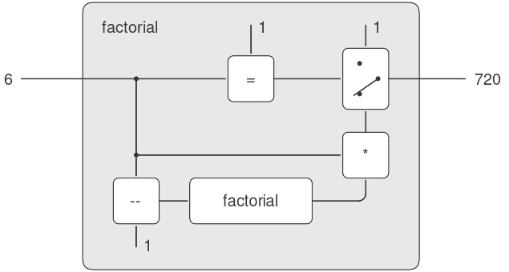

# 4.1 Bộ thông dịch Metacircular

Bộ thông dịch (evaluator) của chúng ta cho Lisp sẽ được hiện thực như một chương trình Lisp. Có thể điều này nghe có vẻ vòng lặp khi nghĩ về việc đánh giá (evaluate) các chương trình Lisp bằng một bộ thông dịch cũng được viết bằng Lisp. Tuy nhiên, evaluation (quá trình đánh giá) là một *process* (quá trình), vì vậy việc mô tả quá trình này bằng Lisp là hoàn toàn hợp lý, bởi Lisp chính là công cụ của chúng ta để mô tả các quá trình[^1]. Một bộ thông dịch được viết bằng chính ngôn ngữ mà nó đánh giá được gọi là *metacircular*.

Bộ thông dịch metacircular về cơ bản là một hiện thực bằng Scheme của *environment model of evaluation* (mô hình môi trường của quá trình đánh giá) đã được mô tả ở mục 3.2. Hãy nhớ rằng mô hình này có hai phần cơ bản:

1.  Để đánh giá một *combination* (tổ hợp — một biểu thức phức hợp không phải *special form*), ta đánh giá các *subexpression* (biểu thức con) rồi áp dụng giá trị của *operator subexpression* (biểu thức toán tử) lên các giá trị của *operand subexpression* (biểu thức toán hạng).
2.  Để áp dụng một *compound procedure* (thủ tục phức hợp) lên một tập đối số, ta đánh giá phần *body* (thân) của procedure trong một *environment* (môi trường) mới. Để tạo ra môi trường này, ta mở rộng phần môi trường của đối tượng procedure bằng một *frame* (khung) trong đó các *formal parameter* (tham số hình thức) của procedure được gán với các đối số mà procedure được áp dụng.

Hai quy tắc này mô tả bản chất của quá trình evaluation: một chu trình cơ bản trong đó các biểu thức cần được đánh giá trong môi trường được rút gọn thành các procedure sẽ được áp dụng lên các đối số, rồi lại được rút gọn thành các biểu thức mới để đánh giá trong các môi trường mới, và cứ thế tiếp diễn, cho đến khi ta gặp các *symbol* (ký hiệu) — giá trị của chúng được tra cứu trong môi trường — và các *primitive procedure* (thủ tục nguyên thủy) — được áp dụng trực tiếp (xem Hình 4.1)[^2]. Chu trình evaluation này sẽ được thể hiện qua sự tương tác giữa hai procedure quan trọng trong bộ thông dịch: `eval` và `apply`, được mô tả ở mục 4.1.1 (xem Hình 4.1).


**Figure 4.1:** The `eval`-`apply` cycle exposes the essence of a computer language.

Việc hiện thực bộ thông dịch sẽ phụ thuộc vào các procedure định nghĩa *syntax* (cú pháp) của các biểu thức cần đánh giá. Chúng ta sẽ sử dụng *data abstraction* (trừu tượng hóa dữ liệu) để làm cho bộ thông dịch độc lập với cách biểu diễn của ngôn ngữ. Ví dụ, thay vì cố định rằng một *assignment* (gán) được biểu diễn bằng một danh sách bắt đầu với symbol `set!`, ta sử dụng một *abstract predicate* (mệnh đề trừu tượng) `assignment?` để kiểm tra xem đó có phải là một assignment hay không, và sử dụng các *abstract selector* (bộ chọn trừu tượng) `assignment-variable` và `assignment-value` để truy cập các phần của một assignment. Việc hiện thực các biểu thức sẽ được mô tả chi tiết ở mục 4.1.2. Ngoài ra còn có các thao tác, được mô tả ở mục 4.1.3, quy định cách biểu diễn các procedure và environment. Ví dụ, `make-procedure` tạo ra các compound procedure, `lookup-variable-value` truy cập giá trị của biến, và `apply-primitive-procedure` áp dụng một primitive procedure lên một danh sách đối số cho trước.

## 4.1.1 Lõi của bộ thông dịch

Quá trình evaluation có thể được mô tả như sự tương tác giữa hai procedure: `eval` và `apply`.

### Eval

`Eval` nhận vào hai đối số: một *expression* (biểu thức) và một environment. Nó phân loại biểu thức và điều hướng quá trình đánh giá. `Eval` được cấu trúc như một phân tích theo trường hợp dựa trên *syntactic type* (kiểu cú pháp) của biểu thức cần đánh giá. Để giữ cho procedure này tổng quát, ta diễn đạt việc xác định kiểu của một biểu thức một cách trừu tượng, không ràng buộc vào bất kỳ cách biểu diễn cụ thể nào cho các loại biểu thức khác nhau. Mỗi loại biểu thức có một *predicate* (mệnh đề kiểm tra) để nhận diện và một phương thức trừu tượng để chọn các thành phần của nó. *Abstract syntax* (cú pháp trừu tượng) này giúp ta dễ dàng thay đổi cú pháp của ngôn ngữ bằng cách sử dụng cùng một bộ thông dịch nhưng với một tập hợp procedure cú pháp khác.

**Primitive expressions**

- Với *self-evaluating expression* (biểu thức tự đánh giá), chẳng hạn như số, `eval` trả về chính biểu thức đó.
- `Eval` phải tra cứu các biến trong environment để tìm giá trị của chúng.

**Special forms**

- Với *quoted expression* (biểu thức trích dẫn), `eval` trả về biểu thức được trích dẫn.
- Một assignment hoặc *definition* (định nghĩa) của biến phải đệ quy gọi `eval` để tính toán giá trị mới sẽ gán cho biến. Environment phải được sửa đổi để thay đổi (hoặc tạo mới) *binding* (liên kết) của biến.
- Một biểu thức `if` yêu cầu xử lý đặc biệt các thành phần của nó, sao cho đánh giá *consequent* (nhánh đúng) nếu *predicate* (điều kiện) là đúng, và ngược lại thì đánh giá *alternative* (nhánh sai).
- Một biểu thức `lambda` phải được biến đổi thành một procedure có thể áp dụng bằng cách đóng gói các *parameter* (tham số) và *body* được chỉ định bởi biểu thức `lambda` cùng với environment của quá trình đánh giá.
- Một biểu thức `begin` yêu cầu đánh giá tuần tự các biểu thức của nó theo đúng thứ tự xuất hiện.
- Một *case analysis* (`cond`) được biến đổi thành một chuỗi lồng nhau của các biểu thức `if` rồi được đánh giá.

**Combinations**

- Với một *procedure application* (ứng dụng thủ tục), `eval` phải đệ quy đánh giá phần *operator* và các *operand* của combination. Procedure và các đối số thu được sẽ được truyền cho `apply`, procedure này sẽ xử lý việc áp dụng thủ tục thực sự.

Dưới đây là định nghĩa của `eval`:

``` {.scheme}
(define (eval exp env)
  (cond ((self-evaluating? exp) 
         exp)
        ((variable? exp) 
         (lookup-variable-value exp env))
        ((quoted? exp) 
         (text-of-quotation exp))
        ((assignment? exp) 
         (eval-assignment exp env))
        ((definition? exp) 
         (eval-definition exp env))
        ((if? exp) 
         (eval-if exp env))
        ((lambda? exp)
         (make-procedure 
          (lambda-parameters exp)
          (lambda-body exp)
          env))
        ((begin? exp)
         (eval-sequence 
          (begin-actions exp) 
          env))
        ((cond? exp) 
         (eval (cond->if exp) env))
        ((application? exp)
         (apply (eval (operator exp) env)
                (list-of-values 
                 (operands exp) 
                 env)))
        (else
         (error "Unknown expression 
                 type: EVAL" exp))))
```


[^1]: Mặc dù vậy, vẫn còn những khía cạnh quan trọng của quá trình evaluation mà bộ thông dịch này không làm sáng tỏ. Quan trọng nhất trong số đó là các cơ chế chi tiết mà các procedure gọi các procedure khác và trả về giá trị cho lời gọi của chúng. Chúng ta sẽ giải quyết các vấn đề này ở Chương 5, nơi chúng ta xem xét kỹ hơn quá trình evaluation bằng cách hiện thực bộ thông dịch như một *register machine* (máy thanh ghi) đơn giản.

[^2]: Nếu chúng ta cho phép mình khả năng áp dụng các primitive, vậy còn lại điều gì cần hiện thực trong bộ thông dịch? Nhiệm vụ của bộ thông dịch không phải là xác định các primitive của ngôn ngữ, mà là cung cấp *connective tissue* (mô liên kết) — phương tiện kết hợp và phương tiện trừu tượng hóa — để gắn kết một tập hợp các primitive thành một ngôn ngữ. Cụ thể là:....


Để rõ ràng, `eval` đã được hiện thực như một phân tích theo trường hợp sử dụng `cond`. Nhược điểm của cách này là procedure (thủ tục) của chúng ta chỉ xử lý được một vài loại biểu thức có thể phân biệt được, và không thể định nghĩa loại mới nếu không chỉnh sửa định nghĩa của `eval`. Trong hầu hết các hiện thực Lisp, việc phân nhánh theo loại của một biểu thức được thực hiện theo *data-directed style* (phong cách điều hướng theo dữ liệu). Cách này cho phép người dùng thêm các loại biểu thức mới mà `eval` có thể phân biệt, mà không cần sửa đổi định nghĩa của `eval` (xem Bài tập 4.3).

### Apply

`Apply` nhận hai đối số: một procedure và một danh sách các đối số mà procedure sẽ được áp dụng lên. `Apply` phân loại procedure thành hai loại: nó gọi `apply-primitive-procedure` để áp dụng các primitive; nó áp dụng các compound procedure bằng cách tuần tự đánh giá các biểu thức tạo nên phần body của procedure. Environment cho việc đánh giá body của một compound procedure được tạo ra bằng cách mở rộng environment cơ sở mà procedure mang theo, để bao gồm một frame ràng buộc các parameter của procedure với các đối số mà procedure sẽ được áp dụng. Dưới đây là định nghĩa của `apply`:

``` {.scheme}
(define (apply procedure arguments)
  (cond ((primitive-procedure? procedure)
         (apply-primitive-procedure 
          procedure 
          arguments))
        ((compound-procedure? procedure)
         (eval-sequence
           (procedure-body procedure)
           (extend-environment
             (procedure-parameters 
              procedure)
             arguments
             (procedure-environment 
              procedure))))
        (else
         (error "Unknown procedure 
                 type: APPLY" 
                procedure))))
```

### Procedure arguments

Khi `eval` xử lý một *procedure application* (ứng dụng thủ tục), nó sử dụng `list-of-values` để tạo ra danh sách các đối số mà procedure sẽ được áp dụng lên. `List-of-values` nhận vào các operand của combination. Nó đánh giá từng operand và trả về một danh sách các giá trị tương ứng:[^3]

``` {.scheme}
(define (list-of-values exps env)
  (if (no-operands? exps)
      '()
      (cons (eval (first-operand exps) env)
            (list-of-values 
             (rest-operands exps) 
             env))))
```

### Conditionals

`Eval-if` đánh giá phần *predicate* của một biểu thức `if` trong environment đã cho. Nếu kết quả là true, `eval-if` đánh giá *consequent*, ngược lại nó đánh giá *alternative*:

``` {.scheme}
(define (eval-if exp env)
  (if (true? (eval (if-predicate exp) env))
      (eval (if-consequent exp) env)
      (eval (if-alternative exp) env)))
```

Việc sử dụng `true?` trong `eval-if` làm nổi bật vấn đề về mối liên hệ giữa *implemented language* (ngôn ngữ được hiện thực) và *implementation language* (ngôn ngữ hiện thực). `If-predicate` được đánh giá trong ngôn ngữ được hiện thực và do đó trả về một giá trị trong ngôn ngữ đó. *Interpreter predicate* `true?` dịch giá trị đó thành một giá trị có thể được kiểm tra bởi `if` trong ngôn ngữ hiện thực: *Metacircular representation* (biểu diễn metacircular) của giá trị đúng có thể không giống với biểu diễn của Scheme nền tảng[^4].

### Sequences

`Eval-sequence` được `apply` sử dụng để đánh giá chuỗi các biểu thức trong body của một procedure và được `eval` sử dụng để đánh giá chuỗi các biểu thức trong một biểu thức `begin`. Nó nhận vào một chuỗi các biểu thức và một environment, và đánh giá các biểu thức theo thứ tự xuất hiện. Giá trị trả về là giá trị của biểu thức cuối cùng.

``` {.scheme}
(define (eval-sequence exps env)
  (cond ((last-exp? exps) 
         (eval (first-exp exps) env))
        (else 
         (eval (first-exp exps) env)
         (eval-sequence (rest-exps exps) 
                        env))))
```

### Assignments and definitions

Procedure sau đây xử lý các assignment cho biến. Nó gọi `eval` để tìm giá trị sẽ được gán và truyền biến cùng giá trị thu được cho `set-variable-value!` để cài đặt trong environment được chỉ định.

``` {.scheme}
(define (eval-assignment exp env)
  (set-variable-value! 
   (assignment-variable exp)
   (eval (assignment-value exp) env)
   env)
  'ok)
```

Các *definition* của biến được xử lý theo cách tương tự[^5].

``` {.scheme}
(define (eval-definition exp env)
  (define-variable! 
    (definition-variable exp)
    (eval (definition-value exp) env)
    env)
  'ok)
```

Chúng tôi chọn trả về symbol `ok` như giá trị của một assignment hoặc một definition[^6].


[^3]: Chúng ta có thể đã đơn giản hóa mệnh đề `application?` trong `eval` bằng cách sử dụng `map` (và quy định rằng `operands` trả về một danh sách) thay vì viết tường minh procedure `list-of-values`. Chúng tôi chọn không dùng `map` ở đây để nhấn mạnh rằng bộ thông dịch có thể được hiện thực mà không cần sử dụng bất kỳ *higher-order procedure* (thủ tục bậc cao) nào (và do đó có thể được viết trong một ngôn ngữ không có thủ tục bậc cao), mặc dù ngôn ngữ mà nó hỗ trợ sẽ bao gồm các thủ tục bậc cao.

[^4]: Trong trường hợp này, ngôn ngữ được hiện thực và ngôn ngữ hiện thực là giống nhau. Việc suy ngẫm về ý nghĩa của `true?` ở đây mang lại sự mở rộng nhận thức mà không cần lạm dụng chất kích thích.

[^5]: Việc hiện thực `define` này bỏ qua một vấn đề tinh tế trong xử lý *internal definition* (định nghĩa nội bộ), mặc dù nó hoạt động đúng trong hầu hết các trường hợp. Chúng ta sẽ thấy vấn đề này và cách giải quyết ở mục 4.1.6.

[^6]: Như chúng tôi đã nói khi giới thiệu `define` và `set!`, các giá trị này phụ thuộc vào hiện thực trong Scheme — nghĩa là, người hiện thực có thể chọn giá trị nào sẽ trả về.

## 4.1.2 Biểu diễn Expressions

Bộ thông dịch (evaluator) gợi nhớ đến chương trình *symbolic differentiation* (vi phân ký hiệu) đã được thảo luận ở mục 2.3.2. Cả hai chương trình đều thao tác trên *symbolic expression* (biểu thức ký hiệu). Trong cả hai chương trình, kết quả của việc thao tác trên một *compound expression* (biểu thức phức hợp) được xác định bằng cách đệ quy thao tác trên các phần của biểu thức và kết hợp các kết quả theo một cách phụ thuộc vào loại của biểu thức. Trong cả hai chương trình, chúng ta đều sử dụng *data abstraction* (trừu tượng hóa dữ liệu) để tách rời các quy tắc thao tác tổng quát khỏi chi tiết về cách biểu diễn các biểu thức. Trong chương trình vi phân, điều này có nghĩa là cùng một *differentiation procedure* (thủ tục vi phân) có thể xử lý các biểu thức đại số ở dạng *prefix* (tiền tố), *infix* (trung tố), hoặc một dạng khác. Đối với bộ thông dịch, điều này có nghĩa là *syntax* (cú pháp) của ngôn ngữ được đánh giá được xác định hoàn toàn bởi các procedure phân loại và trích xuất các phần của biểu thức.

Dưới đây là đặc tả cú pháp của ngôn ngữ chúng ta:

- Các *self-evaluating item* (phần tử tự đánh giá) duy nhất là số và chuỗi:
    ``` {.scheme}
    (define (self-evaluating? exp)
      (cond ((number? exp) true)
            ((string? exp) true)
            (else false)))
    ```

- *Variable* (biến) được biểu diễn bằng *symbol* (ký hiệu):
    ``` {.scheme}
    (define (variable? exp) (symbol? exp))
    ```

- *Quotation* (biểu thức trích dẫn) có dạng `(quote ⟨text-of-quotation⟩)`:[^7]

    ``` {.scheme}
    (define (quoted? exp)
      (tagged-list? exp 'quote))

    (define (text-of-quotation exp)
      (cadr exp))
    ```

    `Quoted?` được định nghĩa dựa trên procedure `tagged-list?`, procedure này nhận diện các danh sách bắt đầu bằng một symbol được chỉ định:

    ``` {.scheme}
    (define (tagged-list? exp tag)
      (if (pair? exp)
          (eq? (car exp) tag)
          false))
    ```

- *Assignment* (gán) có dạng `(set! ⟨var⟩ ⟨value⟩)`:
    ``` {.scheme}
    (define (assignment? exp)
      (tagged-list? exp 'set!))

    (define (assignment-variable exp) 
      (cadr exp))

    (define (assignment-value exp) (caddr exp))
    ```

- *Definition* (định nghĩa) có dạng

    ``` {.scheme}
    (define ⟨var⟩ ⟨value⟩)
    ```

    hoặc dạng

    ``` {.scheme}
    (define (⟨var⟩ ⟨param₁⟩ … ⟨paramₙ⟩)
      ⟨body⟩)
    ```

    Dạng sau (định nghĩa procedure chuẩn) là *syntactic sugar* (cú pháp rút gọn) cho

    ``` {.scheme}
    (define ⟨var⟩
      (lambda (⟨param₁⟩ … ⟨paramₙ⟩)
        ⟨body⟩))
    ```

    Các *syntax procedure* (thủ tục cú pháp) tương ứng như sau:

    ``` {.scheme}
    (define (definition? exp)
      (tagged-list? exp 'define))

    (define (definition-variable exp)
      (if (symbol? (cadr exp))
          (cadr exp)
          (caadr exp)))

    (define (definition-value exp)
      (if (symbol? (cadr exp))
          (caddr exp)
          (make-lambda 
           (cdadr exp)   ; formal parameters
           (cddr exp)))) ; body
    ```

- Biểu thức `lambda` là danh sách bắt đầu bằng symbol `lambda`:

    ``` {.scheme}
    (define (lambda? exp) 
      (tagged-list? exp 'lambda))
    (define (lambda-parameters exp) (cadr exp))
    (define (lambda-body exp) (cddr exp))
    ```

    Chúng ta cũng cung cấp một *constructor* (hàm tạo) cho biểu thức `lambda`, được sử dụng bởi `definition-value` ở trên:

    ``` {.scheme}
    (define (make-lambda parameters body)
      (cons 'lambda (cons parameters body)))
    ```

- *Conditional* (câu điều kiện) bắt đầu với `if` và có một *predicate* (điều kiện), một *consequent* (nhánh đúng), và một *alternative* (nhánh sai — tùy chọn). Nếu biểu thức không có phần alternative, chúng ta cung cấp `false` làm alternative[^8].

    ``` {.scheme}
    (define (if? exp) (tagged-list? exp 'if))
    (define (if-predicate exp) (cadr exp))
    (define (if-consequent exp) (caddr exp))
    (define (if-alternative exp)
      (if (not (null? (cdddr exp)))
          (cadddr exp)
          'false))
    ```

    Chúng ta cũng cung cấp một constructor cho biểu thức `if`, được `cond->if` sử dụng để biến đổi các biểu thức `cond` thành các biểu thức `if`:

    ``` {.scheme}
    (define (make-if predicate 
                     consequent 
                     alternative)
      (list 'if 
            predicate 
            consequent 
            alternative))
    ```

- `Begin` đóng gói một chuỗi các biểu thức thành một biểu thức duy nhất. Chúng ta bao gồm các thao tác cú pháp trên biểu thức `begin` để trích xuất chuỗi thực tế từ biểu thức `begin`, cũng như các *selector* (bộ chọn) trả về biểu thức đầu tiên và phần còn lại của chuỗi[^9].

    ``` {.scheme}
    (define (begin? exp) 
      (tagged-list? exp 'begin))
    (define (begin-actions exp) (cdr exp))
    (define (last-exp? seq) (null? (cdr seq)))
    (define (first-exp seq) (car seq))
    (define (rest-exps seq) (cdr seq))
    ```

    Chúng ta cũng bao gồm một constructor `sequence->exp` (được `cond->if` sử dụng) để biến đổi một chuỗi thành một biểu thức duy nhất, sử dụng `begin` nếu cần:

    ``` {.scheme}
    (define (sequence->exp seq)
      (cond ((null? seq) seq)
            ((last-exp? seq) (first-exp seq))
            (else (make-begin seq))))

    (define (make-begin seq) (cons 'begin seq))
    ```

- Một *procedure application* (ứng dụng thủ tục) là bất kỳ biểu thức phức hợp nào không thuộc các loại biểu thức ở trên. `Car` của biểu thức là *operator* (toán tử), và `cdr` là danh sách các *operand* (toán hạng):
    ``` {.scheme}
    (define (application? exp) (pair? exp))
    (define (operator exp) (car exp))
    (define (operands exp) (cdr exp))
    (define (no-operands? ops) (null? ops))
    (define (first-operand ops) (car ops))
    (define (rest-operands ops) (cdr ops))
    ```


[^7]: Như đã đề cập ở mục 2.3.1, bộ thông dịch nhìn một *quoted expression* (biểu thức trích dẫn) như một danh sách bắt đầu với `quote`, ngay cả khi biểu thức được gõ với dấu nháy đơn. Ví dụ, biểu thức `'a` sẽ được bộ thông dịch nhìn như `(quote a)`. Xem Bài tập 2.55.

[^8]: Giá trị của một biểu thức `if` khi *predicate* là false và không có alternative là không được chỉ định trong Scheme; ở đây chúng ta chọn giá trị là false. Chúng ta sẽ hỗ trợ việc sử dụng các biến `true` và `false` trong các biểu thức được đánh giá bằng cách ràng buộc chúng trong *global environment* (môi trường toàn cục). Xem mục 4.1.4.

[^9]: Các selector này cho một danh sách biểu thức — và các selector tương ứng cho một danh sách operand — không nhằm mục đích là một *data abstraction*. Chúng được giới thiệu như các tên gợi nhớ cho các thao tác danh sách cơ bản để giúp dễ hiểu hơn bộ thông dịch *explicit-control* (điều khiển tường minh) ở mục 5.4.


### Derived expressions

Một số *special form* (dạng đặc biệt) trong ngôn ngữ của chúng ta có thể được định nghĩa dựa trên các biểu thức liên quan đến các special form khác, thay vì được hiện thực trực tiếp. Một ví dụ là `cond`, có thể được hiện thực như một chuỗi lồng nhau của các biểu thức `if`. Ví dụ, chúng ta có thể rút gọn bài toán đánh giá biểu thức

``` {.scheme}
(cond ((> x 0) x)
      ((= x 0) (display 'zero) 0)
      (else (- x)))
```

thành bài toán đánh giá biểu thức sau, có sử dụng các biểu thức `if` và `begin`:

``` {.scheme}
(if (> x 0)
    x
    (if (= x 0)
        (begin (display 'zero) 0)
        (- x)))
```

Hiện thực việc đánh giá `cond` theo cách này giúp đơn giản hóa bộ thông dịch vì nó giảm số lượng special form mà quá trình đánh giá phải được chỉ định tường minh.

Chúng ta bao gồm các *syntax procedure* (thủ tục cú pháp) để trích xuất các phần của một biểu thức `cond`, và một procedure `cond->if` để biến đổi các biểu thức `cond` thành các biểu thức `if`. Một *case analysis* (phân tích trường hợp) bắt đầu với `cond` và có một danh sách các *predicate-action clause* (mệnh đề điều kiện-hành động). Một mệnh đề là mệnh đề `else` nếu *predicate* của nó là symbol `else`.[^10]


``` {.scheme}
(define (cond? exp) 
  (tagged-list? exp 'cond))
(define (cond-clauses exp) (cdr exp))
(define (cond-else-clause? clause)
  (eq? (cond-predicate clause) 'else))
(define (cond-predicate clause) 
  (car clause))
(define (cond-actions clause) 
  (cdr clause))
(define (cond->if exp)
  (expand-clauses (cond-clauses exp)))
(define (expand-clauses clauses)
  (if (null? clauses)
      'false     ; no else clause
      (let ((first (car clauses))
            (rest (cdr clauses)))
        (if (cond-else-clause? first)
            (if (null? rest)
                (sequence->exp 
                 (cond-actions first))
                (error "ELSE clause isn't 
                        last: COND->IF"
                       clauses))
            (make-if (cond-predicate first)
                     (sequence->exp 
                      (cond-actions first))
                     (expand-clauses 
                      rest))))))
```


Các biểu thức (như `cond`) mà chúng ta chọn hiện thực dưới dạng các *syntactic transformation* (biến đổi cú pháp) được gọi là *derived expression* (biểu thức dẫn xuất). Biểu thức `let` cũng là derived expression (xem Bài tập 4.6).[^11]

## 4.1.3 Evaluator Data Structures

Ngoài việc định nghĩa cú pháp bên ngoài của các biểu thức, hiện thực của bộ thông dịch cũng phải định nghĩa các *data structure* (cấu trúc dữ liệu) mà bộ thông dịch thao tác nội bộ, như một phần của việc thực thi chương trình, chẳng hạn như cách biểu diễn *procedure* và *environment*, cũng như cách biểu diễn giá trị true và false.

### Testing of predicates

Đối với các câu điều kiện, chúng ta chấp nhận bất kỳ giá trị nào là true miễn là nó không phải đối tượng `false` tường minh.

``` {.scheme}
(define (true? x)
  (not (eq? x false)))

(define (false? x)
  (eq? x false))
```

### Representing procedures

Để xử lý *primitive* (thủ tục nguyên thủy), chúng ta giả định rằng có sẵn các procedure sau:

- `(apply-primitive-procedure ⟨proc⟩ ⟨args⟩)`

    áp dụng primitive procedure đã cho lên các giá trị đối số trong danh sách `⟨`args`⟩` và trả về kết quả của việc áp dụng.

- `(primitive-procedure? ⟨proc⟩)`

    kiểm tra xem `⟨`proc`⟩` có phải là một primitive procedure hay không.

Các cơ chế xử lý primitive này sẽ được mô tả chi tiết hơn ở mục 4.1.4.

Các *compound procedure* (thủ tục phức hợp) được tạo từ các parameter, phần body của procedure, và environment bằng cách sử dụng *constructor* `make-procedure`:

``` {.scheme}
(define (make-procedure parameters body env)
  (list 'procedure parameters body env))
(define (compound-procedure? p)
  (tagged-list? p 'procedure))
(define (procedure-parameters p) (cadr p))
(define (procedure-body p) (caddr p))
(define (procedure-environment p) (cadddr p))
```

### Operations on Environments

Bộ thông dịch cần các thao tác để xử lý environment. Như đã giải thích ở mục 3.2, một environment là một chuỗi các *frame* (khung), trong đó mỗi frame là một bảng các *binding* (liên kết) gán các biến với giá trị tương ứng của chúng. Chúng ta sử dụng các thao tác sau để xử lý environment:

- `(lookup-variable-value ⟨var⟩ ⟨env⟩)`

    trả về giá trị được gán cho symbol `⟨`var`⟩` trong environment `⟨`env`⟩`, hoặc báo lỗi nếu biến chưa được gán.

- `(extend-environment ⟨variables⟩ ⟨values⟩ ⟨base-env⟩)`

    trả về một environment mới, bao gồm một frame mới trong đó các symbol trong danh sách `⟨`variables`⟩` được gán với các phần tử tương ứng trong danh sách `⟨`values⟩`, với environment bao ngoài là environment `⟨`base-env`⟩`.

- `(define-variable! ⟨var⟩ ⟨value⟩ ⟨env⟩)`

    thêm vào frame đầu tiên trong environment `⟨`env`⟩` một binding mới gán biến `⟨`var`⟩` với giá trị `⟨`value`⟩`.

- `(set-variable-value! ⟨var⟩ ⟨value⟩ ⟨env⟩)`

    thay đổi binding của biến `⟨`var`⟩` trong environment `⟨`env`⟩` để biến này được gán với giá trị `⟨`value`⟩`, hoặc báo lỗi nếu biến chưa được gán.

Để hiện thực các thao tác này, chúng ta biểu diễn một environment như một danh sách các frame. *Enclosing environment* (môi trường bao ngoài) của một environment là `cdr` của danh sách. *Empty environment* (môi trường rỗng) đơn giản là danh sách rỗng.

``` {.scheme}
(define (enclosing-environment env) (cdr env))
(define (first-frame env) (car env))
(define the-empty-environment '())
```

Mỗi frame của một environment được biểu diễn như một cặp danh sách: một danh sách các biến được gán trong frame đó và một danh sách các giá trị tương ứng.[^12]

``` {.scheme}
(define (make-frame variables values)
  (cons variables values))
(define (frame-variables frame) (car frame))
(define (frame-values frame) (cdr frame))
(define (add-binding-to-frame! var val frame)
  (set-car! frame (cons var (car frame)))
  (set-cdr! frame (cons val (cdr frame))))
```

Để mở rộng một environment bằng một frame mới gán các biến với giá trị, chúng ta tạo một frame gồm danh sách biến và danh sách giá trị, rồi nối nó vào environment. Chúng ta báo lỗi nếu số lượng biến không khớp với số lượng giá trị.

``` {.scheme}
(define (extend-environment vars vals base-env)
  (if (= (length vars) (length vals))
      (cons (make-frame vars vals) base-env)
      (if (< (length vars) (length vals))
          (error "Too many arguments supplied" 
                 vars 
                 vals)
          (error "Too few arguments supplied" 
                 vars 
                 vals))))
```

Để tra cứu một biến trong environment, chúng ta quét danh sách các biến trong frame đầu tiên. Nếu tìm thấy biến mong muốn, chúng ta trả về phần tử tương ứng trong danh sách giá trị. Nếu không tìm thấy trong frame hiện tại, chúng ta tìm tiếp trong *enclosing environment*, và cứ thế tiếp tục. Nếu đến *empty environment*, chúng ta báo lỗi “unbound variable” (biến chưa được gán).

``` {.scheme}
(define (lookup-variable-value var env)
  (define (env-loop env)
    (define (scan vars vals)
      (cond ((null? vars)
             (env-loop 
              (enclosing-environment env)))
            ((eq? var (car vars))
             (car vals))
            (else (scan (cdr vars) 
                        (cdr vals)))))
    (if (eq? env the-empty-environment)
        (error "Unbound variable" var)
        (let ((frame (first-frame env)))
          (scan (frame-variables frame)
                (frame-values frame)))))
  (env-loop env))
```


[^10]: Giá trị của một biểu thức `cond` khi tất cả các *predicate* đều false và không có mệnh đề `else` là không được chỉ định trong Scheme; ở đây chúng ta chọn giá trị là false.

[^11]: Các hệ thống Lisp thực tế cung cấp một cơ chế cho phép người dùng thêm các derived expression mới và chỉ định cách hiện thực chúng dưới dạng các syntactic transformation mà không cần sửa đổi bộ thông dịch. Một phép biến đổi do người dùng định nghĩa như vậy được gọi là *macro*. Mặc dù dễ dàng thêm một cơ chế cơ bản để định nghĩa macro, nhưng ngôn ngữ thu được sẽ gặp các vấn đề tinh vi về xung đột tên....


Để gán một biến với một giá trị mới trong một environment (môi trường) được chỉ định, chúng ta quét tìm biến đó, giống như trong `lookup-variable-value`, và thay đổi giá trị tương ứng khi tìm thấy.

``` {.scheme}
(define (set-variable-value! var val env)
  (define (env-loop env)
    (define (scan vars vals)
      (cond ((null? vars)
             (env-loop 
              (enclosing-environment env)))
            ((eq? var (car vars))
             (set-car! vals val))
            (else (scan (cdr vars) 
                        (cdr vals)))))
    (if (eq? env the-empty-environment)
        (error "Unbound variable: SET!" var)
        (let ((frame (first-frame env)))
          (scan (frame-variables frame)
                (frame-values frame)))))
  (env-loop env))
```

Để định nghĩa một biến, chúng ta tìm trong frame đầu tiên một *binding* (liên kết) cho biến đó, và thay đổi binding nếu nó tồn tại (giống như trong `set-variable-value!`). Nếu không tồn tại binding như vậy, chúng ta thêm một binding mới vào frame đầu tiên.

``` {.scheme}
(define (define-variable! var val env)
  (let ((frame (first-frame env)))
    (define (scan vars vals)
      (cond ((null? vars)
             (add-binding-to-frame! 
              var val frame))
            ((eq? var (car vars))
             (set-car! vals val))
            (else (scan (cdr vars) 
                        (cdr vals)))))
    (scan (frame-variables frame)
          (frame-values frame))))
```

Phương pháp được mô tả ở đây chỉ là một trong nhiều cách hợp lý để biểu diễn environment. Vì chúng ta đã sử dụng *data abstraction* (trừu tượng hóa dữ liệu) để tách phần còn lại của bộ thông dịch khỏi lựa chọn chi tiết về cách biểu diễn, nên chúng ta có thể thay đổi cách biểu diễn environment nếu muốn. (Xem Bài tập 4.11.) Trong một hệ thống Lisp chất lượng sản phẩm, tốc độ của các thao tác trên environment của bộ thông dịch — đặc biệt là việc tra cứu biến — có ảnh hưởng lớn đến hiệu năng của hệ thống. Cách biểu diễn được mô tả ở đây, mặc dù đơn giản về mặt khái niệm, nhưng không hiệu quả và thường sẽ không được sử dụng trong một hệ thống sản phẩm.[^13]

## 4.1.4 Running the Evaluator as a Program

Với bộ thông dịch trong tay, chúng ta có một mô tả (biểu diễn bằng Lisp) về quá trình mà các biểu thức Lisp được đánh giá. Một lợi thế của việc biểu diễn bộ thông dịch như một chương trình là chúng ta có thể chạy chương trình đó. Điều này cho phép chúng ta, khi chạy trong Lisp, có một mô hình hoạt động của cách mà chính Lisp đánh giá các biểu thức. Mô hình này có thể đóng vai trò là khung để thử nghiệm các quy tắc đánh giá, như chúng ta sẽ làm sau trong chương này.

Chương trình bộ thông dịch của chúng ta cuối cùng rút gọn các biểu thức thành việc áp dụng các *primitive procedure* (thủ tục nguyên thủy). Do đó, tất cả những gì chúng ta cần để chạy bộ thông dịch là tạo ra một cơ chế gọi đến hệ thống Lisp nền tảng để mô phỏng việc áp dụng các primitive procedure.

Phải có một binding cho mỗi tên primitive procedure, để khi `eval` đánh giá toán tử của một ứng dụng primitive, nó sẽ tìm thấy một đối tượng để truyền cho `apply`. Vì vậy, chúng ta thiết lập một *global environment* (môi trường toàn cục) liên kết các đối tượng duy nhất với tên của các primitive procedure có thể xuất hiện trong các biểu thức mà chúng ta sẽ đánh giá. Global environment cũng bao gồm các binding cho các symbol `true` và `false`, để chúng có thể được sử dụng như các biến trong các biểu thức cần đánh giá.


[^13]: Nhược điểm của cách biểu diễn này (cũng như biến thể trong Bài tập 4.11) là bộ thông dịch có thể phải tìm qua nhiều frame để tìm binding cho một biến nhất định. (Cách tiếp cận như vậy được gọi là *deep binding*.) Một cách để tránh sự kém hiệu quả này là sử dụng một chiến lược gọi là *lexical addressing*, sẽ được thảo luận ở mục 5.5.6.

``` {.scheme}
(define (setup-environment)
  (let ((initial-env
         (extend-environment 
          (primitive-procedure-names)
          (primitive-procedure-objects)
          the-empty-environment)))
    (define-variable! 'true true initial-env)
    (define-variable! 'false false initial-env)
    initial-env))

(define the-global-environment 
  (setup-environment))
```

Không quan trọng chúng ta biểu diễn các đối tượng *primitive procedure* (thủ tục nguyên thủy) như thế nào, miễn là `apply` có thể nhận diện và áp dụng chúng bằng cách sử dụng các procedure `primitive-procedure?` và `apply-primitive-procedure`. Chúng ta chọn cách biểu diễn một primitive procedure như một danh sách bắt đầu với symbol `primitive` và chứa một procedure trong Lisp nền tảng hiện thực primitive đó.

``` {.scheme}
(define (primitive-procedure? proc)
  (tagged-list? proc 'primitive))

(define (primitive-implementation proc) 
  (cadr proc))
```

`Setup-environment` sẽ lấy các tên primitive và các procedure hiện thực từ một danh sách:[^14]

``` {.scheme}
(define primitive-procedures
  (list (list 'car car)
        (list 'cdr cdr)
        (list 'cons cons)
        (list 'null? null?)
        ⟨more primitives⟩ ))

(define (primitive-procedure-names)
  (map car primitive-procedures))

(define (primitive-procedure-objects)
  (map (lambda (proc) 
         (list 'primitive (cadr proc)))
       primitive-procedures))
```

Để áp dụng một primitive procedure, chúng ta chỉ cần áp dụng procedure hiện thực nó lên các đối số, sử dụng hệ thống Lisp nền tảng:[^15]

``` {.scheme}
(define (apply-primitive-procedure proc args)
  (apply-in-underlying-scheme
   (primitive-implementation proc) args))
```

Để thuận tiện khi chạy bộ thông dịch *metacircular*, chúng ta cung cấp một *driver loop* (vòng lặp điều khiển) mô phỏng vòng lặp *read-eval-print* của hệ thống Lisp nền tảng. Nó in ra một *prompt* (dấu nhắc), đọc một biểu thức nhập vào, đánh giá biểu thức này trong *global environment* (môi trường toàn cục), và in kết quả. Chúng ta đặt trước mỗi kết quả in ra một *output prompt* (dấu nhắc xuất) để phân biệt giá trị của biểu thức với các đầu ra khác có thể được in.[^16]

``` {.scheme}
(define input-prompt  ";;; M-Eval input:")
(define output-prompt ";;; M-Eval value:")

(define (driver-loop)
  (prompt-for-input input-prompt)
  (let ((input (read)))
    (let ((output 
           (eval input 
                 the-global-environment)))
      (announce-output output-prompt)
      (user-print output)))
  (driver-loop))

(define (prompt-for-input string)
  (newline) (newline) 
  (display string) (newline))

(define (announce-output string)
  (newline) (display string) (newline))
```

Chúng ta sử dụng một procedure in đặc biệt, `user-print`, để tránh in phần environment của một *compound procedure* (thủ tục phức hợp), vốn có thể là một danh sách rất dài (hoặc thậm chí chứa vòng lặp).

``` {.scheme}
(define (user-print object)
  (if (compound-procedure? object)
      (display 
       (list 'compound-procedure
             (procedure-parameters object)
             (procedure-body object)
             '<procedure-env>))
      (display object)))
```

Giờ đây, tất cả những gì chúng ta cần làm để chạy bộ thông dịch là khởi tạo global environment và bắt đầu driver loop. Sau đây là một ví dụ tương tác:

``` {.scheme}
(define the-global-environment 
  (setup-environment))

(driver-loop)

;;; M-Eval input:
(define (append x y)
  (if (null? x)
      y
      (cons (car x) (append (cdr x) y))))

;;; M-Eval value:
ok

;;; M-Eval input:
(append '(a b c) '(d e f))

;;; M-Eval value:
(a b c d e f)
```

## 4.1.5 Data as Programs

Khi suy nghĩ về một chương trình Lisp đánh giá các biểu thức Lisp, một phép so sánh có thể hữu ích. Một cách nhìn vận hành về ý nghĩa của một chương trình là: chương trình là mô tả của một *abstract machine* (máy trừu tượng) (có thể là vô hạn). Ví dụ, hãy xem xét chương trình quen thuộc để tính giai thừa:

``` {.scheme}
(define (factorial n)
  (if (= n 1)
      1
      (* (factorial (- n 1)) n)))
```

Chúng ta có thể xem chương trình này như mô tả của một cỗ máy chứa các bộ phận giảm giá trị, nhân, và kiểm tra bằng nhau, cùng với một công tắc hai vị trí và một máy tính giai thừa khác. (Máy tính giai thừa này là vô hạn vì nó chứa một máy tính giai thừa khác bên trong nó.) Hình 4.2 là sơ đồ luồng của máy tính giai thừa, cho thấy cách các bộ phận được kết nối với nhau.



**Figure 4.2:** The factorial program, viewed as an abstract machine.

Tương tự, chúng ta có thể xem bộ thông dịch như một cỗ máy đặc biệt nhận đầu vào là mô tả của một cỗ máy khác. Khi nhận đầu vào này, bộ thông dịch tự cấu hình để mô phỏng cỗ máy được mô tả. Ví dụ, nếu chúng ta đưa cho bộ thông dịch định nghĩa của `factorial`, như minh họa ở Hình 4.3, bộ thông dịch sẽ có thể tính giai thừa.


**Figure 4.3:** The evaluator emulating a factorial machine.


[^14]: Bất kỳ procedure nào được định nghĩa trong Lisp nền tảng đều có thể được sử dụng như một primitive cho bộ thông dịch metacircular. Tên của một primitive được cài đặt trong bộ thông dịch không nhất thiết phải giống với tên của hiện thực của nó trong Lisp nền tảng; ở đây các tên giống nhau vì bộ thông dịch metacircular hiện thực chính Scheme. Ví dụ, chúng ta có thể đặt `(list 'first car)` hoặc `(list 'square (lambda (x) (* x x)))` vào danh sách `primitive-procedures`.

[^15]: `Apply-in-underlying-scheme` là procedure `apply` mà chúng ta đã sử dụng ở các chương trước. Procedure `apply` của bộ thông dịch metacircular (mục 4.1.1) mô phỏng hoạt động của primitive này. Việc có hai thứ khác nhau cùng tên `apply` dẫn đến một vấn đề kỹ thuật khi chạy bộ thông dịch metacircular, vì định nghĩa `apply` của bộ thông dịch sẽ che khuất định nghĩa của primitive. Một cách giải quyết là đổi tên `apply` của metacircular để tránh xung đột với tên của primitive procedure. Ở đây, chúng ta giả định rằng đã lưu một tham chiếu đến `apply` của Lisp nền tảng bằng cách thực hiện.

[^16]: Primitive procedure `read` chờ nhập từ người dùng và trả về biểu thức hoàn chỉnh tiếp theo được gõ vào. Ví dụ, nếu người dùng gõ `(+ 23 x)`, `read` trả về một danh sách ba phần tử chứa symbol `+`, số 23, và symbol `x`. Nếu người dùng gõ `'x`, `read` trả về một danh sách hai phần tử chứa symbol `quote` và symbol `x`.

Từ góc nhìn này, bộ thông dịch (evaluator) của chúng ta được xem như một *universal machine* (máy vạn năng). Nó mô phỏng các máy khác khi những máy này được mô tả dưới dạng các chương trình Lisp.[^17] Điều này thật đáng chú ý. Hãy thử tưởng tượng một bộ thông dịch tương tự cho các mạch điện. Đó sẽ là một mạch nhận đầu vào là một tín hiệu mã hóa sơ đồ của một mạch khác, chẳng hạn như một bộ lọc. Khi nhận đầu vào này, bộ thông dịch mạch sẽ hoạt động như một bộ lọc có cùng mô tả. Một mạch điện vạn năng như vậy gần như phức tạp đến mức khó tưởng tượng. Thật đáng kinh ngạc là bộ thông dịch chương trình lại là một chương trình khá đơn giản.[^18]

Một khía cạnh đáng chú ý khác của bộ thông dịch là nó đóng vai trò như một cầu nối giữa các *data object* (đối tượng dữ liệu) được ngôn ngữ lập trình của chúng ta thao tác và chính ngôn ngữ lập trình đó. Hãy tưởng tượng chương trình bộ thông dịch (được hiện thực bằng Lisp) đang chạy, và một người dùng đang gõ các biểu thức vào bộ thông dịch và quan sát kết quả. Từ góc nhìn của người dùng, một biểu thức nhập vào như `(* x x)` là một biểu thức trong ngôn ngữ lập trình, mà bộ thông dịch sẽ thực thi. Tuy nhiên, từ góc nhìn của bộ thông dịch, biểu thức này đơn giản chỉ là một danh sách (trong trường hợp này, là một danh sách gồm ba symbol: `*`, `x`, và `x`) sẽ được thao tác theo một tập hợp các quy tắc được xác định rõ ràng.

Việc các chương trình của người dùng chính là dữ liệu của bộ thông dịch không nhất thiết gây nhầm lẫn. Thực tế, đôi khi việc bỏ qua sự phân biệt này lại hữu ích, và cho phép người dùng có thể tường minh đánh giá một đối tượng dữ liệu như một biểu thức Lisp, bằng cách cung cấp `eval` để sử dụng trong các chương trình. Nhiều *Lisp dialect* (biến thể Lisp) cung cấp một primitive `eval` procedure nhận vào một biểu thức và một environment, rồi đánh giá biểu thức đó trong ngữ cảnh của environment này.[^19] Do đó,

``` {.scheme}
(eval '(* 5 5) user-initial-environment)
```

và

``` {.scheme}
(eval (cons '* (list 5 5)) 
      user-initial-environment)
```

đều sẽ trả về 25.[^20]

## 4.1.6 Internal Definitions

*Mô hình environment* (môi trường) của quá trình đánh giá và bộ thông dịch metacircular của chúng ta thực thi các *definition* (định nghĩa) theo trình tự, mở rộng *environment frame* (khung môi trường) từng định nghĩa một. Điều này đặc biệt thuận tiện cho việc phát triển chương trình tương tác, khi lập trình viên cần tự do kết hợp việc áp dụng các procedure với việc định nghĩa các procedure mới. Tuy nhiên, nếu chúng ta suy nghĩ kỹ về các *internal definition* (định nghĩa nội bộ) được sử dụng để hiện thực *block structure* (cấu trúc khối) (được giới thiệu ở mục 1.1.8), chúng ta sẽ thấy rằng việc mở rộng environment theo từng tên một có thể không phải là cách tốt nhất để định nghĩa các biến cục bộ.

Hãy xem xét một procedure với các internal definition, chẳng hạn như:

``` {.scheme}
(define (f x)
  (define (even? n)
    (if (= n 0)
        true
        (odd? (- n 1))))
  (define (odd? n)
    (if (= n 0)
        false
        (even? (- n 1))))
  ⟨rest of body of f⟩)
```

Ý định của chúng ta ở đây là tên `odd?` trong phần thân của procedure `even?` sẽ tham chiếu đến procedure `odd?` được định nghĩa sau `even?`. *Scope* (phạm vi) của tên `odd?` là toàn bộ phần thân của `f`, chứ không chỉ phần thân của `f` bắt đầu từ vị trí xuất hiện `define` cho `odd?`. Thật vậy, khi xem xét rằng `odd?` bản thân nó được định nghĩa dựa trên `even?` — nghĩa là `even?` và `odd?` là các procedure đệ quy lẫn nhau — chúng ta thấy rằng cách diễn giải thỏa đáng duy nhất cho hai `define` này là coi như các tên `even?` và `odd?` được thêm vào environment đồng thời. Tổng quát hơn, trong block structure, phạm vi của một tên cục bộ là toàn bộ phần thân procedure trong đó `define` được đánh giá.


[^17]: Việc các máy được mô tả bằng Lisp là không quan trọng. Nếu chúng ta đưa cho bộ thông dịch một chương trình Lisp hoạt động như một bộ thông dịch cho một ngôn ngữ khác, chẳng hạn C, thì bộ thông dịch Lisp sẽ mô phỏng bộ thông dịch C, và bộ thông dịch C đó lại có thể mô phỏng bất kỳ máy nào được mô tả bằng một chương trình C. Tương tự, viết một bộ thông dịch Lisp bằng C sẽ tạo ra một chương trình C có thể thực thi bất kỳ chương trình Lisp nào. Ý tưởng sâu xa ở đây là bất kỳ bộ thông dịch nào cũng có thể mô phỏng bất kỳ bộ thông dịch nào khác. Do đó, khái niệm “những gì về nguyên tắc có thể tính toán được” (bỏ qua các yếu tố thực tế về thời gian và bộ nhớ cần thiết) là độc lập với ngôn ngữ hay máy tính, và thay vào đó phản ánh một khái niệm nền tảng về *computability* (tính khả tính). Điều này lần đầu tiên được chứng minh rõ ràng bởi Alan M. Turing (1912-1954), người mà bài báo năm 1936 đã đặt nền móng cho khoa học máy tính lý thuyết. Trong bài báo đó, Turing trình bày một mô hình tính toán đơn giản — nay được gọi là *Turing machine* (máy Turing) — và lập luận rằng bất kỳ “quy trình hiệu quả” nào cũng có thể được biểu diễn thành một chương trình cho máy này. (Lập luận này được gọi là *Church-Turing thesis*.) Turing sau đó đã hiện thực một *universal machine* (máy vạn năng), tức là một máy Turing hoạt động như một bộ thông dịch cho các chương trình máy Turing. Ông đã sử dụng khuôn khổ này để chứng minh rằng có những bài toán được xác định rõ nhưng không thể tính toán bằng máy Turing (xem Bài tập 4.15), và do đó cũng không thể được biểu diễn thành “quy trình hiệu quả”. Turing cũng đã có những đóng góp nền tảng cho khoa học máy tính thực tiễn. Ví dụ, ông đã phát minh ra ý tưởng cấu trúc hóa chương trình bằng các *subroutine* (chương trình con) đa dụng. Xem Hodges 1983 để biết tiểu sử của Turing.

[^18]: Một số người thấy khó tin rằng một bộ thông dịch, vốn được hiện thực bằng một procedure tương đối đơn giản, lại có thể mô phỏng các chương trình phức tạp hơn chính nó. Sự tồn tại của một *universal evaluator machine* (máy thông dịch vạn năng) là một thuộc tính sâu sắc và tuyệt vời của tính toán. *Recursion theory* (lý thuyết đệ quy), một nhánh của logic toán học, nghiên cứu các giới hạn logic của tính toán. Cuốn sách tuyệt đẹp *Gödel, Escher, Bach* của Douglas Hofstadter khám phá một số ý tưởng này (Hofstadter 1979).

[^19]: Cảnh báo: Primitive `eval` này không giống với procedure `eval` mà chúng ta đã hiện thực ở mục 4.1.1, vì nó sử dụng *actual Scheme environment* (môi trường Scheme thực) thay vì các cấu trúc environment mẫu mà chúng ta đã xây dựng ở mục 4.1.3. Các environment thực này không thể được người dùng thao tác như các danh sách thông thường; chúng phải được truy cập thông qua `eval` hoặc các thao tác đặc biệt khác. Tương tự, primitive `apply` mà chúng ta đã thấy trước đó cũng không giống với `apply` metacircular, vì nó sử dụng các Scheme procedure thực thay vì các đối tượng procedure mà chúng ta đã xây dựng ở mục 4.1.3 và 4.1.4.

[^20]: Bản hiện thực Scheme của MIT bao gồm `eval`, cũng như một symbol `user-initial-environment` được gán với environment khởi tạo, trong đó các biểu thức nhập vào của người dùng được đánh giá.

Trên thực tế, bộ thông dịch (interpreter) của chúng ta sẽ đánh giá các lời gọi tới `f` một cách chính xác, nhưng là vì một lý do “tình cờ”: Do các định nghĩa của các *internal procedure* (thủ tục nội bộ) xuất hiện trước, nên sẽ không có lời gọi nào tới các thủ tục này được đánh giá cho đến khi tất cả chúng đã được định nghĩa xong. Do đó, `odd?` sẽ được định nghĩa trước khi `even?` được thực thi. Thực tế, cơ chế đánh giá tuần tự của chúng ta sẽ cho cùng một kết quả như một cơ chế hiện thực trực tiếp *simultaneous definition* (định nghĩa đồng thời) đối với bất kỳ thủ tục nào mà các internal definition xuất hiện trước trong phần thân, và việc đánh giá các *value expression* (biểu thức giá trị) cho các biến được định nghĩa không thực sự sử dụng bất kỳ biến nào trong số đó. (Để xem một ví dụ về một thủ tục không tuân theo các ràng buộc này, khiến cho định nghĩa tuần tự không tương đương với định nghĩa đồng thời, xem Bài tập 4.19.)[^21]

Tuy nhiên, có một cách đơn giản để xử lý các định nghĩa sao cho các tên được định nghĩa nội bộ thực sự có *scope* (phạm vi) đồng thời — đó là tạo tất cả các biến cục bộ sẽ có trong environment hiện tại trước khi đánh giá bất kỳ biểu thức giá trị nào. Một cách để làm điều này là thông qua một *syntax transformation* (biến đổi cú pháp) trên các biểu thức `lambda`. Trước khi đánh giá phần thân của một biểu thức `lambda`, chúng ta “scan out” (quét ra) và loại bỏ tất cả các internal definition trong phần thân. Các biến được định nghĩa nội bộ sẽ được tạo bằng một `let` và sau đó được gán giá trị bằng *assignment* (gán). Ví dụ, thủ tục

``` {.scheme}
(lambda ⟨vars⟩
  (define u ⟨e1⟩)
  (define v ⟨e2⟩)
  ⟨e3⟩)
```

sẽ được biến đổi thành

``` {.scheme}
(lambda ⟨vars⟩
  (let ((u '*unassigned*)
        (v '*unassigned*))
    (set! u ⟨e1⟩)
    (set! v ⟨e2⟩)
    ⟨e3⟩))
```

trong đó `*unassigned*` là một *special symbol* (ký hiệu đặc biệt) khiến cho việc tra cứu một biến sẽ báo lỗi nếu cố gắng sử dụng giá trị của biến chưa được gán.

Một chiến lược thay thế để *scan out* các internal definition được trình bày trong Bài tập 4.18. Không giống như phép biến đổi ở trên, cách này buộc phải tuân theo ràng buộc rằng giá trị của các biến được định nghĩa có thể được đánh giá mà không sử dụng bất kỳ giá trị nào của các biến đó.[^22]

## 4.1.7 Separating Syntactic Analysis from Execution

Bộ thông dịch được hiện thực ở trên là đơn giản, nhưng rất kém hiệu quả, vì quá trình *syntactic analysis* (phân tích cú pháp) của các biểu thức bị xen kẽ với quá trình thực thi chúng. Do đó, nếu một chương trình được thực thi nhiều lần, cú pháp của nó sẽ bị phân tích nhiều lần. Ví dụ, hãy xem xét việc đánh giá `(factorial 4)` sử dụng định nghĩa `factorial` sau:

``` {.scheme}
(define (factorial n)
  (if (= n 1)
      1
      (* (factorial (- n 1)) n)))
```

Mỗi lần `factorial` được gọi, bộ thông dịch phải xác định rằng phần thân là một biểu thức `if` và trích xuất *predicate* (điều kiện). Chỉ sau đó nó mới có thể đánh giá điều kiện và phân nhánh theo giá trị của nó. Mỗi lần nó đánh giá biểu thức `(* (factorial (- n 1)) n)`, hoặc các *subexpression* `(factorial (- n 1))` và `(- n 1)`, bộ thông dịch phải thực hiện phân tích theo trường hợp trong `eval` để xác định rằng biểu thức là một *application* (ứng dụng), và phải trích xuất *operator* (toán tử) và *operand* (toán hạng) của nó. Phân tích này tốn kém. Việc thực hiện nó lặp đi lặp lại là lãng phí.

Chúng ta có thể biến đổi bộ thông dịch để hiệu quả hơn đáng kể bằng cách sắp xếp sao cho phân tích cú pháp chỉ được thực hiện một lần.[^23] Chúng ta tách `eval`, vốn nhận một biểu thức và một environment, thành hai phần. Procedure `analyze` chỉ nhận biểu thức. Nó thực hiện phân tích cú pháp và trả về một procedure mới, gọi là *execution procedure* (thủ tục thực thi), đóng gói công việc cần làm khi thực thi biểu thức đã phân tích. Execution procedure nhận một environment làm đối số và hoàn tất việc đánh giá. Điều này tiết kiệm công sức vì `analyze` sẽ chỉ được gọi một lần trên một biểu thức, trong khi execution procedure có thể được gọi nhiều lần.

Với việc tách biệt phân tích và thực thi, `eval` giờ trở thành:

``` {.scheme}
(define (eval exp env) ((analyze exp) env))
```

Kết quả của việc gọi `analyze` là execution procedure sẽ được áp dụng cho environment. Procedure `analyze` thực hiện cùng một phân tích theo trường hợp như `eval` gốc ở mục 4.1.1, ngoại trừ việc các procedure mà nó phân nhánh tới chỉ thực hiện phân tích, không thực hiện toàn bộ việc đánh giá:


``` {.scheme}
(define (analyze exp)
  (cond ((self-evaluating? exp)
         (analyze-self-evaluating exp))
        ((quoted? exp) 
         (analyze-quoted exp))
        ((variable? exp) 
         (analyze-variable exp))
        ((assignment? exp) 
         (analyze-assignment exp))
        ((definition? exp) 
         (analyze-definition exp))
        ((if? exp) 
         (analyze-if exp))
        ((lambda? exp) 
         (analyze-lambda exp))
        ((begin? exp) 
         (analyze-sequence 
          (begin-actions exp)))
        ((cond? exp) 
         (analyze (cond->if exp)))
        ((application? exp) 
         (analyze-application exp))
        (else
         (error "Unknown expression 
                 type: ANALYZE" 
                exp))))
```

[^21]: Việc muốn các chương trình không phụ thuộc vào cơ chế đánh giá này là lý do cho nhận xét “management is not responsible” trong Chú thích 28 của Chương 1. Bằng cách yêu cầu các internal definition xuất hiện trước và không sử dụng lẫn nhau trong khi các định nghĩa đang được đánh giá, tiêu chuẩn IEEE cho Scheme cho phép các nhà hiện thực có một số lựa chọn trong cơ chế được sử dụng để đánh giá các định nghĩa này. Việc chọn một quy tắc đánh giá này thay vì một quy tắc khác ở đây có thể có vẻ là một vấn đề nhỏ, chỉ ảnh hưởng đến cách diễn giải các chương trình “được hình thành kém”. Tuy nhiên, chúng ta sẽ thấy ở mục 5.5.6 rằng việc chuyển sang mô hình *simultaneous scoping* (phạm vi đồng thời) cho các internal definition sẽ tránh được một số khó khăn nghiêm trọng có thể phát sinh khi hiện thực một *compiler* (trình biên dịch).

[^22]: Tiêu chuẩn IEEE cho Scheme cho phép các chiến lược hiện thực khác nhau bằng cách quy định rằng lập trình viên phải tuân thủ ràng buộc này, chứ không phải hiện thực phải bắt buộc nó. Một số hiện thực Scheme, bao gồm MIT Scheme, sử dụng phép biến đổi được trình bày ở trên. Do đó, một số chương trình không tuân thủ ràng buộc này vẫn có thể chạy trong các hiện thực như vậy.

[^23]: Kỹ thuật này là một phần không thể thiếu của quá trình *compilation* (biên dịch), mà chúng ta sẽ thảo luận ở Chương 5. Jonathan Rees đã viết một bộ thông dịch Scheme như vậy vào khoảng năm 1982 cho dự án T (Rees and Adams 1982). Marc Feeley (1986) (xem thêm Feeley và Lapalme 1987) đã độc lập phát minh ra kỹ thuật này trong luận văn thạc sĩ của mình.

Dưới đây là *syntactic analysis procedure* (thủ tục phân tích cú pháp) đơn giản nhất, xử lý các *self-evaluating expression* (biểu thức tự đánh giá). Nó trả về một *execution procedure* (thủ tục thực thi) bỏ qua đối số environment và chỉ trả về chính biểu thức đó:

``` {.scheme}
(define (analyze-self-evaluating exp)
  (lambda (env) exp))
```

Đối với một *quoted expression* (biểu thức trích dẫn), chúng ta có thể đạt được một chút hiệu quả bằng cách trích xuất phần văn bản của trích dẫn chỉ một lần trong giai đoạn phân tích, thay vì trong giai đoạn thực thi.

``` {.scheme}
(define (analyze-quoted exp)
  (let ((qval (text-of-quotation exp)))
    (lambda (env) qval)))
```

Việc tra cứu giá trị của một biến vẫn phải được thực hiện trong giai đoạn thực thi, vì điều này phụ thuộc vào việc biết environment.[^24]

``` {.scheme}
(define (analyze-variable exp)
  (lambda (env) 
    (lookup-variable-value exp env)))
```

`Analyze-assignment` cũng phải hoãn việc thực sự gán giá trị cho biến cho đến khi thực thi, khi environment đã được cung cấp. Tuy nhiên, việc biểu thức `assignment-value` có thể được phân tích (đệ quy) trong giai đoạn phân tích là một cải thiện lớn về hiệu quả, vì biểu thức `assignment-value` giờ sẽ chỉ được phân tích một lần. Điều này cũng đúng đối với *definition*.

``` {.scheme}
(define (analyze-assignment exp)
  (let ((var (assignment-variable exp))
        (vproc (analyze 
                (assignment-value exp))))
    (lambda (env)
      (set-variable-value! 
       var (vproc env) env)
      'ok)))

(define (analyze-definition exp)
  (let ((var (definition-variable exp))
        (vproc (analyze 
                (definition-value exp))))
    (lambda (env)
      (define-variable! var (vproc env) env)
      'ok)))
```

Đối với các biểu thức `if`, chúng ta trích xuất và phân tích *predicate* (điều kiện), *consequent* (nhánh đúng), và *alternative* (nhánh sai) ngay tại thời điểm phân tích.

``` {.scheme}
(define (analyze-if exp)
  (let ((pproc (analyze (if-predicate exp)))
        (cproc (analyze (if-consequent exp)))
        (aproc (analyze (if-alternative exp))))
    (lambda (env)
      (if (true? (pproc env))
          (cproc env)
          (aproc env)))))
```

Phân tích một biểu thức `lambda` cũng mang lại một cải thiện lớn về hiệu quả: Chúng ta chỉ phân tích phần thân của `lambda` một lần, ngay cả khi các procedure thu được từ việc đánh giá `lambda` có thể được áp dụng nhiều lần.

``` {.scheme}
(define (analyze-lambda exp)
  (let ((vars (lambda-parameters exp))
        (bproc (analyze-sequence 
                (lambda-body exp))))
    (lambda (env) 
      (make-procedure vars bproc env))))
```

Phân tích một chuỗi các biểu thức (như trong một `begin` hoặc phần thân của một biểu thức `lambda`) phức tạp hơn.[^25] Mỗi biểu thức trong chuỗi được phân tích, tạo ra một execution procedure. Các execution procedure này được kết hợp để tạo ra một execution procedure nhận environment làm đối số và lần lượt gọi từng execution procedure riêng lẻ với environment đó.

``` {.scheme}
(define (analyze-sequence exps)
  (define (sequentially proc1 proc2)
    (lambda (env) (proc1 env) (proc2 env)))
  (define (loop first-proc rest-procs)
    (if (null? rest-procs)
        first-proc
        (loop (sequentially first-proc 
                            (car rest-procs))
              (cdr rest-procs))))
  (let ((procs (map analyze exps)))
    (if (null? procs)
        (error "Empty sequence: ANALYZE"))
    (loop (car procs) (cdr procs))))
```

Để phân tích một *application* (ứng dụng), chúng ta phân tích *operator* và các *operand*, rồi xây dựng một execution procedure gọi execution procedure của toán tử (để lấy procedure thực sự sẽ được áp dụng) và các execution procedure của toán hạng (để lấy các đối số thực sự). Sau đó, chúng ta truyền các giá trị này cho `execute-application`, vốn là tương tự với `apply` trong mục 4.1.1. `Execute-application` khác với `apply` ở chỗ phần thân của một *compound procedure* đã được phân tích sẵn, nên không cần phân tích thêm. Thay vào đó, chúng ta chỉ cần gọi execution procedure cho phần thân trên environment đã được mở rộng.

``` {.scheme}
(define (analyze-application exp)
  (let ((fproc (analyze (operator exp)))
        (aprocs (map analyze (operands exp))))
    (lambda (env)
      (execute-application 
       (fproc env)
       (map (lambda (aproc) (aproc env))
            aprocs)))))

(define (execute-application proc args)
  (cond ((primitive-procedure? proc)
         (apply-primitive-procedure proc args))
        ((compound-procedure? proc)
         ((procedure-body proc)
          (extend-environment 
           (procedure-parameters proc)
           args
           (procedure-environment proc))))
        (else (error "Unknown procedure type: 
                      EXECUTE-APPLICATION"
                     proc))))
```

Bộ thông dịch mới của chúng ta sử dụng cùng các *data structure* (cấu trúc dữ liệu), *syntax procedure* (thủ tục cú pháp), và các *run-time support procedure* (thủ tục hỗ trợ thời gian chạy) như trong các mục 4.1.2, 4.1.3, và 4.1.4.


[^24]: Tuy nhiên, có một phần quan trọng của việc tìm kiếm biến *có thể* được thực hiện như một phần của phân tích cú pháp. Như chúng ta sẽ chỉ ra ở mục 5.5.6, có thể xác định vị trí trong cấu trúc environment nơi giá trị của biến sẽ được tìm thấy, do đó loại bỏ nhu cầu quét environment để tìm mục khớp với biến.

[^25]: Xem Bài tập 4.23 để hiểu thêm về cách xử lý các chuỗi.