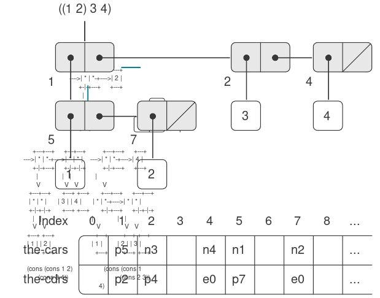

# 5.3 Cấp phát bộ nhớ và Thu gom rác

Trong mục 5.4, chúng ta sẽ trình bày cách hiện thực một Scheme evaluator (bộ thông dịch Scheme) dưới dạng một register machine (máy thanh ghi). Để đơn giản hóa phần thảo luận, chúng ta sẽ giả định rằng các register machine của mình có thể được trang bị một *list-structured memory* (“bộ nhớ có cấu trúc danh sách”), trong đó các thao tác cơ bản để xử lý dữ liệu dạng danh sách là các thao tác nguyên thủy. Giả định sự tồn tại của một bộ nhớ như vậy là một trừu tượng hóa hữu ích khi tập trung vào các cơ chế điều khiển trong một Scheme interpreter, nhưng điều này không phản ánh thực tế về các thao tác dữ liệu nguyên thủy của các máy tính hiện đại. Để có một bức tranh đầy đủ hơn về cách một hệ thống Lisp vận hành, chúng ta cần tìm hiểu cách biểu diễn cấu trúc danh sách sao cho tương thích với bộ nhớ của máy tính thông thường.

Có hai khía cạnh cần xem xét khi hiện thực cấu trúc danh sách. Khía cạnh thứ nhất hoàn toàn là vấn đề biểu diễn: làm thế nào để biểu diễn cấu trúc “box-and-pointer” (hộp và con trỏ) của các cặp Lisp, chỉ sử dụng khả năng lưu trữ và định địa chỉ của bộ nhớ máy tính thông thường. Khía cạnh thứ hai liên quan đến việc quản lý bộ nhớ khi quá trình tính toán diễn ra. Hoạt động của một hệ thống Lisp phụ thuộc rất nhiều vào khả năng liên tục tạo ra các đối tượng dữ liệu mới. Những đối tượng này bao gồm cả các đối tượng được tạo ra một cách tường minh bởi các procedure Lisp đang được thông dịch, cũng như các cấu trúc được chính bộ thông dịch tạo ra, chẳng hạn như environments và argument lists. Mặc dù việc liên tục tạo ra các đối tượng dữ liệu mới sẽ không gây vấn đề gì trên một máy tính có bộ nhớ vô hạn và có thể truy cập nhanh, nhưng bộ nhớ máy tính thực tế chỉ có kích thước hữu hạn (thật đáng tiếc). Do đó, các hệ thống Lisp cung cấp một cơ chế *automatic storage allocation* (“cấp phát bộ nhớ tự động”) để hỗ trợ ảo tưởng về một bộ nhớ vô hạn. Khi một đối tượng dữ liệu không còn cần thiết nữa, vùng nhớ đã cấp phát cho nó sẽ được tự động thu hồi và tái sử dụng để tạo ra các đối tượng dữ liệu mới. Có nhiều kỹ thuật khác nhau để cung cấp cơ chế cấp phát bộ nhớ tự động như vậy. Phương pháp mà chúng ta sẽ thảo luận trong phần này được gọi là *garbage collection* (“thu gom rác”).


## 5.3.1 Bộ nhớ dưới dạng Vector

Bộ nhớ máy tính thông thường có thể được hình dung như một mảng các ô chứa (cubbyhole), mỗi ô có thể chứa một mẩu thông tin. Mỗi ô chứa có một tên duy nhất, gọi là *address* (địa chỉ) hoặc *location* (vị trí). Các hệ thống bộ nhớ điển hình cung cấp hai thao tác nguyên thủy: một thao tác lấy dữ liệu được lưu tại một vị trí xác định và một thao tác gán dữ liệu mới vào một vị trí xác định. Địa chỉ bộ nhớ có thể được tăng tuần tự để hỗ trợ truy cập tuần tự đến một tập hợp các ô chứa. Tổng quát hơn, nhiều thao tác dữ liệu quan trọng yêu cầu địa chỉ bộ nhớ được xử lý như dữ liệu, có thể lưu trữ trong các vị trí bộ nhớ và thao tác trong các register của máy. Việc biểu diễn cấu trúc danh sách là một ứng dụng của *address arithmetic* (số học địa chỉ) như vậy.

Để mô hình hóa bộ nhớ máy tính, chúng ta sử dụng một kiểu cấu trúc dữ liệu mới gọi là *vector*. Về mặt trừu tượng, một vector là một đối tượng dữ liệu hợp thành, trong đó các phần tử riêng lẻ có thể được truy cập thông qua một chỉ số nguyên trong một khoảng thời gian không phụ thuộc vào chỉ số đó[^1]. Để mô tả các thao tác bộ nhớ, chúng ta sử dụng hai procedure nguyên thủy của Scheme để thao tác với vector:

- `(vector-ref ⟨vector⟩ ⟨n⟩)` trả về phần tử thứ $n^{\text{th}}$ của vector.
- `(vector-set! ⟨vector⟩ ⟨n⟩ ⟨value⟩)` gán giá trị được chỉ định cho phần tử thứ $n^{\text{th}}$ của vector.

Ví dụ, nếu `v` là một vector, thì `(vector-ref v 5)` lấy phần tử thứ năm trong vector `v` và `(vector-set! v 5 7)` thay đổi giá trị của phần tử thứ năm trong vector `v` thành 7[^2]. Đối với bộ nhớ máy tính, việc truy cập này có thể được hiện thực bằng cách sử dụng số học địa chỉ để kết hợp *base address* (địa chỉ cơ sở) chỉ vị trí bắt đầu của một vector trong bộ nhớ với một *index* (chỉ số) chỉ độ lệch của phần tử cụ thể trong vector đó.

[^1]: Chúng ta có thể biểu diễn bộ nhớ dưới dạng danh sách các phần tử. Tuy nhiên, khi đó thời gian truy cập sẽ không còn độc lập với chỉ số, vì để truy cập phần tử thứ $n^{\text{th}}$ của một danh sách cần thực hiện $n - 1$ phép `cdr`.

[^2]: Để đầy đủ, chúng ta nên chỉ rõ thao tác `make-vector` để tạo vector. Tuy nhiên, trong ứng dụng hiện tại, chúng ta sẽ chỉ sử dụng vector để mô hình hóa các phân vùng cố định của bộ nhớ máy tính.

### Biểu diễn dữ liệu Lisp

Chúng ta có thể sử dụng vector để hiện thực các cấu trúc pair cơ bản cần thiết cho một list-structured memory. Giả sử bộ nhớ máy tính được chia thành hai vector: `the-cars` và `the-cdrs`. Chúng ta sẽ biểu diễn cấu trúc danh sách như sau: Một con trỏ đến một pair là một chỉ số vào hai vector này. `car` của pair là phần tử trong `the-cars` tại chỉ số được chỉ định, và `cdr` của pair là phần tử trong `the-cdrs` tại chỉ số đó. Chúng ta cũng cần một cách biểu diễn cho các đối tượng không phải pair (chẳng hạn như số và symbol) và một cách để phân biệt các loại dữ liệu khác nhau. Có nhiều phương pháp để thực hiện điều này, nhưng tất cả đều quy về việc sử dụng *typed pointers* (“con trỏ có kiểu”), tức là mở rộng khái niệm “con trỏ” để bao gồm cả thông tin về kiểu dữ liệu[^3]. Kiểu dữ liệu cho phép hệ thống phân biệt một con trỏ đến một pair (bao gồm kiểu dữ liệu “pair” và một chỉ số vào các vector bộ nhớ) với các con trỏ đến các loại dữ liệu khác (bao gồm một kiểu dữ liệu khác và bất kỳ cách biểu diễn nào được sử dụng cho loại dữ liệu đó). Hai đối tượng dữ liệu được coi là giống nhau (`eq?`) nếu các con trỏ của chúng giống hệt nhau [^4].  

Hình 5.14 minh họa việc sử dụng phương pháp này để biểu diễn danh sách `((1 2) 3 4)`, kèm theo sơ đồ box-and-pointer của nó. Chúng ta sử dụng các tiền tố chữ cái để biểu thị thông tin kiểu dữ liệu. Ví dụ, một con trỏ đến pair có chỉ số 5 được ký hiệu là `p5`, danh sách rỗng được ký hiệu bằng con trỏ `e0`, và một con trỏ đến số 4 được ký hiệu là `n4`. Trong sơ đồ box-and-pointer, chúng ta đã chỉ ra ở góc dưới bên trái của mỗi pair chỉ số vector xác định nơi lưu trữ `car` và `cdr` của pair đó. Các vị trí trống trong `the-cars` và `the-cdrs` có thể chứa các phần của các cấu trúc danh sách khác (không được đề cập ở đây).  

  

**Figure 5.14:** Box-and-pointer and memory-vector representations of the list `((1 2) 3 4)`.  

[^3]: Đây chính là ý tưởng “tagged data” (dữ liệu gắn nhãn) mà chúng ta đã giới thiệu trong Chương 2 để xử lý các phép toán tổng quát. Tuy nhiên, ở đây các kiểu dữ liệu được bao gồm ở mức máy nguyên thủy thay vì được xây dựng thông qua việc sử dụng danh sách.
[^4]: Thông tin kiểu có thể được mã hóa theo nhiều cách khác nhau, tùy thuộc vào chi tiết của máy tính mà hệ thống Lisp được hiện thực. Hiệu suất thực thi của các chương trình Lisp sẽ phụ thuộc mạnh mẽ vào mức độ khéo léo của lựa chọn này, nhưng rất khó để đưa ra các quy tắc thiết kế tổng quát cho các lựa chọn tốt. Cách đơn giản nhất để hiện thực typed pointers là cấp phát một tập hợp cố định các bit trong mỗi con trỏ để làm *type field* (trường kiểu) mã hóa kiểu dữ liệu. Các câu hỏi quan trọng cần giải quyết khi thiết kế một biểu diễn như vậy bao gồm: Cần bao nhiêu bit kiểu? Chỉ số vector cần lớn đến mức nào? Có thể sử dụng hiệu quả các lệnh máy nguyên thủy để thao tác các trường kiểu của con trỏ hay không? Các máy tính có phần cứng đặc biệt để xử lý hiệu quả các trường kiểu được gọi là *tagged architectures*.

Một con trỏ đến một số, chẳng hạn như `n4`, có thể bao gồm một kiểu dữ liệu chỉ ra rằng đây là dữ liệu số, cùng với biểu diễn thực tế của số 4 [^5]. Để xử lý các số quá lớn không thể biểu diễn trong không gian cố định dành cho một con trỏ, chúng ta có thể sử dụng một kiểu dữ liệu riêng gọi là *bignum*, trong đó con trỏ trỏ đến một danh sách chứa các phần của số đó [^6]. 

[^5]: Quyết định về cách biểu diễn số này sẽ xác định liệu `eq?` — phép kiểm tra sự bằng nhau của các con trỏ — có thể được dùng để kiểm tra sự bằng nhau của các số hay không. Nếu con trỏ chứa trực tiếp giá trị số, thì các số bằng nhau sẽ có cùng một con trỏ. Nhưng nếu con trỏ chứa chỉ số của một vị trí lưu trữ số đó, thì các số bằng nhau chỉ chắc chắn có cùng con trỏ nếu chúng ta cẩn thận không bao giờ lưu cùng một số ở nhiều vị trí khác nhau.

[^6]: Điều này giống như việc viết một số dưới dạng một chuỗi các chữ số, ngoại trừ việc mỗi “chữ số” là một số nằm trong khoảng từ 0 đến số lớn nhất có thể lưu trong một con trỏ đơn.

Một symbol có thể được biểu diễn như một typed pointer (con trỏ có kiểu) trỏ đến một dãy các ký tự tạo thành dạng in của symbol đó. Dãy ký tự này được Lisp reader (bộ đọc Lisp) tạo ra khi chuỗi ký tự lần đầu tiên xuất hiện trong đầu vào. Vì chúng ta muốn hai thể hiện của cùng một symbol được `eq?` nhận diện là “cùng” một symbol và muốn `eq?` chỉ là một phép kiểm tra đơn giản về sự bằng nhau của các con trỏ, chúng ta phải đảm bảo rằng nếu reader gặp cùng một chuỗi ký tự hai lần, nó sẽ sử dụng cùng một con trỏ (trỏ đến cùng một dãy ký tự) để biểu diễn cả hai lần xuất hiện.  

Để làm được điều này, reader duy trì một bảng, theo truyền thống gọi là *obarray*, chứa tất cả các symbol mà nó từng gặp. Khi reader gặp một chuỗi ký tự và chuẩn bị tạo một symbol, nó sẽ kiểm tra obarray để xem đã từng gặp chuỗi ký tự này trước đây chưa. Nếu chưa, nó sẽ dùng các ký tự đó để tạo một symbol mới (một typed pointer trỏ đến một dãy ký tự mới) và đưa con trỏ này vào obarray. Nếu reader đã gặp chuỗi ký tự này trước đó, nó sẽ trả về con trỏ symbol đã lưu trong obarray. Quá trình thay thế các chuỗi ký tự bằng các con trỏ duy nhất này được gọi là *interning* symbol.

### Hiện thực các thao tác danh sách nguyên thủy

Với sơ đồ biểu diễn ở trên, chúng ta có thể thay thế mỗi thao tác danh sách “nguyên thủy” của một register machine bằng một hoặc nhiều thao tác vector nguyên thủy. Chúng ta sẽ dùng hai register, `the-cars` và `the-cdrs`, để xác định các vector bộ nhớ, và giả định rằng `vector-ref` và `vector-set!` có sẵn như các thao tác nguyên thủy. Chúng ta cũng giả định rằng các phép toán số học trên con trỏ (chẳng hạn như tăng giá trị con trỏ, dùng con trỏ pair để đánh chỉ số vào vector, hoặc cộng hai số) chỉ sử dụng phần chỉ số của typed pointer.

Ví dụ, chúng ta có thể làm cho một register machine hỗ trợ các lệnh:

``` {.scheme}
(assign ⟨reg₁⟩ (op car) (reg ⟨reg₂⟩))
(assign ⟨reg₁⟩ (op cdr) (reg ⟨reg₂⟩))
```

nếu chúng ta hiện thực chúng lần lượt như sau:

``` {.scheme}
(assign ⟨reg₁⟩ 
        (op vector-ref)
        (reg the-cars)
        (reg ⟨reg₂⟩))
(assign ⟨reg₁⟩
        (op vector-ref)
        (reg the-cdrs)
        (reg ⟨reg₂⟩))
```

Các lệnh:

``` {.scheme}
(perform (op set-car!) (reg ⟨reg₁⟩) (reg ⟨reg₂⟩))
(perform (op set-cdr!) (reg ⟨reg₁⟩) (reg ⟨reg₂⟩))
```

được hiện thực như sau:

``` {.scheme}
(perform (op vector-set!)
         (reg the-cars)
         (reg ⟨reg₁⟩)
         (reg ⟨reg₂⟩))
(perform (op vector-set!)
         (reg the-cdrs)
         (reg ⟨reg₁⟩)
         (reg ⟨reg₂⟩))
```

`Cons` được thực hiện bằng cách cấp phát một chỉ số chưa dùng và lưu các đối số của `cons` vào `the-cars` và `the-cdrs` tại vị trí vector có chỉ số đó. Chúng ta giả định rằng có một register đặc biệt, `free`, luôn giữ một pair pointer chứa chỉ số khả dụng tiếp theo, và chúng ta có thể tăng phần chỉ số của con trỏ đó để tìm vị trí trống tiếp theo [^7].

[^7]: Có những cách khác để tìm vùng nhớ trống. Ví dụ, chúng ta có thể liên kết tất cả các pair chưa dùng thành một *free list*. Các vị trí trống của chúng ta là liên tiếp (và do đó có thể truy cập bằng cách tăng con trỏ) vì chúng ta đang sử dụng một compacting garbage collector, như sẽ thấy ở 5.3.2.  

Ví dụ, lệnh:

``` {.scheme}
(assign ⟨reg₁⟩
        (op cons)
        (reg ⟨reg₂⟩)
        (reg ⟨reg₃⟩))
```

được hiện thực thành chuỗi thao tác vector sau đây:[^8]

[^8]: Về cơ bản đây là cách hiện thực `cons` bằng `set-car!` và `set-cdr!`, như mô tả ở 3.3.1. Thao tác `get-new-pair` dùng trong hiện thực đó ở đây được thực hiện bởi con trỏ `free`.

``` {.scheme}
(perform (op vector-set!)
         (reg the-cars)
         (reg free)
         (reg ⟨reg₂⟩))
(perform (op vector-set!)
         (reg the-cdrs)
         (reg free)
         (reg ⟨reg₃⟩))
(assign ⟨reg₁⟩ (reg free))
(assign free (op +) (reg free) (const 1))
```

Thao tác `eq?`:

``` {.scheme}
(op eq?) (reg ⟨reg₁⟩) (reg ⟨reg₂⟩)
```

đơn giản chỉ kiểm tra sự bằng nhau của tất cả các trường trong các register, và các predicate như `pair?`, `null?`, `symbol?`, và `number?` chỉ cần kiểm tra trường kiểu.

### Hiện thực stack

Mặc dù các register machine của chúng ta sử dụng stack, chúng ta không cần làm gì đặc biệt ở đây, vì stack có thể được mô hình hóa bằng danh sách. Stack có thể là một danh sách các giá trị đã lưu, được trỏ tới bởi một register đặc biệt `the-stack`. Do đó, `(save ⟨reg⟩)` có thể được hiện thực như:

``` {.scheme}
(assign the-stack 
        (op cons)
        (reg ⟨reg⟩)
        (reg the-stack))
```

Tương tự, `(restore ⟨reg⟩)` có thể được hiện thực như:

``` {.scheme}
(assign ⟨reg⟩ (op car) (reg the-stack))
(assign the-stack (op cdr) (reg the-stack))
```

và `(perform (op initialize-stack))` có thể được hiện thực như:

``` {.scheme}
(assign the-stack (const ()))
```

Các thao tác này có thể được mở rộng thêm dựa trên các thao tác vector đã nêu ở trên. Tuy nhiên, trong các kiến trúc máy tính thông thường, thường có lợi khi cấp phát stack như một vector riêng biệt. Khi đó, việc push và pop stack có thể được thực hiện bằng cách tăng hoặc giảm một chỉ số vào vector đó.

## 5.3.2 Duy trì ảo tưởng về bộ nhớ vô hạn

Phương pháp biểu diễn được phác thảo ở 5.3.1 giải quyết vấn đề hiện thực cấu trúc danh sách, với điều kiện chúng ta có một lượng bộ nhớ vô hạn. Với một máy tính thực, cuối cùng chúng ta sẽ hết vùng trống để tạo các pair mới[^9].

[^9]: Điều này có thể sẽ không còn đúng trong tương lai, vì bộ nhớ có thể đủ lớn để không thể hết bộ nhớ trống trong suốt vòng đời của máy tính. Ví dụ, có khoảng $3 \cdot 10^{13}$ micro giây trong một năm, nên nếu chúng ta `cons` một lần mỗi micro giây thì sẽ cần khoảng $10^{15}$ ô nhớ để xây dựng một máy có thể hoạt động 30 năm mà không hết bộ nhớ. Lượng bộ nhớ đó nghe có vẻ cực kỳ lớn theo tiêu chuẩn ngày nay, nhưng không phải là không thể về mặt vật lý. Mặt khác, bộ xử lý ngày càng nhanh hơn và một máy tính trong tương lai có thể có số lượng lớn bộ xử lý hoạt động song song trên cùng một bộ nhớ, nên có thể tiêu thụ bộ nhớ nhanh hơn nhiều so với giả định.  

Tuy nhiên, hầu hết các pair được tạo ra trong một phép tính điển hình chỉ được dùng để giữ các kết quả trung gian. Sau khi các kết quả này được truy cập, các pair đó không còn cần thiết nữa — chúng trở thành *garbage* (rác). Ví dụ, phép tính:

``` {.scheme}
(accumulate 
 + 
 0
 (filter odd? (enumerate-interval 0 n)))
```

tạo ra hai danh sách: danh sách liệt kê và kết quả của việc lọc danh sách đó. Khi quá trình cộng dồn hoàn tất, các danh sách này không còn cần thiết nữa, và vùng nhớ đã cấp phát có thể được thu hồi. Nếu chúng ta có thể sắp xếp để thu gom toàn bộ rác định kỳ, và nếu việc này tái sử dụng bộ nhớ với tốc độ xấp xỉ tốc độ tạo ra các pair mới, chúng ta sẽ duy trì được ảo tưởng rằng có một lượng bộ nhớ vô hạn.  


``` {.scheme}
begin-garbage-collection
  (assign free (const 0))
  (assign scan (const 0))
  (assign old (reg root))
  (assign relocate-continue 
          (label reassign-root))
  (goto (label relocate-old-result-in-new))
reassign-root
  (assign root (reg new))
  (goto (label gc-loop))
```

Trong vòng lặp chính của bộ thu gom rác (garbage collector), chúng ta phải xác định xem còn đối tượng nào cần quét hay không. Việc này được thực hiện bằng cách kiểm tra xem con trỏ `scan` có trùng với con trỏ `free` hay không. Nếu hai con trỏ bằng nhau, điều đó có nghĩa là tất cả các đối tượng có thể truy cập đã được di dời (relocate), và chúng ta sẽ rẽ nhánh đến `gc-flip`, nơi thực hiện việc dọn dẹp để có thể tiếp tục quá trình tính toán đang bị gián đoạn. Nếu vẫn còn các pair cần quét, chúng ta gọi chương trình con (subroutine) relocate để di dời `car` của pair tiếp theo (bằng cách đặt con trỏ `car` vào `old`). Thanh ghi `relocate-continue` được thiết lập để chương trình con sẽ quay lại và cập nhật con trỏ `car`.

``` {.scheme}
gc-loop
  (test (op =) (reg scan) (reg free))
  (branch (label gc-flip))
  (assign old 
          (op vector-ref)
          (reg new-cars)
          (reg scan))
  (assign relocate-continue 
          (label update-car))
  (goto (label relocate-old-result-in-new))
```


Tại `update-car`, chúng ta sửa đổi con trỏ `car` của pair đang được quét, sau đó tiếp tục di dời `cdr` của pair. Chúng ta quay lại `update-cdr` khi việc di dời đó đã hoàn tất. Sau khi di dời và cập nhật `cdr`, chúng ta đã hoàn tất việc quét pair đó, vì vậy tiếp tục vòng lặp chính.  

``` {.scheme}
update-car
  (perform (op vector-set!)
           (reg new-cars)
           (reg scan)
           (reg new))
  (assign  old 
           (op vector-ref)
           (reg new-cdrs)
           (reg scan))
  (assign  relocate-continue
           (label update-cdr))
  (goto (label relocate-old-result-in-new))
update-cdr
  (perform (op vector-set!)
           (reg new-cdrs)
           (reg scan)
           (reg new))
  (assign  scan (op +) (reg scan) (const 1))
  (goto (label gc-loop))
```

Chương trình con `relocate-old-result-in-new` di dời các đối tượng như sau: Nếu đối tượng cần di dời (được trỏ bởi `old`) không phải là một pair, thì chúng ta trả về cùng một con trỏ đến đối tượng đó mà không thay đổi (trong `new`). (Ví dụ, chúng ta có thể đang quét một pair mà `car` của nó là số 4. Nếu chúng ta biểu diễn `car` bằng `n4`, như mô tả trong 5.3.1, thì chúng ta muốn con trỏ `car` “đã di dời” vẫn là `n4`.) Ngược lại, chúng ta phải thực hiện việc di dời. Nếu vị trí `car` của pair cần di dời chứa một nhãn broken-heart, thì pair này thực tế đã được di chuyển, do đó chúng ta lấy địa chỉ chuyển tiếp (forwarding address) từ vị trí `cdr` của broken heart và trả về giá trị này trong `new`. Nếu con trỏ trong `old` trỏ đến một pair chưa được di chuyển, thì chúng ta di chuyển pair đó đến ô trống đầu tiên trong bộ nhớ mới (được trỏ bởi `free`) và thiết lập broken heart bằng cách lưu nhãn broken-heart và địa chỉ chuyển tiếp tại vị trí cũ. `Relocate-old-result-in-new` sử dụng một thanh ghi `oldcr` để giữ `car` hoặc `cdr` của đối tượng được trỏ bởi `old` [^10].

[^10]: Bộ thu gom rác sử dụng predicate mức thấp `pointer-to-pair?` thay vì phép toán cấu trúc danh sách `pair?` vì trong một hệ thống thực tế có thể tồn tại nhiều loại đối tượng được xử lý như pair cho mục đích garbage collection. Ví dụ, trong một hệ thống Scheme tuân thủ tiêu chuẩn IEEE, một đối tượng procedure có thể được hiện thực như một dạng đặc biệt của “pair” mà không thỏa mãn predicate `pair?`. Trong mục đích mô phỏng, `pointer-to-pair?` có thể được hiện thực như `pair?`.  


``` {.scheme}
relocate-old-result-in-new
  (test (op pointer-to-pair?) (reg old))
  (branch (label pair))
  (assign new (reg old))
  (goto (reg relocate-continue))
pair
  (assign  oldcr 
           (op vector-ref)
           (reg the-cars)
           (reg old))
  (test (op broken-heart?) (reg oldcr))
  (branch  (label already-moved))
  (assign  new (reg free)) ; new location for pair
  ;; Update free pointer.
  (assign free (op +) (reg free) (const 1))
  ;; Copy the car and cdr to new memory.
  (perform (op vector-set!)
           (reg new-cars)
           (reg new)
           (reg oldcr))
  (assign  oldcr 
           (op vector-ref)
           (reg the-cdrs)
           (reg old))
  (perform (op vector-set!)
           (reg new-cdrs)
           (reg new)
           (reg oldcr))
  ;; Construct the broken heart.
  (perform (op vector-set!)
           (reg the-cars)
           (reg old)
           (const broken-heart))
  (perform (op vector-set!)
           (reg the-cdrs)
           (reg old)
           (reg new))
  (goto (reg relocate-continue))
already-moved
  (assign  new
           (op vector-ref)
           (reg the-cdrs)
           (reg old))
  (goto (reg relocate-continue))
```

Ở phần cuối cùng của quá trình garbage collection, chúng ta hoán đổi vai trò của bộ nhớ cũ và bộ nhớ mới bằng cách hoán đổi các con trỏ: hoán đổi `the-cars` với `new-cars`, và `the-cdrs` với `new-cdrs`. Khi đó, chúng ta sẽ sẵn sàng thực hiện một lần garbage collection khác khi bộ nhớ lại đầy.  


``` {.scheme}
gc-flip
  (assign temp (reg the-cdrs))
  (assign the-cdrs (reg new-cdrs))
  (assign new-cdrs (reg temp))
  (assign temp (reg the-cars))
  (assign the-cars (reg new-cars))
  (assign new-cars (reg temp))
```